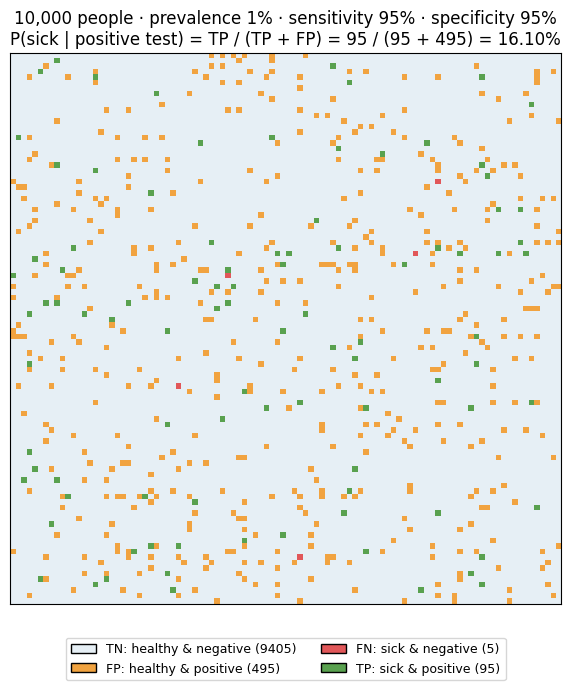
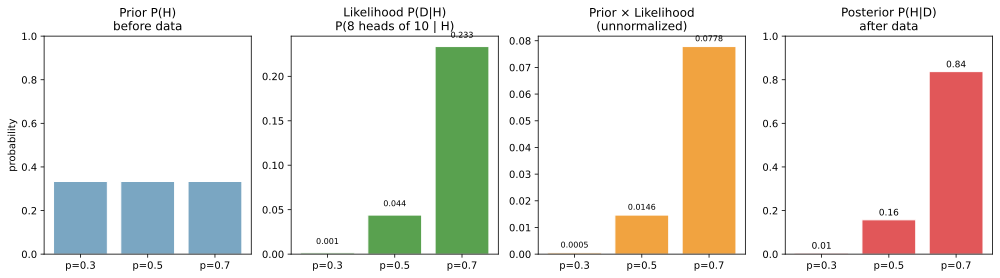
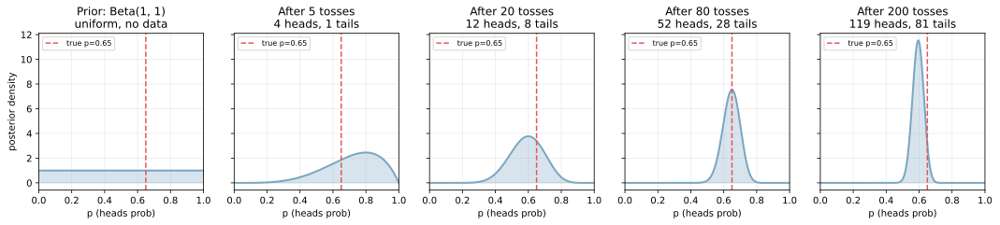
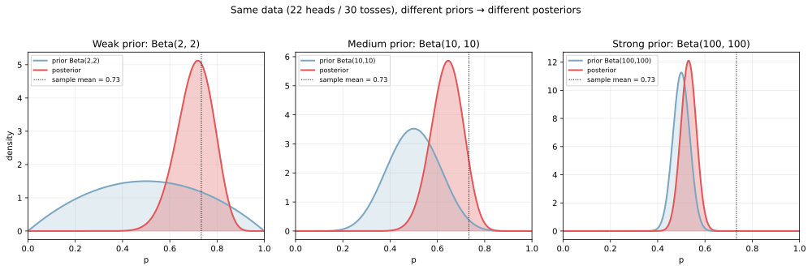
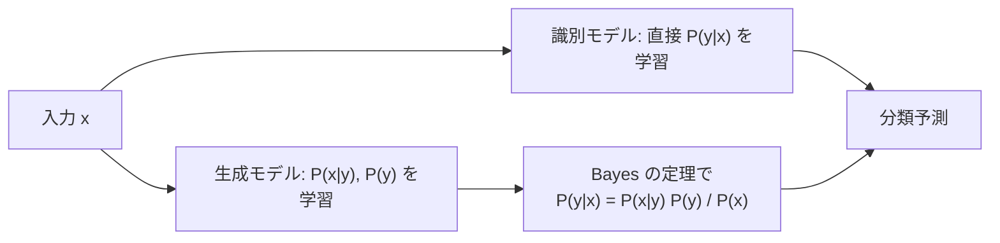

ベイズの定理（Bayes' theorem）は、ある仮説に対する確率を「観測したデータ」を踏まえて更新する規則である。式で書くと、

`P(H | D) = P(D | H) × P(H) / P(D)`

- `P(H)`: 事前分布（prior, データを見る前の仮説への確信度）
- `P(D | H)`: 尤度（likelihood, 仮説が正しいときにそのデータが観測される確率）
- `P(D)`: 周辺尤度（evidence, 仮説を全パターン考慮したときに `D` が観測される総確率）
- `P(H | D)`: 事後分布（posterior, データを見た後の仮説への確信度）

「事前」に持っていた信念を「データ」で更新して「事後」を得る、というのがベイズ更新のサイクルである。機械学習では分類器の確率出力、ナイーブベイズ、ベイズ線形回帰、確率的グラフィカルモデル、変分推論、ベイズ最適化など、確率モデルが絡む場面で繰り返し現れる。

[同時分布・周辺分布・条件付き分布](../joint-marginal-conditional/) の関係式 `P(H, D) = P(D | H) P(H) = P(H | D) P(D)` を変形しただけのもので、ベイズの定理に「特別な公式」というほどの新規性はない。ただし、確率を「データに対する信念の更新ルール」として読み直す視点が革命的で、ここから推論・予測・意思決定の枠組みが大きく広がる。

### 病気検査の例: base rate が効く

最も有名な例として、稀な病気の検査を考える。

- 有病率（事前確率）: `P(sick) = 1%`
- 感度（病気の人が陽性になる確率）: `P(+ | sick) = 95%`
- 特異度（健康な人が陰性になる確率）: `P(- | healthy) = 95%`

検査で陽性が出たとき、本当に病気である確率 `P(sick | +)` はいくらか。直感的には「95%」と答えたくなるが、ベイズの定理で計算すると違う答えになる。

`P(sick | +) = P(+ | sick) × P(sick) / P(+) = 0.95 × 0.01 / P(+)`

`P(+) = P(+ | sick) × P(sick) + P(+ | healthy) × P(healthy) = 0.95 × 0.01 + 0.05 × 0.99 = 0.059`

`P(sick | +) = 0.0095 / 0.059 ≈ 16.1%`

10000 人の集団で実際に数えると次のようになる。

| 種別 | 人数 |
|---|---|
| 病気で陽性 (TP) | 95 |
| 病気で陰性 (FN) | 5 |
| 健康で陽性 (FP) | 495 |
| 健康で陰性 (TN) | 9405 |

`P(sick | +) = TP / (TP + FP) = 95 / (95 + 495) ≈ 16%` となる。検査の感度・特異度が高くても、有病率が低い病気では「陽性」=「実際に病気」とは限らない、というのがベイズ的に明確に示される現象である。

```python
import numpy as np
import matplotlib.pyplot as plt
from matplotlib.colors import ListedColormap

N = 10000
n_sick = 100
tp, fn, fp, tn = 95, 5, 495, 9405
# 10000 人を 100x100 グリッドで色分け（scripts 側を参照）
plt.savefig("disease_test_grid.png", bbox_inches="tight")
```



緑（TP）と橙（FP）が「陽性と判定された人」の総数で、その中で本当に病気なのは緑だけなので約 16%、という直感が一目で分かる。同じ感度・特異度でも「有病率が低いほど偽陽性の影響が大きい」という構造は、機械学習の不均衡データ評価でも繰り返し問題になる現象である（[ROC-AUC / PR-AUC](../../ml/roc-pr-auc/) のノート参照）。

---

### 4 つの成分の関係

ベイズの定理に出てくる 4 つの要素の関係を、コイン投げのおもちゃ問題で見る。3 枚のコイン（表が出る確率 `p ∈ {0.3, 0.5, 0.7}` のどれか）からランダムに 1 枚選び、10 回投げて 8 回表が出たとする。どのコインを引いた可能性が最も高いか。

```python
from scipy import stats

hyps = np.array([0.3, 0.5, 0.7])
prior = np.array([1/3, 1/3, 1/3])
likelihood = stats.binom.pmf(8, 10, hyps)
unnorm = prior * likelihood
posterior = unnorm / unnorm.sum()
print(posterior)
# 4 段階の棒グラフ（scripts 側を参照）
plt.savefig("bayes_components.svg", bbox_inches="tight")
```

出力:

```text
[0.002 0.103 0.895]
```



4 つの棒グラフが左から「事前分布（3 枚から等確率で選ぶ）」「尤度（各コインで 10 投 8 表が観測される確率）」「事前 × 尤度（非正規化事後）」「正規化された事後分布」である。事前は一様だが、尤度が `p = 0.7` のコインを強く支持するため、事後分布もそちらに大きく傾く（90% 近い）。一方で `p = 0.3` のコインで 8 表が出る確率はほぼゼロなので、事後も無視できるほど小さい。

ベイズの定理は「事前を尤度で重み付けして正規化する」という操作であり、データが多ければ尤度が支配的になり、データが少なければ事前の影響が残る、という直感的な構造を持つ。

---

### 逐次更新: データを 1 個ずつ追加する

ベイズの最大の強みは、データを 1 個ずつ取り込んで事後分布を更新できる点にある。各時点の事後を次の時点の事前として再利用すれば、データを溜め込まずに逐次更新できる。

コインの表確率 `p` を推定する例で、最初は無情報な一様分布 `Beta(1, 1)` から始め、観測を増やすたびに事後 `Beta(1 + heads, 1 + tails)` が更新されていく様子を描く。

```python
true_p = 0.65
data_seq = np.random.default_rng(0).binomial(1, true_p, size=200)
p_grid = np.linspace(0, 1, 400)
for n in [0, 5, 20, 80, 200]:
    if n == 0: a, b = 1, 1
    else:
        h = int(data_seq[:n].sum())
        a, b = 1 + h, 1 + n - h
    pdf = stats.beta.pdf(p_grid, a, b)
    # 描画は scripts 側を参照
plt.savefig("bayes_sequential_update.svg", bbox_inches="tight")
```



左端は事前分布（一様）で、`p` がどの値でも等確率としている。5 投・20 投・80 投と進むにつれて、事後分布は真の値 `p = 0.65`（赤い破線）の周りに鋭く集中していく。200 投時点ではほぼ真の値の周辺に押し込まれている。データを集めるほど分布が狭まる、というのは推定の精度が上がることに直結する。

この更新規則 `posterior_t → posterior_{t+1}` がオンライン学習・カルマンフィルタ・パーティクルフィルタなどの基礎となる。

---

### 事前分布の強さが結果に効く

事前分布をどれだけ「強く」信じるかは、事後分布に明確に影響する。同じデータ（30 投で 22 表）に対して、3 種類の事前分布（弱・中・強）を当てたときの事後を比較する。

```python
n_data = 30
heads_obs = 22
for a_prior, b_prior in [(2, 2), (10, 10), (100, 100)]:
    prior_pdf = stats.beta.pdf(p_grid, a_prior, b_prior)
    a_post = a_prior + heads_obs
    b_post = b_prior + n_data - heads_obs
    post_pdf = stats.beta.pdf(p_grid, a_post, b_post)
# 詳細な可視化は scripts 側を参照
plt.savefig("bayes_prior_strength.svg", bbox_inches="tight")
```



左から弱い事前 `Beta(2, 2)`、中程度の `Beta(10, 10)`、強い `Beta(100, 100)` を当てた結果である。弱い事前ではデータの影響が大きく、事後はサンプル平均 0.73 付近に寄る。強い事前では「コインは公正に近い」という信念がデータより重く、事後は 0.5 寄りに留まる。

「事前は何で決めるべきか」は実用上の重要な論点で、過去データ・専門家の知識・無情報事前（uniform）などから選ぶ。データ量が十分多ければ事前の影響は薄れる（漸近的に頻度主義の最尤推定に近づく）ので、データが豊富な機械学習タスクでは事前の選び方の影響は小さいことも多い。一方でデータが少ない領域や、強い事前知識がある場面ではベイズの利点が大きいと考えられる。

---

### 識別モデル vs 生成モデル

ベイズの定理は、機械学習における 2 系統のモデル設計を分ける視点を与える。

- 識別モデル（discriminative）: `P(y | x)` を直接モデル化する。[ロジスティック回帰](../../ml/logistic-regression/)、決定木、ニューラルネット
- 生成モデル（generative）: `P(x | y)` と `P(y)` を別々にモデル化し、ベイズの定理で `P(y | x)` を作る。ナイーブベイズ、LDA、GAN、Diffusion



識別モデルは分類性能に集中できる一方、生成モデルはデータの生成過程をモデル化するため新規データを生成したり、欠損値を埋めたりできる柔軟性がある。代表例の Naive Bayes 分類器は、特徴量間の条件付き独立 `P(x_1, ..., x_d | y) = Π_i P(x_i | y)` を仮定して、テキスト分類などで実用的な性能を出す。

### 数学での使いどころ

- 確率推論の基本規則（条件付き確率の入れ替え）
- 階層モデル・グラフィカルモデルの推論
- マルコフ連鎖モンテカルロ法（MCMC）で事後分布をサンプリング
- 変分推論（事後分布を扱いやすい分布で近似）
- 観測の重ね合わせ（カルマンフィルタ、粒子フィルタの更新ステップ）

---

### 機械学習での使いどころ

- ナイーブベイズ分類器（スパムフィルタ、文書分類）
- ベイズ線形回帰・ベイズロジスティック回帰（事後分布として重みを扱う）
- ベイズ最適化（ハイパーパラメータ探索で事後分布から「次に試す点」を決める）
- ガウス過程回帰（事後分布として「予測平均 + 不確実性」を返す）
- A/B テストのベイズ解釈（事前 + データ → 各群の効果の事後分布）
- 確率的グラフィカルモデル（HMM、CRF、Bayesian network）
- カルマンフィルタ・パーティクルフィルタ（時系列の状態推定で逐次ベイズ更新）
- LDA（Latent Dirichlet Allocation）などのトピックモデル
- 校正された確率出力（Platt scaling、isotonic regression は確率の事後補正）
- 不均衡データでのクラス事前補正（訓練と本番のクラス比率が違うとき `P(y)` を再校正）

---

### 適さないケース / 落とし穴

ベイズの定理は強力だが、落とし穴も多い。

- 事前分布の選択が恣意的になりやすい: 「無情報事前」の選び方ですら一意でない（一様 vs Jeffreys vs reference prior）。データが少ない場面では結論が事前で大きく変わる
- 周辺尤度 `P(D)` の計算が高次元では困難: 解析的に積分できないと MCMC・変分推論などの近似が必要になる
- 計算量が大きい: 厳密ベイズはサンプリングや積分が必要で、深層学習のような大規模モデルではフルベイズは現実的でないことが多い。代わりに MAP 推定や最尤推定で済ますことも多い
- 「ベイズの定理を使えば確率が正確になる」とは限らない: モデルそのものが間違っていれば、ベイズ更新しても誤った事後分布に収束する。「garbage in, garbage out」は健在
- 事後分布の解釈の難しさ: 信頼区間と confidence interval（頻度主義）は意味が違う。混同するとレポートで誤解を生む
- 検査の base rate 無視: ベイズの典型問題で、人間の直感は「事前確率を軽く見る」傾向がある。1% の有病率で 95% 感度の検査の陽性的中率が 16% という結論を直感では出しにくい
- ナイーブベイズの独立性仮定: 実データではほぼ成り立たないが、それでも分類精度では悪くないという経験的事実がある。確率出力そのものを信頼するのは難しい
