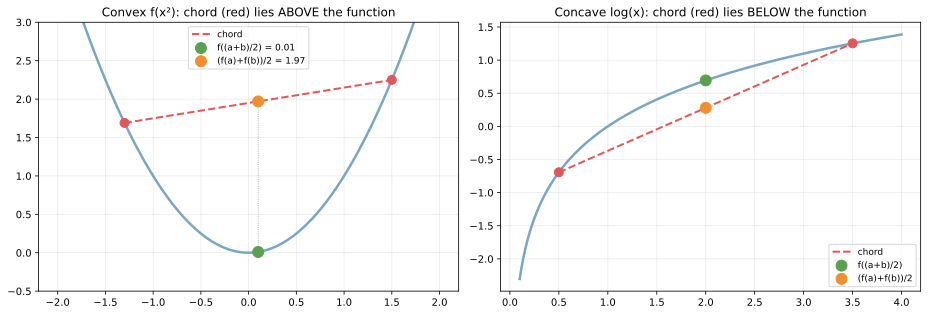
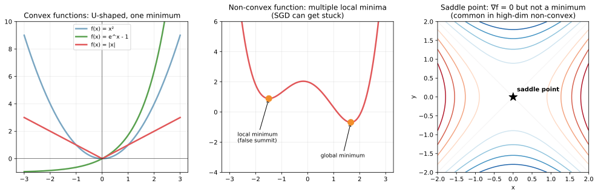
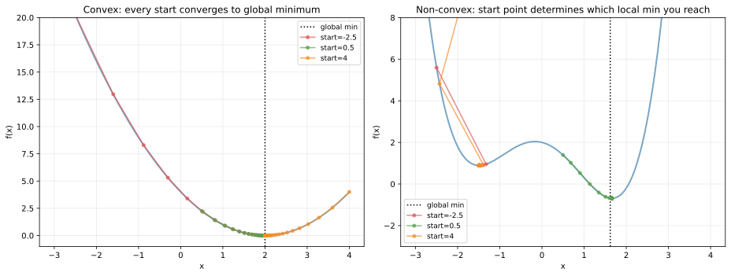

凸関数（convex function）は、グラフが「下に凸」（U 字型）で、任意の 2 点を結んだ弦が関数の上にくる関数のことである。凸関数の最大の特徴は「**局所最小値が必ず大域最小値**」になる点で、これが凸最適化が「解ける」「保証がある」と言われる根拠となる。

機械学習で扱う損失関数は、線形モデル系（[線形回帰](../../ml/linear-regression/) の MSE、[ロジスティック回帰](../../ml/logistic-regression/) の交差エントロピー、[SVM](../../ml/svm/) のヒンジ損失）は凸で、深層学習の損失関数（多層 NN）は非凸となる。前者は SGD で大域最適に到達できるが、後者は局所最小・鞍点に捕まる可能性がある、という対比を理解しておくと、[最急降下法・SGD](../gradient-descent-sgd/) の挙動の差が読めるようになる。

### 凸関数の定義

関数 `f: ℝ → ℝ` が凸関数（convex）であるとは、任意の `x, y` と `t ∈ [0, 1]` について次が成り立つこと。

`f(t x + (1 - t) y) ≤ t f(x) + (1 - t) f(y)`

左辺は「`x` と `y` の内分点での関数値」、右辺は「関数値の内分」。両者を比べたとき左辺が小さい（等しい）、つまり「弦の下に関数がいる」のが凸関数の幾何的な意味となる。

```python
import numpy as np
import matplotlib.pyplot as plt

x = np.linspace(-2, 2, 400)
y = x ** 2
# 2 点 (-1.3, ...) と (1.5, ...) を結ぶ弦と関数値を比較
plt.savefig("convex_chord_definition.svg", bbox_inches="tight")
```



左の `f(x) = x²` は凸: 弦（赤い破線）が常に関数（青）の上にある。中点で `f((a+b)/2) = 0.01`、`(f(a)+f(b))/2 = 1.97` で確かに前者が小さい。右の `log(x)` は凹（concave）: 弦が関数の下にある。

凸関数の代表例:

- 多項式の偶数べき: `x², x⁴, ...`
- 指数関数: `exp(x)`
- 絶対値: `|x|`
- 負の対数: `-log(x)`（`x > 0`）
- 正の定数倍と非負の重み付き和（凸性は和で保たれる）
- 凸関数同士の最大値: `max(f, g)`

凹関数（concave）は単に `-f` が凸の関数で、`log(x)`、`-x²`、`sqrt(x)`（x ≥ 0）など。「凹を最大化する = 凸を最小化する」なので、最適化の世界では両者を区別せずに扱える。

### 凸関数の判定方法

- 1 階条件: `f(y) ≥ f(x) + f'(x)(y - x)` for all x, y（接線が常に下にある）
- 2 階条件: `f''(x) ≥ 0` for all x（1 次元）。多次元なら Hessian 行列が半正定値
- 制約の保存則: 凸関数の和、正の定数倍、合成（外側が凸かつ単調増加、内側が凸）はすべて凸

実用上は「`f''(x) ≥ 0`」で判定するのが一番早い。`f(x) = x²` なら `f''(x) = 2 > 0` なので凸、`f(x) = log(x)` なら `f''(x) = -1/x² < 0` なので凹。

---

### 凸 vs 非凸: SGD の振る舞いの差

凸関数では最適化が「素直」だが、非凸関数では局所最小・鞍点に捕まる。

```python
def f_convex(x): return (x - 2) ** 2
def f_nonconvex(x): return 0.3 * x ** 4 - 1.5 * x ** 2 - 0.5 * x + 2
# 詳細は scripts 側を参照
plt.savefig("convex_vs_nonconvex.svg", bbox_inches="tight")
```



- 左（凸）: `x²`, `e^x - 1`, `|x|` の 3 つ。すべて単一の最小値を持ち、SGD はどこからでもそこに収束する
- 中央（非凸）: 4 次関数で 2 つの局所最小値を持つ。SGD は初期値次第でどちらかに捕まる
- 右（鞍点）: `x² - y²`。`∇f = 0` だが最小値ではない。高次元では「ほとんどの停留点は鞍点」と言われる

3 つの初期値から SGD を回したときの軌跡を見る。

```python
for start in [-2.5, 0.5, 4]:
    x_cur = start
    for _ in range(50):
        x_cur -= 0.1 * df_convex(x_cur)  # or df_nonconvex
plt.savefig("convex_sgd_trajectories.svg", bbox_inches="tight")
```



左の凸関数では、`-2.5, 0.5, 4` のどこから始めても 50 ステップで `x = 2` に収束する。右の非凸関数では、3 つの初期値がそれぞれ別の点に収束しており、初期値次第で結果が変わる。

これが「凸最適化は解ける」と言われる本質。初期値や最適化アルゴリズムの細部に依存せず、十分なステップ数で大域最適に到達する保証がある。一方の非凸最適化では「複数初期値で試して最良を選ぶ」「Momentum や Adam で鞍点を抜ける」「Batch Normalization で勾配地形を改善」などの工夫が必要になる。

---

### Jensen の不等式: 凸関数の期待値

凸関数 `f` と任意の確率変数 `X` について、

`f(E[X]) ≤ E[f(X)]`

が成り立つ。これが Jensen の不等式（Jensen's inequality）で、凸関数の定義をそのまま確率の世界に持ち込んだもの。

```python
# f(x) = x², X ~ uniform(-2, 2)
# E[X] = 0, E[f(X)] = E[X²] = 4/3 ≈ 1.33
# f(E[X]) = 0 < E[f(X)] = 1.33  -> 不等式が成立
plt.savefig("convex_jensen.svg", bbox_inches="tight")
```

![Jensen の不等式: f(E[X]) ≤ E[f(X)]](./convex_jensen.svg)

緑が `f(E[X]) = 0`、赤が `E[f(X)] ≈ 1.33` で、両者の差が「Jensen gap」。`X` の分散がゼロ（決定論的）でない限り、凸関数では gap が正になる。

機械学習での応用は無数にある。

- AM-GM 不等式: 相加平均 ≥ 相乗平均（`f = -log` が凹で Jensen を逆向き）
- KL ダイバージェンス `KL(P || Q) ≥ 0`: `f = -log` の凸性から導出（[情報理論](../information-theory/) 参照）
- 変分推論の ELBO: 対数尤度の下界を Jensen で導出
- 一般化期待値 EM アルゴリズム: 各ステップで Jensen 下界を最大化

「凸性」が分かれば、これらの不等式が共通の原理から導かれていることが見えてくる、と考えられる。

---

### 凸最適化の理論的保証

凸最適化問題は次の形を取る。

```text
min  f(x)            # 目的関数が凸
s.t. g_i(x) ≤ 0     # 不等式制約が凸
     h_j(x) = 0     # 等式制約が線形（= 凸かつ凹）
```

この枠組みに収まる問題に対して、次の強い保証がある。

- **局所最適 = 大域最適**: 局所最小値が見つかれば、それが大域最小値
- **多項式時間で解ける**: 内点法（interior point method）など、効率的なアルゴリズムが存在
- **双対性が綺麗に成立**: 主問題と双対問題の最適値が一致（強双対性）
- **解の一意性**: 厳密に凸なら解は一意

機械学習で凸最適化として定式化される代表的なモデル:

| モデル | 目的関数の凸性 |
|---|---|
| [線形回帰](../../ml/linear-regression/) OLS | 凸（quadratic in w） |
| Ridge / Lasso | 凸 |
| [ロジスティック回帰](../../ml/logistic-regression/) | 凸 |
| [SVM](../../ml/svm/) | 凸 |
| 線形計画法 (LP) | 凸 |
| 二次計画法 (QP) | 凸（Q が半正定値なら） |
| ニューラルネット | 非凸（一般に） |
| 決定木 | 離散最適化（凸の枠外） |

「あなたのモデルが凸かどうか」を意識すると、(1) どんなアルゴリズムが使えるか、(2) 初期値の影響、(3) 過学習との関係、が見えてくる。

### 数学での使いどころ

- 最適化の存在保証: 凸関数 + 制約集合が有界閉集合 → 最小値が存在
- KKT 条件: 制約付き凸最適化の最適性必要十分条件
- 双対性: ラグランジュ双対、Fenchel 双対
- 鞍点定理: 凸-凹のミニマックス問題に大域解が存在
- 半正定値計画法（SDP）: 行列の凸最適化
- 確率収束の不等式: マルコフ・チェビシェフ・チェルノフの各不等式
- 凸解析の基本定理: 分離超平面定理、サポート関数

---

### 機械学習での使いどころ

- 線形モデルの学習: OLS、Ridge、Lasso、ロジスティック回帰、SVM はすべて凸最適化
- [正則化](../../ml/regularization/): L1 / L2 ペナルティは凸関数の和なので凸性を保つ
- カーネル法: 双対形式が凸 QP として定式化（SVM の SMO アルゴリズム）
- ベイズ推論の変分近似: ELBO が凸下界（特定の場合）
- ロバスト統計: Huber 損失は凸かつロバスト
- LP 制約付き割当問題: マッチング、輸送問題（OT）
- 多目的最適化の Pareto 解: 凸集合の幾何
- 推薦システムの行列因子分解: 一方を固定すると他方が凸（交互最適化）
- 強化学習の Linear Programming for MDP
- 公平性制約: 凸制約として加える ([公平性] への展開)

非凸最適化（深層学習）でも「凸的な枠組み」を理解しておくと、(1) 損失関数の設計、(2) 局所最小と汎化の関係、(3) Adam などの最適化アルゴリズムの根拠、を考える土台になる。

---

### 適さないケース / 落とし穴

- 「ニューラルネットが凸最適化を解いている」と誤解: 深層 NN は非凸。SGD は局所最適または鞍点に収束し、大域最適保証は無い
- ヒンジ損失で誤って `max` の代わりに `|...|` を使う: 凸性は保たれるが意味が変わる
- 凸性チェックを 1 階だけで判定: `f'(x) = 0` は最小値の必要条件だが十分条件ではない。`f''(x) ≥ 0` の確認が必要
- 凸関数の合成: 凸の合成は常に凸ではない。「外側が凸かつ単調増加」が必要。例: `f(g(x))` で `g` が凸でも `f` が単調減少なら結果は凹かも
- Lasso が「凸だから解ける」と思って素朴に最急降下: L1 ノルムは `x = 0` で微分不可能。劣勾配法、座標降下法、近接勾配法 (proximal) を使う
- 制約付き凸最適化を素朴な勾配降下で: 制約を破る方向に動いてしまう。projected gradient、interior point、ラグランジュ乗数を使う
- 凸最適化ライブラリの過信: 大規模問題（10⁶ 変数以上）では汎用ソルバ（CVXPY）は遅い。問題構造に特化した solver が必要
- 強双対性の前提を確認しない: 制約の qualifier（Slater 条件）が満たされていないと双対性が崩れる
- 凸性と単峰性を混同: 凸関数は単峰だが、単峰なら凸とは限らない（例: ロジスティック分布）
- 凸を最大化しようとする: 凸の最大化は端点で起きる NP 困難な問題（線形計画の双対の例外）。最小化のみが解きやすい
- 「f が凸 → 最適化が簡単」と思って次元を無視: 100 万変数の凸でも、メモリ・I/O が壁になる
- 「非凸だから諦める」: 深層学習は非凸でも実用上は SGD + 適切な初期化 + Momentum で十分な解が見つかる経験的事実がある
