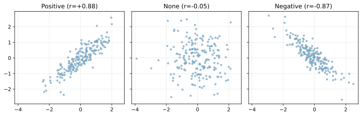
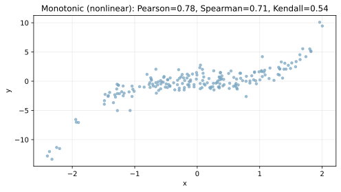

相関係数は、2つの変数の関係の強さを数値で表す指標。目的やデータ特性に応じて複数の相関係数を使い分ける。代表的には、線形関係を測る Pearson 相関係数、順位の関係を見る Spearman / Kendall 相関係数が使われる。

### Pearson 相関係数

Pearson 相関係数（Pearson correlation, r）は、2つの変数の「線形な関係の強さ」を -1 から 1 の範囲で表す指標。r が 1 に近いほど正の相関、-1 に近いほど負の相関、0 に近いほど線形関係が弱い。

- 定義: `r = cov(X, Y) / (sigma_x * sigma_y)`
- `cov(X, Y)` は共分散、`sigma_x` と `sigma_y` は標準偏差  
  共分散は、2つの変数が「同じ方向に動くか／逆方向に動くか」を表す指標。`cov(X, Y) = E[(X - mu_x)(Y - mu_y)]` で、`mu_x` と `mu_y` はそれぞれ `X` と `Y` の平均（期待値）。共分散が正なら同方向、負なら逆方向に動く傾向がある。ただし、単位が元のデータの単位に依存するため、比較や解釈には相関係数のような正規化が必要になる。

### 前提・注意

* 線形関係しか捉えられない（非線形な関係は r が小さくても存在しうる）
* 外れ値に引っ張られやすい
* 相関は因果関係ではない（第三の要因の可能性）

**利点：**
* 解釈が直感的（符号と大きさ）
* 相関行列で多変量の関係を俯瞰できる

**欠点：**
* 非線形な関係を見逃しやすい
* 外れ値の影響が大きい

### Spearman / Kendall の相関

Pearson が「値そのものの線形関係」を見るのに対し、Spearman や Kendall は「順位（ランク）の関係」を見る相関係数。

* **Spearman 相関**: 各値を順位に変換して Pearson を計算する。単調関係（一直線ではないが、増える/減るが一貫する関係）に強い。
* **Kendall 相関**: データの順序の一致/不一致（順序対）に基づく相関。外れ値に比較的強く、サンプルが小さい場合に安定しやすい。

使い分けの目安は次の通り。

* 線形関係が前提なら Pearson
* 単調関係が前提、外れ値が多いなら Spearman
* 順位の一致を厳密に見たい、サンプルが小さいなら Kendall

## Python での実例

### Pearson

線形関係の例。正相関／相関なし／負相関の3パターンを並べて比較する。

```python
import numpy as np
import matplotlib.pyplot as plt

rng = np.random.default_rng(0)
n = 200

x1 = rng.normal(size=n)
y1 = 0.8 * x1 + rng.normal(scale=0.4, size=n)

x2 = rng.normal(size=n)
y2 = rng.normal(size=n)

x3 = rng.normal(size=n)
y3 = -0.8 * x3 + rng.normal(scale=0.4, size=n)

fig, axes = plt.subplots(1, 3, figsize=(9, 3), sharex=True, sharey=True)
axes[0].scatter(x1, y1, s=10, alpha=0.7)
axes[0].set_title("Positive")
axes[1].scatter(x2, y2, s=10, alpha=0.7)
axes[1].set_title("None")
axes[2].scatter(x3, y3, s=10, alpha=0.7)
axes[2].set_title("Negative")
fig.suptitle("Pearson Correlation Examples")
plt.tight_layout()
plt.show()
```

**Output:**



### Spearman / Kendall

単調関係（非線形）の例。Pearson だと弱く見えるが、順位の関係は強いケースを想定している。

```python
import numpy as np
import pandas as pd
import matplotlib.pyplot as plt

rng = np.random.default_rng(0)
n = 200
x = rng.normal(size=n)
y = x ** 3 + rng.normal(scale=1.0, size=n)

plt.scatter(x, y, s=10, alpha=0.7)
plt.title("Monotonic (nonlinear) scatter")
plt.xlabel("x")
plt.ylabel("y")
plt.tight_layout()
plt.show()
```

**Output:**



### 数学での使いどころ

* 共分散行列の要約として相関行列を使う（多くは Pearson）
* 変数間の冗長性や多重共線性の確認（線形関係なら Pearson が基本）
* データの構造理解（単調関係が疑われる場合は Spearman / Kendall が有効）

### 機械学習での使いどころ

* 特徴量間の相関が高い場合の特徴選択（線形関係なら Pearson、単調関係なら Spearman / Kendall を見る）
* [PCA](../../ml/pca/pca.md) や線形モデルの前処理としての確認（相関構造を掴み、標準化や次元削減の必要性を判断する）
* EDA での仮説づくり（外れ値や歪みが強い場合は順位相関のほうが安定）

### 適さないケース

* 曲線的な関係が本質なデータ（例: 二次関数）
* 外れ値が多いデータ
* 因果推論を目的とする分析
