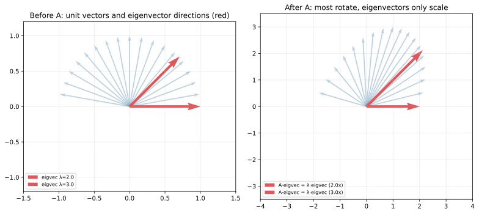
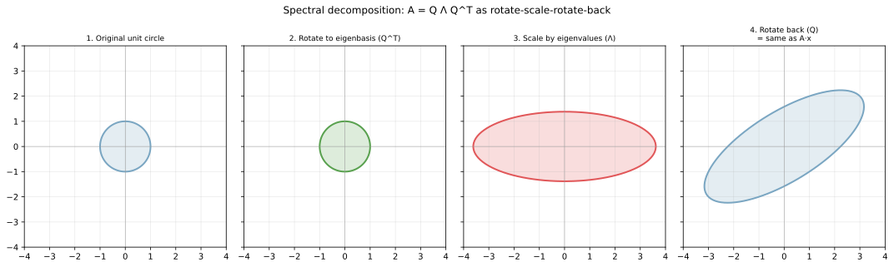
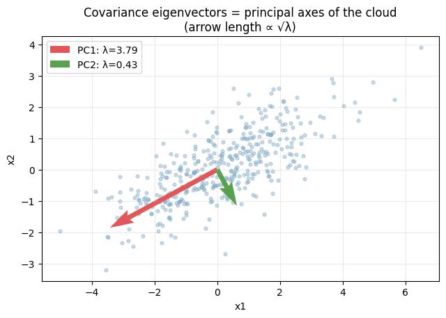
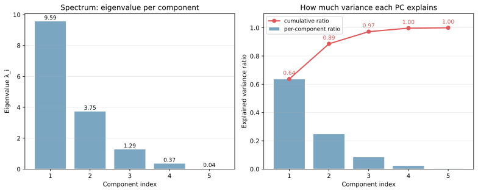

固有ベクトル（eigenvector）は、ある正方行列 `A` をかけても向きが変わらないベクトルのことで、固有値（eigenvalue）はその「向きが変わらないベクトル」が `A` によってスカラー倍された倍率である。式で書くと、

`A v = λ v`

を満たす `v ≠ 0` と `λ` を、それぞれ固有ベクトル・固有値と呼ぶ。一般のベクトルは `A` をかけると向きも長さも変わるが、固有ベクトルは長さだけが `λ` 倍に変わって、向きはそのままになる。

機械学習では [主成分分析（PCA）](../../ml/pca/) の中核に共分散行列の固有値分解が座っており、データの「最も伸びている方向」「次に伸びている方向」を順に固有ベクトルが捉える。線形変換の見方（[ベクトルと行列の演算](../vector-matrix-ops/) 参照）と組み合わせると、固有値・固有ベクトルは「その変換の骨格」を取り出す道具と読める。

### 固有ベクトル: 向きが変わらない方向

行列 `A = [[2, 1], [0, 3]]` を例に取る。

```python
import numpy as np
import matplotlib.pyplot as plt

A = np.array([[2.0, 1.0], [0.0, 3.0]])
eigvals, eigvecs = np.linalg.eig(A)

angles = np.linspace(0, np.pi, 18, endpoint=False)
vs = np.column_stack([np.cos(angles), np.sin(angles)])
Avs = (A @ vs.T).T

fig, axes = plt.subplots(1, 2, figsize=(11, 5))
for v in vs:
    axes[0].quiver(0, 0, *v, angles="xy", scale_units="xy", scale=1, color="#7aa6c2", alpha=0.5)
for v, Av in zip(vs, Avs):
    axes[1].quiver(0, 0, *Av, angles="xy", scale_units="xy", scale=1, color="#7aa6c2", alpha=0.5)
# (固有ベクトルの強調は scripts 側を参照)
plt.savefig("eigen_action.svg", bbox_inches="tight")
```



左の図は単位円周上に並べた青いベクトル群と、強調された 2 本の赤い固有ベクトルである。右の図は同じベクトル群に `A` をかけた結果で、青い大半のベクトルは向きが変わっているのに対し、赤い固有ベクトル方向だけは伸び方向が保たれている。それぞれの固有値 `λ_1 = 3, λ_2 = 2` が、固有ベクトル方向への伸び率に対応している。

固有値の符号と大きさには次の意味がある。

- `λ > 1`: その方向に拡大
- `0 < λ < 1`: その方向に縮小
- `λ < 0`: 方向反転 + 拡大/縮小
- `λ = 0`: その方向は潰れる（行列が特異）
- 複素固有値: 2 次元の回転成分を含む（実数の世界では「向きが変わらない」が成り立たない）

---

### 固有値分解（spectral decomposition）

正方行列 `A` が `n` 個の線形独立な固有ベクトルを持つとき、

`A = Q Λ Q^-1`

の形に分解できる。ここで `Q` は固有ベクトルを列に並べた行列、`Λ` は固有値を対角に並べた対角行列である。

対称行列の場合は `Q` が直交行列となり `Q^-1 = Q^T`、

`A = Q Λ Q^T`

と簡潔に書ける。共分散行列はもともと対称なので、機械学習ではこの形が標準と考えてよい。

この分解の幾何的な意味は「`A` の作用は『固有ベクトル基底に座標変換 → 各軸を固有値倍にスケーリング → 元の座標系に戻す』の 3 段階の合成として書ける」ことである。

```python
A = np.array([[3.0, 1.0], [1.0, 2.0]])  # 対称
eigvals, eigvecs = np.linalg.eigh(A)
# 円が A x によってどう変形するかを 4 段階で可視化（scripts 側を参照）
plt.savefig("diagonalization_steps.svg", bbox_inches="tight")
```



4 段階の図の読み方:

- 1: 元の単位円
- 2: `Q^T` で固有ベクトルが座標軸と揃うように回転
- 3: 対角行列 `Λ` を作用させて各軸を固有値倍に伸縮（楕円になる）
- 4: `Q` で元の座標系に戻る。結果は `A x` を直接適用したものと同じ

任意の対称行列は「直交回転 → 軸方向の伸縮 → 直交回転」の合成、というのが固有値分解の幾何的な核心である。一般の正方行列に拡張したものが特異値分解（SVD, singular value decomposition）で、こちらは正方でなくても適用できる代わりに左右で別の直交行列を使う `A = U Σ V^T` の形になる。

---

### 共分散行列の固有値分解 = PCA

機械学習で固有値分解が最も使われるのは、データの共分散行列 `Σ = (1/n) X^T X`（中心化済み）の分解である。これがそのまま [PCA](../../ml/pca/) で、主成分は共分散行列の固有ベクトル、各主成分の分散の寄与は対応する固有値となる。

```python
rng = np.random.default_rng(0)
data = rng.multivariate_normal([0, 0], [[3.0, 1.4], [1.4, 1.2]], size=400)
cov_emp = np.cov(data.T)
eigvals2, eigvecs2 = np.linalg.eigh(cov_emp)

plt.scatter(data[:, 0], data[:, 1], alpha=0.4, s=12, color="#7aa6c2")
for lam, v in zip(eigvals2, eigvecs2.T):
    scale = 2 * np.sqrt(lam)
    plt.quiver(0, 0, v[0] * scale, v[1] * scale, color="#e15759")
plt.savefig("cov_eigen_pca.png", bbox_inches="tight")
```



データ点群の散らばりの「主軸」が固有ベクトル方向と一致している。第 1 主成分（赤、最も大きい固有値）はデータが最も伸びる方向を、第 2 主成分（緑、2 番目の固有値）はそれに直交する方向で残りの分散を最大に説明する方向を指す。矢印の長さを `√λ` に取ることで、固有値がそのまま分散の大きさを表す関係も可視化されている。

固有値分解はもうひとつ重要なものを与える。固有値の配列（スペクトル）を見ると、各成分がデータのどれくらいの分散を説明するかが分かる。

```python
# 5 次元の合成データの共分散から
eigvals5 = np.sort(np.linalg.eigh(cov_X)[0])[::-1]
ratio = eigvals5 / eigvals5.sum()
cumratio = np.cumsum(ratio)
# 棒グラフと累積寄与率を並べる（scripts 側を参照）
plt.savefig("eigen_spectrum.svg", bbox_inches="tight")
```



左の棒グラフがスペクトル（各主成分の固有値）、右が「各成分が説明する分散の比率」と「累積寄与率」である。この例では上位 2 成分で全分散の約 87%、上位 3 成分で 94% を説明できることが読み取れる。「何次元に削減するか」を決めるとき、累積寄与率を見ながら 90%・95% のような目安で切る運用が標準である。

---

### 数学での使いどころ

- 線形微分方程式系 `dx/dt = A x` の解析解（固有値で振動・減衰の様子が決まる）
- 2 次形式 `x^T A x` の符号判定（正定値・負定値は固有値の符号で決まる）
- 主軸変換（楕円・楕円体の標準形への変換）
- マルコフ連鎖の定常分布（遷移行列の固有値 1 に対応する固有ベクトル）
- グラフラプラシアンの固有値分解（スペクトラルクラスタリングの基盤）

---

### 機械学習での使いどころ

固有値分解 / 特異値分解は機械学習の数式の至る所に現れる。

- [PCA](../../ml/pca/): 共分散行列の固有値分解で次元削減
- 特異値分解（SVD）: 長方形行列の分解、潜在因子モデル、行列補完
- スペクトラルクラスタリング: グラフラプラシアンの小さい固有ベクトルでクラスタリング
- カーネル PCA: カーネル行列の固有値分解で非線形な主成分を抽出
- レコメンドの行列分解: ユーザー × アイテム行列を低ランク近似（SVD ベース）
- 画像圧縮: 画像を行列とみなして低ランク近似する（上位 k 個の特異値だけ残す）
- LSI（潜在意味解析）: 文書 × 単語行列の SVD で潜在トピックを抽出
- 主固有値の活用: PageRank はリンク行列の最大固有値に対応する固有ベクトル

---

### 適さないケース / 落とし穴

固有値分解は強力だが、適用条件と数値特性に注意が必要である。

- 一般の長方形行列には適用できない: 正方行列が前提。長方形なら特異値分解（SVD）を使う
- 対角化できない行列がある: 同じ固有値を複数持つ場合、線形独立な固有ベクトルが足りずジョルダン標準形が必要になる。実用上はほぼ気にしなくてよいが、数値計算では摂動で対角化可能になることが多い
- 非対称行列の固有値は複素数になりうる: 実数の世界で「向きを保つ」と読めるのは実固有値の場合に限られる
- 大規模疎行列での全固有値計算は重い: 全部要らないなら上位 k 個だけ取る部分固有値分解（`scipy.sparse.linalg.eigsh`）を使うのが筋がよい
- 数値的不安定: 条件数が悪い行列の固有値分解は誤差が増幅される。SVD の方が数値的に安定で、実用では SVD 経由で固有値情報を取る場面も多い
- スケールの違う特徴量での PCA: 共分散行列が分散の大きい特徴量に支配されるため、PCA の前に [標準化](../../ml/standardization/) するのが基本
- 解釈の難しさ: 固有ベクトルの各要素が「元のどの特徴量にどう寄与しているか」を読むのは慣れが必要で、しばしばラベル付きの可視化が補助になる
