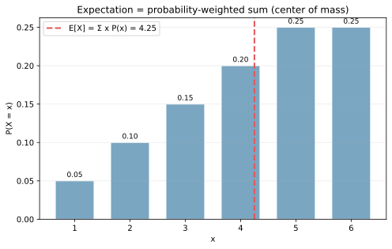
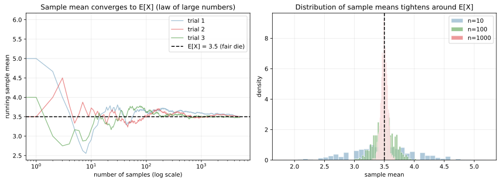
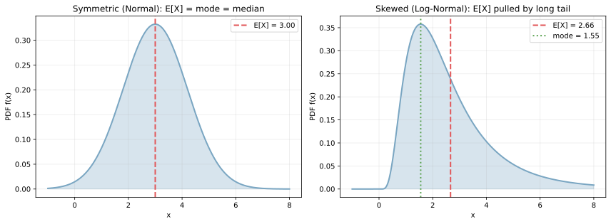

期待値（expected value, `E[X]`）は、確率変数 `X` を「無限回サンプリングして平均を取ったときの収束先」を表す量である。離散の場合は `E[X] = Σ_x x P(x)`、連続の場合は `E[X] = ∫ x f(x) dx` と書ける。「確率で重み付けした和（または積分）」が中心の定義で、物理で言う質量分布の重心と同じ構造を持つ。

機械学習で出てくる損失関数の多くは、データ分布に対する期待値の形をしている。`L(θ) = E_{(x, y) ~ p}[ℓ(x, y, θ)]` のように書かれ、これを訓練データという有限サンプルの平均で近似する、というのが「経験リスク最小化」と呼ばれる枠組みである。バイアス・バリアンス、強化学習の報酬、KL ダイバージェンスなど、確率モデルが出てくる場面では必ず期待値の言葉で議論される。

### 離散の期待値

サイコロを少し細工して、目が出る確率が下の表のように偏っているとする。

| 目 `x` | 1 | 2 | 3 | 4 | 5 | 6 |
|---|---|---|---|---|---|---|
| `P(X=x)` | 0.05 | 0.10 | 0.15 | 0.20 | 0.25 | 0.25 |

期待値は確率を重みとした和である。

`E[X] = 1×0.05 + 2×0.10 + 3×0.15 + 4×0.20 + 5×0.25 + 6×0.25 = 4.25`

```python
import numpy as np
import matplotlib.pyplot as plt

xs = np.array([1, 2, 3, 4, 5, 6])
probs = np.array([0.05, 0.10, 0.15, 0.20, 0.25, 0.25])
EX = float((xs * probs).sum())

plt.bar(xs, probs, color="#7aa6c2", edgecolor="white")
plt.axvline(EX, color="#e15759", lw=2, ls="--", label=f"E[X] = {EX:.2f}")
plt.savefig("expectation_discrete.svg", bbox_inches="tight")
```



赤い破線が `E[X] = 4.25` の位置で、青い棒（確率分布）の「重心」に対応する。期待値そのものが取りうる値のひとつであるとは限らない（実際この例で 4.25 という目はサイコロには存在しない）。値域に含まれない値が期待値になるのは、確率変数の定義上ごく普通の現象である。

期待値は「[平均](../mean/)」と混同しやすいが、両者は別物である。サンプル平均（標本平均, `x̄ = Σ x_i / n`）は手元のデータから計算する量、期待値は確率分布（または真の母集団）から計算する量である。サンプルが多ければ平均は期待値に近づくが、これを保証するのが次の大数の法則である。

---

### 大数の法則: サンプル平均が期待値に近づく

期待値の存在意義は、「サンプル平均が増えるほど期待値に収束する」という性質に支えられている。これを大数の法則（law of large numbers）と呼ぶ。

公平なサイコロを振り続け、ロール数の増加に伴うサンプル平均の動きを描く。期待値は `E[X] = (1+2+3+4+5+6)/6 = 3.5` である。

```python
rng = np.random.default_rng(0)
n_trials = 5000

fig, axes = plt.subplots(1, 2, figsize=(12, 4.5))
for seed, color in [(0, "#7aa6c2"), (1, "#e15759"), (2, "#59a14f")]:
    rolls = np.random.default_rng(seed).integers(1, 7, size=n_trials)
    running_mean = np.cumsum(rolls) / np.arange(1, n_trials + 1)
    axes[0].plot(running_mean, color=color, alpha=0.7, label=f"trial {seed+1}")
axes[0].axhline(3.5, color="black", ls="--")
axes[0].set_xscale("log")
# (右図はサンプル平均の分布、scripts 側を参照)
plt.savefig("law_of_large_numbers.svg", bbox_inches="tight")
```



左の図は 3 通りの試行で、サンプル数を 1 〜 5000 と増やしたときの累積平均の推移である。最初は試行ごとに揺れるが、サンプル数が増えると 3 本とも黒い破線（期待値 3.5）に収束していく。右の図は「`n` サンプルでの平均値」を 1000 回繰り返した分布で、`n = 10` では幅広く、`n = 100`、`n = 1000` と増やすにつれて期待値の周りに鋭く集中する。「`1/√n` のオーダーで収束する」という具体的な速度は中心極限定理が記述する内容で、機械学習でも標準誤差や信頼区間の計算に直結する。

---

### 連続の期待値

連続変数の期待値は積分で定義される。

`E[X] = ∫_{-∞}^{∞} x f(x) dx`

対称な分布（正規分布など）では `E[X]` は中央値・最頻値と一致するが、非対称な分布では大きくずれる。

```python
from scipy import stats

x = np.linspace(-1, 8, 400)
pdf_norm = stats.norm.pdf(x, loc=3.0, scale=1.2)
pdf_skew = stats.lognorm.pdf(x + 0.001, s=0.6, scale=np.exp(0.8))

fig, axes = plt.subplots(1, 2, figsize=(12, 4.5))
axes[0].plot(x, pdf_norm, color="#7aa6c2", lw=2)
axes[0].axvline(3.0, color="#e15759", ls="--", label="E[X] = 3.00")
axes[1].plot(x, pdf_skew, color="#7aa6c2", lw=2)
axes[1].axvline(np.exp(0.8 + 0.6**2 / 2), color="#e15759", ls="--", label="E[X]")
axes[1].axvline(np.exp(0.8 - 0.6**2), color="#59a14f", ls=":", label="mode")
plt.savefig("expectation_continuous.svg", bbox_inches="tight")
```



左の正規分布では `E[X]` がピーク（最頻値）と一致するが、右の対数正規分布では「裾」の長い右側に期待値が引っ張られ、最頻値より大きい位置に来る。期待値は外れ値の影響を強く受ける、というのが [平均と中央値](../median/) の議論と同じ構造である。実用ではロバスト性が必要なときに中央値や trimmed mean を併用する。

---

### 期待値の重要な性質

期待値の使いやすさは、次の 2 つの代数的性質に支えられている。

| 性質 | 式 | 条件 |
|---|---|---|
| 線形性 | `E[a X + b Y] = a E[X] + b E[Y]` | 常に成立（独立性は不要） |
| スカラー倍 | `E[c X] = c E[X]` | 常に成立 |
| 定数 | `E[c] = c` | 常に成立 |
| 積（独立時） | `E[X Y] = E[X] E[Y]` | `X, Y` が独立のとき限定 |

線形性は「`X` と `Y` が独立でなくても成り立つ」という点が重要である。共分散があっても、和の期待値は期待値の和になる。

```python
rng = np.random.default_rng(0)
n = 5000
X = rng.normal(2.0, 1.5, n)
Y = rng.chisquare(df=3, size=n)
Y_corr = Y + 0.5 * X  # X と Y_corr は相関を持つ
print(f"E[X] = {X.mean():.3f}")
print(f"E[Y] = {Y_corr.mean():.3f}")
print(f"E[X+Y] = {(X+Y_corr).mean():.3f}  vs  E[X]+E[Y] = {X.mean() + Y_corr.mean():.3f}")
# 詳細な可視化は scripts 側を参照
plt.savefig("expectation_linearity.svg", bbox_inches="tight")
```

出力例:

```text
E[X] = 2.013
E[Y] = 4.010
E[X+Y] = 6.023  vs  E[X]+E[Y] = 6.023
```

![期待値の線形性: 相関があっても E[X+Y]=E[X]+E[Y]](./expectation_linearity.svg)

3 つのヒストグラムが `X`、`Y`、`X + Y` のサンプル分布で、それぞれの期待値の位置に赤い破線を引いてある。右図の `X + Y` の平均と、`X` と `Y` の平均の和が一致している（赤と黒のラインがほぼ重なる）。`X` と `Y` は相関を持つように作ってあるが、期待値の線形性は独立性を要求しないため、それでも等号が成り立つ。

この性質のおかげで、複雑な確率モデルの期待値も「項ごとに分解して足し算」で扱えるケースが多い。例として、ニューラルネットの損失 `E[Σ_i ℓ_i]` は `Σ_i E[ℓ_i]` に分解でき、ミニバッチ平均でも有効な期待値推定になる。

---

### 条件付き期待値と total expectation

ある変数の値を固定したときのもう片方の期待値を、条件付き期待値（conditional expectation, `E[Y | X = x]`）と呼ぶ。回帰の問題設定そのもので、「`x` が与えられたときの `y` の期待値」を学習することが回帰モデルの目的になる。

全期待値の法則（law of total expectation, tower property）が便利な道具となる。

`E[Y] = E[E[Y | X]]`

「`X` を固定して条件付き期待値を計算 → さらにその `X` についての期待値を取る」と、無条件の期待値が復元できる、という構造である。階層的なデータ（クラスタ × サンプル）を扱うときや、ベイズ推論で事後期待値を求めるときに頻出する。

### 数学での使いどころ

- [分散](../variance/) の定義: `Var(X) = E[(X - E[X])^2] = E[X^2] - (E[X])^2`
- [相関](../correlation/) と共分散: `Cov(X, Y) = E[(X - E[X])(Y - E[Y])]`
- モーメント（`E[X^k]`）と特性関数（`E[exp(i t X)]`）
- 確率不等式（マルコフの不等式 `P(X ≥ a) ≤ E[X] / a`、チェビシェフの不等式）
- イェンセンの不等式: 凸関数 `g` について `g(E[X]) ≤ E[g(X)]`
- 中心極限定理（標本平均の分布の収束）

---

### 機械学習での使いどころ

- 損失関数の定義: 経験リスク `L(θ) = E_{(x, y)}[ℓ(x, y, θ)]` の最小化（経験リスク最小化）
- バイアス: `Bias[ŷ] = E[ŷ] - y_true`（[バイアス-バリアンス分解](../../ml/bias-variance-tradeoff/) 参照）
- 回帰モデル: 多くの場合 `ŷ(x) = E[Y | X = x]` を学習する
- KL ダイバージェンス: `KL(p || q) = E_p[log(p/q)]`
- 強化学習: 累積報酬の期待値 `V(s) = E[Σ_t γ^t r_t | s_0 = s]` の最大化
- 自然方策勾配・変分推論: 期待値の勾配を扱う場面が多い（REINFORCE、ELBO）
- 確率モデルの周辺化: 潜在変数を持つモデルで `p(x) = E_z[p(x | z)]`
- ベイズ最適化: 獲得関数 EI（Expected Improvement）は「改善量の期待値」

期待値は機械学習の式の文法のような存在で、ほとんどの目的関数や評価式が `E[...]` の形をしている。

---

### 適さないケース / 落とし穴

- 期待値が存在しないケース: 裾の重い分布（コーシー分布など）では `E[X]` が発散する。サンプル平均は値を取るが、何回繰り返しても収束しない
- 期待値が実用的な代表値にならないケース: 二峰性の強い分布では期待値が「どちらの山にも属さない谷」を指すことがある（[平均](../mean/) のノート参照）
- サンプル平均は期待値の「無偏推定量」だが、`E[X^2]` の推定では `(1/n) Σ x_i^2` ではなく `(1/(n-1)) Σ (x_i - x̄)^2` のような補正が分散には必要
- 期待値とサンプル平均の混同: 期待値は真の分布についての量、サンプル平均はサンプルからの推定量。研究や論文では区別が重要
- 線形性は独立を必要としないが、積の期待値 `E[X Y]` は独立性が必要。共分散がある場合 `E[X Y] = E[X] E[Y] + Cov(X, Y)`
- 高次元での期待値計算の難しさ: 解析的に積分できないケースが大半で、モンテカルロ法（サンプル平均で近似）か変分近似が必要になる
