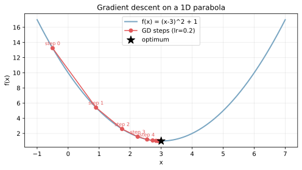
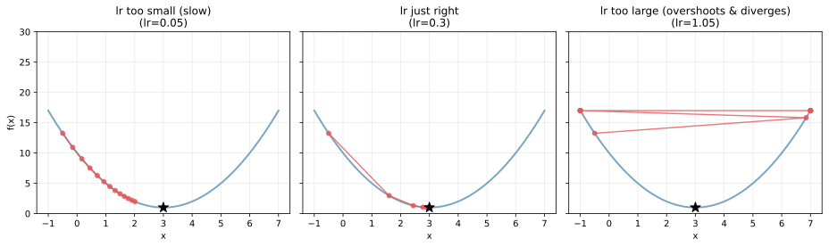
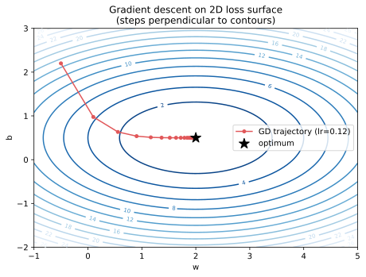
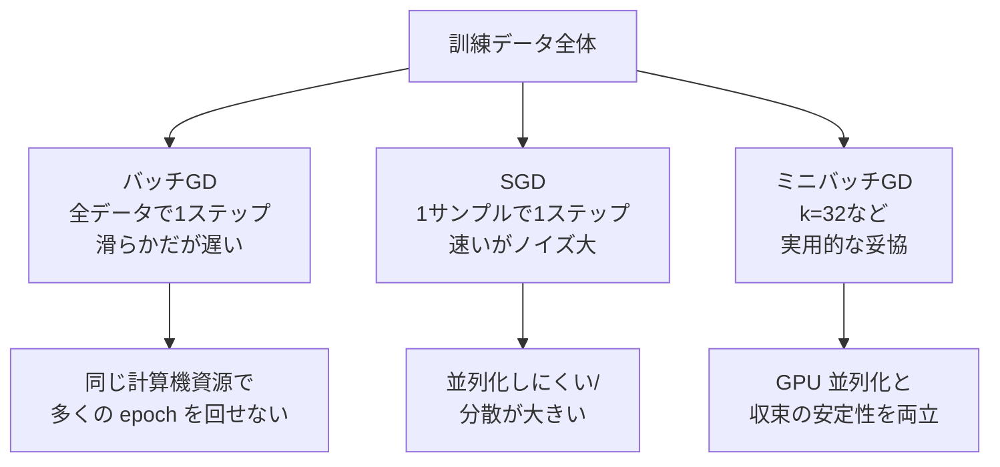
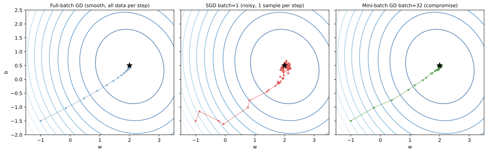

最急降下法（gradient descent, GD）は、関数 `f(x)` を最小化するために「現在地から見て最も急に下る方向（= 負の勾配 `-∇f`）に少しずつ進む」反復アルゴリズムである。確率的勾配降下法（stochastic gradient descent, SGD）は、勾配を全データではなくランダムな 1 サンプル（または小バッチ）から推定して更新する派生で、大規模データでの学習に欠かせない手法となる。

機械学習で「モデルを訓練する」と言うとき、その多くは損失関数 `L(θ)` をパラメータ `θ` について最小化する最適化問題を解いていることを意味する。線形回帰の閉形式解のように勾配を使わずに最小値を直接出せる例外もあるが、ロジスティック回帰、サポートベクターマシン、ニューラルネットといった大半のモデルは GD / SGD 系のアルゴリズムで重みを更新している。前提として [偏微分と勾配](../partial-derivative-gradient/) の概念を使うので、必要なら先に確認しておくとよい。

### 更新式の基本形

更新式は次の 1 行に集約される。

`θ_{t+1} = θ_t - η ∇L(θ_t)`

- `θ_t`: 時刻 `t` のパラメータベクトル
- `η`: 学習率（learning rate）。1 ステップでどれだけ動くかを決める正の小さな数
- `∇L(θ_t)`: 現在のパラメータでの損失の勾配

この式は「下りたい方向（負の勾配）に学習率の倍率で進む」という直感そのものを式にしたもので、形だけ見れば極めて単純である。一方で、`η` の選び方・勾配の計算方法・更新のスケジュールの組み合わせで、収束の速さ・安定性・最終的な精度が大きく変わる。

---

### 1 次元での挙動

最も単純な例として `f(x) = (x - 3)^2 + 1` を最小化する。最適解は `x* = 3, f(x*) = 1` である。微分は `f'(x) = 2(x - 3)` で、これが勾配になる。

```python
import numpy as np
import matplotlib.pyplot as plt

def f(x): return (x - 3) ** 2 + 1
def df(x): return 2 * (x - 3)

x_grid = np.linspace(-1, 7, 200)
plt.plot(x_grid, f(x_grid), color="#7aa6c2", lw=2)

x_cur, lr = -0.5, 0.2
history = [x_cur]
for _ in range(8):
    x_cur = x_cur - lr * df(x_cur)
    history.append(x_cur)
history = np.array(history)
plt.plot(history, f(history), "o-", color="#e15759")
plt.savefig("gd_1d.svg", bbox_inches="tight")
```



赤い点列が `x` の更新軌跡で、初期値 `x_0 = -0.5` から始めて 8 ステップで最適解付近 `x ≈ 3` に近づいている。最初は勾配が大きいので歩幅も大きく、最適解に近づくと勾配が小さくなって自然に細かく動くようになる。これが最急降下法が最適解に「収束していく」直感である。

---

### 学習率の選び方

`η` の値は GD の挙動を支配する。3 つのケースを並べると分かりやすい。

```python
fig, axes = plt.subplots(1, 3, figsize=(13, 4))
for ax, lr in zip(axes, [0.05, 0.3, 1.05]):
    ax.plot(x_grid, f(x_grid), color="#7aa6c2", lw=2)
    x_cur = -0.5
    hist = [x_cur]
    for _ in range(12):
        x_cur = x_cur - lr * df(x_cur)
        hist.append(x_cur)
    ax.plot(np.clip(hist, -1, 7), f(np.clip(hist, -1, 7)),
            "o-", color="#e15759")
plt.savefig("gd_learning_rate.svg", bbox_inches="tight")
```



3 つのパターンの読み方:

- 左（`lr=0.05`）: 1 ステップの歩幅が小さく、12 ステップ経っても最適解にまだ到達していない。「収束はするが遅い」状態
- 中央（`lr=0.3`）: 数ステップで最適解付近に到達。バランスのよい設定
- 右（`lr=1.05`）: 1 ステップで反対側に飛び越え、振幅が拡大していく。発散して `x` が無限大に飛ぶ

学習率は、損失関数の曲率（2 階微分）で決まる「安全な上限」を超えると発散することが知られており、2 次関数では `η < 2 / f''` が安定性の境界となる。実用上は試行錯誤か、学習率を徐々に下げるスケジュール（cosine decay, step decay）で安全側に倒すのが標準的と考えられる。

---

### 2 次元での軌跡

パラメータが 2 つ以上の場合も同じ更新式が成り立つ。`L(w, b) = (w - 2)^2 + 3 (b - 0.5)^2` の例で軌跡を見る。

```python
def L(w, b): return (w - 2) ** 2 + 3 * (b - 0.5) ** 2
def dL(w, b): return 2 * (w - 2), 6 * (b - 0.5)

w_grid = np.linspace(-1, 5, 200); b_grid = np.linspace(-2, 3, 200)
WW, BB = np.meshgrid(w_grid, b_grid)
plt.contour(WW, BB, L(WW, BB), levels=15, cmap="Blues_r")

w_cur, b_cur, lr = -0.5, 2.2, 0.12
hist = [(w_cur, b_cur)]
for _ in range(20):
    gw, gb = dL(w_cur, b_cur)
    w_cur -= lr * gw; b_cur -= lr * gb
    hist.append((w_cur, b_cur))
hist = np.array(hist)
plt.plot(hist[:, 0], hist[:, 1], "o-", color="#e15759")
plt.savefig("gd_2d_trajectory.svg", bbox_inches="tight")
```



各ステップは等高線に直交する方向（= 勾配ベクトルの逆向き）に進んでいる。曲率が大きい `b` 方向では振動気味に、曲率が小さい `w` 方向ではゆっくり最適解に近づく軌跡が見て取れる。この「方向ごとに収束速度が違う」現象は ill-conditioning と呼ばれ、Adam のような適応的学習率系の最適化手法が緩和する課題と直結する。

---

### バッチ GD・SGD・ミニバッチの違い

訓練データが `n` サンプルあるとき、勾配 `∇L(θ)` をどのデータから計算するかで 3 つの流派が分かれる。

- バッチ GD（full-batch）: 毎ステップ、全 `n` サンプルで勾配を計算。方向は正確だが 1 ステップが重い
- SGD（batch=1）: 毎ステップ、ランダムに選んだ 1 サンプルで勾配を計算。1 ステップは軽いが方向はノイズだらけ
- ミニバッチ GD（batch=k, 例 16〜256）: 毎ステップ、ランダムに選んだ `k` サンプルで勾配を計算。両者の中間



線形回帰の例で軌跡を比較する。

```python
rng = np.random.default_rng(0)
n_data = 500
x_data = rng.uniform(-2, 2, n_data)
y_data = 2.0 * x_data + 0.5 + rng.normal(0, 0.5, n_data)
# 詳細な実行は scripts 側を参照
plt.savefig("gd_vs_sgd.svg", bbox_inches="tight")
```



左から順に full-batch GD・SGD（batch=1）・ミニバッチ GD（batch=32）の軌跡である。

- Full-batch（青）: ほぼ真っ直ぐ最適解に向かう。等高線の法線方向を毎回正確に下る
- SGD（赤）: ジグザグに大きく揺れる。各ステップの勾配が 1 サンプル分のノイズを含む
- ミニバッチ（緑）: 全体としては full-batch に近い滑らかさで、各ステップの計算は SGD に近い軽さ

実用では深層学習を含めてほぼミニバッチ GD が標準で、batch size は GPU メモリ・学習の安定性・並列性のトレードオフで決まる。理論的には full-batch が「真の」勾配方向を出すが、ノイズが入る SGD には鞍点や浅い局所最小から抜け出しやすい副次効果もあり、深層学習ではむしろ歓迎されることが多いと考えられる。

---

### 派生手法の見取り図

素の GD / SGD はそのまま深層学習で使われることは少なく、収束の速さと安定性を補う派生手法が主流である。代表的なものを並べる。

| 手法 | 中核アイデア | 解決する課題 |
|---|---|---|
| Momentum | 過去の勾配を慣性として蓄積。`v ← μ v - η g; θ ← θ + v` | 谷沿いの振動を抑えて収束を速める |
| Nesterov | Momentum を「見越して」適用 | Momentum の過剰オーバーシュートを軽減 |
| AdaGrad | パラメータごとに学習率を勾配の累積で割る | 疎な特徴量の学習率を相対的に大きく取る |
| RMSProp | AdaGrad の累積を移動平均化 | 学習率が時間とともに 0 に落ちる問題を回避 |
| Adam | Momentum + RMSProp の組み合わせ | 多くの実用ケースでデフォルト候補 |

深層学習では Adam か SGD + Momentum が圧倒的な標準である。一方で「Adam は汎化性能が SGD + Momentum に劣る」という議論もあり、画像分類の SOTA では SGD + Momentum + cosine decay が選ばれる場面も多い。

### 数学での使いどころ

- 制約なし最適化の汎用解法（凸関数なら大域最適解に収束）
- 微分可能なすべての関数の極値探索の基本道具
- 線形方程式 `A x = b` の数値解法（共役勾配法は GD の発展形）
- ニュートン法と対比される 1 次法（勾配だけを使う方法）
- 確率近似法（Robbins-Monro）の理論的枠組み

---

### 機械学習での使いどころ

- 線形回帰・ロジスティック回帰・SVM の双対問題など、ほぼすべての教師あり学習で標準
- ニューラルネットの全パラメータ更新（[誤差逆伝播法](../../ml/backpropagation/) で各層の勾配を求めて適用）
- 勾配ブースティング（決定木の残差を疑似勾配として近似する）
- 強化学習のポリシー勾配法（報酬の期待値の勾配でポリシーを更新）
- オンライン学習・ストリーミング学習（データが順次到着する場面で SGD が自然）

学習率の決め方や batch size の選び方は [ハイパーパラメータ](../../ml/hyperparameter/) として明示的にチューニングの対象になることが多い。

---

### 適さないケース / 限界

GD / SGD は万能ではない。以下のケースでは別系統の手法を検討する必要がある。

- 微分不可能な点が支配的: 絶対値関数の角や、決定木の分岐は GD で扱えない（劣勾配や離散最適化で対応）
- 強い非凸性 + 鞍点が多い高次元損失: 局所最小に捕まりやすい。SGD のノイズや Momentum、Adam が緩和するが完全解決ではない
- 勾配計算が極端に重い: 1 サンプルの勾配計算がそもそも高コストだと、勾配を使わない手法（ベイズ最適化、遺伝的アルゴリズム）が候補に上がる
- 制約付き最適化: 等式・不等式制約が強い場合は射影勾配法、ラグランジュ乗数、内点法など追加の枠組みが必要
- 厳密解が閉形式で出るケース: 線形回帰の正規方程式 `θ = (X^T X)^-1 X^T y` のように、直接解いた方が速い場合は GD を使う理由がない
