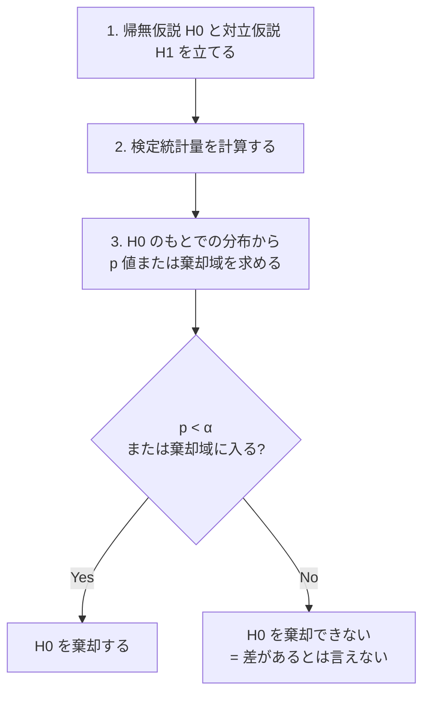
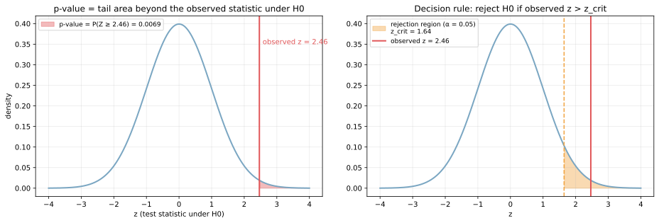
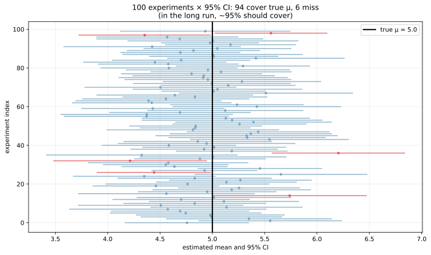
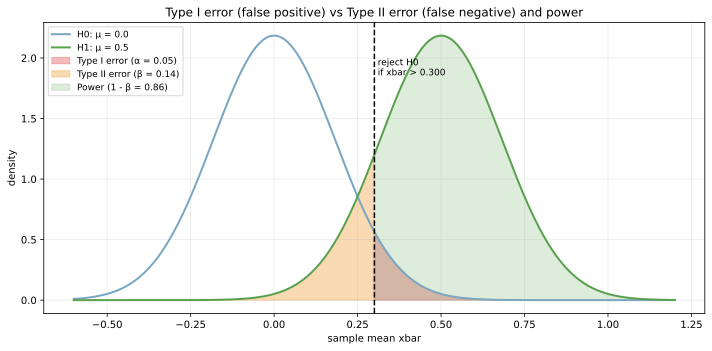
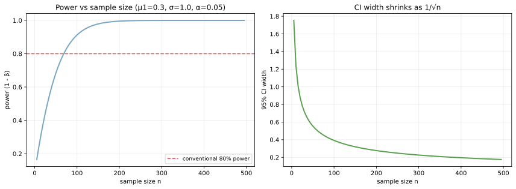

仮説検定（hypothesis testing）は、ある主張（帰無仮説）が正しいと仮定したときに、観測されたデータがどれくらい「ありえない」かを定量化して結論を出す統計的手続きである。p 値（p-value）はその「ありえなさ」を 1 つの確率として表した量、信頼区間（confidence interval）は推定値の周りに「真値があると考えられる範囲」を区間で示したものとなる。

機械学習の文脈では、A/B テストでのモデル比較、特徴量の有意性判定、複数モデルの精度差の検定、データドリフトの検出など、「2 つの群が違うと言ってよいか」を判断する場面で繰り返し登場する。一方で「p < 0.05 だから差がある」のような単純な使い方は問題視されており、効果量・信頼区間・検定力をセットで読むのが現代的な作法となる。

### 仮説検定の枠組み

検定はおおよそ次の 4 ステップで進む。



- 帰無仮説 `H0`（null hypothesis）: 「差がない」「効果がない」など、保守的・現状維持側の主張
- 対立仮説 `H1`（alternative hypothesis）: `H0` の否定。両側 (`≠`) か片側 (`>` or `<`) かを事前に決める
- 検定統計量: 観測データから計算されるスカラー値。`H0` のもとで分布が分かっているもの
- 有意水準 `α`: 第一種誤り（H0 が正しいのに棄却してしまう確率）の上限。慣習的に 0.05 や 0.01

検定統計量の例として、母平均の検定では `z = (xbar - μ_0) / (σ / √n)` を使う。`xbar` がサンプル平均、`μ_0` が `H0` での平均、`n` がサンプル数。`H0` のもとで `z` は標準正規分布 `N(0, 1)` に従うため、観測値の「珍しさ」を確率に変換できる。

---

### p 値の意味

p 値は「帰無仮説が正しいと仮定したとき、観測された検定統計量と同等以上に極端な値が得られる確率」である。式で書けば片側検定で `p = P(Z ≥ z_obs | H0)`、両側検定で `p = 2 × P(Z ≥ |z_obs| | H0)`。

例: サンプル数 30、サンプル平均 0.45、母標準偏差 1、帰無仮説 `μ = 0`、対立仮説 `μ > 0` のとき、

`z_obs = 0.45 × √30 / 1 ≈ 2.46`

H0 のもとで `Z ≥ 2.46` となる確率は約 0.0069 で、これが p 値となる。

```python
import numpy as np
import matplotlib.pyplot as plt
from scipy import stats

z_obs = 0.45 * np.sqrt(30)
z = np.linspace(-4, 4, 400)
pdf = stats.norm.pdf(z)

plt.plot(z, pdf, color="#7aa6c2", lw=2)
plt.fill_between(z, pdf, where=(z >= z_obs), color="#e15759", alpha=0.4,
                 label=f"p = {1 - stats.norm.cdf(z_obs):.4f}")
plt.axvline(z_obs, color="#e15759", lw=2)
plt.savefig("p_value_concept.svg", bbox_inches="tight")
```



左の図の赤い領域が p 値を表す面積で、右の図は事前に決めた有意水準 `α = 0.05` での棄却域（橙の領域）を示している。観測 z が棄却域に入っていれば `H0` を棄却する、というのが伝統的な意思決定ルールである。両者は同じ操作の 2 つの見方で、`p < α` ⇔ `z_obs ∈ 棄却域` が成り立つ。

p 値の解釈は誤りやすいので、明確に区別する必要がある。

| 正しい解釈 | よくある誤った解釈 |
|---|---|
| H0 が正しいと仮定したときに、観測と同等以上に極端なデータが得られる確率 | H0 が正しい確率（= p） |
| H1 を支持する強さの目安（小さいほど H0 と整合しにくい） | 効果の大きさ |
| 仮説と整合性が低いことを示すが、原因ではない | 「p が小さい = 統計的に強い」とは限らない |

p 値はあくまで「H0 のもとでの観測の珍しさ」であり、`P(H0 | データ)` ではない点に注意が必要となる。これは [ベイズの定理](../bayes-theorem/) の事後確率とは別物で、混同するのが典型的な誤りである。

---

### 信頼区間: 推定値の不確実性を区間で表す

信頼区間は「同じ実験を多数回繰り返したとき、その何 % が真値を含むか」を保証する区間である。よく使われる 95% 信頼区間は

`CI_95% = xbar ± 1.96 × (σ / √n)`

の形を取る（標準正規近似の場合）。

注意: 信頼区間の正しい解釈は「区間そのものが真値を含む確率」ではなく、「実験を繰り返したとき 95% の区間が真値を含む」という頻度主義的な意味である。1 回の実験で得られた特定の区間に対して「この区間に真値が 95% の確率で含まれる」と言うのは厳密には誤りで、これは [ベイズの定理](../bayes-theorem/) の信用区間（credible interval）が持つ意味と取り違えやすい。

```python
rng = np.random.default_rng(0)
true_mu = 5.0; sigma = 2.0; n_per = 30
for i in range(100):
    sample = rng.normal(true_mu, sigma, n_per)
    xbar = sample.mean()
    se = sample.std(ddof=1) / np.sqrt(n_per)
    lo, hi = xbar - 1.96 * se, xbar + 1.96 * se
# 区間が真値を含むかどうかで色分け (scripts 側を参照)
plt.savefig("confidence_intervals.svg", bbox_inches="tight")
```



各横棒が 1 回の実験で得られた 95% 信頼区間で、青は真値（黒い縦線）を含む区間、赤は含まない区間である。100 回の実験のうち 95% 前後が含み、約 5% は外す、というのが 95% 信頼区間の正しい意味となる。サンプル数 `n` を増やすと、区間の幅は `1/√n` で縮む。

信頼区間と p 値は同じ情報を別の形で表したものでもあり、「95% 信頼区間が `μ_0` を含まない」⇔「両側検定で p < 0.05」が成り立つ。実用上は信頼区間の方が情報量が多い（区間の位置・幅から効果の大きさと精度の両方を読める）ため、論文・レポートでは信頼区間を主に提示し、p 値は補助に回す流れが強まっている。

---

### 第一種誤り・第二種誤り・検定力

検定では 2 種類の誤りがありえる。

| 誤り | 状況 | 確率 |
|---|---|---|
| 第一種誤り（type I error） | H0 が真なのに棄却 | α（有意水準で制御） |
| 第二種誤り（type II error） | H1 が真なのに H0 を棄却できない | β |

検定力（power）は `1 - β`、すなわち「H1 が真のとき正しく H0 を棄却できる確率」である。慣習的に 80% 以上を目指す。

```python
n = 30; sigma = 1.0; mu0 = 0.0; mu1 = 0.5
se = sigma / np.sqrt(n)
x = np.linspace(-0.6, 1.2, 600)
pdf0 = stats.norm.pdf(x, loc=mu0, scale=se)
pdf1 = stats.norm.pdf(x, loc=mu1, scale=se)
crit = stats.norm.ppf(0.95, loc=mu0, scale=se)
# H0 と H1 の分布を重ね、棄却域・β・power を色分け (scripts 側を参照)
plt.savefig("type1_type2_power.svg", bbox_inches="tight")
```



青い曲線が `H0: μ = 0` のもとでの `xbar` の分布、緑が `H1: μ = 0.5` のもとでの分布である。黒い破線が `α = 0.05` での棄却境界で、その右側が棄却域となる。

- 赤の領域: 第一種誤り α（H0 真なのに「右に超える」確率）
- 橙の領域: 第二種誤り β（H1 真なのに「右を超えない」確率）
- 緑のうち右側: 検定力 `1 - β`

α を小さくすると（境界を右にずらす）、第一種誤りは減るが第二種誤りは増える。この緊張関係は 2 群の分布の重なりが本質で、サンプル数を増やして両分布を細くするか、効果量（`μ1 - μ0`）が大きい場面でしか同時に改善できない。

---

### サンプル数の効果

サンプル数 `n` を増やすと検定力が上がり、信頼区間が狭まる。両者の改善速度は `1/√n` のオーダーで、`n` を 4 倍にして精度・検定力が約 2 倍向上する。

```python
mu1 = 0.3; sigma = 1.0; alpha = 0.05
ns = np.arange(5, 500, 5)
powers, ci_widths = [], []
for n in ns:
    se = sigma / np.sqrt(n)
    crit = stats.norm.ppf(1 - alpha, loc=0, scale=se)
    powers.append(1 - stats.norm.cdf(crit, loc=mu1, scale=se))
    ci_widths.append(2 * 1.96 * se)
# 描画は scripts 側を参照
plt.savefig("sample_size_effect.svg", bbox_inches="tight")
```



左の図はサンプル数と検定力の関係で、目標値 80%（赤い破線）に達するのに必要な `n` を読み取れる。右の図は信頼区間の幅で、`1/√n` で減衰する。実験計画段階で「最小限の検出可能効果」と「目標検定力」から必要サンプル数を逆算するのが、`power analysis`（検定力分析）と呼ばれる手続きである。

### 数学での使いどころ

- 統計的推定の理論基盤（最尤推定の漸近正規性、フィッシャー情報量）
- 母数の区間推定（平均・分散・比率・回帰係数）
- ノンパラメトリック検定（マン-ホイットニー U 検定、コルモゴロフ-スミルノフ検定）
- 多重比較補正（Bonferroni、Holm、Benjamini-Hochberg）
- 効果量（Cohen's d、Cramér's V）の併用

---

### 機械学習での使いどころ

- A/B テスト: 新モデルや新機能の効果検定
- モデル比較: 交差検証で得られたスコア差の検定（対応のある t 検定、Wilcoxon 符号順位検定）
- 特徴量の有意性: ロジスティック回帰や線形回帰の係数の Wald 検定
- データドリフト検出: 訓練データと本番データの分布差の検定（KS 検定、PSI、`χ²` 検定）
- ハイパーパラメータ探索の停止基準（Successive Halving、early stopping）
- データ分割の妥当性チェック（train/test 分布が同じかの検定）
- ベイズ最適化の獲得関数（信頼区間の幅で「不確実性が高い領域」を優先探索）

機械学習の実践では、p 値より「効果量 + 信頼区間 + サンプル数」のセットで議論する方が、結果が安定して伝わると考えられる。

---

### 適さないケース / 落とし穴

- p ハッキング: 多数の検定を試して p < 0.05 が出たものだけ報告する。偽陽性が大量に出る。多重比較補正かベイズ流アプローチが必要
- 効果量を見ない: サンプル数が極端に大きいと、無視できる差でも p < 0.05 が出る。実用的に意味があるかは効果量で判断する
- 「p > 0.05 だから差がない」と結論する: H0 を「採択」したわけではなく、棄却できなかっただけ。検定力不足の可能性が常にある
- 正規性・等分散性の仮定が満たされない: t 検定は正規性に強くないがロバスト、F 検定は等分散性の崩れに弱い。前処理または別の検定（ノンパラ）で対処
- 独立性の仮定: 同一被験者からの繰り返し測定は通常の t 検定では扱えない。対応のある t 検定や混合効果モデルが必要
- 信頼区間とベイズの信用区間の混同: 95% CI は「真値を含む実験の割合が 95%」、95% 信用区間は「事後分布での真値の確率が 95%」。意味も計算も別物
- マルチアームバンディットとの混同: 探索と活用のバランスを取りつつ群差を推定するなら、固定の検定よりベイズ的逐次推論の方が筋がよいことが多い
- 「機械学習モデルの精度差に t 検定をかける」のは妥当か: 評価指標の独立性が崩れていることが多い（同じテストデータ）。Nadeau-Bengio 補正や Bayesian comparison を併用するのが本筋
