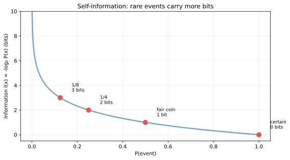
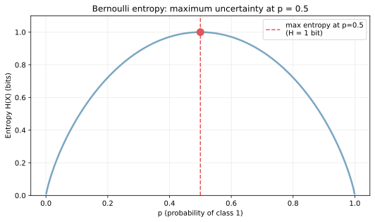
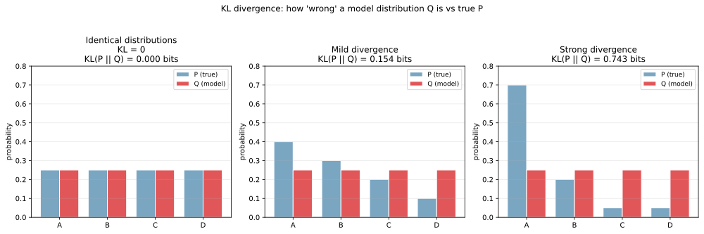
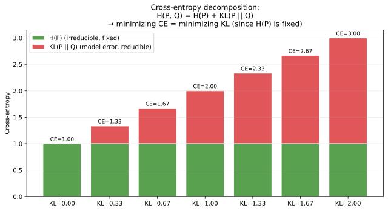
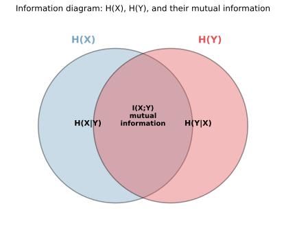

情報理論（information theory）は、Claude Shannon が 1948 年に創始した「情報を定量化する」枠組みである。中核となる量がエントロピー（entropy, 不確実性）、KL ダイバージェンス（2 分布の距離）、相互情報量（mutual information, 2 変数の依存性）の 3 つで、機械学習の損失関数・特徴量選択・決定木の分割基準・変分推論などに直接現れる。

[ベイズの定理](../bayes-theorem/) と [対数・指数関数](../log-exp-logodds/) の知識を前提として、確率分布を「情報量」という単位で扱う視点を得るためのノートとなる。[損失関数](../../ml/loss-functions/) の交差エントロピー、[決定木](../../ml/decision-tree/) の情報利得、[特徴量重要度](../../ml/feature-importance/) の MDI など、ML の多くの場面で前提として登場する。

### 自己情報量: 珍しい事象ほど情報が大きい

確率 `p(x)` で起こる事象 `x` が観測されたときの「驚き」を量化したものが自己情報量。

`I(x) = -log_2 p(x)`

底に 2 を取ると単位は「ビット（bit）」、自然対数なら「ナット（nat）」となる。機械学習では自然対数を使うのが標準。

```python
import numpy as np
import matplotlib.pyplot as plt

p = np.linspace(0.001, 1, 400)
plt.plot(p, -np.log2(p), color="#7aa6c2", lw=2.5)
plt.xlabel("P(event)")
plt.ylabel("I(x) = -log₂ P(x) (bits)")
plt.savefig("info_self_information.svg", bbox_inches="tight")
```



- `p = 1` の事象（確実に起きる）: `I = 0` ビット（何の情報も得られない）
- `p = 0.5` の事象（コインの裏表）: `I = 1` ビット（YES/NO 1 つ分）
- `p = 1/8` の事象（8 通りから 1 つ）: `I = 3` ビット（2³ = 8 を区別する bit 数）
- `p → 0` の事象（超低頻度）: `I → ∞`

「めったに起きないこと」が起きたら、その情報量が大きい、というのが情報理論の出発点。事前確率を予測している話との対比で「予想していた事象が起きてもニュース性は低いが、予想外の事象が起きるとニュース性は高い」という日常感覚と一致する。

---

### エントロピー: 平均情報量

確率変数 `X` の取りうる全ての値 `x` について、自己情報量を確率で重み付けして平均したものがエントロピー。

`H(X) = -Σ_x P(x) log P(x)`

これが「`X` を予測するときの平均的な不確実性」あるいは「`X` を符号化するのに必要な平均ビット数」を表す。

2 値ベルヌーイ分布（コイン投げ）のエントロピーを `p` の関数として描く。

```python
ps = np.linspace(0.001, 0.999, 400)
H = -(ps * np.log2(ps) + (1 - ps) * np.log2(1 - ps))
plt.plot(ps, H, color="#7aa6c2", lw=2.5)
plt.savefig("info_bernoulli_entropy.svg", bbox_inches="tight")
```



- `p = 0` または `p = 1`: 結果が決まっているのでエントロピー 0
- `p = 0.5`: 完全に半々で結果が予測できない。エントロピー最大 = 1 ビット

「クラスが半々」が最も予測しにくい状態、というのは [決定木](../../ml/decision-tree/) で分割の不純度として登場する Gini と本質的に同じ構造である。決定木は「分割によって `H` が下がる量（情報利得）」が最大の特徴量を選んでいる。

### 連続変数の微分エントロピー

連続変数の場合は和が積分に変わる。

`H(X) = -∫ f(x) log f(x) dx`

連続分布の中でエントロピー最大なのは、(1) 値域が `[a, b]` で固定なら一様分布、(2) 平均と分散が固定なら正規分布、というのが「最大エントロピー原理」として知られる。「分かっている制約だけ仮定し、それ以上の情報は仮定しない」という発想で、ベイズ統計の事前分布の選択に利用される。

---

### KL ダイバージェンス: 2 分布の「距離」

`P` と `Q` の 2 つの確率分布があるとき、KL ダイバージェンス（Kullback-Leibler divergence）は、

`KL(P || Q) = Σ_x P(x) log (P(x) / Q(x))`

の式で定義される。「`Q` を `P` の近似と思って使ったときの符号化の余分なビット数」「`P` で発生したサンプルを `Q` で説明したときの誤差」と解釈できる。

性質:

- `KL(P || Q) ≥ 0`、等号は `P = Q` のときのみ（ギブスの不等式）
- `KL(P || Q) ≠ KL(Q || P)`（非対称、距離関数ではない）
- `P(x) > 0` だが `Q(x) = 0` の点があると `∞`（モデルが「あり得ない」と言った事象が真分布で起きると無限のペナルティ）

```python
# 3 通りのケースで KL を計算
import numpy as np
cases = [
    ("identical", [0.25]*4, [0.25]*4),
    ("mild", [0.4, 0.3, 0.2, 0.1], [0.25]*4),
    ("strong", [0.7, 0.2, 0.05, 0.05], [0.25]*4),
]
for name, p, q in cases:
    p, q = np.array(p), np.array(q)
    print(f"{name}: KL(P || Q) = {(p * np.log2(p / q)).sum():.3f} bits")
plt.savefig("info_kl_divergence.svg", bbox_inches="tight")
```

出力:

```text
identical: KL(P || Q) = 0.000 bits
mild:      KL(P || Q) = 0.207 bits
strong:    KL(P || Q) = 0.812 bits
```



3 つのパネルで `Q`（赤、一様分布）は固定、`P`（青、真の分布）を徐々に偏らせている。`P` と `Q` が一致するとき KL = 0、`P` が偏るほど KL が増える。「真分布 `P` に対してモデル `Q` がどれだけ wrong か」を定量化する尺度として、機械学習の評価・学習に頻出する。

---

### 交差エントロピー = エントロピー + KL

[損失関数](../../ml/loss-functions/) のノートで扱った交差エントロピーは、エントロピーと KL に分解できる。

`H(P, Q) = -Σ_x P(x) log Q(x) = H(P) + KL(P || Q)`

ここで `H(P)` は真分布 `P` のエントロピーで、訓練データが決まれば固定。`KL(P || Q)` がモデル `Q` 依存の部分で、「交差エントロピーを最小化する = KL を最小化する = モデル `Q` を真分布 `P` に近づける」という関係になる。



緑が固定の `H(P)`（モデルでは下げられない floor）、赤が可変の `KL(P || Q)`（モデル誤差で下げられる部分）。学習で交差エントロピー損失を最小化しているとき、実際に下げているのは KL の部分のみ。「accuracy 100% でも cross-entropy が 0 にならない」のは、これが理由（ラベルにノイズや内在的なランダム性があると `H(P) > 0`）。

---

### 相互情報量: 2 変数の依存性

確率変数 `X` と `Y` の相互情報量（mutual information, MI）は、

`I(X; Y) = Σ_{x,y} P(x, y) log (P(x, y) / (P(x) P(y)))`
`        = H(X) - H(X | Y) = H(Y) - H(Y | X)`

と表される。これが「`Y` を知ることで `X` の不確実性がどれだけ減るか」、あるいは「`X` と `Y` の同時分布が独立分布の積からどれだけずれているか」を測る量となる。

`I(X; Y) = KL(P(x, y) || P(x) P(y))`

の形でも書けて、「[同時分布](../joint-marginal-conditional/) が周辺分布の積（= 独立を仮定したもの）からどれだけ離れているか」と読める。独立なら `I = 0`、強く依存していれば `I > 0`。



ベン図的に書くと、`X` のエントロピー `H(X)` と `Y` のエントロピー `H(Y)` の重なり部分が相互情報量。重なりが大きいほど 2 変数の依存が強いことを示す。

[相関係数](../correlation/) は線形依存しか測れないが、相互情報量は線形・非線形を問わず一般的な依存性を捉える。[特徴量選択](../../ml/feature-selection/) の `mutual_info_classif` は、この値を特徴量の有用性スコアとして使っている。

### 数学での使いどころ

- データ圧縮の限界: シャノンの符号化定理（エントロピーが圧縮の理論限界）
- 最大エントロピー原理: 与えられた制約下で最も「公平な」確率分布を選ぶ
- 確率分布の距離: KL、JS（Jensen-Shannon）、Wasserstein
- 微分エントロピー: 正規分布のエントロピー `(1/2) log(2πeσ²)`
- 共役性: ベイズ更新における情報量の保存
- データ処理不等式: `X → Y → Z` で `I(X; Z) ≤ I(X; Y)`

---

### 機械学習での使いどころ

- [損失関数](../../ml/loss-functions/) の交差エントロピー: 分類タスクの標準損失（softmax + CE）
- [決定木](../../ml/decision-tree/) の情報利得: 分割によるエントロピー減少量で分岐選択
- [特徴量選択](../../ml/feature-selection/) の相互情報量: 線形相関では拾えない依存性を検出
- 変分推論（VAE）: ELBO の中で KL ダイバージェンスが事前分布との近さを表す
- GAN: 元論文の JS ダイバージェンス、Wasserstein GAN への発展
- 強化学習の探索: エントロピー正則化（最大エントロピー RL）でポリシーの多様性を保つ
- 自己教師あり学習: 相互情報量最大化（InfoNCE、SimCLR）
- 知識蒸留: 教師モデルと生徒モデルの出力の KL を最小化
- データドリフト検知: 訓練分布と本番分布の KL や PSI（KL の近似）でドリフトを定量化（[データドリフト](../../mlops/data-drift/) 参照）
- 不確実性推定: ベイズ NN の予測分布のエントロピーで「分からない」を定量化
- クラスタリング評価: 相互情報量ベースの NMI（normalized mutual information）

scikit-learn では `metrics.mutual_info_score`、`metrics.normalized_mutual_info_score`、`feature_selection.mutual_info_classif` などが提供されている。

---

### 適さないケース / 落とし穴

- KL を「距離」と呼ぶ: 非対称 (`KL(P || Q) ≠ KL(Q || P)`) なので厳密には距離関数ではない。対称化したい場合は JS ダイバージェンス `JS(P, Q) = (KL(P || M) + KL(Q || M)) / 2`（M は P と Q の平均）
- `Q(x) = 0` の点で `P(x) > 0`: KL が無限大に発散する。学習で `Q` を確率分布として保証するか、smoothing（`Q ← Q + ε`）を入れる
- サンプル数が少ない離散変数で MI を推定: バイアスが大きい。bias-correction（Miller-Madow、Schurmann-Grassberger 補正）を使う
- 連続変数の MI を直接計算: 解析的には難しい。KSG estimator、k-NN ベースの推定、KDE ベースなどを使う
- 高次元での MI: [次元の呪い](../../ml/curse-of-dimensionality/) で推定が極めて困難。低次元への射影や mutual information neural estimator (MINE) が必要
- エントロピーと分散を同一視: 関係はあるが別物。同じ分散でも分布形が違えばエントロピーは違う（正規が最大）
- 「相互情報量が 0 なら独立」を逆向きに使う: 真。ただし推定値で `MI = 0` は推定誤差を含むので、サンプル数を確認
- 交差エントロピー損失を「分類精度の代理」と単純化: CE はクラス確率も評価しており、accuracy より細かい情報を持つ。確率出力のキャリブレーションを評価できる
- 情報量の単位を混在: log 底が変わると bits / nats / dits / hartley と単位が変わる。同じ計算内で一貫させる
- 「エントロピーが高い = ランダム = 悪い」: 文脈次第。生成モデルでは高エントロピー出力が多様性を意味して良い場合がある（temperature scaling）
- データ圧縮の限界を ML モデルに適用: シャノン限界は「ロスレス圧縮」の話で、ロッシー圧縮（JPEG など）や予測モデルの精度には直接対応しない
