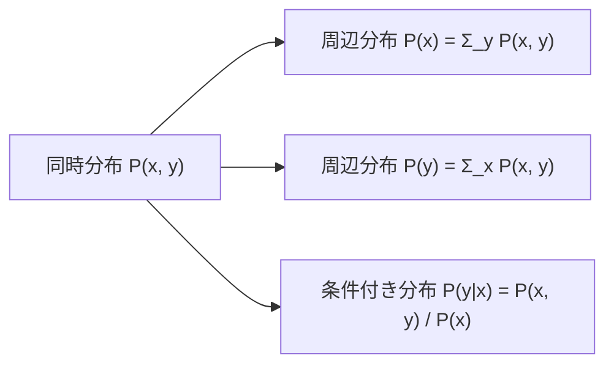
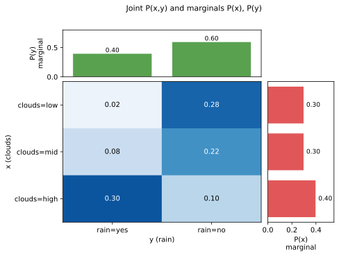
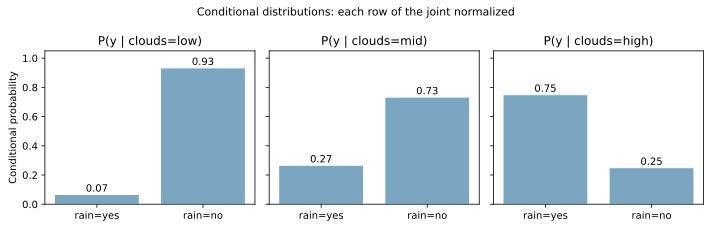
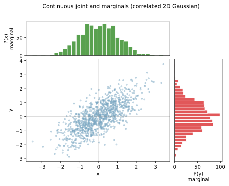

確率変数が複数あるとき、それらの関係を表す分布には 3 種類ある。同時分布（joint distribution, `P(x, y)`）、周辺分布（marginal distribution, `P(x)` や `P(y)`）、条件付き分布（conditional distribution, `P(y|x)`）の 3 つで、機械学習の本や論文で繰り返し出てくる基本概念である。

[データドリフト](../../mlops/data-drift/) で 4 種類の drift を切り分けたり、ベイズの定理を扱ったり、分類器の出力を確率として解釈したりと、3 つの分布の区別ができないと先に進みづらい場面が多い。この 3 つは独立した別物というより、同じ同時分布から取り出し方が違うだけ、と考えると整理しやすい。

### 3 つの分布の関係



- 同時分布: `x` と `y` を同時に観測したときの確率
- 周辺分布: 片方の変数だけに注目した分布。もう片方を足し合わせる（または積分する）操作で得られる
- 条件付き分布: 片方の変数を固定したときの、もう片方の分布

関係式を 1 行で書くと次の通り。これは「乗法定理」とも呼ばれ、ベイズの定理の出発点になる。

`P(x, y) = P(y|x) × P(x) = P(x|y) × P(y)`

---

### 離散の例: 雲量と雨

具体例として「雲量 `x` ∈ {少, 中, 多}」と「雨 `y` ∈ {降る, 降らない}」を考える。観測データから次のような同時分布が得られたとする。

```python
import matplotlib.pyplot as plt
import numpy as np

x_labels = ["clouds=low", "clouds=mid", "clouds=high"]
y_labels = ["rain=yes", "rain=no"]
joint = np.array([
    [0.02, 0.28],
    [0.08, 0.22],
    [0.30, 0.10],
])

p_x = joint.sum(axis=1)  # 行方向の和 = P(x)
p_y = joint.sum(axis=0)  # 列方向の和 = P(y)

fig = plt.figure(figsize=(7, 5))
gs = fig.add_gridspec(2, 2, width_ratios=[3, 1], height_ratios=[1, 3],
                      hspace=0.05, wspace=0.05)
ax_top = fig.add_subplot(gs[0, 0])
ax_main = fig.add_subplot(gs[1, 0])
ax_right = fig.add_subplot(gs[1, 1])

ax_main.imshow(joint, cmap="Blues", aspect="auto", vmin=0, vmax=0.35)
for i in range(joint.shape[0]):
    for j in range(joint.shape[1]):
        ax_main.text(j, i, f"{joint[i, j]:.2f}", ha="center", va="center",
                     color="black" if joint[i, j] < 0.2 else "white")
ax_main.set_xticks(range(len(y_labels))); ax_main.set_xticklabels(y_labels)
ax_main.set_yticks(range(len(x_labels))); ax_main.set_yticklabels(x_labels)

ax_top.bar(range(len(y_labels)), p_y, color="#59a14f", edgecolor="white")
ax_top.set_xticks([]); ax_top.set_ylabel("P(y)\nmarginal")
ax_right.barh(range(len(x_labels)), p_x, color="#e15759", edgecolor="white")
ax_right.set_yticks([]); ax_right.invert_yaxis()
ax_right.set_xlabel("P(x)\nmarginal")
fig.suptitle("Joint P(x,y) and marginals P(x), P(y)")
plt.savefig("joint-marginal-conditional_discrete.svg", bbox_inches="tight")
```

出力:

```text
P(x) = [0.3 0.3 0.4]
P(y) = [0.4 0.6]
```



中央のヒートマップ 6 マスが同時分布 `P(x, y)` で、すべての値を足すと 1.0 になる。上端の緑のバーは「行方向に足し上げて得た `P(y)`」、右端の赤のバーは「列方向に足し上げて得た `P(x)`」である。図の端っこ（margin）にできるので marginal（周辺）と呼ばれる、と覚えると名前が腑に落ちると言える。

---

### 周辺分布（marginal distribution）

複数の変数を持つ同時分布から、一部の変数だけに注目して取り出した分布を周辺分布と呼ぶ。求め方は、注目しない変数について「足し合わせる」（連続なら「積分する」）だけである。

離散の例で再掲する。

- `P(x=low)`  = `P(x=low, y=yes) + P(x=low, y=no)` = `0.02 + 0.28 = 0.30`
- `P(x=mid)`  = `0.08 + 0.22 = 0.30`
- `P(x=high)` = `0.30 + 0.10 = 0.40`

機械学習の文脈では `P(y)` を「クラス比率」「事前分布」「prior」と呼ぶことが多い。不正取引検知で `P(y=1) = 0.01`（陽性 1%）のような数字がそれにあたる。ラベル分布が時間で変わる現象は [label shift / prior shift](../../mlops/data-drift/) と呼ばれ、`P(y)` が動く drift の一種である。

---

### 条件付き分布（conditional distribution）

片方の変数をある値に固定したときの、もう片方の分布。同時分布の「特定の行」または「特定の列」を取り出して、それが確率分布として 1 に正規化されるよう全体を割る操作で得られる。

`P(y|x) = P(x, y) / P(x)`

雲量の例で計算してみる。

```python
conditionals = joint / p_x[:, None]  # 各行を P(x) で割る

fig, axes = plt.subplots(1, 3, figsize=(10, 3.2), sharey=True)
for i, (ax, xlbl) in enumerate(zip(axes, x_labels)):
    ax.bar(y_labels, conditionals[i], color="#7aa6c2", edgecolor="white")
    for j, v in enumerate(conditionals[i]):
        ax.text(j, v + 0.02, f"{v:.2f}", ha="center", fontsize=10)
    ax.set_title(f"P(y | {xlbl})")
    ax.set_ylim(0, 1.05)
axes[0].set_ylabel("Conditional probability")
fig.suptitle("Conditional distributions: each row of the joint normalized")
plt.tight_layout()
plt.savefig("joint-marginal-conditional_conditional.svg", bbox_inches="tight")
```

出力:

```text
P(y | x=low)  = [0.07, 0.93]
P(y | x=mid)  = [0.27, 0.73]
P(y | x=high) = [0.75, 0.25]
```



「雲量が多いとき雨が降る確率」は 75% で、「雲量が少ないとき雨が降る確率」は 7% である、と読める。条件付き分布は機械学習で最も多用される量と言える。分類器の `predict_proba` が出すスコアは、まさに `P(y=1 | x)`（入力 `x` が与えられたとき、ラベルが 1 である確率）の推定値である。

---

### 連続の例: 2 次元正規分布

連続変数の場合も考え方は同じで、「足し合わせる」が「積分する」に変わるだけである。相関 0.7 の二次元正規分布から 1000 点をサンプリングし、散布図と周辺ヒストグラムを描く。

```python
mean = [0, 0]
cov = [[1.0, 0.7], [0.7, 1.0]]
samples = np.random.default_rng(0).multivariate_normal(mean, cov, size=1000)

fig = plt.figure(figsize=(7, 5))
gs = fig.add_gridspec(2, 2, width_ratios=[3, 1], height_ratios=[1, 3],
                      hspace=0.05, wspace=0.05)
ax_top = fig.add_subplot(gs[0, 0])
ax_main = fig.add_subplot(gs[1, 0])
ax_right = fig.add_subplot(gs[1, 1])

ax_main.scatter(samples[:, 0], samples[:, 1], s=8, alpha=0.4, color="#7aa6c2")
ax_main.set_xlabel("x"); ax_main.set_ylabel("y")
ax_top.hist(samples[:, 0], bins=30, color="#59a14f", edgecolor="white")
ax_top.set_xticks([]); ax_top.set_ylabel("P(x)\nmarginal")
ax_right.hist(samples[:, 1], bins=30, color="#e15759", edgecolor="white",
              orientation="horizontal")
ax_right.set_yticks([]); ax_right.set_xlabel("P(y)\nmarginal")
ax_top.set_xlim(ax_main.get_xlim()); ax_right.set_ylim(ax_main.get_ylim())
fig.suptitle("Continuous joint and marginals (correlated 2D Gaussian)")
plt.savefig("joint-marginal-conditional_continuous.svg", bbox_inches="tight")
```



中央の散布図が同時分布 `P(x, y)` のサンプル可視化で、上端と右端のヒストグラムがそれぞれ `P(x)` と `P(y)` の周辺分布である。連続の場合、条件付き分布 `P(y|x=a)` は「`x=a` 付近の縦の細い帯に入る点だけ取り出した分布」に対応する。`x` と `y` に [相関](../correlation/) があるため、`x` が大きい領域では `y` も大きめ、という関係が見える。

---

### ベイズの定理との関係

3 つの分布をつなぐ式から、ベイズの定理が直接導出できる。

`P(x, y) = P(y|x) × P(x) = P(x|y) × P(y)`

両辺を変形すると次のようになる。

`P(y|x) = P(x|y) × P(y) / P(x)`

これがベイズの定理である。読み方は「事後分布 `P(y|x)` は、尤度 `P(x|y)` と事前分布 `P(y)` の積を、証拠 `P(x)` で正規化したもの」となる。同時分布から始めると、ベイズの定理は特別な公式ではなく、3 つの分布の関係を変形しただけのものと考えられる。

機械学習では `P(y|x)`（入力から出力を予測）を直接学習するモデル（識別モデル: ロジスティック回帰、決定木、ニューラルネット）と、`P(x|y)` と `P(y)` を別々に学習してベイズの定理で `P(y|x)` を作るモデル（生成モデル: Naive Bayes、LDA、GAN、Diffusion）の 2 系統があり、3 つの分布のどれを直接モデル化するかで設計思想が分かれる。

---

### 数学での使いどころ

- 期待値の計算（`E[Y] = Σ_y y P(y)` のように周辺分布を使う）
- 独立性の判定（`P(x, y) = P(x) × P(y)` なら独立）
- 条件付き期待値（`E[Y|X=x] = Σ_y y P(y|x)`）
- 相関と共分散の定義（同時分布から計算する量）
- 大数の法則・中心極限定理の議論（周辺分布の漸近的性質）

---

### 機械学習での使いどころ

3 つの分布の区別は、教科書の数式を読むときと、自分のモデルの出力を解釈するときの両方で効いてくる。

- 分類器の出力解釈: `predict_proba` は `P(y|x)` の推定値
- データドリフト分析: covariate shift は `P(x)`、concept drift は `P(y|x)`、label shift は `P(y)` が動くので、3 分類が直接判断軸になる
- 生成モデルと識別モデルの違い: 何を直接モデル化しているかで分類できる
- ベイズ推論: 事前分布 `P(θ)`、尤度 `P(D|θ)`、事後分布 `P(θ|D)` の関係をベイズの定理でつなぐ
- Naive Bayes 分類器: 特徴量間の条件付き独立 `P(x1, x2, ..., xn | y) = Π_i P(xi | y)` を仮定して計算量を抑える
- 不均衡データの校正: クラス比率 `P(y)` が訓練と本番で違うときの確率出力の再校正

ここで使った図をまとめて生成するスクリプトは `projects/ml/scripts/notes/joint-marginal-conditional_gen.py` にあり、`cd projects/ml && uv run python scripts/notes/joint-marginal-conditional_gen.py` で再生成できる。

---

### よくある誤解

- 「周辺分布と同時分布は同じもの」ではない: 同時分布は 2 変数を保ったまま、周辺分布は片方を捨てた要約。情報量が減るので、周辺分布から同時分布は復元できない（独立な場合を除く）
- 「`P(y|x)` と `P(x|y)` は同じ」ではない: 条件と被条件を入れ替えると意味も値も変わる。雨の例で `P(雨|雲量=多) = 0.75` だが `P(雲量=多|雨) = 0.30 / 0.40 = 0.75` のように、たまたま近い値でも意味が違う。混同するとベイズの定理の意味も失われる
- 「条件付き分布の和が 1 にならない」: 各 `x` の値で固定したときの `y` の分布として 1 に正規化されている（行ごとに合計 1）。同時分布のように全マスを足すと 1 ではなく、行数分（条件の数だけ）足し上がる
- 「離散と連続で別の公式を使う必要がある」とは限らない: 足し合わせるか積分するかの違いだけで、関係式 `P(x, y) = P(y|x) × P(x)` は同じ形をしている
