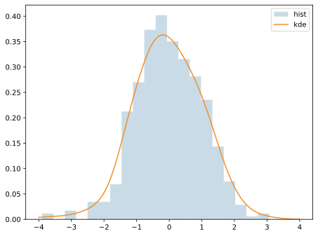

カーネル密度推定（Kernel Density Estimation, KDE）は、ヒストグラムの代わりに「滑らかな分布曲線」を推定する方法である。ここでの「密度」は、値の周辺にどれだけデータが集まっているかを表す量で、曲線の面積が1になるように正規化される。各データ点に対して「その点の近くほど確率が高い」という小さな分布を置き、全点の分布を足し合わせて全体の形を作る。

### イメージ

- ヒストグラムはビン幅に強く依存し、形がギザギザになりやすい
- KDE はビンではなく「滑らかな曲線」で分布の形を見やすくする
- 滑らかさは バンド幅（bandwidth） で決まり、広いほど平滑で細部が消える

---

### 読み方のポイント

- 山が高いほど、その値付近にデータが多い
- ピークの位置と数で、分布の中心や多峰性を確認できる
- 右に長い尾や非対称性も曲線で把握しやすい
- バンド幅が大きすぎると特徴が潰れ、小さすぎるとノイズが残る

---

### 前提・注意

- バンド幅（bandwidth）の設定で見え方が大きく変わる
- 境界付近（0未満が存在しないなど）で密度が歪むことがある
- サンプル数が少ないと形が不安定になる

---

### 利点
- 分布形状を滑らかに可視化できる
- 多峰性や歪みを掴みやすい

---

### 欠点
- バンド幅に依存する
- ヒストグラムより解釈が難しい場合がある

---

## Python での実例

```python
import numpy as np
import matplotlib.pyplot as plt

rng = np.random.default_rng(0)
data = rng.normal(loc=0, scale=1, size=500)

plt.hist(data, bins=20, density=True, alpha=0.4, color="#4C78A8", label="hist")

# 簡易KDE（ガウスカーネル）
xs = np.linspace(-4, 4, 200)
bandwidth = 0.4
kernel = np.exp(-0.5 * ((xs[:, None] - data[None, :]) / bandwidth) ** 2)
kde = kernel.mean(axis=1) / (bandwidth * (2 * np.pi) ** 0.5)

plt.plot(xs, kde, color="#F58518", label="kde")
plt.legend()
plt.tight_layout()
plt.show()
```

出力:



---

### 数学での使いどころ

- 分布形状の推定（特に非対称・多峰性の確認）
- ヒストグラムの補助としての可視化

---

### 機械学習での使いどころ

- EDA での特徴量分布の把握
- クラスごとの分布比較（重ね描き）

---

### 適さないケース

- サンプル数が極端に少ないデータ
- 境界（0未満が存在しないなど）で密度が歪むケース
