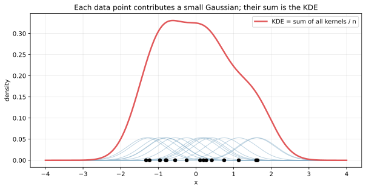
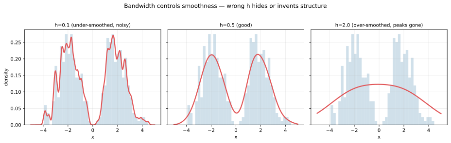
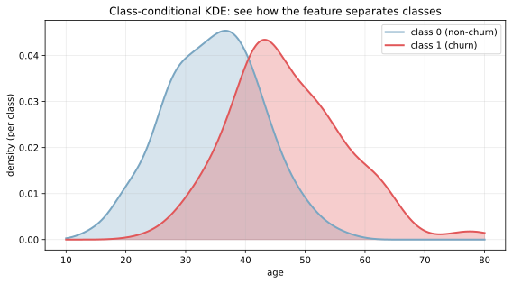

カーネル密度推定（Kernel Density Estimation, KDE）は、ヒストグラムの代わりに「滑らかな分布曲線」を推定するノンパラメトリックな手法である。各データ点に「その点の近くほど確率が高い」という小さな分布（カーネル）を置き、全点のカーネルを足し合わせて全体の形を作る。曲線の面積が 1 になるように正規化されており、出力は確率密度関数として読める。

ヒストグラムが「離散的なビンに分けて棒で表す」のに対し、KDE は「連続的な曲線で表す」。同じデータでもヒストグラムはビン幅の取り方で形がガラッと変わってしまうのに対し、KDE はバンド幅という連続的なパラメータで滑らかさを調整できる。EDA（探索的データ分析）で分布の癖を素早く掴むのに向いた手法と言える。

### 数式と直感

KDE の式は次の通り。

```text
f(x) = (1 / (n * h)) * Σ K((x - x_i) / h)
```

- `n`: データ点の数
- `h`: バンド幅（bandwidth）
- `K`: カーネル関数（ガウス関数が最も一般的）
- `x_i`: 各データ点

直感的には、各データ点 `x_i` に「中心が `x_i` のガウス分布」を置き、それらを全部足してから `n` で割る、という操作になっている。バンド幅 `h` は個々のカーネルの広がりを決め、`h` が大きいほど各点の影響が広い範囲に滑らかに広がる。

### イメージ

- ヒストグラムはビン幅に強く依存し、形がギザギザになりやすい
- KDE はビンではなく「滑らかな曲線」で分布の形を見やすくする
- 滑らかさは バンド幅（bandwidth, `h`） で決まり、広いほど平滑で細部が消える
- 同じデータでも `h` を変えると見た目が大きく変わるため、複数の `h` で並べて見るのが安全

### カーネル関数の選び方

カーネル `K(u)` には複数の選択肢がある。

| カーネル | 特徴 |
|---|---|
| ガウス（Gaussian） | 最も標準的。滑らかで微分可能 |
| Epanechnikov | 理論的に最適性が示されている。ガウスより計算が軽い |
| Tophat（uniform） | 単純な箱型。隣接点だけ等重みで使う |
| Triangular | 三角形。線形に重みが減少 |

実用上はガウスカーネルがデフォルトで、特別な理由が無ければそれで十分と考えられる。カーネルの選択よりもバンド幅の選択の方が結果への影響が大きい、という経験則がある。

### バンド幅の選び方

バンド幅 `h` の選定は KDE の最大の関心事である。代表的な手法は次の通り。

- Silverman's rule of thumb: `h = 1.06 * sigma * n^(-1/5)`（簡便でよく使われる）
- Scott's rule: `h = n^(-1/(d+4))`（多次元 KDE 向け）
- [交差検証](../../ml/cross-validation/) による選択: 最尤推定でデータの尤度を最大化する `h` を探す
- 経験的調整: 複数の `h` で描いて、過剰平滑（ピークが消える）と過小平滑（ノイズが残る）の中間を選ぶ

scikit-learn の `KernelDensity` や seaborn の `kdeplot` では、デフォルトで Silverman 系の規則が使われる。実務的には、複数の `h` を試して目視で判断するのが一番素直と考えられる。

---

### 読み方のポイント

- 山が高いほど、その値付近にデータが多い
- ピークの位置と数で、分布の中心や多峰性を確認できる
- 右に長い尾や非対称性も曲線で把握しやすい
- バンド幅が大きすぎると特徴が潰れ、小さすぎるとノイズが残る

---

### 前提・注意

- バンド幅（bandwidth）の設定で見え方が大きく変わる
- 境界付近（0未満が存在しないなど）で密度が歪むことがある
- サンプル数が少ないと形が不安定になる

---

### 利点
- 分布形状を滑らかに可視化できる
- 多峰性や歪みを掴みやすい

---

### 欠点
- バンド幅に依存する
- ヒストグラムより解釈が難しい場合がある

---

## Python での実例

```python
import numpy as np
import matplotlib.pyplot as plt

rng = np.random.default_rng(0)
data = rng.normal(loc=0, scale=1, size=500)

plt.hist(data, bins=20, density=True, alpha=0.4, color="#4C78A8", label="hist")

# 簡易KDE（ガウスカーネル）
xs = np.linspace(-4, 4, 200)
bandwidth = 0.4
kernel = np.exp(-0.5 * ((xs[:, None] - data[None, :]) / bandwidth) ** 2)
kde = kernel.mean(axis=1) / (bandwidth * (2 * np.pi) ** 0.5)

plt.plot(xs, kde, color="#F58518", label="kde")
plt.legend()
plt.tight_layout()
plt.show()
```

出力:


### 1 点ずつのカーネルの足し合わせとして見る

KDE の式 `f(x) = (1/(n h)) Σ K((x - x_i) / h)` がそのまま何をやっているかを、サンプル 15 点で可視化する。

```python
sample = rng.normal(0, 1, 15)
xs = np.linspace(-4, 4, 400)
h = 0.5
total = np.zeros_like(xs)
for xi in sample:
    k = np.exp(-0.5 * ((xs - xi) / h) ** 2) / (h * np.sqrt(2 * np.pi))
    total += k / len(sample)
    plt.plot(xs, k / len(sample), alpha=0.5)
plt.plot(xs, total, color="#e15759", lw=2.5)
plt.savefig("kde_per_point_intuition.svg", bbox_inches="tight")
```



青い細い曲線がそれぞれ 1 つのデータ点に対応するガウスカーネルで、`n` で割って正規化済みである。その全部を足し上げた赤い曲線が KDE となる。点が密集している領域では青いカーネルが重なって厚くなり、結果として赤い曲線が高くなる、というのが KDE の動作原理である。

### バンド幅で見え方が変わる

`h` の選び方による見え方の違いを、2 峰性データで確認する。

```python
data = np.concatenate([rng.normal(-2.0, 0.8, 200), rng.normal(2.0, 0.8, 200)])
for h in [0.1, 0.5, 2.0]:
    kde = stats.gaussian_kde(data, bw_method=h / data.std())
    # 描画は scripts 側を参照
plt.savefig("kde_bandwidth.svg", bbox_inches="tight")
```



3 つのパネルを左から見ていく。

- `h=0.1`: 個々の点の小山が見えるレベルで、ピークが偽物にしか見えない（under-smoothing, 過小平滑）
- `h=0.5`: 2 つの山がはっきり分かれて見える。データの本来の構造が見えている
- `h=2.0`: 山が 1 つに潰れて、もはや 2 峰性が分からない（over-smoothing, 過剰平滑）

KDE は分布形を「見せる」ための道具なので、`h` の選び方そのものが結論を左右する。Silverman の規則のような自動選択でも、複数の `h` で目視確認するのが安全と考えられる。

### クラスごとの KDE で「特徴量がクラスを分けているか」を見る

EDA で頻出の使い方として、クラスごとに KDE を重ね描きすると「この特徴量がクラスをどれくらい分けているか」が一目で分かる。

```python
class0 = rng.normal(35, 8, 420)  # non-churn customers
class1 = rng.normal(48, 10, 180)  # churn customers
kde0 = stats.gaussian_kde(class0)
kde1 = stats.gaussian_kde(class1)
# 描画は scripts 側を参照
plt.savefig("kde_class_conditional.svg", bbox_inches="tight")
```



非解約（青）と解約（赤）顧客の年齢分布を KDE で見たもので、解約者の方が高齢側に分布が寄っている様子が一目で分かる。重なりの大きさが「この特徴量だけではクラスを完全に分けられない」程度を示し、後段で `age + 他の特徴量` を組み合わせる必要性の判断材料になる。

ナイーブベイズ分類器・ガウス判別分析の確率モデルも、各クラスの特徴量分布を確率密度として扱う点で KDE と発想が同じである。

---

### 数学での使いどころ

- 分布形状のノンパラメトリック推定（事前に分布族を仮定しない）
- ヒストグラムの補助としての可視化
- 確率密度関数の推定: 連続値の密度を直接出せる
- 異常検知における正常分布の推定（外れた点を低密度として検出。[平均](../mean/) ± 3σ ベースの単純な異常検知より分布の癖を反映できる）
- ベイズ推論の事前分布・事後分布の可視化
- 多峰性分布で [平均](../mean/) や [標準偏差](../stddev/) だけでは見えない構造を補足

---

### 機械学習での使いどころ

EDA から異常検知まで、確率密度を扱う多くの場面で使われる。

- EDA での特徴量分布の把握: ヒストグラムより滑らかで判断しやすい
- クラスごとの分布比較: クラス 0 / クラス 1 の特徴量分布を重ね描きして識別可能性を確認
- 異常検知: 学習データの密度を KDE で推定し、低密度の点を異常としてフラグ
- 生成モデルの簡易ベースライン: 1 次元の密度推定として、より複雑な GAN / VAE と比較
- 特徴量の前処理判断: [歪度](../skewness/) と組み合わせて変換の必要性を判断
- 連続値ターゲットの分布確認: 回帰問題で目的変数 `y` の分布を見て、対数変換などの前処理を検討

具体的な利用例:

- 不正検知で「正常取引の金額分布」を KDE で推定し、それから大きく外れた取引を検出
- 顧客のクラスタリング前にクラスタ候補ごとの特徴量分布を KDE で比較
- A/B テスト後の効果量分布の可視化（平均だけでは見えない差を確認）

---

### 適さないケース

- サンプル数が極端に少ないデータ（数十件以下）: バンド幅の選定が不安定
- 境界（`x ≥ 0` のように下限がある）付近で密度が歪むケース: 境界補正付き KDE（reflection KDE）を使う
- 高次元データ（3 次元以上）: 次元の呪いでカーネルが希薄化し、密度推定が不安定。代わりに [PCA](../../ml/pca/) で次元削減してから KDE を当てるなどの工夫が必要
- 計算速度が重要な場面: データ点数に比例した計算量がかかるので、大規模データには不向き
