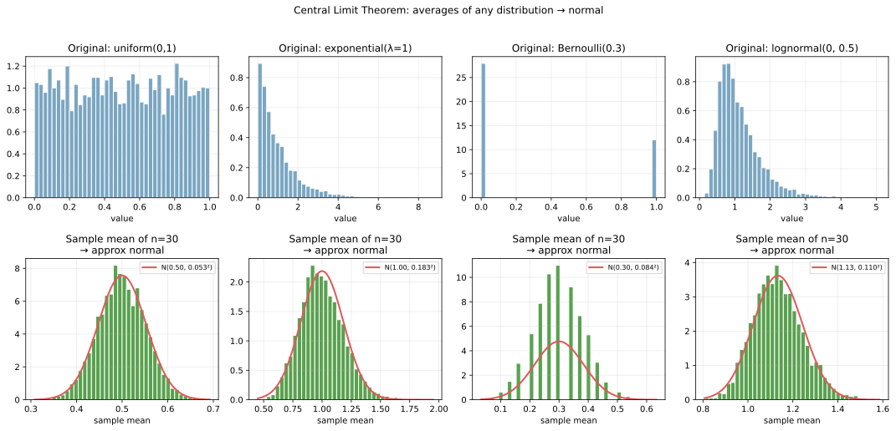
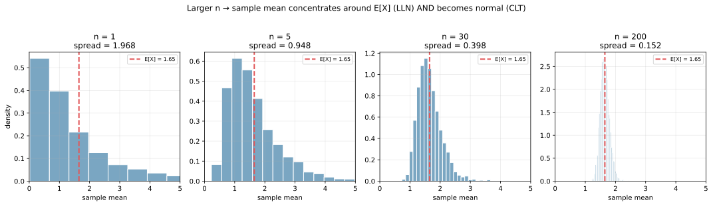
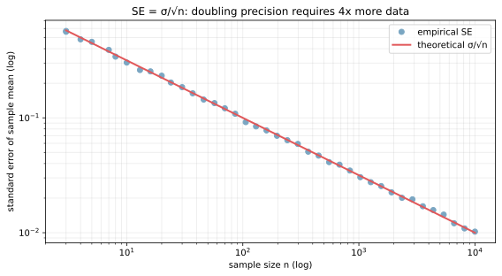

大数の法則（Law of Large Numbers, LLN）と中心極限定理（Central Limit Theorem, CLT）は、統計学の 2 大基本定理である。両者とも「独立同分布のサンプル `X_1, X_2, ..., X_n` の平均」が大きな `n` でどう振る舞うかを記述する。

- LLN: サンプル平均は真の [期待値](../expectation/) に収束する（点で集中する）
- CLT: サンプル平均の分布は、元の分布によらず正規分布に近づく（形が決まる）

統計的推測 ([仮説検定](../hypothesis-test/)) の理論的基盤、機械学習での bootstrap・分位回帰・confidence interval、A/B テストの効果検証など、ML / 統計の至るところで前提として使われる。すでに [期待値](../expectation/) のノートで「サンプル平均が期待値に収束する」現象を可視化した（大数の法則）が、ここではそれと CLT を統一的に整理する。

### 大数の法則: 平均は期待値に収束する

独立同分布（i.i.d.）の確率変数 `X_1, ..., X_n` について、サンプル平均 `X̄_n = (X_1 + ... + X_n) / n` は `n → ∞` で真の期待値 `μ = E[X]` に収束する。

`X̄_n →ᵖ μ` （確率収束）

「直感」: ランダムなノイズは平均を取れば打ち消しあって、真の中心だけが残る。

```python
import numpy as np
import matplotlib.pyplot as plt

# 公平なサイコロを n 回振り、累積平均の推移を 3 通り見る
n_max = 5000
for trial, color in [(0, "#7aa6c2"), (1, "#e15759"), (2, "#59a14f")]:
    rolls = np.random.default_rng(trial).integers(1, 7, n_max)
    running = np.cumsum(rolls) / np.arange(1, n_max + 1)
    plt.plot(running, color=color, alpha=0.65)
plt.axhline(3.5, color="black", ls="--")  # E[X] = 3.5
plt.savefig("llnclt_lln.svg", bbox_inches="tight")
```

![大数の法則: 累積平均が E[X]=3.5 に収束](./llnclt_lln.svg)

3 通りの試行（青・赤・緑）はそれぞれ初期に揺れるが、サンプル数が増えるとすべて黒い破線（期待値 3.5）に収束する。横軸 log スケールで `n = 100` あたりからほぼ落ち着き、`n = 1000` ではほぼ動かなくなる。

LLN には強弱 2 種類ある。

- 弱法則（WLLN）: 確率収束。`P(|X̄_n - μ| > ε) → 0`
- 強法則（SLLN）: ほぼ確実な収束。`P(lim X̄_n = μ) = 1`

ML の実用では区別を意識することは少なく、「サンプル数を増やせば推定値は真値に近づく」という保証として使う場面が多い。

---

### 中心極限定理: サンプル平均は正規分布に近づく

LLN は「サンプル平均が `μ` に集中する」と言うだけで、`μ` の周りでどう散らばるかは何も言わない。これを補完するのが CLT。

独立同分布（i.i.d.）の確率変数 `X_1, ..., X_n` の平均 `X̄_n` について、`n → ∞` で標準化した量が標準正規分布に分布収束する。

`(X̄_n - μ) / (σ / √n)  →ᵈ  N(0, 1)`

ここで `μ = E[X]`、`σ² = Var(X)`。等価な書き方として、`X̄_n` 自体が `N(μ, σ²/n)` に近づく、と書ける。

驚くべきは「元の `X` の分布によらない」という普遍性。一様分布、指数分布、ベルヌーイ分布、対数正規分布、いずれを取っても、その平均は正規分布に収束する。

```python
# 4 種類の元分布 + 各 30 サンプルの平均を 5000 回計算して分布を見る
distributions = [
    ("uniform(0,1)", lambda r, n: r.uniform(0, 1, n)),
    ("exponential(λ=1)", lambda r, n: r.exponential(1, n)),
    ("Bernoulli(0.3)", lambda r, n: r.binomial(1, 0.3, n).astype(float)),
    ("lognormal(0, 0.5)", lambda r, n: r.lognormal(0, 0.5, n)),
]
# 上段: 元分布、下段: n=30 のサンプル平均の分布
# 詳細は scripts 側を参照
plt.savefig("llnclt_clt_universal.svg", bbox_inches="tight")
```



上段の元分布は全部形が違う。一様（矩形）、指数（右に裾の重い）、ベルヌーイ（2 点離散）、対数正規（強く右に歪む）。にもかかわらず下段の「30 サンプル平均」の分布はすべて釣鐘型で、赤い理論曲線 `N(μ, σ²/n)` にほぼ一致する。

これが「正規分布が至るところに現れる」最大の理由。複数の独立な要因の加算的な効果は、個々の要因が何であれ正規分布に近づく。身長・テストスコア・測定誤差・株価変動などが正規分布で近似できるのは、複数の独立要因の和とみなせるからと考えられる。

---

### n が大きくなるほど集中 + 正規化

CLT と LLN を 1 つの実験で見る。対数正規分布を例に、`n` を変えてサンプル平均の分布を描く。

```python
sampler = lambda r, n: r.lognormal(0, 1, n)
mu_true = np.exp(0.5)  # E[X] = exp(σ²/2)
for n in [1, 5, 30, 200]:
    rng = np.random.default_rng(0)
    means = np.array([sampler(rng, n).mean() for _ in range(5000)])
    print(f"n={n}: mean ≈ {means.mean():.3f}, spread = {means.std():.3f}")
plt.savefig("llnclt_n_effect.svg", bbox_inches="tight")
```

出力:

```text
n=1:   mean ≈ 1.648, spread = 2.137
n=5:   mean ≈ 1.640, spread = 0.957
n=30:  mean ≈ 1.648, spread = 0.394
n=200: mean ≈ 1.649, spread = 0.153
```



`n = 1` は元の対数正規分布そのもの。強く右に歪んだ形。`n = 5` で歪みが緩んできて、`n = 30` でほぼ正規型、`n = 200` で真値 `E[X] ≈ 1.65`（赤い破線）の周りに鋭く集中する。

spread は `n = 1` の 2.14 から `n = 200` の 0.15 へ、おおむね `1/√n` の速度で縮む。これが「サンプル数を 4 倍にすると精度が 2 倍になる」根拠で、次の標準誤差の議論に繋がる。

---

### 標準誤差は 1/√n で縮む

サンプル平均 `X̄_n` の標準偏差を標準誤差（standard error, SE）と呼ぶ。

`SE(X̄_n) = σ / √n`

ここで `σ` は元の分布の標準偏差、`n` はサンプル数。実データでは `σ` を `sample std` で近似する。

```python
ns = np.logspace(0.5, 4, 40).astype(int)
sigma_true = 1.0
empirical_se = []
for n in ns:
    means = np.array([np.random.default_rng(0).normal(0, sigma_true, n).mean()
                      for _ in range(500)])
    empirical_se.append(means.std())
plt.savefig("llnclt_se_root_n.svg", bbox_inches="tight")
```



両対数グラフで、青い実測点（標準誤差）と赤い理論線 `σ/√n` がきれいに一致する。傾きは -0.5、すなわち `n` を 4 倍にすると SE が半分、`n` を 100 倍にすると SE が 10 分の 1。

実用的な含意:

- `n = 100` で精度 `σ × 0.1`
- `n = 10000` で精度 `σ × 0.01`（10 倍精度に 100 倍データ）
- `n = 1000000` で精度 `σ × 0.001`（さらに 10 倍精度に 100 倍データ）

「データを増やせば精度が上がるが、対費用効果は急速に逓減する」というのが、現実の実験計画・A/B テスト設計の基本となる。

---

### 95% 信頼区間と CLT

CLT を直接使うと、サンプル平均の信頼区間が次のように書ける。

`CI_95% = X̄_n ± 1.96 × (σ / √n)`

`1.96` は標準正規分布の上側 2.5% 点。「同じ実験を多数回繰り返したとき、95% の区間が真値 `μ` を含む」というのが頻度主義的な解釈で、[仮説検定](../hypothesis-test/) のノートで詳しく扱っている。

CLT がなければこの計算は成立しない。元の分布が何であろうと、サンプル平均が正規分布に近づくので、`±1.96σ/√n` という単純な計算で信頼区間が出る。

---

### 限界と例外

CLT は強力だが、無条件に使えるわけではない。

- 分散が有限である前提: コーシー分布のような「分散が存在しない」分布では成り立たない（サンプル平均がそのまま元の分布になる）
- 独立性の前提: 強い相関のあるデータ（時系列、空間相関）では収束が遅い
- 「i.i.d.」の前提: 分布が時間で変わる（[データドリフト](../../mlops/data-drift/)）と CLT は無効
- 収束の速さは元分布の歪度に依存: 強く歪んだ分布では `n = 30` でも CLT 近似が甘い。`n = 100〜1000` が必要なことも

経験則として「`n ≥ 30` あれば CLT は近似的に成り立つ」とよく言われるが、これは元分布が「中程度の歪み」までの場合の目安。強く歪んだ分布や離散分布では、より大きな `n` が必要となる。実データで CLT 近似が成り立つかは、Q-Q プロット（quantile-quantile plot）で正規分布との直線性を視覚的に確認するのが安全。

### 数学での使いどころ

- 統計的推定の理論基盤: 最尤推定量の漸近正規性
- 信頼区間の構成: `±z × SE` の形式
- 検定統計量の分布: z 値、t 値の理論的根拠
- bootstrap との対比: CLT が成り立つ場合の解析的近似、不明な場合は bootstrap で経験分布から
- ランダムウォーク・拡散方程式: 時間的に和を取る確率過程の収束
- 確率収束・分布収束の概念: 確率論の中心トピック

---

### 機械学習での使いどころ

- 評価指標の信頼区間: `accuracy ± 1.96 × √(p(1-p)/n)` で精度の不確実性を表す
- A/B テストの効果検定: 2 群の平均差の z 検定（CLT のおかげで分布形を仮定せず使える）
- bootstrap: 経験分布から再サンプリングして CLT の代わりに信頼区間を構築
- ミニバッチ SGD のノイズ解析: ミニバッチ勾配は真の勾配の周りに正規分布する
- バギング・[ランダムフォレスト](../../ml/random-forest/): 独立な弱学習器の平均は分散が `1/n` に縮む（LLN + CLT）
- 確率モデルの近似推論: 変分推論の下界の有効性、Laplace 近似
- 強化学習の return 推定: モンテカルロ平均が真の Q 値に収束（LLN）
- データ収集量の決定: 「あと何サンプルあれば SE が 0.01 まで縮むか」を `1/√n` から逆算
- 分散縮小法: control variates、importance sampling で SE を縮める
- LLM の MCQ 評価: 多数サンプルの確率平均が真の選好確率に収束

---

### 適さないケース / 落とし穴

- 「`n ≥ 30` なら CLT」を盲信: 強く歪んだ分布では `n = 30` で正規近似が崩れる
- 分散が無限の分布（コーシー、Pareto with α≤2）: LLN も CLT も成り立たない。サンプル平均が収束しない
- 相関のあるサンプル: 時系列、空間相関、繰り返し測定。有効サンプル数 `n_eff` で計算するか、相関を考慮した手法へ
- 「サンプル平均が正規分布だから個々のサンプルも正規」と誤解: CLT は平均についての話で、元分布の形は変わらない
- 重みなしサンプル平均でしか CLT を使わない: 重み付き平均にも一般化された CLT があるが、有効サンプル数の計算が複雑になる
- 不均衡データで naive な評価: 少数クラスのサンプル数が少ないと、そのクラスの metric の SE が大きい。stratified bootstrap などで補正
- 「もっとサンプルを集めれば解決」を頻発: SE は `1/√n` で縮むので、10 倍精度に 100 倍コスト。コスト効率を考えて Stop
- 厳密な p 値計算で CLT を使う: 標本数が少ないと近似が甘い。t 分布や順列検定の方が正確
- ML モデルの予測精度に CLT を直接当てる: 予測が i.i.d. でない（同じ訓練データから来る）。Nadeau-Bengio 補正や交差検証で対処
- 「正規分布だから外れ値は出ない」: 元分布が裾の重い場合、サンプル平均が正規でも個々のサンプルは外れ値を含む
