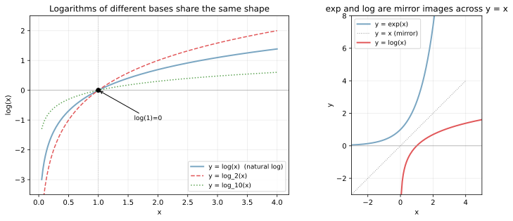
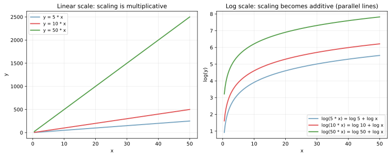
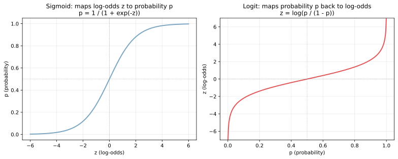
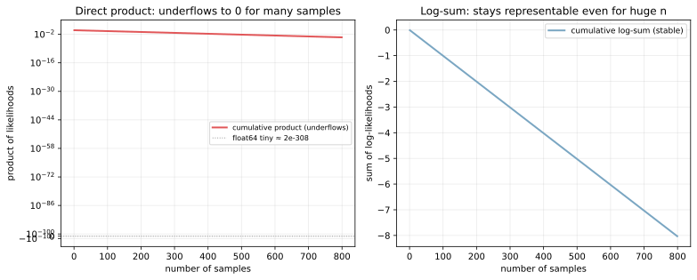

対数関数 `log(x)` と指数関数 `exp(x)` は互いに逆関数の関係にあり、機械学習では「積を和に変換する」「桁の違うスケールを揃える」「確率を log-odds に変換する」といった用途で繰り返し登場する。特に分類器の出力を「線形和としてモデル化する」発想は、`p / (1 - p)` を対数化した log-odds（対数オッズ）で表す形で実装されており、[ロジスティック回帰](../../ml/logistic-regression/) の中核を成す。

ここでは、機械学習で出てくる場面に絞って対数・指数の性質を整理する。具体的には、(1) log と exp の対応関係、(2) 「積を和に」変える代数的性質、(3) シグモイドと logit による確率↔log-odds の往復、(4) 浮動小数点の数値安定性を保つための log 空間計算、の 4 点である。

### log と exp の対応関係

底 `a > 0, a ≠ 1` に対して、

`a^z = x` ⇔ `log_a(x) = z`

の関係が成り立つ。`a = e ≈ 2.718` の場合を「自然対数」と呼び、単に `log(x)` あるいは `ln(x)` と書く。機械学習・統計の文脈で「log」と書いてあれば原則として自然対数で、エントロピーなど情報理論の文脈で `log_2`、対数尺度の可視化で `log_10` が使われる程度の区別となる。

```python
import numpy as np
import matplotlib.pyplot as plt

x_pos = np.linspace(0.05, 4, 200)
x_all = np.linspace(-3, 4, 200)

fig, axes = plt.subplots(1, 2, figsize=(11, 4.5))
axes[0].plot(x_pos, np.log(x_pos), color="#7aa6c2", lw=2, label="log(x)")
axes[0].plot(x_pos, np.log2(x_pos), color="#e15759", lw=1.5, ls="--", label="log_2(x)")
axes[0].plot(x_pos, np.log10(x_pos), color="#59a14f", lw=1.5, ls=":", label="log_10(x)")
axes[1].plot(x_all, np.exp(x_all), color="#7aa6c2", lw=2, label="exp(x)")
axes[1].plot(np.linspace(0.05, np.exp(2.5), 200),
             np.log(np.linspace(0.05, np.exp(2.5), 200)),
             color="#e15759", lw=2, label="log(x)")
plt.savefig("log_exp_curves.svg", bbox_inches="tight")
```



左の図は底だけ違う 3 種類の対数曲線で、いずれも `x = 1` で 0 を通り、形は同じである（互いに定数倍の関係）。右の図は `exp(x)` と `log(x)` を同じ座標に描いたもので、直線 `y = x` に対して鏡像になっている。これが「互いに逆関数」の幾何的な意味で、`exp(log(x)) = x` および `log(exp(x)) = x` が自然に成り立つ。

定義域・値域の対応関係も重要で、`log` は正の数 `(0, ∞)` から実数全体 `(-∞, ∞)` へ、`exp` は実数全体から正の数 `(0, ∞)` へ、それぞれ全単射に写る。負の数や 0 の対数は実数では定義されない点に注意が必要である。

---

### 代数的性質: 積を和に、冪を倍に

対数の最重要性質は次の 3 式である。

- `log(x y) = log(x) + log(y)`（積→和）
- `log(x / y) = log(x) - log(y)`（商→差）
- `log(x^k) = k log(x)`（冪→倍数）

可視化すると次のようになる。

```python
xs = np.linspace(0.5, 50, 200)
fig, axes = plt.subplots(1, 2, figsize=(11, 4.5))
axes[0].plot(xs, xs * 5, color="#7aa6c2", lw=2, label="5x")
axes[0].plot(xs, xs * 10, color="#e15759", lw=2, label="10x")
axes[0].plot(xs, xs * 50, color="#59a14f", lw=2, label="50x")
axes[0].set_title("Linear: scaling diverges")
axes[1].plot(xs, np.log(xs * 5), color="#7aa6c2", lw=2)
axes[1].plot(xs, np.log(xs * 10), color="#e15759", lw=2)
axes[1].plot(xs, np.log(xs * 50), color="#59a14f", lw=2)
axes[1].set_title("Log: scaling becomes a vertical shift")
plt.savefig("log_products_to_sums.svg", bbox_inches="tight")
```



左の線形スケールでは「5 倍」「10 倍」「50 倍」が傾きの違いとして発散していくのに対し、右の log スケールでは 3 本が同じ形を保ったまま縦方向に平行にずれている。これは `log(k x) = log(k) + log(x)` の式そのものを視覚化したもので、「倍率」が「平行移動」に変わる構造が見える。

この性質は次の 3 つの場面で効いてくる。

- 大きく桁が違う特徴量の前処理: 収入・売上・人口など正値で右に裾の長い分布は `log1p(x)` を取ると正規分布に近づき、線形モデルが扱いやすくなる（[歪度](../skewness/) のノート参照）
- 尤度の最大化を log-likelihood の最大化に置き換える: `Π_i p_i` を最大化する代わりに `Σ_i log(p_i)` を最大化する。積は和になり、最適化が安定化する
- 情報量・エントロピーの定義: `-log(p)` がイベントの「驚き」を表す自然な単位として現れる

---

### log-odds（対数オッズ）と logit / sigmoid

確率 `p ∈ (0, 1)` のオッズ（odds）を `p / (1 - p)` で定義する。`p = 0.5` でオッズは 1、`p = 0.9` でオッズは 9、`p = 0.99` でオッズは 99 となる。オッズに log を被せた `log(p / (1 - p))` を log-odds または logit と呼ぶ。

`logit(p) = log(p / (1 - p))`

逆向きに、log-odds `z` から確率 `p` を取り戻す関数がシグモイド（sigmoid, logistic function）である。

`sigmoid(z) = 1 / (1 + exp(-z))`

両者は互いに逆関数の関係にあり、合わせると「`logit` で `(0, 1)` を `(-∞, ∞)` に伸ばし、`sigmoid` で `(-∞, ∞)` を `(0, 1)` に押し戻す」変換となる。

```python
z = np.linspace(-6, 6, 400)
p = 1.0 / (1.0 + np.exp(-z))
p_grid = np.linspace(0.001, 0.999, 400)
logodds = np.log(p_grid / (1 - p_grid))

fig, axes = plt.subplots(1, 2, figsize=(11, 4.5))
axes[0].plot(z, p, color="#7aa6c2", lw=2)
axes[0].set_title("sigmoid: log-odds → probability")
axes[1].plot(p_grid, logodds, color="#e15759", lw=2)
axes[1].set_title("logit: probability → log-odds")
plt.savefig("sigmoid_logit.svg", bbox_inches="tight")
```



左のシグモイドは `z = 0` で `p = 0.5` を通り、`z` が大きくなると `p` は 1 に飽和、`z` が小さくなると 0 に飽和する S 字形となる。右の logit は `p = 0.5` で 0 を通り、`p` が 0 や 1 に近づくと急激に発散する。同じ「確率を 0.1 から 0.2 に動かす」操作と「0.8 から 0.9 に動かす」操作は、log-odds で見るとそれぞれ約 +0.81、+1.20 という別の値の動きであり、`p = 0.5` 付近の方が動かしやすい性質が読み取れる。

ロジスティック回帰がやっていることは、特徴量の線形和 `z = w · x + b` を「log-odds」と見なし、シグモイドで確率に変換する、という枠組みである。確率を直接線形和でモデル化すると `(0, 1)` の制約があるため扱いにくいが、log-odds なら値域が実数全体になるので線形和と素直につながる。詳細は [ロジスティック回帰](../../ml/logistic-regression/) のノートで扱う。

---

### log 空間で計算する: 数値安定性

確率は 0〜1 の間の値で、これを多数掛け合わせるとあっという間に浮動小数点の下限を下回り 0 に潰れる。例として、各サンプルの尤度を 0.99 として 800 個掛け合わせると、`0.99^800 ≈ 3.2 × 10^-4` と見かけ上は問題ないが、`0.5^1500` のような場面では `float64` の最小正規化数 `≈ 2.2 × 10^-308` を下回り、結果が 0 になってしまう（underflow）。

log を被せると、積 `Π_i p_i` は和 `Σ_i log(p_i)` に変わる。`log(p)` は `p` が 0 に近いほど大きな負の値になるが、和を取る限り和の絶対値はサンプル数 `n` に比例する程度で、`float64` で安全に扱える範囲に収まる。

```python
n_steps = np.arange(1, 800)
p_each = 0.99
prod = np.cumprod(np.full_like(n_steps, p_each, dtype=float))
log_sum = np.cumsum(np.full_like(n_steps, np.log(p_each), dtype=float))

fig, axes = plt.subplots(1, 2, figsize=(11, 4.5))
axes[0].plot(n_steps, prod, color="#e15759", lw=2)
axes[0].set_yscale("symlog", linthresh=1e-100)
axes[0].set_title("Direct product: underflows")
axes[1].plot(n_steps, log_sum, color="#7aa6c2", lw=2)
axes[1].set_title("log-sum: stable")
plt.savefig("log_numerical_stability.svg", bbox_inches="tight")
```



左の図では、確率の累積積はサンプル数を増やすと急激に小さくなり、視覚化のために log スケールを使っている。これを実コードで直接 `np.prod(...)` すると最終的には `0.0` に潰れる。一方で右の図では log 空間での累積和は線形に下がるだけで、何百万サンプルになっても float の表現範囲に収まる。

この理由から、最尤推定・EM アルゴリズム・隠れマルコフモデル・ナイーブベイズ・分類器の確率出力の交差エントロピー、いずれも「log を取ってから足し算」で実装されている。`scipy.special.logsumexp` や `torch.logsumexp` のように、`log(Σ exp(x_i))` を数値安定に計算する関数も標準で用意されており、softmax と組み合わせて頻繁に使われる。

### 数学での使いどころ

- 微積分の道具: `log` の微分は `1/x`、`exp` の微分は `exp(x)` 自身（極めて扱いやすい）
- 連続複利の極限: `lim (1 + x/n)^n = exp(x)`
- 情報理論: エントロピー `H(X) = -Σ p(x) log p(x)`、相互情報量、KL ダイバージェンス
- 微分方程式: `dy/dx = ky` の解は `y = C exp(kx)`（指数成長・崩壊の原型）
- 対数尺度: 桁が大きく変動する量（地震マグニチュード、pH、音圧、log-fold change）

---

### 機械学習での使いどころ

- ロジスティック回帰: log-odds を線形和でモデル化する設計思想の中核
- 多クラス分類の softmax: クラスごとの線形和 `z_k` を `exp` で正に、和で割って確率にする
- 最尤推定 / 損失関数: 交差エントロピー `-Σ y log(p)`、対数尤度、ベルヌーイ尤度の和、すべて log を経由
- ナイーブベイズ: クラスごとの事前確率と特徴量の条件付き確率の積を log で和に変換
- 特徴量の前処理: 売上・人口・遅延時間など正値で右に裾の長い量を `log1p(x)` で正規化（[歪度](../skewness/) 参照）
- 評価指標: log-loss（cross-entropy loss）、log-likelihood、information gain
- 学習率スケジュール: 指数減衰 `lr_t = lr_0 × γ^t` で学習率を時間とともに下げる
- 大規模言語モデルの損失: トークン列の同時確率を `Σ log p(token_t | ...)` で計算

---

### 適さないケース / 落とし穴

- 0 や負の値に log を取れない: `log(0)` は `-∞`、負の値の log は実数で定義されない。`p = 0` の確率を扱うときは `log(p + ε)` のように小さな下駄を履かせる
- 解釈が直感的でない: log-odds や対数スコアの値そのものを読み解くのは慣れが必要。提示するときは exp で戻して確率にする方が伝わる
- 単位の意味が変わる: log で変換した特徴量は元の単位を持たない（`log(売上)` の係数 `0.3` は「売上が 1% 増えると目的変数が 0.3% 動く」のような弾力性の解釈になる）
- log 変換は値の差を圧縮する: 外れ値の影響を抑える効果がある一方、本当に大事な差を見えにくくすることもある。回帰の残差プロットで判断するのが筋がよい
- 底の取り違え: `log` を自然対数と思って書いた式が、別ライブラリで `log_10` 扱いされる事故がある。`np.log` は自然対数、`np.log10` は底 10、`math.log` は引数の数で底が変わる、といった違いを把握しておく
