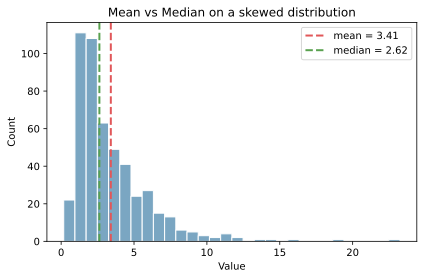

平均（算術平均, mean）は、データの「中心」を表す代表値のひとつ。  全ての値を足して、個数で割ったもの。

- 標本平均: `x_bar = (x1 + x2 + ... + xn) / n`
- 母平均: `mu = E[X]`

ここで `X` は「確率変数」（値がランダムに決まると考える対象）で、`E[X]` はその期待値（平均値）を表す。`mu` は、母平均を意味する。

平均は直感的だが、外れ値に引っ張られやすいという弱点がある。

### 前提・注意

* データは数値であることが前提
* 外れ値の影響を強く受ける
* 分布が歪んでいる場合、中心の代表としてズレることがある

---

### 利点
* 計算が簡単で直感的
* 多くの数理モデルで扱いやすい
* 他の指標（[分散](../variance/)・[標準偏差](../stddev/)）の基盤になる

---

### 欠点
* 外れ値に弱い
* 分布の形（歪みや多峰性）は反映しにくい

---

## Python での実例

以下は、平均と[中央値](../median/)の違いを可視化する簡単な例。右に長い分布では平均が右側へ引っ張られる。

```python
import numpy as np
import matplotlib.pyplot as plt

rng = np.random.default_rng(0)
values = rng.lognormal(mean=1.0, sigma=0.7, size=500)

mean = values.mean()
median = np.median(values)

plt.figure(figsize=(6, 4))
plt.hist(values, bins=30, color="#7aa6c2", edgecolor="white")
plt.axvline(mean, color="#e15759", linestyle="--", linewidth=2, label="mean")
plt.axvline(median, color="#59a14f", linestyle="--", linewidth=2, label="median")
plt.title("Mean vs Median")
plt.xlabel("Value")
plt.ylabel("Count")
plt.legend()
plt.tight_layout()
plt.show()
```

出力:



---

### 数学での使いどころ

数学・統計では平均は以下で使われる。

* 期待値 `E[X]` としての中心
* 分散の定義 `Var(X) = E[(X - mu)^2]`
* 大数の法則・中心極限定理の基盤（標本平均が母平均に近づく／標本平均の分布が正規分布に近づく）

数学的には、平均は「値の重心」を表すと解釈できる。平方誤差を最小にする代表値でもある。

---

### 機械学習での使いどころ

機械学習では平均は前処理・特徴量設計で頻出。

* 特徴量のセンタリング（平均との差し）
* 欠損値の平均補完
* ミニバッチの平均勾配（最適化の基本）

---

### 適さないケース

* 外れ値が多いデータ（[中央値](../median/)や[四分位点](../quantile/)が有効）
* 分布が大きく歪んでいるデータ
* 多峰性が強く、中心が意味を持ちにくいデータ
