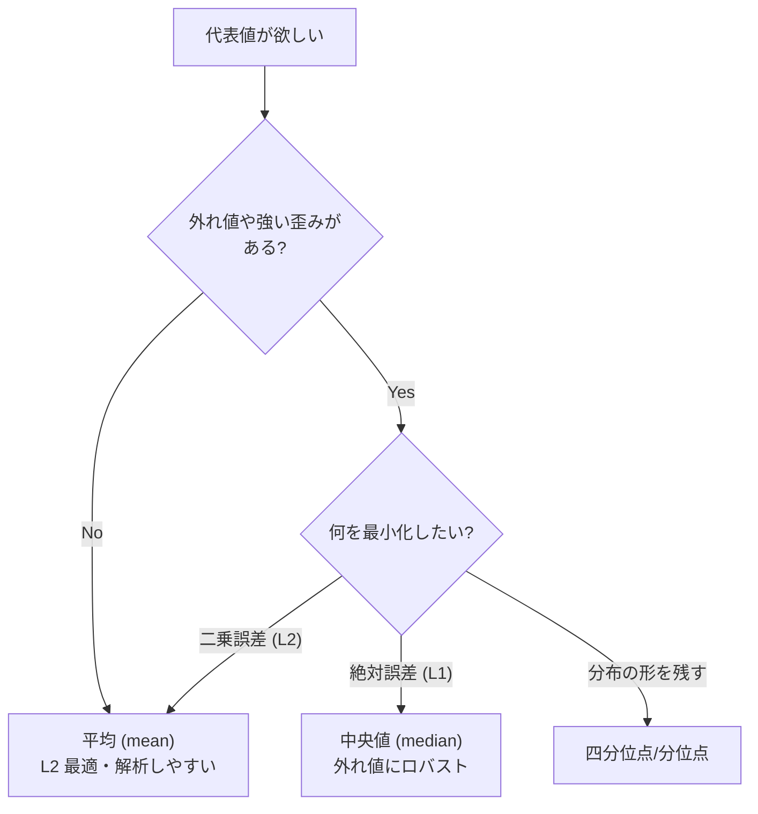
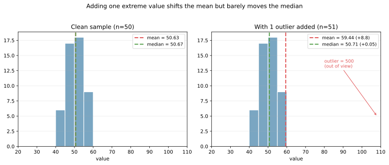
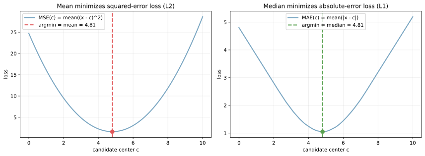

平均（算術平均, mean）は、データの「中心」を表す代表値の中で最も基本的な指標である。全ての値を足して個数で割るというシンプルな計算式ながら、確率論の期待値・最小二乗推定・大数の法則・中心極限定理の定義に直接現れる。後から学ぶ [分散](../variance/) ・ [標準偏差](../stddev/) ・ [相関係数](../correlation/) も内部で平均を使っており、後続の統計量を読むときの基準点として最初に押さえる量となる。

- 標本平均: `x_bar = (x1 + x2 + ... + xn) / n`
- 母平均: `mu = E[X]`

ここで `X` は「確率変数」（値がランダムに決まると考える対象）で、`E[X]` はその期待値（平均値）を表す。`mu` は母平均、`x_bar` は実際に手元のデータから計算する標本平均を意味する。

平均は直感的で計算も軽いが、外れ値に引っ張られやすいという弱点を持つ。[中央値](../median/) との対比でいうと、平均は「値の重心」を見る指標（全ての値を平等に扱う）、中央値は「順位の中心」を見る指標（順位だけ見て値の大小は無視）という違いがある。右に長い分布（給与・取引金額など）では平均が右側に引きずられるため、典型値を見るなら中央値の方が素直という場面が多くある。

### 平均の数学的特徴付け

平均には「データを 1 つの代表値で要約するときの最適解」という数学的な性質がある。具体的には、

```text
mu = argmin_c  E[(X - c)^2]
```

これは「平均は L2 損失（二乗誤差）を最小にする点」という言い方ができる。対応する関係として、[中央値](../median/) は L1 損失（絶対誤差）を最小にする点である。この対比は機械学習の損失関数選びにも直結する: MSE（Mean Squared Error）損失で回帰すると平均的な振る舞いを当てに行き、MAE（Mean Absolute Error）損失で回帰すると中央値的な振る舞いを当てに行く。

幾何学的には、平均は「データ点群の重心」と等しい。各点が等しい質量を持つと考えたときの物理的な重心が平均、というイメージで、これが「外れ値が遠くにあると重心が引きずられる」直感を支えている。

平均と中央値の使い分けは、外れ値の有無と「何を最小化したいか」の 2 軸で整理できる。



---

### 前提・注意

- データは数値であることが前提
- 外れ値の影響を強く受ける
- 分布が歪んでいる場合、中心の代表としてズレることがある

---

### 利点
- 計算が簡単で直感的
- 多くの数理モデルで扱いやすい
- 他の指標（[分散](../variance/)・[標準偏差](../stddev/)）の基盤になる

---

### 欠点
- 外れ値に弱い
- 分布の形（歪みや多峰性）は反映しにくい

---

## Python での実例

以下は、平均と[中央値](../median/)の違いを可視化する簡単な例。右に長い分布では平均が右側へ引っ張られる。

```python
import numpy as np
import matplotlib.pyplot as plt

rng = np.random.default_rng(0)
values = rng.lognormal(mean=1.0, sigma=0.7, size=500)

mean = values.mean()
median = np.median(values)

plt.figure(figsize=(6, 4))
plt.hist(values, bins=30, color="#7aa6c2", edgecolor="white")
plt.axvline(mean, color="#e15759", linestyle="--", linewidth=2, label="mean")
plt.axvline(median, color="#59a14f", linestyle="--", linewidth=2, label="median")
plt.title("Mean vs Median")
plt.xlabel("Value")
plt.ylabel("Count")
plt.legend()
plt.tight_layout()
plt.show()
```

出力:


### 外れ値 1 つで平均は動く

平均の「弱点」として頻繁に指摘されるのが、外れ値への感度の高さである。50 個の値（平均 50 周辺）に「500」という値を 1 つだけ追加すると、平均は 9 ほどジャンプするのに対し、中央値はほぼ動かない。

```python
base = rng.normal(50, 5, 50)
contaminated = np.concatenate([base, [500]])

print(f"clean:        mean = {base.mean():.2f}, median = {np.median(base):.2f}")
print(f"with outlier: mean = {contaminated.mean():.2f}, median = {np.median(contaminated):.2f}")
plt.savefig("mean_outlier_drift.svg", bbox_inches="tight")
```

出力:

```text
clean:        mean = 50.31, median = 50.10
with outlier: mean = 59.13, median = 50.10
```



これは「平均は値の重心、中央値は順位の中心」という違いから直接来る性質で、データに極端な値が混ざる可能性がある場面（収入・取引額・反応時間など）では平均をそのまま代表値として読むと判断を誤る、と考えられる。

### L2 と L1 の最小化点としての平均・中央値

冒頭で示した `mu = argmin_c E[(X - c)^2]` の関係を、実際に損失関数のグラフで確認する。

```python
data = rng.normal(5.0, 1.5, 50)
cs = np.linspace(0, 10, 400)
mse = np.array([np.mean((data - c) ** 2) for c in cs])
mae = np.array([np.mean(np.abs(data - c)) for c in cs])
# 詳細は scripts 側を参照
plt.savefig("mean_l2_vs_median_l1.svg", bbox_inches="tight")
```



左の青い曲線は二乗誤差 `MSE(c) = mean((x - c)^2)` を `c` の関数として描いたもので、極小点が標本平均と一致する。右の絶対誤差 `MAE(c) = mean(|x - c|)` は極小点が標本中央値と一致する。回帰問題で MSE 損失を使うと平均的な振る舞いを学習し、MAE 損失を使うと中央値的な振る舞いを学習する、というのはこの関係から直接導かれる。

---

### 数学での使いどころ

数学・統計では平均は以下で使われ、ほぼ全ての基礎指標が平均を内部で使う構造になっている。

- 期待値 `E[X]` としての中心（確率論の最も基本的な量）
- [分散](../variance/) の定義 `Var(X) = E[(X - mu)^2]` の中の `mu`
- [標準偏差](../stddev/) の zスコア `(x - mu) / sigma`
- [相関係数](../correlation/) の共分散 `Cov(X, Y) = E[(X - mu_x)(Y - mu_y)]`
- 大数の法則（標本平均は母平均に確率収束する）
- 中心極限定理（標本平均の分布は正規分布に近づく、ばらつきは `sigma^2 / n`）
- L2 損失（二乗誤差）の最小化点という最適性
- 最小二乗推定の解（線形回帰の係数推定）

数学的には、平均は「値の重心」を表すと解釈できる。物理での重心、確率での期待値、最適化での L2 損失最小化、これらが全て同じ「平均」という量に集約される構造を持っている。

---

### 機械学習での使いどころ

機械学習では平均は前処理・最適化・評価のあらゆる場面で頻出する。

- 特徴量のセンタリング（平均との差を取って平均 0 に揃える）
- [標準化](../../ml/standardization/): 平均 0・[分散](../variance/) 1 に揃える前処理
- 欠損値の平均補完（外れ値が少ない数値特徴量で標準的）
- ミニバッチの平均勾配: SGD やニューラルネットワークの最適化はミニバッチごとの平均勾配で更新する
- 損失関数の構成: MSE（Mean Squared Error）、Cross Entropy など、ほぼ全ての損失関数はサンプルごとの誤差の平均
- アンサンブル予測: [RandomForest](../../ml/random-forest/) の回帰や [勾配ブースティング](../../ml/gradient-boosting/) の予測値は内部で平均を取る
- [交差検証](../../ml/cross-validation/) のスコア集約: 各 fold のスコアを平均して 1 つの推定値にする
- A/B テスト: 群間の平均比較が基本

具体的な利用例:

- ニューラルネットワークのバッチ正規化（BatchNorm）はミニバッチ内の平均と分散を使う
- レコメンドでのユーザー嗜好の代表値
- 画像処理での画素値の平均減算（ImageNet 平均など）

---

### 適さないケース

- 外れ値が多いデータ（[中央値](../median/)や[四分位点](../quantile/)が有効）
- 分布が大きく歪んでいるデータ
- 多峰性が強く、中心が意味を持ちにくいデータ
