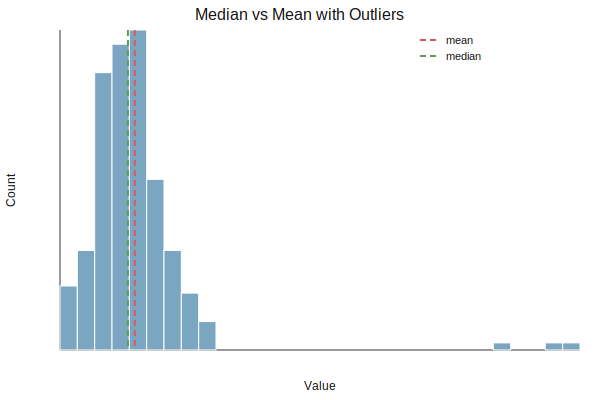

中央値（median）は、データを小さい順に並べたときの「真ん中の値」を表す代表値。外れ値の影響を受けにくいのが特徴。

- データ数が奇数: ちょうど真ん中の値
- データ数が偶数: 真ん中2つの平均

平均は全体をならすのに対し、中央値は「順位の中心」を見る指標である。

### 前提・注意

* データは「昇順に並べる」ことが前提
* 外れ値に強いが、分布の形までは分からない
* データが少ないと不安定になることがある

**利点：**
* 外れ値の影響を受けにくい
* 分布が歪んでいても中心を捉えやすい
* 順位で解釈できるので直感的

**欠点：**
* 計算が並べ替え前提なので平均より重い
* 分布の細かい形状は反映しにくい

## Python での実例

以下は、外れ値がある場合に平均と中央値がどう違うかを示す例。

**Output:**

### 数学での使いどころ

数学・統計では中央値は以下で使われる。

* 順位に基づく中心（ロバスト統計）
* [四分位点（Q2）](../quantile/quantile.md)としての位置
* L1損失（絶対誤差）を最小にする代表値

中央値は「絶対偏差の和を最小化する点」としても定義できる。

### 機械学習での使いどころ

機械学習では、外れ値への頑健さが求められる場面で使う。

* 特徴量の代表値（外れ値が多い特徴量）
* 欠損値の中央値補完
* ロバストな前処理（中央値でのセンタリング）

### 適さないケース

* 分布の細かな形を知りたい場合
* データ数が極端に少ない場合
* 順位ではなく総量を重視したい場合
