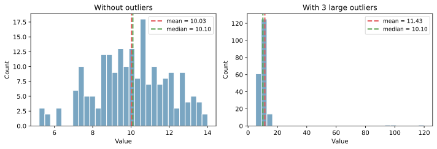
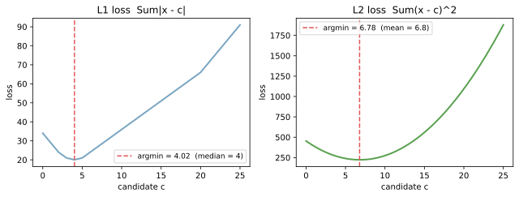
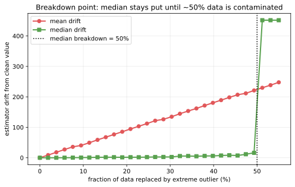
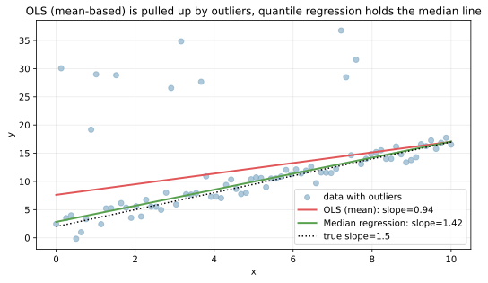

中央値（median）は、データを小さい順に並べたときに「真ん中に来る値」を表す代表値である。[平均](../mean/)が「値の重心」を見るのに対し、中央値は「順位の中心」を見るので、外れ値の影響を受けにくいのが大きな特徴となる。

定義はデータ数 `n` で場合分けする。

- `n` が奇数: ちょうど真ん中の値（`(n+1)/2` 番目）
- `n` が偶数: 真ん中 2 つの平均（`n/2` 番目と `n/2+1` 番目の平均）

中央値は「[四分位点](../quantile/) の Q2（50% 点）」と同じものを指す。順位ベースの代表値という意味で、ロバスト統計（外れ値や歪んだ分布に強い手法の総称）の入口に位置する指標と言える。

### 外れ値耐性の根拠

[平均](../mean/) と中央値の決定的な違いは、「**外れ値が代表値をどれだけ動かすか**」にある。下の図は同じ正規分布のデータに、3 つの大きな外れ値（95, 100, 120）を追加した前後の比較である。



具体的には、

- 外れ値追加前: mean = 10.03, median = 10.10
- 外れ値追加後: mean = 11.43, median = 10.10

3 件しか外れ値を追加していないのに、平均は 1.4 ほど引き上げられる。一方、中央値はほぼ動かない。データ全体の値を平均で集計する平均と違って、中央値は「真ん中の順位の値」しか見ないので、外側の極端な値がいくら巨大でも順位の中心は変わらない、という構造になっている。

この性質から、給与・取引金額・アクセス回数のような「右に長い裾を持つ分布」では、中央値の方がデータの「典型的な値」を素直に反映する代表値となる。逆に、外れ値も含めた合計や総量を見たい場合は平均の方が適切と言える。

---

### L1 損失と中央値の関係

中央値には「L1 損失（絶対誤差の和）を最小化する点」という数学的な特徴付けがある。これは [平均](../mean/) が「L2 損失（二乗誤差の和）を最小化する点」であることと対になる構造である。

データ `[2, 3, 4, 5, 20]` に対して、候補値 `c` を動かしながら L1 損失 `Σ|x - c|` と L2 損失 `Σ(x - c)²` をプロットすると次のようになる。



- L1 損失は `c = 4`（中央値）で最小
- L2 損失は `c = 6.8`（平均）で最小

このペアは「外れ値 20 がどの程度代表値を引きずるか」を端的に示している。L2 は二乗するため、`20 - c` の差が大きく増幅され、結果として `c` を外れ値側へ引きずる。L1 は線形なので、外れ値の影響が等価値で扱われ、`c` は順位の真ん中で止まる。

機械学習でも同じ構造が現れる。線形回帰の損失関数を L1（Mean Absolute Error）にすると外れ値に強い回帰になり、L2（Mean Squared Error）にすると外れ値の影響を強く受ける回帰になる。中央値は L1 損失の最小点という観点で見ると、損失関数の選び方とロバスト性の関係を理解する起点になる。

---

### Breakdown point: 50% まで耐える

ロバスト統計には「breakdown point（崩壊点）」という指標がある。「データのうち何 % が任意の極端な値に置き換わったとき、推定値が任意の値に動きうるか」を表す。平均の breakdown point は 0%（1 個でも極端な値が混ざると引きずられる）に対し、中央値の breakdown point は 50% である。

```python
fractions = np.linspace(0, 0.55, 30)
mean_drift, median_drift = [], []
for frac in fractions:
    n_contam = int(round(len(clean) * frac))
    contaminated = clean.copy()
    if n_contam > 0:
        idx = rng.choice(len(clean), size=n_contam, replace=False)
        contaminated[idx] = 500.0
    mean_drift.append(contaminated.mean() - clean.mean())
    median_drift.append(np.median(contaminated) - np.median(clean))
plt.savefig("median_breakdown.svg", bbox_inches="tight")
```



赤い線が平均の動き、緑が中央値の動き。横軸は「データの何 % を極端な値（500）に置き換えたか」である。平均は汚染率に比例して直線的に上昇していくのに対し、中央値は約 50% に達するまではほぼ動かない。50% を超えると一気に「外れ値側の値」が真ん中の順位に来るので跳ね上がる。この性質が「中央値はロバスト統計の代表」と呼ばれる理由となる。

「データの半分まで信頼できないかもしれない」状況は通常まれだが、極端な裾を持つ分布や、悪意のあるデータ汚染が考えられる場面（不正検出、ロバスト回帰）では breakdown point の高さが大きな安全マージンになる、と考えられる。

---

### Quantile regression: 「中央値を予測する回帰」

回帰モデルにも「平均を予測する OLS」と「中央値を予測する quantile regression」の対比がある。外れ値が混ざるデータで両者を当てると、振る舞いが目に見えて違う。

```python
from sklearn.linear_model import LinearRegression, QuantileRegressor

x_data = np.linspace(0, 10, 80)
y_data = 1.5 * x_data + 2.0 + rng.normal(0, 1.5, 80)
# 10 個の上方外れ値を注入
y_data[rng.choice(80, 10, replace=False)] += rng.uniform(15, 30, 10)

ols = LinearRegression().fit(x_data.reshape(-1, 1), y_data)
qr = QuantileRegressor(quantile=0.5, alpha=0.0).fit(x_data.reshape(-1, 1), y_data)
# 詳細な描画は scripts 側を参照
plt.savefig("median_quantile_regression.svg", bbox_inches="tight")
```



真の傾きは 1.5 だが、上方に外れ値を混ぜたため OLS（赤、L2 損失）は傾きを大きく見積もる方向に引きずられる。一方で quantile regression（緑、`quantile=0.5` で L1 損失）は外れ値の影響を抑え、真の傾き付近に張り付く。回帰でロバスト性が欲しい場面では、損失関数を L1 に切り替える（あるいは Huber 損失のような L1/L2 のハイブリッドを使う）のが定石となる。

---

### 前提・注意

- データは「順序付け可能」であることが前提（数値・順序尺度）
- データ数が少ないと（数件レベル）、真ん中の値そのものが不安定になる
- 「順位の中心」しか見ないので、分布の形状や全体の総量は反映しない
- 同値が多いデータでは、中央値が「中央値以下」のデータと混在しうる

---

### 利点

- 外れ値の影響をほぼ受けない（ロバスト統計の代表）
- 分布が歪んでいても「典型的な値」を捉えやすい
- 順位で解釈できるので、単位を持たないデータ（順序尺度）にも使える
- 累積分布関数 `F(x) = 0.5` を満たす点として、確率論的に明確に定義できる

---

### 欠点

- 計算が並べ替え前提なので、計算量が `O(n log n)`（[平均](../mean/) は `O(n)`）
- 分布の形状（歪み・多峰性・分散）は反映できない
- 微分不可能な統計量なので、最適化の文脈で扱いにくい（L1 損失は劣勾配が必要になる）
- 同じ値が多いと「複数の中央値が成り立つ」あいまいさが生じることがある

---

## Python での実例

scikit-learn / numpy / pandas のいずれでも 1 行で計算できる。

```python
import numpy as np
import pandas as pd

values = np.array([2, 3, 4, 5, 20])
print(np.median(values))        # 4.0
print(pd.Series(values).median())  # 4.0
```

外れ値の影響度を比較する最小例。

```python
import numpy as np

rng = np.random.default_rng(0)
base = rng.normal(loc=10.0, scale=2.0, size=200)
outlier = np.concatenate([base, [100.0, 120.0, 95.0]])

print("mean:  ", base.mean(),    "->", outlier.mean())
print("median:", np.median(base), "->", np.median(outlier))
# mean:   10.03 -> 11.43
# median: 10.10 -> 10.10
```

---

### 数学での使いどころ

- 順位に基づく中心としての代表値（ロバスト統計の入口）
- [四分位点](../quantile/) の Q2 として、箱ひげ図の中央線
- L1 損失（絶対誤差の和）を最小にする点（最適化問題の特殊解）
- 累積分布関数 `F(x) = 0.5` の解（分位関数の値）

数学的には、中央値は「微分不可能な統計量」の代表例でもある。L1 損失の最小化は微分ではなく劣勾配で扱う必要があり、最適化理論の話題に直結する。

---

### 機械学習での使いどころ

機械学習では、外れ値への頑健さや分布の歪みが問題になる場面で中央値が選ばれる。

- 特徴量の代表値: 外れ値が混じる可能性のあるデータの中心を見るとき
- 欠損値の中央値補完: 平均補完と比べて外れ値に引きずられにくい
- ロバストな前処理: `RobustScaler` は中央値と[四分位点](../quantile/) を使って[標準化](../../ml/standardization/) する（外れ値耐性版の標準化）
- L1 損失を使う回帰（Quantile Regression、Median Regression）: 中央値を予測対象にすると外れ値に強い
- A/B テストの代表値: 売上分布が右に長いとき、平均より中央値で群間比較する方が「典型値の差」を素直に見える

具体的な利用例:

- 給与・取引金額のような対数正規分布的なデータの中心
- 不動産価格の典型値（外れ値である高級物件の影響を抑える）
- レコメンドの評価値（クリック率の中央値で「典型ユーザー」の挙動を見る）

---

### 適さないケース

- 分布の細かな形状（多峰性・尖度など）を知りたい場合: [KDE](../kde/) やヒストグラムを併用する
- データ数が極端に少ない場合（10 件以下など）: 真ん中の値そのものが偶然に左右される
- 順位ではなく総量・合計を重視したい場合: 売上合計や総人数のような「足し算」が意味を持つ指標は平均（や合計）の方が適切
- 微分可能性が必要な最適化: 中央値は不連続な統計量なので、勾配ベースの最適化には向かない（近似として `quantile` を smooth 近似する手法もある）
