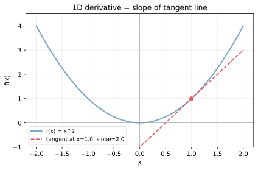
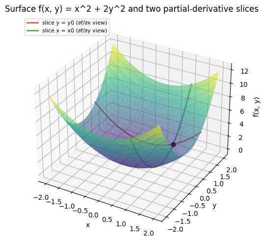
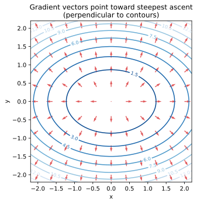
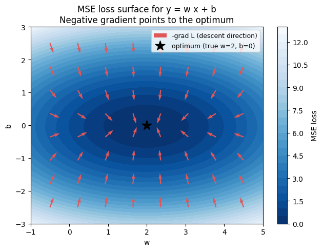

偏微分（partial derivative）は、複数の変数を持つ関数 `f(x, y, ...)` を「ある 1 変数だけ動かして、他は固定する」と決めて、その 1 変数についての変化率を取った量である。勾配（gradient, `∇f`）は、全変数についての偏微分をベクトルに並べたもので、そのベクトルが「f が最も急に増える向き」を指す性質を持つ。

機械学習では損失関数 `L(w_1, w_2, ..., w_n)` をモデルのパラメータで偏微分し、勾配の逆向きにパラメータを少しずつ動かして損失を下げる、という枠組みが繰り返し出てくる。線形回帰の正規方程式から始まり、ロジスティック回帰の最尤推定、ニューラルネットの誤差逆伝播まで、根は同じ「勾配の符号を反対側に進む」操作である。

### 1 変数の微分から始める

1 変数関数 `f(x)` の微分 `f'(x)` は、`x` を少しだけ動かしたときに `f` が動く比率を表す。グラフ上では、点 `(x, f(x))` での接線の傾きと同じものとなる。

```python
import numpy as np
import matplotlib.pyplot as plt

x = np.linspace(-2, 2, 400)
y = x ** 2
x0 = 1.0
slope = 2 * x0
tangent = slope * (x - x0) + x0 ** 2

plt.plot(x, y, color="#7aa6c2", lw=2, label="f(x) = x^2")
plt.plot(x, tangent, color="#e15759", ls="--",
         label=f"tangent at x={x0}, slope={slope}")
plt.scatter([x0], [x0 ** 2], color="#e15759")
plt.savefig("tangent_1d.svg", bbox_inches="tight")
```



`f(x) = x^2` の `x=1` における微分は `f'(1) = 2` で、図の赤い破線の傾きと一致する。微分は局所的な傾きであり、グラフが平らな点（`f'(x) = 0`）は極大・極小・鞍点の候補となる。最適化はこの「平らな点」を探す作業でもある。

---

### 偏微分: 1 変数だけ動かす

多変数関数 `f(x, y) = x^2 + 2 y^2` を考える。`x` についての偏微分 `∂f/∂x` は、`y` を固定したまま `x` だけ動かしたときの変化率である。形式的には `y` を定数とみなして 1 変数の微分を取る。

- `∂f/∂x = 2x`（`y` は定数扱い、`2 y^2` の項は微分で消える）
- `∂f/∂y = 4y`（`x` は定数扱い、`x^2` の項は微分で消える）

幾何的には、`y = y_0` という平面でサーフェスを切った断面の傾きが `∂f/∂x` に、`x = x_0` で切った断面の傾きが `∂f/∂y` に対応する。

```python
from mpl_toolkits.mplot3d import Axes3D  # noqa
import numpy as np
import matplotlib.pyplot as plt

xs = np.linspace(-2, 2, 60)
ys = np.linspace(-2, 2, 60)
XX, YY = np.meshgrid(xs, ys)
ZZ = XX ** 2 + 2 * YY ** 2

fig = plt.figure(figsize=(7, 5))
ax = fig.add_subplot(111, projection="3d")
ax.plot_surface(XX, YY, ZZ, cmap="viridis", alpha=0.6, edgecolor="none")

x0, y0 = 1.0, 0.8
ax.plot(xs, np.full_like(xs, y0), xs ** 2 + 2 * y0 ** 2,
        color="#e15759", lw=2, label="slice y = y0 (∂f/∂x)")
ax.plot(np.full_like(ys, x0), ys, x0 ** 2 + 2 * ys ** 2,
        color="#59a14f", lw=2, label="slice x = x0 (∂f/∂y)")
plt.savefig("surface_slices.png", bbox_inches="tight")
```



赤い曲線が `y = y_0` 平面での断面で、その曲線の傾きが `(x_0, y_0)` における `∂f/∂x` の値となる。緑の曲線は `x = x_0` 平面での断面で、傾きが `∂f/∂y` を表す。1 つの点に対して、見る方向ごとに別々の傾きが定まる、という点が多変数関数の特徴である。

---

### 勾配ベクトル: 偏微分を並べる

偏微分を全変数ぶん集めてベクトルにしたものを勾配と呼ぶ。記号は `∇f`（ナブラ f）。

`∇f(x, y) = (∂f/∂x, ∂f/∂y)`

`f(x, y) = x^2 + 2 y^2` の場合は `∇f = (2x, 4y)` となる。

勾配には次の 2 つの幾何的性質がある。

- 向き: 勾配ベクトルは「`f` が最も急に増える方向」を指す
- 大きさ: 勾配ベクトルの長さ `|∇f|` は、その方向への変化率の大きさを表す

そのため、最小化したい関数では `-∇f`（負の勾配、descent direction）の向きに動けば、最も急に値が下がる。これが最急降下法（gradient descent）の出発点となる。詳細は [最急降下法・SGD](../gradient-descent-sgd/) のノートに譲る。

等高線図上で見ると、勾配ベクトルは等高線に常に垂直に立つ。等高線は「同じ高さの点をつないだ線」なので、その線に沿って動いても高さは変わらない。最も大きく高さが変わる向きはその直交方向、つまり等高線の法線方向となる。

```python
import numpy as np
import matplotlib.pyplot as plt

xs = np.linspace(-2.2, 2.2, 200)
ys = np.linspace(-2.2, 2.2, 200)
XX, YY = np.meshgrid(xs, ys)
ZZ = XX ** 2 + 2 * YY ** 2

XQ, YQ = np.meshgrid(np.linspace(-2, 2, 11), np.linspace(-2, 2, 11))
UQ, VQ = 2 * XQ, 4 * YQ
mag = np.sqrt(UQ ** 2 + VQ ** 2)
plt.contour(XX, YY, ZZ, levels=12, cmap="Blues_r")
plt.quiver(XQ, YQ, UQ / (mag + 1e-9), VQ / (mag + 1e-9),
           color="#e15759", scale=25, width=0.005)
plt.savefig("gradient_field.svg", bbox_inches="tight")
```



赤い矢印が各点の勾配ベクトル（正規化済み）で、青い等高線に直交している。原点が最小値で、勾配の長さは原点から離れるほど大きくなる。`y` 方向は係数 4、`x` 方向は係数 2 なので、矢印は `y` 方向に強めに傾く点も見える。

---

### 機械学習に直結する例: MSE 損失の勾配

線形モデル `y_pred = w * x + b` を MSE（平均二乗誤差, mean squared error）で訓練する状況を考える。

`L(w, b) = (1/n) Σ_i (y_i - (w x_i + b))^2`

これを `w` と `b` で偏微分すると、

- `∂L/∂w = -(2/n) Σ_i x_i (y_i - (w x_i + b))`
- `∂L/∂b = -(2/n) Σ_i (y_i - (w x_i + b))`

となる。勾配は `(w, b)` 平面上のベクトルで、その逆向きに `(w, b)` を更新していけば損失が下がる。学習率 `η` を掛けて

`w ← w - η (∂L/∂w)`
`b ← b - η (∂L/∂b)`

とするのが最急降下法そのものである。

```python
import numpy as np
import matplotlib.pyplot as plt

rng = np.random.default_rng(0)
x_data = np.linspace(-1, 1, 30)
y_data = 2.0 * x_data + rng.normal(0.0, 0.3, 30)

w_grid = np.linspace(-1, 5, 80)
b_grid = np.linspace(-3, 3, 80)
WW, BB = np.meshgrid(w_grid, b_grid)
LL = np.array([[np.mean((y_data - (w * x_data + b)) ** 2)
                for w in w_grid] for b in b_grid])

# 描画と勾配ベクトルは略 (スクリプト側で生成)
plt.savefig("mse_gradient.png", bbox_inches="tight")
```



色の濃淡が損失の高さで、星が真の最適解 `(w=2, b=0)` の位置である。各点の赤い矢印は `-∇L`（負の勾配）の向きで、いずれも星の方向を指している。最急降下法はこの矢印に沿ってパラメータを動かすことで、損失面を「下る」アルゴリズムだと考えられる。

---

### 連鎖律（chain rule）

合成関数 `f(g(x))` の微分は、`f'(g(x)) × g'(x)` という積で書ける。これが連鎖律で、ニューラルネットの誤差逆伝播法はこの連鎖律を層をまたいで適用したものに他ならない。

多変数の連鎖律は、層 `L = f(z(w))`（`z` は中間出力、`w` は重み）に対して

`∂L/∂w = (∂L/∂z) × (∂z/∂w)`

のように偏微分の積で書ける。「外側の損失の勾配」と「内側の関数のヤコビ行列」を順に掛け合わせる構造で、深いネットワークでも 1 層ずつ局所的に勾配を計算できる仕組みになる。

### 数学での使いどころ

- 多変数関数の極値判定（停留点は `∇f = 0` を満たす）
- ラグランジュ未定乗数法（制約付き最適化、`∇f = λ ∇g`）
- 方向微分（任意の単位ベクトル `u` 方向の変化率は `∇f · u`）
- ベクトル場の物理的意味（重力・電場など）
- [固有値分解](../eigen-decomposition/) と関連する 2 次形式 `x^T A x` の勾配は `2 A x`

---

### 機械学習での使いどころ

機械学習で勾配が登場しない場面はほとんどない。

- パラメータ学習: [最急降下法・SGD](../gradient-descent-sgd/) でモデルパラメータを更新する基本道具
- 損失関数の最小化: 線形回帰、ロジスティック回帰、ニューラルネット、サポートベクターマシンすべて勾配ベースの最適化が標準
- 誤差逆伝播法（backpropagation）: 連鎖律を多層に適用してニューラルネットの全パラメータの勾配を求める
- 特徴量の重要度: 入力に対する勾配 `∂y/∂x` の大きさで特徴量の影響度を測る手法（Saliency Map など）
- ハイパーパラメータ最適化: ベイズ最適化のような勾配を直接使わない手法もあるが、微分可能な領域なら勾配ベース最適化が高速

---

### 適さないケース / 限界

勾配ベース最適化は便利だが、すべての関数に効くわけではない。

- 微分不可能な関数: ReLU の `x=0` のように尖った点では厳密な勾配が定義されない（実装では劣勾配や任意の値で代用）
- 離散最適化: 整数計画や組合せ最適化は連続変数の勾配の枠外で、別系統のアルゴリズム（branch-and-bound、遺伝的アルゴリズム）が必要
- 非凸関数: 勾配が 0 になる点は最小値とは限らず、鞍点や局所最小に捕まる。深層学習では SGD のノイズや momentum がこれらを抜け出す装置として効くと考えられる
- 勾配消失・勾配爆発: 深いネットワークで連鎖律の積が極端に小さく/大きくなる現象。活性化関数の選び方（ReLU 等）や初期化、正規化で緩和する
- ノイズの大きい損失面: 観測誤差が支配的な場合、勾配の方向自体が信頼できない。ミニバッチサイズや学習率を慎重に選ぶ必要がある
