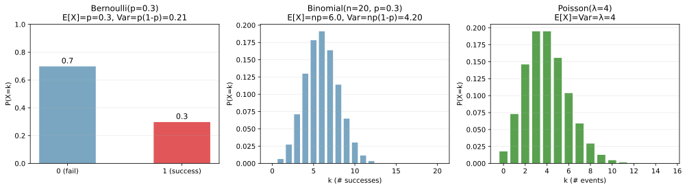
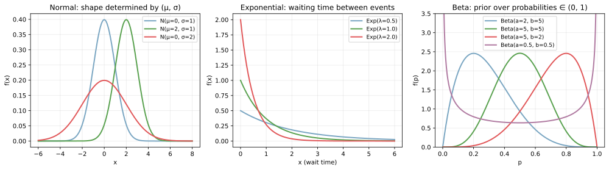
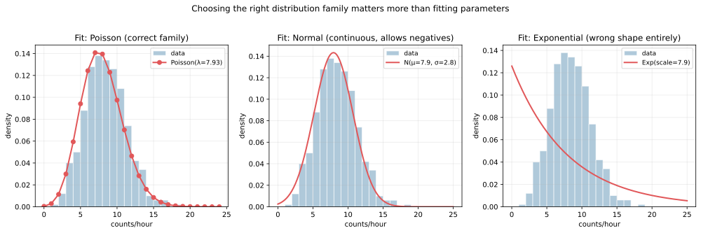
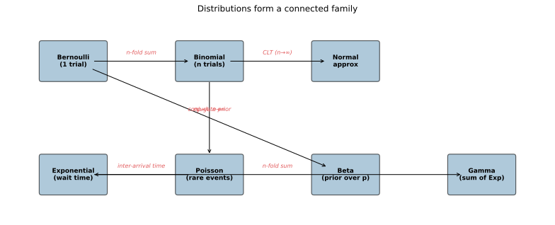

確率分布（probability distribution）は、確率変数 `X` が取りうる値とその確率を対応づける関数のことである。離散変数なら確率質量関数（PMF, `P(X = k)`）、連続変数なら確率密度関数（PDF, `f(x)`）で記述される。機械学習で「データはこんな分布から生成されたとモデル化する」「予測モデルはこんな分布を出力する」と語るとき、必ず特定の分布族を念頭に置くことになる。

ここでは ML で最頻出の 5 つ（ベルヌーイ・二項・正規・ポアソン・指数・ベータ）を取り上げ、それぞれの (1) 何を表すか、(2) パラメータ、(3) 平均と分散、(4) ML での代表的な使いどころ、を整理する。詳しい [期待値](../expectation/) や [同時分布](../joint-marginal-conditional/) との繋がりは前のノートで扱っている。

### 離散分布: ベルヌーイ・二項・ポアソン

「サンプル空間が離散値（整数）」のときに使う分布。

```python
import numpy as np
from scipy import stats
import matplotlib.pyplot as plt

# Bernoulli, Binomial, Poisson の PMF を並べて描画
# 詳細は scripts 側を参照
plt.savefig("distributions_discrete.svg", bbox_inches="tight")
```



| 分布 | PMF | パラメータ | E[X] | Var(X) | 何を表す |
|---|---|---|---|---|---|
| ベルヌーイ | `P(X=1)=p, P(X=0)=1-p` | `p` | `p` | `p(1-p)` | 1 回の試行の成功/失敗 |
| 二項 | `C(n,k) p^k (1-p)^(n-k)` | `n, p` | `np` | `np(1-p)` | `n` 回の独立試行で `k` 回成功 |
| ポアソン | `λ^k e^(-λ) / k!` | `λ` | `λ` | `λ` | 単位時間/領域で起きる稀な事象の回数 |

ベルヌーイは「コイン投げ 1 回」、二項はそれを `n` 回繰り返した「`n` 回中の成功数」。ポアソンは「`n` 回の試行で成功率 `p = λ/n` が小さい」極限として二項から導かれ、「単位時間あたりに起きる稀な事象（事故・故障・電話）」のモデルとして頻出する。

ポアソン分布の重要な性質は `E[X] = Var(X) = λ` で平均と分散が等しいこと。実データで「平均より分散が大きい」（over-dispersion）なら、ポアソンでは足りず負の二項分布などへの拡張が必要となる。

---

### 連続分布: 正規・指数・ベータ

「サンプル空間が連続値」のときに使う分布。

```python
# Normal, Exponential, Beta の PDF を並べて描画
plt.savefig("distributions_continuous.svg", bbox_inches="tight")
```



| 分布 | PDF | パラメータ | E[X] | Var(X) | 何を表す |
|---|---|---|---|---|---|
| 正規 | `(1/(σ√(2π))) exp(-(x-μ)²/(2σ²))` | `μ, σ` | `μ` | `σ²` | 多数の独立要因の和（CLT による普遍性） |
| 指数 | `λ exp(-λx)` (x ≥ 0) | `λ` | `1/λ` | `1/λ²` | 次の事象までの待ち時間 |
| ベータ | `x^(a-1)(1-x)^(b-1) / B(a,b)` | `a, b` | `a/(a+b)` | `ab/((a+b)²(a+b+1))` | `(0, 1)` 区間の確率の事前分布 |

- 正規分布（ガウス分布）: 統計と ML の中で圧倒的に頻出。中心極限定理（[lln-clt](../lln-clt/) のノート参照）により、独立な確率変数の和は分布形によらず正規分布に近づくため、「最初に試す」分布として広く使われる
- 指数分布: ポアソンで起きる事象の「次まで何秒待つか」。記憶喪失性（memoryless property）を持つ唯一の連続分布
- ベータ分布: 値域が `(0, 1)` に閉じているので、確率そのものの事前分布として自然。形が極めて柔軟で、`a, b` の調整で「U 字」「逆 U 字」「左寄り」「右寄り」を作れる

---

### 「正しい分布族を選ぶ」が一番重要

同じデータに対して間違った分布族を当てると、パラメータ推定が完璧でも結果は使い物にならない。「1 時間あたりの来店客数」（ポアソン的なデータ）に正規分布や指数分布を当てて見る。

```python
rng = np.random.default_rng(0)
counts = rng.poisson(8, 500)
# Poisson fit / Normal fit / Exponential fit を比較
plt.savefig("distributions_family_choice.svg", bbox_inches="tight")
```



- 左の Poisson fit: 釣鐘型ヒストグラムにきれいに沿う
- 中央の Normal fit: 連続化されており、負の客数まで確率を割り振ってしまう（実際にはあり得ない）
- 右の Exponential fit: 完全に形が違う。指数分布は単調減少形で、釣鐘型は表現できない

EDA（探索的データ分析）の最初の段階で「データの性質に合う分布族を選ぶ」のは [歪度](../skewness/) のノートで触れた「log 変換が必要か」の判断と同じ系統の作業となる。具体的には、

- 0/1 → Bernoulli
- 試行回数が固定の成功数 → Binomial
- 単位時間/領域での回数 → Poisson
- 連続値、釣鐘型 → Normal
- 正の連続値、右に裾 → Exponential / Gamma / Log-Normal
- 確率 `(0, 1)` 上の値 → Beta

を最初の候補にすると、フィットの品質が大きく違ってくる、と考えられる。

---

### 分布同士の関係

代表的な分布は孤立しているわけではなく、互いに変換・極限で繋がる「分布族」を成している。



主要な関係:

- Bernoulli × n 回 = Binomial: コイン投げを n 回繰り返した成功数
- Binomial の極限（`n → ∞, np → λ`）= Poisson: 試行が多くて成功率が低いとき
- Binomial の極限（`n → ∞`）= Normal: 中心極限定理（[lln-clt](../lln-clt/) 参照）
- Poisson の inter-arrival time = Exponential: ポアソン過程で事象が起きる間隔
- Exponential × n 回の和 = Gamma: n 個目の事象までの累積待ち時間
- Bernoulli の共役事前分布 = Beta: [ベイズの定理](../bayes-theorem/) で更新するとき計算が楽

「どの分布を使うか」の判断は、現象の構造（離散か連続か、回数か時間か、`(0,1)` の値か無界か）と分布の性質を対応させるところから始まる。

### 数学での使いどころ

- 最尤推定（MLE）: 各分布族にパラメータを当てはめる基本テクニック
- [ベイズの定理](../bayes-theorem/) の事前分布: Beta-Binomial、Gamma-Poisson、Normal-Normal などの共役関係
- [大数の法則と中心極限定理](../lln-clt/): 標本平均が正規分布に収束する理論
- 仮説検定: 検定統計量が各分布（t、χ²、F、正規）に従うことを利用（[hypothesis-test](../hypothesis-test/) 参照）
- モーメント母関数・特性関数: 分布の特性を 1 つの関数に集約
- 多変量への拡張: 多変量正規分布、Dirichlet 分布（Beta の多変量版）

---

### 機械学習での使いどころ

- 損失関数の導出: MSE は正規分布尤度、交差エントロピーはベルヌーイ/カテゴリ尤度に対応（[損失関数](../../ml/loss-functions/) 参照）
- ナイーブベイズ: 各特徴量の分布（Gaussian Naive Bayes、Multinomial Naive Bayes）を仮定
- 確率モデルの基盤: ロジスティック回帰（ベルヌーイ）、ポアソン回帰、Gamma 回帰、ベータ回帰
- 生成モデル: VAE は正規分布、Diffusion はガウス過程、GAN は明示的な分布を仮定しない
- A/B テストのベイズ解釈: Beta-Binomial で「コンバージョン率の事後分布」を推定
- ハイパーパラメータの事前: Bayesian optimization で Gaussian Process を使う
- 異常検知: 「正常データの分布」を当てはめ、低密度の点を異常とする
- 強化学習の探索: Thompson sampling は Beta-Bernoulli の事後分布から候補を引く
- 不確実性推定: 予測を 1 つの値でなく分布として返す（Bayesian NN、ガウス過程）
- 待ち行列・キュー設計: 推論サーバーのレイテンシ予測（指数 / Gamma）

scikit-learn では分布族指定を `glm` 系（`PoissonRegressor`, `GammaRegressor`, `TweedieRegressor`）で行う。深層学習では `nn.GaussianNLLLoss`、`nn.PoissonNLLLoss` などの形で損失関数として組み込まれる。

---

### 適さないケース / 落とし穴

- 「とりあえず正規分布」: 多くのデータは右に裾を引いており（給与、価格、待ち時間）、正規仮定が崩れる。[歪度](../skewness/) を見て log 変換 or 別分布へ
- 二項分布の独立試行仮定: 試行同士が相関しているとパラメータ推定が崩れる（ベータ二項分布で対処）
- Poisson の over-dispersion: 分散が平均より明らかに大きいとき。負の二項分布、Quasi-Poisson、Zero-inflated Poisson などへ
- ベータの境界 `p ∈ {0, 1}`: 厳密に 0 や 1 を取るデータがあると、`Beta` PDF が定義できない。Beta-Bernoulli の混合や 0/1-inflated Beta を使う
- 「同じパラメータなら同じ予測」: 異なる分布族で `μ` が同じでも予測は全然違う。分布族の選択が先
- 多モード（峰が複数）: 単一の標準分布では表現できない。混合分布（Gaussian Mixture）を使う
- 連続データを離散分布で扱う: 整数に丸めて Poisson 当てはめ等は情報を失う。素直に連続分布へ
- 独立性仮定: 多くの分布は独立サンプルを前提とする。時系列など相関データには別枠の手法（自己相関モデル、HMM）
- パラメータ推定の不確実性無視: 推定値 `λ_hat = 5.2` を確定値として扱うと、推定の標準誤差を無視することになる。信頼区間 / 事後分布を併用
- 「正規分布なら標準偏差 3σ で十分」をすべてに適用: 裾の重い分布（t、Pareto、対数正規）では 3σ ルールが極端に楽観的な見積もりになる
