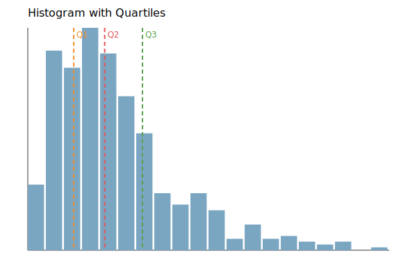
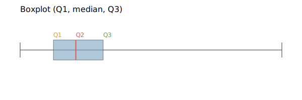

四分位点（quartile）は、データを小さい順に並べたときに「4等分する位置」を表す。  
- 第1四分位点（Q1）：下位25%の位置
- 第2四分位点（Q2）：[中央値](../median/)（50%の位置）
- 第3四分位点（Q3）：下位75%の位置

分位点（quantile）は「データの中で何%の位置か」を示す指標で、四分位点はその代表例である。  分布の中心やばらつき、外れ値の候補を把握するために使う。

### 前提・注意

* データは「昇順に並べる」ことで意味を持つ
* 外れ値に引っ張られやすい指標（平均）より、中央値や四分位点のほうが安定する
* 箱ひげ図は四分位点を視覚化する代表的な方法

---

### 利点
* 分布の偏りや広がりが分かる
* 平均よりも外れ値の影響を受けにくい
* 比較（A/B）に使いやすい

---

### 欠点
* 分布の形状（山の数など）までは分からない
* データ量が少ないと不安定

---

## Python での実例

以下は、四分位点の計算と可視化を同時に行う例。  

```python
import numpy as np
import matplotlib.pyplot as plt

# 右に長い分布を作る（ログ正規分布）
rng = np.random.default_rng(0)
values = rng.lognormal(mean=1.0, sigma=0.6, size=500)

q1, q2, q3 = np.quantile(values, [0.25, 0.5, 0.75])

# ヒストグラム + 四分位点
plt.figure(figsize=(6, 4))
plt.hist(values, bins=30, color="#7aa6c2", edgecolor="white")
for q, label, color in [(q1, "Q1", "#f28e2b"), (q2, "Q2 (median)", "#e15759"), (q3, "Q3", "#59a14f")]:
    plt.axvline(q, color=color, linestyle="--", linewidth=2)
    plt.text(q, plt.ylim()[1] * 0.9, label, rotation=90, va="top", ha="right", color=color)
plt.title("Histogram with Quartiles")
plt.xlabel("Value")
plt.ylabel("Count")
plt.tight_layout()
plt.show()

# 箱ひげ図
plt.figure(figsize=(6, 2.5))
plt.boxplot(values, vert=False, showmeans=True)
plt.title("Boxplot (Q1, median, Q3)")
plt.xlabel("Value")
plt.tight_layout()
plt.show()
```

出力:




---

### 数学での使いどころ

数学・統計の文脈では、四分位点や分位点は以下で使われる。

* 分布の要約（代表値とばらつき）
* 外れ値の判定（IQR = Q3 - Q1）  
  IQR（Interquartile Range）は、Q3とQ1の差で、中央50%の広がりを示す。`IQR = Q3 - Q1` と定義し、外れ値判定の目安にも使う。
* データの比較（A/Bの分布差）

数学的には、分位点は「小さい順に並べたときの位置」を数式で書いたものだと考える。

* `F(x) = P(X <= x)` は「x以下がどれくらいの割合か」を表す関数（分布関数 `F(x)`）  
* q分位点は「全体のq(%)がx以下になるような境界」のこと  
  例: q=0.25なら「下位25%の境界」がQ1、q=0.5なら中央値(Q2)

---

### 機械学習での使いどころ

機械学習では、特徴量の分布確認や前処理の判断に使う。

* 特徴量のスケール感の把握
* 外れ値の除外やクリッピングの基準設定
* 学習前のデータ探索（EDA: Exploratory Data Analysis）

---

### 適さないケース

* 分布の形（多峰性など）を重視したい場合
* 非常に小さいサンプルサイズ
* 時系列の変化を追いたい場合（分位点だけでは時間軸が消える）
