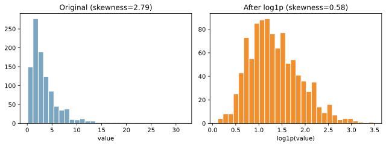

歪度（skewness、わいど）は、分布の「左右の非対称さ」を表す指標。右に長い尾を持つ分布は正の歪度、左に長い尾を持つ分布は負の歪度になる。例えば、右に長い分布（右裾が長い分布）は、小さな値が多く、大きな値が少数存在する。ヒストグラムでは、右側に細長い尾が伸びる形になり、[平均](../mean/)が[中央値](../median/)より大きくなることが多い。

代表的な定義（標準化された3次モーメント）は次の通り。

- `skewness = E[((X - mu) / sigma)^3]`
- `mu` は平均、`sigma` は[標準偏差](../stddev/)

### 前提・注意

- 外れ値の影響を強く受ける
- サンプル数が小さいと推定が不安定
- 歪度は「形の傾向」を示すだけで、分布の全体像を代替しない

---

## log1p (plus) 変換

log1p 変換は `log(1 + x)` を適用する変換。右に歪んだ分布（長い右尾）を圧縮し、極端な値の影響を和らげるのが目的である。`log(x)` は `x=0` で定義できないため、0 を含むデータでは扱いにくい。`log1p` は `log(1 + x)` を使うことで 0 を含めても安全に変換でき、`x` が小さいときは `log(1 + x) ≈ x` となるため、値の歪みを抑えつつ自然にスケールを圧縮できる。

---

### 使いどころ

- 取引金額やアクセス回数など、右に長い分布の特徴量
- 外れ値の影響を抑えたいとき
- 変数のスケール差が大きく、学習が不安定なとき

---

### 注意点

- `x >= 0` が前提（負の値には直接使えない）
- 0 を含む場合でも `log1p` なら安全に扱える
- 変換後の解釈（単位）が変わる点に注意

---

## Python での実例

```python
import numpy as np
import matplotlib.pyplot as plt

rng = np.random.default_rng(0)
raw = rng.lognormal(mean=1.0, sigma=0.8, size=1000)
log1p = np.log1p(raw)

fig, axes = plt.subplots(1, 2, figsize=(8, 3))
axes[0].hist(raw, bins=30, color="#4C78A8", edgecolor="white")
axes[0].set_title("Original (right-skewed)")
axes[1].hist(log1p, bins=30, color="#F58518", edgecolor="white")
axes[1].set_title("After log1p")
plt.tight_layout()
plt.show()
```

出力:



---

### 数学での使いどころ

- 分布の形状把握（非対称性の定量化）
- 正規性の仮定チェックの補助指標

---

### 機械学習での使いどころ

- 特徴量の分布を整えて学習を安定化する
- 線形モデルで外れ値の影響を抑える
- 距離ベース手法でスケール差を緩和する

---

### 適さないケース

- 負の値を多く含む変数（別の変換が必要）
- 変換後の解釈が重要な場面（ログ変換で意味が変わる）
