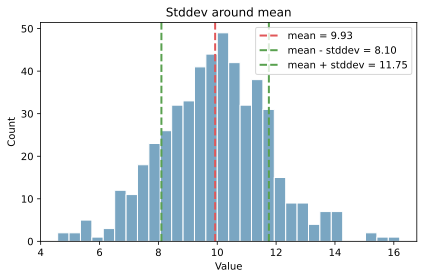

標準偏差（standard deviation, stddev）は、[分散（バリアンス）](../variance/)の平方根。データの散らばり具合を元の単位のまま表せる。

- 母標準偏差: `sigma = sqrt(sigma2)`
- 標本標準偏差: `s = sqrt(s2)`

`sigma2` や `s2` は分散を表し、詳細は[分散（バリアンス）](../variance/)を参照。

### 前提・注意

- データは数値であることが前提
- 外れ値の影響を強く受ける
- 分布が歪むと解釈が難しい

---

### 利点
- 元の単位でばらつきを表せる
- [平均（算術平均）](../mean/)からの距離感が直感的
- 標準化などの前処理に使いやすい

---

### 欠点
- 外れ値に弱い
- 分布の形状によって意味が変わる

---

## Python での実例

以下は、[平均（算術平均）](../mean/)の周りに標準偏差の幅を示した例。

```python
import numpy as np
import matplotlib.pyplot as plt

rng = np.random.default_rng(1)
values = rng.normal(loc=10.0, scale=2.0, size=500)

mean = values.mean()
std = values.std()

plt.figure(figsize=(6, 4))
plt.hist(values, bins=30, color="#7aa6c2", edgecolor="white")
plt.axvline(mean, color="#e15759", linestyle="--", linewidth=2, label="mean")
plt.axvline(mean - std, color="#59a14f", linestyle="--", linewidth=2, label="mean - stddev")
plt.axvline(mean + std, color="#59a14f", linestyle="--", linewidth=2, label="mean + stddev")
plt.title("Stddev around mean")
plt.xlabel("Value")
plt.ylabel("Count")
plt.legend()
plt.tight_layout()
plt.show()
```

出力:



---

### 数学での使いどころ

数学・統計では標準偏差は以下で使われる。

- zスコア（[平均（算術平均）](../mean/)との差を標準偏差で割る）
- 正規分布の広がりの理解
- 誤差の大きさの表現

---

### 機械学習での使いどころ

機械学習では、標準偏差は前処理で頻出。

- 特徴量の標準化（[平均（算術平均）](../mean/)を0にし、[分散（バリアンス）](../variance/)を1に揃える）
- 異常検知の基準（zスコア）
- 損失のスケール感の確認

---

### 適さないケース

- 外れ値が多いデータ（ロバストな指標が必要）
- 分布が大きく歪んでいるデータ
- 多峰性が強い分布
