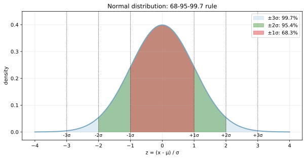
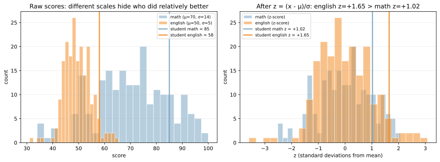

標準偏差（standard deviation, stddev）は、[分散](../variance/) の平方根として定義される散らばりの指標である。分散と数学的には等価だが、「単位が元データと同じ」という違いが実用上は決定的に重要となる。例えば身長（cm）のデータなら、分散は `cm²` という解釈しにくい単位になる一方、標準偏差は `cm` のまま扱える。

- 母標準偏差: `sigma = sqrt(sigma2)`
- 標本標準偏差: `s = sqrt(s2)`

`sigma2` や `s2` は分散を表し、詳細は [分散](../variance/) を参照。

### 単位が揃うことの意味

「分散があるのになぜ標準偏差を別に定義するのか」という疑問は、単位を考えると自然に解ける。身長データで `mu = 170 cm`、`sigma2 = 25 cm²` だったとき、「平均から `25 cm²` ずれている」と言われても直感が働かない。一方、`sigma = 5 cm` と言われれば「平均 ± 5 cm の範囲がだいたい典型的なばらつきだ」と即座にイメージできる。

これは数学的に同じ情報を持つ量でも、「データと同じ単位で表現できるか」が運用上の使いやすさを大きく左右する例と言える。実務で出す数字（誤差、信頼区間、リスクなど）はほぼ全て標準偏差ベースで報告される。

### 68-95-99.7 ルール（正規分布の経験則）

データが正規分布に近い場合、標準偏差を「典型的なばらつきの目盛り」として直感的に使える。

- 平均 ± 1σ の範囲に約 68% のデータが入る
- 平均 ± 2σ の範囲に約 95% のデータが入る
- 平均 ± 3σ の範囲に約 99.7% のデータが入る

例えば身長で `mu = 170 cm`, `sigma = 5 cm` なら、

- 165〜175 cm に約 68% の人が入る
- 160〜180 cm に約 95% の人が入る
- 155〜185 cm に約 99.7% の人が入る

この感覚は異常検知の閾値設定や統計検定の判断に直結する。「3σ を超える値は異常」というルールはこの 99.7% 区間に基づいている。ただし正規分布から外れる（裾の重い分布、歪んだ分布）と崩れるので、ヒストグラムや [KDE](../kde/) で分布形を確認するのが先決と考えられる。

### 前提・注意

- データは数値であることが前提
- 外れ値の影響を強く受ける
- 分布が歪むと解釈が難しい

---

### 利点
- 元の単位でばらつきを表せる
- [平均（算術平均）](../mean/)からの距離感が直感的
- 標準化などの前処理に使いやすい

---

### 欠点
- 外れ値に弱い
- 分布の形状によって意味が変わる

---

## Python での実例

以下は、[平均（算術平均）](../mean/)の周りに標準偏差の幅を示した例。

```python
import numpy as np
import matplotlib.pyplot as plt

rng = np.random.default_rng(1)
values = rng.normal(loc=10.0, scale=2.0, size=500)

mean = values.mean()
std = values.std()

plt.figure(figsize=(6, 4))
plt.hist(values, bins=30, color="#7aa6c2", edgecolor="white")
plt.axvline(mean, color="#e15759", linestyle="--", linewidth=2, label="mean")
plt.axvline(mean - std, color="#59a14f", linestyle="--", linewidth=2, label="mean - stddev")
plt.axvline(mean + std, color="#59a14f", linestyle="--", linewidth=2, label="mean + stddev")
plt.title("Stddev around mean")
plt.xlabel("Value")
plt.ylabel("Count")
plt.legend()
plt.tight_layout()
plt.show()
```

出力:


### 68-95-99.7 ルールを可視化する

正規分布の経験則を、標準正規分布の図に重ねて見る。

```python
from scipy import stats

x = np.linspace(-4, 4, 800)
pdf = stats.norm.pdf(x)
plt.plot(x, pdf, color="#7aa6c2", lw=2)
plt.fill_between(x, pdf, where=(np.abs(x) <= 3), alpha=0.6, label="±3σ: 99.7%")
plt.fill_between(x, pdf, where=(np.abs(x) <= 2), alpha=0.5, label="±2σ: 95.4%")
plt.fill_between(x, pdf, where=(np.abs(x) <= 1), alpha=0.55, label="±1σ: 68.3%")
plt.savefig("stddev_normal_rule.svg", bbox_inches="tight")
```



入れ子の 3 色の帯がそれぞれ ±1σ・±2σ・±3σ の範囲を表しており、覆っている確率の割合がラベルに書かれている。「3σ ルール」（観測値が ±3σ を超えれば異常）はこの 99.7% という数字が根拠で、正規分布ならば 1000 個に 3 個程度しか出ない極端な値、という意味になる。

ただし正規分布から外れる（裾の重い分布、歪んだ分布）と数字が大きく変わる。例として t 分布（自由度 5）では ±3σ の中に入る確率は 97% 程度に下がり、log-normal のような右に裾の長い分布ではさらに崩れる。実際のデータに 3σ ルールを適用する前に、ヒストグラムや [KDE](../kde/) で形を確認するのが安全と考えられる。

### Z スコアで異なる単位の値を比較する

Z スコア `z = (x - μ) / σ` を使うと、平均・標準偏差が違うデータ同士を「平均から何 σ離れているか」という共通単位で比較できる。

```python
math_scores = rng.normal(70, 15, 200).clip(0, 100)
english_scores = rng.normal(50, 5, 200).clip(0, 100)
student_math, student_english = 85, 58
z_math = (student_math - math_scores.mean()) / math_scores.std()
z_english = (student_english - english_scores.mean()) / english_scores.std()
print(f"math z = {z_math:+.2f}, english z = {z_english:+.2f}")
plt.savefig("stddev_zscore_compare.svg", bbox_inches="tight")
```

出力:

```text
math z = +1.04, english z = +1.34
```



左の生スコアでは「数学 85 点 > 英語 58 点」で数学の方が高く見えるが、右の Z スコア表示では英語の方が `+1.34σ` と数学 `+1.04σ` より相対的に高い位置にいる。これは英語の母集団のばらつきが小さい（σ=5）ため、同じ生スコアの差でも母集団内での偏差としては大きく見える、という構造である。偏差値（`z × 10 + 50`）はこの考え方を 1 次変換しただけのもので、Z スコアは「異なる母集団の相対位置を統一する」道具となる。

機械学習の [標準化](../../ml/standardization/) も全く同じ操作で、特徴量を Z スコアに変換することで、距離ベース（kNN、k-means）や正則化を伴うモデル（Ridge、Lasso、ロジスティック回帰）が安定して動くようになる。

---

### Z スコアと標準化

標準偏差を使ってデータを「無次元化」する操作が Z スコア（Z-score）である。

```text
z = (x - mu) / sigma
```

これは「平均から何 σ だけ離れているか」を表す数で、単位を持たない。Z スコアの利点は次の通り。

- 異なる単位・スケールのデータを比較できる（例: 数学のテストと英語のテストの偏差値）
- 異常検知の閾値として使える（`|z| > 3` で外れ値、など）
- 機械学習の[標準化](../../ml/standardization/) では、特徴量を Z スコアに変換することで距離ベース・正則化系のモデルが安定する

Z スコアは「標準偏差を 1 単位の物差しにする」発想で、これによって異なる量の比較が可能になると言える。

### 数学での使いどころ

数学・統計では標準偏差は以下で使われる。

- Z スコア: 平均からの距離を標準偏差で測る無次元量
- 正規分布の広がりの記述（68-95-99.7 ルール）
- 信頼区間: `mu ± 1.96 * (sigma / sqrt(n))` で 95% 区間
- 標準誤差（Standard Error）: 推定量のばらつき。標本平均の標準誤差は `sigma / sqrt(n)`
- 検定統計量: t 値・z 値の構成要素
- [相関係数](../correlation/) の正規化: `r = Cov(X,Y) / (sigma_x * sigma_y)`

---

### 機械学習での使いどころ

機械学習では、標準偏差は前処理・評価・異常検知で頻出する。

- 特徴量の[標準化](../../ml/standardization/): `(x - mu) / sigma` で平均 0・[分散](../variance/) 1 に揃える
- [交差検証](../../ml/cross-validation/) のスコア集約: 平均 ± 標準偏差で「実力値の範囲」を表す
- 異常検知の閾値: `|z| > 3` のような 3σ ルール
- ハイパーパラメータ評価のばらつき測定: 同じ設定で複数 random_state を試したときの標準偏差
- 損失のスケール感の確認: 学習過程の loss が「ばらつきの何 σ 分動いているか」
- 信頼区間ベースの A/B テスト: 群間平均の差が標準誤差の何倍かで判定

具体的な利用例:

- モデルの実力評価で `0.85 ± 0.03` のように報告する（標準偏差で誤差幅を示す）
- 不正検知で「過去 30 日の取引額の平均 ± 3σ」を超える取引を要注意としてフラグ
- ニューラルネットワークの重み初期化（Xavier・He 初期化）で標準偏差を `sqrt(2/n)` などに設定

---

### 適さないケース

- 外れ値が多いデータ（ロバストな指標が必要）
- 分布が大きく歪んでいるデータ
- 多峰性が強い分布
