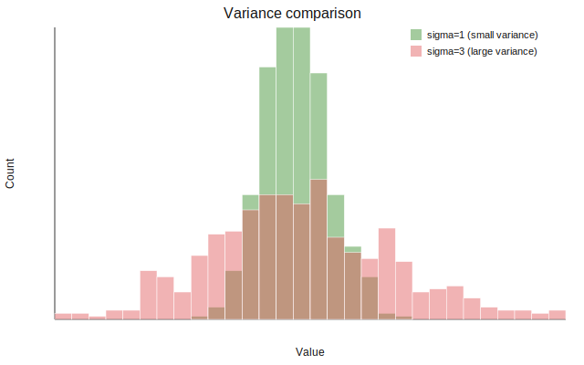

分散（variance）は、データの散らばり具合を表す指標。平均との差を二乗して[平均（算術平均）](../mean/)したもの。

- 母分散: `sigma2 = E[(X - mu)^2]`
- 標本分散: `s2 = sum((xi - x_bar)^2) / (n - 1)`

ここで `mu` と `x_bar` は[平均（算術平均）](../mean/)を表す。`X` は確率変数、`E[ ]` は期待値。

分散は「ばらつきの大きさ」を数値化するが、単位が元データの二乗になる点に注意。

### 前提・注意

* データは数値であることが前提
* 外れ値の影響を強く受ける
* 単位が二乗になる（元の単位のまま比較できないので、直感的な大きさは[標準偏差](../stddev/)で見る）

---

### 利点
* ばらつきを定量的に測れる
* 数学的に扱いやすい（加法性がある）
* [標準偏差](../stddev/)など他の指標の基盤になる

---

### 欠点
* 外れ値に弱い
* 単位が直感的でない

---

## Python での実例

以下は、[平均（算術平均）](../mean/)が同じで分散が異なる分布を比較する例。

```python
import numpy as np
import matplotlib.pyplot as plt

rng = np.random.default_rng(0)
values1 = rng.normal(loc=0.0, scale=1.0, size=500)
values2 = rng.normal(loc=0.0, scale=3.0, size=500)

plt.figure(figsize=(6, 4))
plt.hist(values1, bins=30, color="#59a14f", alpha=0.55, edgecolor="white", label="sigma=1")
plt.hist(values2, bins=30, color="#e15759", alpha=0.45, edgecolor="white", label="sigma=3")
plt.title("Variance comparison")
plt.xlabel("Value")
plt.ylabel("Count")
plt.legend()
plt.tight_layout()
plt.show()
```

出力:



---

### 数学での使いどころ

数学・統計では分散は以下で使われる。

* ばらつきの尺度（中心だけでなく広がりを見る）
* 分散の分解（全体 = 群内 + 群間）
* 共分散・相関の土台

分散は「平均との差の二乗の[平均（算術平均）](../mean/)」という形で、解析がしやすい。

---

### 機械学習での使いどころ

機械学習では分散は以下で頻出。

* 特徴量のスケール確認（分散が極端だと学習に影響）
* [PCA](../../ml/pca/)での主成分の重要度（分散が大きい方向を重視）
* 分散[正則化](../../ml/regularization/)（[過学習](../../ml/overfitting/)の抑制の一部として使う場合がある）

---

### 適さないケース

* 外れ値が多いデータ（ロバストな指標が必要）
* 単位をそのまま解釈したい場合（標準偏差のほうが直感的）
