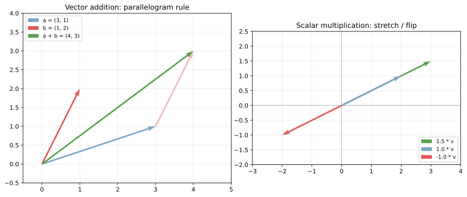
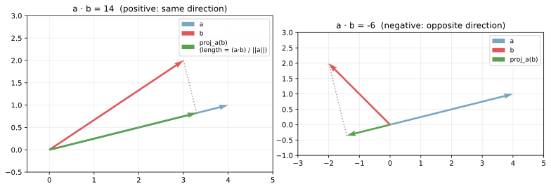
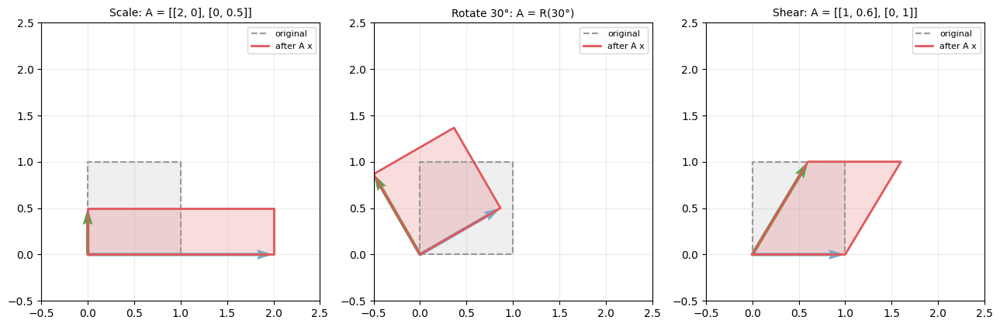
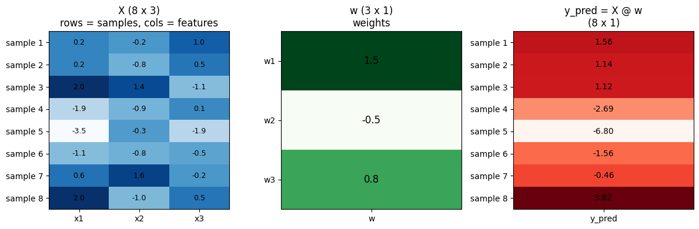

ベクトル（vector）は数を 1 列に並べたもの、行列（matrix）は数を 2 次元に並べたものである。機械学習では、データ 1 件を「特徴量ベクトル」、データ集合を「行列」、モデルの重みを「ベクトル」または「行列」で表すのが標準で、内積・行列積といった演算がほぼすべてのアルゴリズムの計算基盤になっている。

ここでは、(1) ベクトルの加算・スカラー倍、(2) 内積の代数と幾何の両面、(3) 行列の積と線形変換としての見方、(4) 機械学習で頻出する「データ行列 × 重みベクトル」のパターン、の 4 点を整理する。線形回帰・ロジスティック回帰・ニューラルネット・PCA・SVM、いずれも `X @ w` という形の行列ベクトル積が中核に座っている。

### ベクトル: 加算・スカラー倍

ベクトル `a = (a_1, a_2, ..., a_n)` と `b = (b_1, b_2, ..., b_n)` の加算は、要素ごとの和である。

`a + b = (a_1 + b_1, a_2 + b_2, ..., a_n + b_n)`

スカラー `k` 倍は全要素を `k` 倍する。

`k a = (k a_1, k a_2, ..., k a_n)`

幾何的には、加算は平行四辺形則に対応し、スカラー倍は同じ向きへの伸縮（`k < 0` なら向きの反転）を表す。

```python
import numpy as np
import matplotlib.pyplot as plt

a = np.array([3, 1])
b = np.array([1, 2])
c = a + b

fig, axes = plt.subplots(1, 2, figsize=(11, 5))
axes[0].quiver(0, 0, *a, angles="xy", scale_units="xy", scale=1, color="#7aa6c2")
axes[0].quiver(0, 0, *b, angles="xy", scale_units="xy", scale=1, color="#e15759")
axes[0].quiver(0, 0, *c, angles="xy", scale_units="xy", scale=1, color="#59a14f")
axes[0].set_title("Vector addition")

v = np.array([2, 1])
for k, color in [(1.5, "#59a14f"), (1.0, "#7aa6c2"), (-1.0, "#e15759")]:
    axes[1].quiver(0, 0, *(k * v), angles="xy", scale_units="xy", scale=1, color=color)
axes[1].set_title("Scalar multiplication")
plt.savefig("vector_basics.svg", bbox_inches="tight")
```



左の図では `a = (3, 1)`、`b = (1, 2)` の和が `a + b = (4, 3)` となり、`a` の終点から `b` を継ぎ足した位置に対角線として現れる。右の図ではスカラー倍が方向を保ったまま長さだけ変える操作で、負のスカラーで反対側に伸びる。

機械学習でベクトルが出てくる典型は次の 3 場面である。

- 特徴量ベクトル: 1 件のデータ `x = (x_1, ..., x_d)`。`d` 次元の点として扱う
- 重みベクトル: 線形モデルの係数 `w = (w_1, ..., w_d)`
- 勾配ベクトル: 損失関数のパラメータ偏微分を並べた `∇L`（[偏微分と勾配](../partial-derivative-gradient/) 参照）

---

### 内積（dot product / inner product）

ベクトル `a` と `b` の内積は、対応する要素の積を足し上げたスカラー値である。

`a · b = a_1 b_1 + a_2 b_2 + ... + a_n b_n = Σ_i a_i b_i`

代数的にはそれだけだが、幾何的には次の関係が成り立つ。

`a · b = ||a|| ||b|| cos(θ)`

ここで `||a||` は `a` の長さ（ノルム）、`θ` は 2 ベクトル間の角度である。この式から内積の符号で 2 ベクトルの方向関係が読み取れる。

- `a · b > 0`: 鋭角（同じ方向に近い）
- `a · b = 0`: 直交（90°）
- `a · b < 0`: 鈍角（反対方向に近い）

```python
fig, axes = plt.subplots(1, 2, figsize=(11, 5))
a = np.array([4, 1])
b = np.array([3, 2])
axes[0].quiver(0, 0, *a, angles="xy", scale_units="xy", scale=1, color="#7aa6c2")
axes[0].quiver(0, 0, *b, angles="xy", scale_units="xy", scale=1, color="#e15759")
axes[0].set_title(f"a · b = {a @ b}  (positive, acute)")

b = np.array([-2, 2])
axes[1].quiver(0, 0, *a, angles="xy", scale_units="xy", scale=1, color="#7aa6c2")
axes[1].quiver(0, 0, *b, angles="xy", scale_units="xy", scale=1, color="#e15759")
axes[1].set_title(f"a · b = {a @ b}  (negative, obtuse)")
plt.savefig("dot_product_projection.svg", bbox_inches="tight")
```



左は鋭角の例で `a · b = 14 > 0`、右は鈍角の例で `a · b = -6 < 0` となる。緑の矢印は `b` を `a` の方向に射影した成分で、内積はこの射影の長さに `||a||` を掛けたもの、と読める。

機械学習では「線形和」がほぼすべて内積として書ける。

- 線形回帰の予測: `y_pred = w · x + b`（特徴量ベクトル `x` と重みベクトル `w` の内積）
- ロジスティック回帰の log-odds: `z = w · x + b`、確率はシグモイドで `p = 1 / (1 + exp(-z))`
- コサイン類似度: `cos(θ) = (a · b) / (||a|| ||b||)`。レコメンド・文書類似度の基本指標
- ニューラルネットの 1 ニューロン: `h = activation(w · x + b)`

---

### 行列積（matrix product）

行列 `A`（`m × k` サイズ）と `B`（`k × n` サイズ）の積 `C = A B` は `m × n` の行列で、要素 `C_{ij}` は「`A` の `i` 行」と「`B` の `j` 列」の内積で定義される。

`C_{ij} = Σ_l A_{il} B_{lj}`

形状の制約として、`A` の列数と `B` の行数が一致しなければ積は定義されない。`(m × k) (k × n) → (m × n)` の形を覚えておくと事故が減る。

性質として重要なのは、結合則は成り立つ（`(AB)C = A(BC)`）が交換則は成り立たない（一般に `AB ≠ BA`）こと。順序を変えると意味が変わる、というのは線形変換の合成として見ると当然で、「先に回転してから拡大」と「先に拡大してから回転」が違うのと同じ理屈である。

線形変換としての見方を 1 つ持っておくと行列の理解が深まる。`A` を「ベクトル `x` を `Ax` に写す関数」とみなすと、`A` は空間全体の伸縮・回転・剪断（せん断）を表す変換になる。

```python
square = np.array([[0, 0], [1, 0], [1, 1], [0, 1], [0, 0]]).T
matrices = [
    ("Scale", np.array([[2, 0], [0, 0.5]])),
    ("Rotate 30°", np.array([[np.cos(np.pi/6), -np.sin(np.pi/6)],
                              [np.sin(np.pi/6),  np.cos(np.pi/6)]])),
    ("Shear", np.array([[1, 0.6], [0, 1]])),
]
fig, axes = plt.subplots(1, 3, figsize=(13, 4.5))
for ax, (title, A) in zip(axes, matrices):
    transformed = A @ square
    ax.fill(square[0], square[1], color="#999999", alpha=0.15)
    ax.fill(transformed[0], transformed[1], color="#e15759", alpha=0.2)
plt.savefig("matrix_transformations.png", bbox_inches="tight")
```



灰色の正方形が元の単位正方形 `[0,1]^2`、赤色がその上に `A x` を適用した変換後の図形である。スケーリング（左）は軸方向の伸縮、回転（中央）は形を保ったまま角度だけ変える操作、剪断（右）は片側に滑らせる変形となる。任意の線形変換は、伸縮・回転・剪断の合成として理解できる、というのが [固有値分解](../eigen-decomposition/) や特異値分解（SVD）が浮かび上がってくる素地である。

---

### 機械学習で頻出する形: X w

教師あり学習では、`n` 個のデータと `d` 個の特徴量を「データ行列 `X`（`n × d`）」、重みを「ベクトル `w`（`d × 1`）」で表し、全サンプルの予測を 1 行の式で書く。

`y_pred = X w` （`(n × d) (d × 1) = n × 1`）

各行のサンプル `i` についての予測 `y_pred_i = x_i · w` を `n` 個まとめて行列ベクトル積で表現したものに過ぎないが、numpy / pytorch などのライブラリでは for ループを書かずに 1 行で済む（BLAS で並列化される）ため、計算速度が桁違いになる。

```python
rng = np.random.default_rng(0)
n, d = 8, 3
X = np.round(rng.standard_normal((n, d)) * 1.5, 1)
w = np.array([1.5, -0.5, 0.8])
y = np.round(X @ w + rng.normal(0, 0.4, n), 2)

# 形状の可視化は scripts 側を参照
plt.savefig("matrix_regression_layout.png", bbox_inches="tight")
```



左から「データ行列 `X`（縦に並ぶ各行が 1 サンプル、横に並ぶ列が特徴量）」「重みベクトル `w`（特徴量ぶんの長さ）」「予測 `y_pred = X w`（サンプルぶんの長さ）」と並べた図である。`X` の各行と `w` の内積が `y_pred` の対応する要素となる。

この `X w` パターンは線形回帰だけのものではなく、機械学習の中核に何度も現れる。

- 線形回帰: `y_pred = X w + b`
- ロジスティック回帰: `p = sigmoid(X w + b)`
- ニューラルネットの 1 層: `h = activation(X W + b)`（`W` は `d × h` の重み行列）
- 主成分分析: 入力 `X` を主成分の方向に射影 `Z = X V`
- カーネル法: 内積を一般化したカーネル `K(x_i, x_j)` の行列を構築

実装上のコツとして、numpy では `X @ w` または `np.dot(X, w)` で行列ベクトル積を書く。要素ごとの積（アダマール積）`X * w` と取り違えると static エラーで気づくとは限らないので、形状の確認は `X.shape` で都度行うのが安全である。

---

### ノルム（vector の長さ）

ベクトルの「長さ」を測る関数をノルム（norm）と呼ぶ。代表的なのは次の 3 つで、機械学習では使い分けが効いてくる。

- L2 ノルム（ユークリッド距離）: `||x||_2 = sqrt(Σ_i x_i^2)`。最も標準的な距離
- L1 ノルム（マンハッタン距離）: `||x||_1 = Σ_i |x_i|`。座標軸方向の移動の総和
- L∞ ノルム（最大ノルム）: `||x||_∞ = max_i |x_i|`。最大の絶対値成分

[正則化](../../ml/regularization/) では L2 を 2 乗した `||w||_2^2`（Ridge）と L1 ノルム `||w||_1`（Lasso）が罰則項として用いられ、L1 は重みを 0 に寄せる（疎な解を作る）性質、L2 は重み全体を均等に小さくする性質を持つ。

### 数学での使いどころ

- 線形方程式系 `A x = b` の解法（逆行列・LU 分解・QR 分解）
- [固有値分解](../eigen-decomposition/) や特異値分解（SVD）の基盤
- 線形変換の合成（回転・拡大・射影の組み合わせ）
- ベクトル空間・部分空間・直交補空間の議論
- 2 次形式 `x^T A x`（ガウス分布の指数部、最小二乗法、SVM の双対表現）

---

### 機械学習での使いどころ

- ほぼすべての線形モデル（[線形回帰](../../ml/linear-regression/)、[ロジスティック回帰](../../ml/logistic-regression/)、SVM）
- ニューラルネットの順伝播・逆伝播（行列積の連鎖で順方向の計算と勾配を表現）
- [PCA](../../ml/pca/) と関連する次元削減（共分散行列の固有値分解）
- 距離・類似度ベースの手法（[kNN](../../ml/knn/)、k-means、コサイン類似度）
- 推薦システムの行列因子分解（user × item 行列を 2 つの低ランク行列の積で近似）
- アテンション機構（クエリ・キー・バリュー行列の積で重み付き和を計算）

---

### 適さないケース / 落とし穴

- 大規模疎行列での密行列演算: 行列の大半が 0 のとき密行列として扱うと無駄が大きい。`scipy.sparse` のような疎行列専用の構造を使う
- 数値的に不安定な逆行列: `(X^T X)` が悪条件のとき `(X^T X)^-1` を直接計算すると誤差が膨らむ。QR 分解や SVD で擬似逆行列を使うのが筋がよい
- 形状の不一致: `(n × d) @ (d × 1)` を意図したつもりが `(d × n) @ (d × 1)` になっていた、というのは典型的なバグ。`np.einsum` や形状アサーションで防御するのが安全
- 内積を要素積と混同する: numpy の `*` は要素ごとの積（アダマール積）、`@` または `np.dot` が行列積。Python では演算子で区別される
- 行列積の交換則を仮定する: `AB ≠ BA` が原則。`AB = BA` が成り立つのは特殊なケース（対角行列同士など）に限られる
