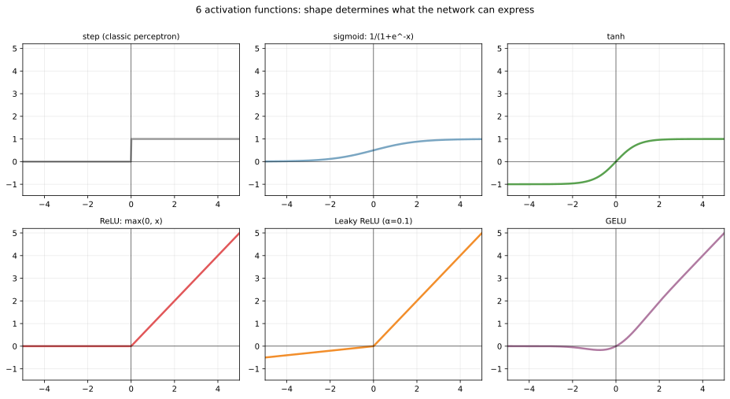
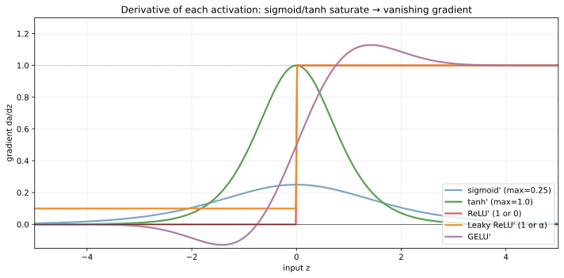
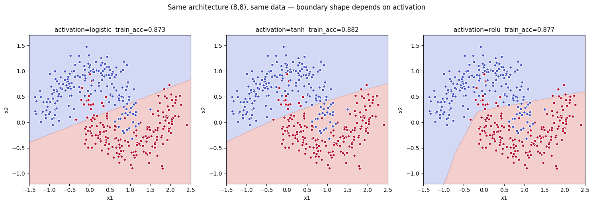
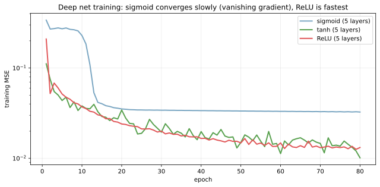
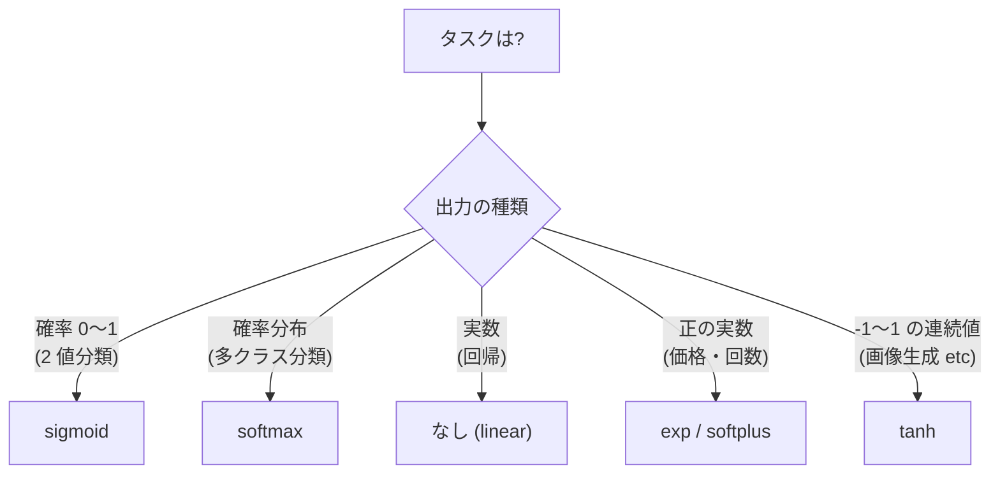

活性化関数（activation function）は、ニューラルネットの各ニューロンで「線形和の結果 `z = w · x + b` を非線形に変換する関数」のことである。これがあるからこそ複数層を積む意味が生まれ、ニューラルネットが任意の非線形関数を近似できるようになる。

線形変換だけを何層積んでも、合成は結局 1 つの線形変換に潰れる（`A_2 (A_1 x) = (A_2 A_1) x`）。深さに意味を持たせるためには、層と層の間に「非線形」を入れる必要がある。その非線形を担うのが活性化関数で、選び方が学習の速さ・最終精度・[勾配消失](#勾配消失問題と-relu-の登場) の起きにくさを大きく左右する。

[パーセプトロン](../perceptron/) の step function を皮切りに、sigmoid → tanh → ReLU → GELU と歴史的に進化してきた経緯がある。現代の深層学習では ReLU 系（ReLU、Leaky ReLU、GELU、Swish）が標準で、sigmoid・tanh は出力層や特殊用途に限定されている。

### 代表的な活性化関数の形

6 つの主要な活性化関数の入力 → 出力の対応を並べる。

```python
import numpy as np
import matplotlib.pyplot as plt

x = np.linspace(-5, 5, 400)
sigmoid = 1 / (1 + np.exp(-x))
tanh = np.tanh(x)
relu = np.maximum(0, x)
leaky_relu = np.where(x > 0, x, 0.1 * x)
gelu = 0.5 * x * (1 + np.tanh(np.sqrt(2/np.pi) * (x + 0.044715 * x ** 3)))
step = np.where(x > 0, 1, 0).astype(float)
# 描画は scripts 側を参照
plt.savefig("activations_shapes.svg", bbox_inches="tight")
```



| 関数 | 値域 | 滑らかさ | 計算量 | 主な用途 |
|---|---|---|---|---|
| step | `{0, 1}` | 不連続 | 最軽 | 古典 [パーセプトロン](../perceptron/) のみ |
| sigmoid | `(0, 1)` | 滑らか | 重 (exp) | 2 値分類の出力層、ゲート（LSTM, GRU） |
| tanh | `(-1, 1)` | 滑らか | 重 (exp) | 隠れ層（RNN で稀に） |
| ReLU | `[0, ∞)` | 0 で折れ目 | 最軽 (比較) | 隠れ層の標準 |
| Leaky ReLU | `(-∞, ∞)` | 0 で折れ目 | 最軽 | ReLU の「dead neuron」対策 |
| GELU | `(-∞, ∞)` | 滑らか | 重 (tanh) | Transformer の標準 |

数式:

- `sigmoid(z) = 1 / (1 + exp(-z))`
- `tanh(z) = (exp(z) - exp(-z)) / (exp(z) + exp(-z))`
- `ReLU(z) = max(0, z)`
- `LeakyReLU(z) = z if z > 0 else α z` (typical α = 0.01 or 0.1)
- `GELU(z) ≈ 0.5 z (1 + tanh(√(2/π) (z + 0.044715 z³)))`

---

### 勾配消失問題と ReLU の登場

活性化関数を選ぶうえで最も重要なのが「勾配（derivative）の振る舞い」である。[誤差逆伝播法](../backpropagation/) で勾配が層を伝わる際、各層の活性化関数の微分が掛け合わされる。この値が `< 1` の領域では、層を伝わるたびに勾配が指数的に小さくなる（vanishing gradient）。

```python
sigmoid_grad = sigmoid * (1 - sigmoid)        # max = 0.25 at z=0
tanh_grad = 1 - tanh ** 2                      # max = 1.0 at z=0
relu_grad = np.where(x > 0, 1, 0)              # 1 or 0
plt.savefig("activations_gradients.svg", bbox_inches="tight")
```



- sigmoid の勾配は `z = 0` で最大 0.25、`|z| > 3` でほぼ 0。10 層積むと勾配が `0.25^10 ≈ 10^-6` まで縮む
- tanh は `z = 0` で 1 と高いが、`|z| > 2` で急速に飽和し、深いネットでは同様に勾配が消える
- ReLU は正領域で常に 1。何層積んでも正領域なら勾配が衰えない

これが「2010 年代に深層学習がブレイクした主因の 1 つ」と言われる ReLU の貢献である。LeCun・Bengio・Hinton らの研究で、ReLU が深いネットの学習を可能にしたことが Nobel-level の発見として認知された（実際に 2024 年 Nobel 物理学賞）。

ReLU にも弱点はあり、`z < 0` で勾配がちょうど 0 になるため、一度負側に振れたニューロンが学習しなくなる「dead ReLU」現象が起きる。これを救うために Leaky ReLU（負側にも小さい勾配 α を残す）、ELU、Swish、GELU などの改良版が次々に提案された。

---

### 同じ NN・違う活性化関数での決定境界

同じアーキテクチャ（隠れ層 8-8）・同じデータでも、活性化関数で決定境界の形が変わる。

```python
from sklearn.datasets import make_moons
from sklearn.neural_network import MLPClassifier

X, y = make_moons(n_samples=400, noise=0.2, random_state=0)
for act in ["logistic", "tanh", "relu"]:
    mlp = MLPClassifier(hidden_layer_sizes=(8, 8), activation=act,
                        max_iter=3000, random_state=0).fit(X, y)
plt.savefig("activations_decision_boundary.png", bbox_inches="tight")
```



- sigmoid（左）: 境界がやや滑らかすぎる傾向。深い NN では学習が遅い
- tanh（中央）: sigmoid より急峻で当てはまりが改善
- ReLU（右）: 折り目のある「piecewise linear」な境界。表現力が高く、学習も速い

ReLU の境界が「直線の組み合わせ」になっているのは、ReLU 自身が piecewise linear だからである。複数の ReLU を組み合わせると、結果も piecewise linear な関数になり、これが [決定木](../decision-tree/) の階段状境界に近い表現を持つ。

---

### 学習速度の比較

5 層の MLP を sigmoid / tanh / ReLU で訓練し、収束速度を比べる。

```python
from sklearn.neural_network import MLPRegressor

def train_curve(activation, n_epochs=80):
    mlp = MLPRegressor(hidden_layer_sizes=(16, 16, 16, 16, 16),
                       activation=activation, solver="adam",
                       max_iter=1, warm_start=True, random_state=0)
    losses = []
    for _ in range(n_epochs):
        mlp.fit(X_data, y_data)
        losses.append(mlp.loss_)
    return losses
plt.savefig("activations_training_curves.svg", bbox_inches="tight")
```



縦軸が log スケールの MSE 損失。

- ReLU（赤）: 数 epoch で大きく loss が下がり、80 epoch までに最低まで到達
- tanh（緑）: ReLU よりやや遅いが収束はする
- sigmoid（青）: 勾配消失で学習が極端に遅く、80 epoch でも他の 2 つの半分にしかならない

「5 層程度でこの差」というのが重要で、ResNet のような 100 層を超えるネットワークでは sigmoid は実質的に学習不可能となる。逆に言うと「ReLU 以前は 2-3 層が限界だった」のが「ReLU 以降は 100+ 層でも普通に学習できる」ようになった、というのが深層学習の歴史的転換点となる。

---

### 出力層の活性化関数

隠れ層では基本 ReLU 系を使うが、出力層は「タスクに応じた関数」を使い分ける。



| タスク | 出力活性化 | 損失関数 |
|---|---|---|
| 2 値分類 | sigmoid | binary cross-entropy |
| 多クラス分類 | softmax | categorical cross-entropy |
| 回帰 | linear（なし） | MSE / MAE |
| 正の連続値 | exp / softplus | log-likelihood of Poisson 等 |
| ピクセル値生成 | tanh / sigmoid | MSE / cross-entropy |

これらは [損失関数](../loss-functions/) の選び方とセットで決まる。sigmoid + binary cross-entropy、softmax + categorical cross-entropy は数値的に安定な実装が標準で、フレームワークでは `BCEWithLogitsLoss` や `CrossEntropyLoss` が「activation + loss」を内部で融合してくれる。

### 数学での使いどころ

- 非線形変換と万能近似性: 1 隠れ層 + 非線形活性化で任意の連続関数を近似（普遍近似定理）
- 連鎖律と勾配計算: [偏微分と勾配](../../math/partial-derivative-gradient/)・[誤差逆伝播法](../backpropagation/) の核心
- フーリエ近似と ReLU: ReLU の組み合わせが基底関数として機能する
- 凸性とニューラルネット: ReLU は凸でも凹でもないが piecewise linear、これが計算の容易さに繋がる
- 確率分布の出力: sigmoid / softmax は確率モデルの自然なリンク関数

---

### 機械学習での使いどころ

- 隠れ層のデフォルト: ReLU（数 GB 規模のモデルまで）、GELU（Transformer 系の標準）、Swish
- 2 値分類の出力層: sigmoid + BCE 損失
- 多クラス分類の出力層: softmax + CE 損失
- 回帰の出力層: なし（linear）+ MSE / MAE
- LSTM / GRU のゲート: sigmoid（0〜1 を「開ける/閉める」割合として）
- 自然言語処理 (Transformer): GELU が事実上の標準（BERT、GPT 等で採用）
- 画像生成 (GAN, Diffusion): tanh（出力を -1〜1 に正規化する場合）
- 強化学習のポリシー: softmax（離散行動）または tanh（連続行動）

ReLU の問題（dead neuron）が顕在化したケースでは、Leaky ReLU、ELU、Swish、GELU を試す。最新の Transformer 系では GELU が定着しているが、ReLU で十分なケースも多いと考えられる。

---

### 適さないケース / 落とし穴

- sigmoid を深い隠れ層に: 勾配消失で学習が止まる。ReLU 系に切り替える
- ReLU の dead neuron: 一度負側に振れたニューロンが永遠に学習しない。He 初期化、学習率調整、Leaky ReLU で対処
- 出力層に ReLU: 値域が `[0, ∞)` なので、負の値が必要な回帰では出力が制限される
- 確率出力に linear: `predict_proba` の結果が `[0, 1]` の範囲外になる。sigmoid / softmax を必ず付ける
- softmax で 1 つだけ高い logit: 他クラスの確率がほぼ 0 になり、勾配が消える。温度パラメータ（temperature scaling）で和らげる
- tanh と sigmoid を混ぜすぎる: 1 つのアーキで一貫して 1 種類使うほうが debug しやすい
- 活性化関数を入れ忘れる: 線形層を重ねただけになり、深さの意味が無くなる。多層なのに精度が単層と変わらないなら疑う
- batch normalization と ReLU の順番: BN → ReLU が標準だが、ReLU → BN を試している論文もある。フレームワーク既定に従うのが無難
- 古典的なネットワーク（pre-2010）の文献を読んで sigmoid を使う: 当時の常識で、現代では非標準。論文を読むときは年代を意識する
- 「ReLU が全てを解決する」と思う: dead neuron、出力が非対称（常に >= 0）など独自の問題もある。タスクごとに最適は変わる
- 勾配消失と勾配爆発を混同: 勾配消失は活性化関数の選択で対処、勾配爆発は gradient clipping + 重みの初期化 + 正則化で対処、と原因と対処が違う
