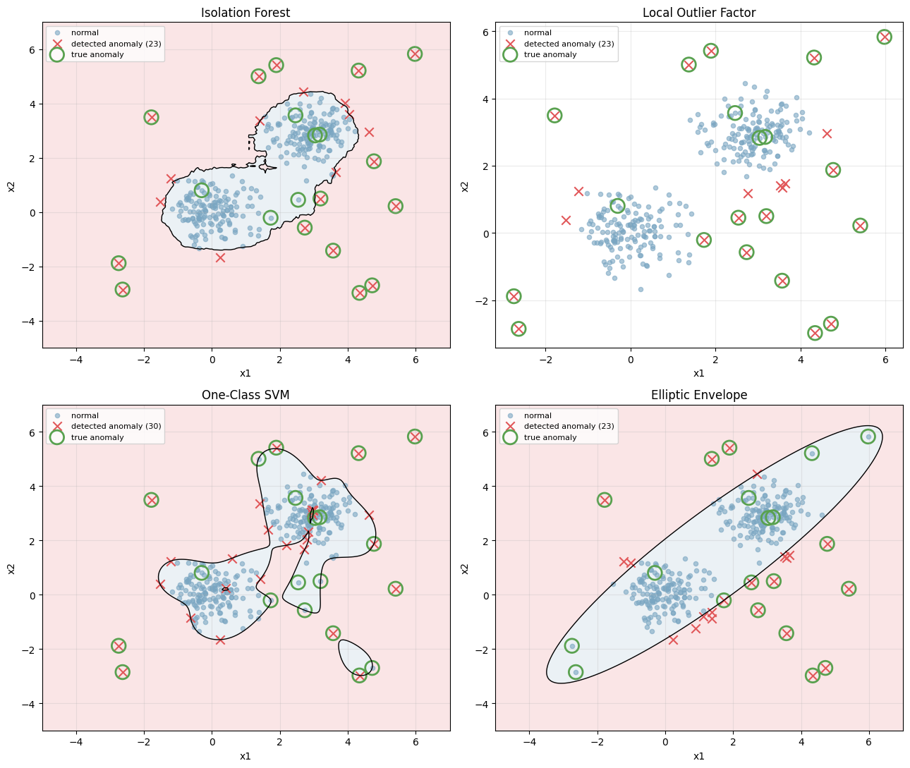
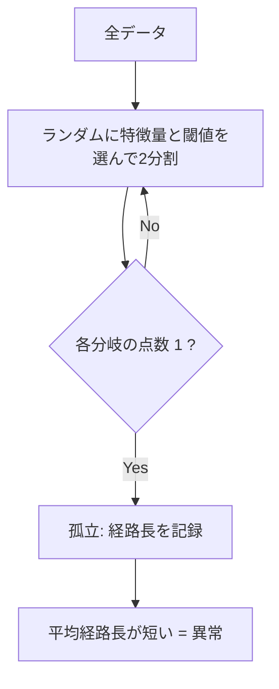
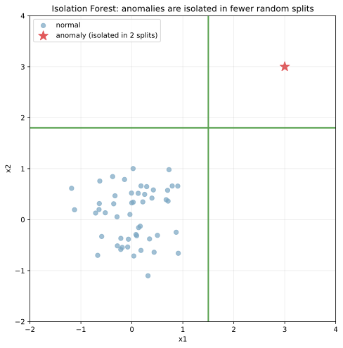
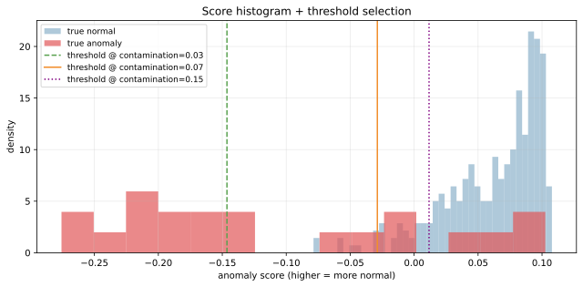
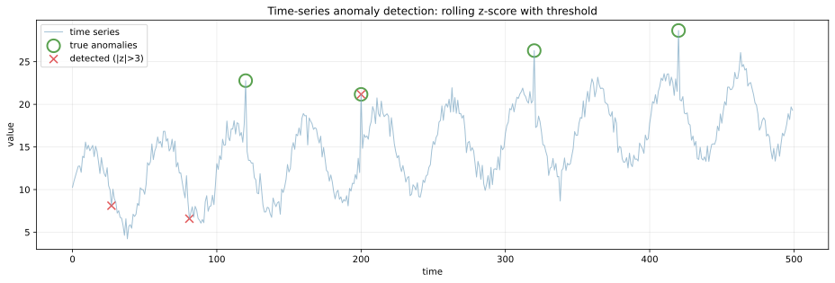

異常検知（anomaly detection, outlier detection）は、「正常データから外れた点」を検出する教師なし学習の一系統である。不正検知、故障予測、ネットワーク侵入検知、品質管理、医療診断など、「興味のあるクラスのサンプルが極端に少ない / 事前にラベルが取れない」場面で使われる。

[クラス不均衡](../class-imbalance/) の極端なケースとも見なせるが、不均衡分類は「正例と負例の両方にラベルがある」状況、異常検知は「正常データだけ（または僅かな異常ラベル）から学ぶ」状況、という違いがある。代表的なアルゴリズムは 4 つで、データの形状と分布の前提によって使い分ける。

### 4 つの代表アルゴリズム

| 手法 | 仕組み | 強み | 弱み |
|---|---|---|---|
| Isolation Forest | ランダム分割木で「孤立しやすい点」を異常とする | 高次元 OK、計算速い、解釈しやすい | パラメータ contamination 要設定 |
| Local Outlier Factor (LOF) | 局所密度に対する逸脱度 | 密度の異なるクラスタ混在に強い | 計算重い、新規データに使いにくい |
| One-Class SVM | 正常データを囲む境界を学習 | 高次元 + 非線形カーネル | スケール感度高、調整重い |
| Elliptic Envelope | 正常データを多変量正規分布で fit | シンプル、理論的 | 正規分布前提、外れ値に弱い |

```python
from sklearn.ensemble import IsolationForest
from sklearn.neighbors import LocalOutlierFactor
from sklearn.svm import OneClassSVM
from sklearn.covariance import EllipticEnvelope

algorithms = {
    "Isolation Forest": IsolationForest(contamination=0.07, random_state=0),
    "LOF": LocalOutlierFactor(n_neighbors=20, contamination=0.07),
    "One-Class SVM": OneClassSVM(nu=0.07, kernel="rbf", gamma=0.5),
    "Elliptic Envelope": EllipticEnvelope(contamination=0.07, random_state=0),
}
for name, clf in algorithms.items():
    if isinstance(clf, LocalOutlierFactor):
        pred = clf.fit_predict(X)
    else:
        pred = clf.fit(X).predict(X)
plt.savefig("anomaly_methods_compare.png", bbox_inches="tight")
```



正常クラスタが 2 つ + 散在する真の異常点（緑の枠）で 4 アルゴリズムを比較。

- Isolation Forest: 境界が「軸に平行な階段状」（決定木ベースなので）
- LOF: 「境界線」なし。点ごとに異常判定（プロットには色付き領域は出せない）
- One-Class SVM: 非線形な滑らかな境界（RBF カーネル）
- Elliptic Envelope: 楕円形の境界（多変量正規分布の等密度面）

それぞれが微妙に違う異常を検出する。実用では「データの形」「外れ値の性質」「計算コスト」のトレードオフで選ぶ。

---

### Isolation Forest: 「孤立しやすい点」が異常

Isolation Forest（iForest）は最も実用的な異常検知アルゴリズムの 1 つ。アイデアは「データを再帰的にランダムに分割して、何ステップで点を孤立させられるか」を測ること。



直感: 異常点は他の点から離れているので、ランダムな分割でも少数ステップで「単独」になりやすい。逆に正常点は密集地帯にいるので、何度も分割しないと孤立しない。



赤い星（異常点）は緑線 2 本の分割だけで他の点と分離される。青い正常点を 1 つだけ取り出すには、はるかに多くの分割が必要。これを多数の木で平均化して anomaly score を計算する。

iForest の長所:

- 計算量が線形 `O(n log n)` で大規模データに強い
- 高次元データでも比較的安定
- 解釈しやすい（木構造）
- 学習データに異常が含まれていてもロバスト

### しきい値の選び方

`contamination` パラメータ（異常の予測比率）は重要な hyperparameter。

```python
clf = IsolationForest(contamination="auto").fit(X)
scores = clf.decision_function(X)  # 高い = 正常
for contam in [0.03, 0.07, 0.15]:
    thr = np.percentile(scores, contam * 100)
plt.savefig("anomaly_threshold_tuning.svg", bbox_inches="tight")
```



正常データ（青）と異常データ（赤）のスコア分布が描かれ、3 つの異なる contamination でのしきい値が縦線で示されている。

- `contamination = 0.03`: しきい値が厳しい → 誤検知少だが見逃しが増える
- `contamination = 0.07`: バランスの良い設定
- `contamination = 0.15`: しきい値が緩い → 異常を捕まえやすいが誤検知も増える

業務上のコスト（誤検知 vs 見逃し）に応じて選ぶ。`contamination="auto"` でアルゴリズムが自動推定もできるが、ドメイン知識で `0.01〜0.10` 程度の範囲から選ぶのが標準。

---

### 時系列の異常検知

時系列特化の異常検知では、シンプルな rolling z-score がよく使われる。

```python
window = 30
roll_mean = pd.Series(y).rolling(window).mean()
roll_std = pd.Series(y).rolling(window).std()
z = (y - roll_mean) / (roll_std + 1e-6)
anomalies = np.abs(z) > 3
plt.savefig("anomaly_time_series.svg", bbox_inches="tight")
```



過去 30 ステップの平均と標準偏差を計算し、現在値が `|z| > 3` を超えたら異常と判定。緑の枠が真の異常、赤い × が検出された点で、4 つの真の異常のうち 4 つを検出している。

時系列専用の手法は他にも:

- ARIMA + 残差検定（[時系列予測](../time-series-forecasting/) 参照）
- 周期性を考慮した STL 分解 + 残差検定
- LSTM autoencoder の再構成誤差
- Matrix Profile（NLP の手法を借りた変則的アプローチ）
- Spectral residual（Microsoft Azure Anomaly Detector）

### 数学での使いどころ

- ロバスト統計の breakdown point（[中央値](../../math/median/) 参照）
- Mahalanobis distance（Elliptic Envelope の基盤）
- カーネル密度推定（[KDE](../../math/kde/)）と異常検知
- 情報理論的アプローチ: KL ダイバージェンスで分布変化を検出
- 確率モデル: Gaussian Mixture Model で「低尤度の点」を異常とする
- 統計検定: Grubbs 検定、Tukey の IQR ルール ([四分位点](../../math/quantile/) 参照)

---

### 機械学習での使いどころ

- 不正検知: クレジットカード、ログイン、不正出金
- 故障予測: 製造業の設備異常検知
- ネットワーク侵入検知: トラフィックパターンの逸脱
- 品質管理: 生産ラインの欠陥検出
- 医療診断: 心電図の異常パターン、レントゲン画像の異常
- IoT センサーの異常値検知
- ログ監視（DevOps）: エラーパターンの自動検出
- 推薦システムの異常購買検知
- 監視カメラ映像の異常行動検出
- 金融市場の異常取引検知
- データ品質チェック: 入力データ自体の異常を発見
- A/B test 中の異常値除去（[時系列予測](../time-series-forecasting/) の前処理）

scikit-learn では `sklearn.ensemble.IsolationForest`、`sklearn.neighbors.LocalOutlierFactor`、`sklearn.svm.OneClassSVM`、`sklearn.covariance.EllipticEnvelope` が標準。深層学習系は `pyod`（Python Outlier Detection、20+ アルゴリズム）、`anomalib`（画像特化）、`tsod`（時系列特化）。

---

### 適さないケース / 落とし穴

- 異常の定義が不明確: 「何が異常か」をビジネス側と擦り合わせないと、技術的に検出しても価値がない
- 教師あり問題を異常検知で解こうとする: ラベルがあるなら [class-imbalance](../class-imbalance/) の不均衡分類の方が精度が出ることが多い
- contamination を当てずっぽうで決める: ドメイン知識または PR 曲線で根拠を持って選ぶ
- スケールが揃っていない: 距離ベース手法（LOF、One-Class SVM、Elliptic）が崩れる。[標準化](../standardization/) を必ず先に
- 高次元データで Elliptic Envelope: 共分散行列の推定が困難に。Isolation Forest や LOF へ
- 学習データの異常を放置: 異常を含むデータで学習すると境界が歪む。最初の数イテレーションで除外する 2 段階アプローチが有効
- 異常検知の評価指標: accuracy は不均衡で意味なし。Precision @ k、ROC-AUC、PR-AUC を使う
- 時系列で過去の異常パターンが未来と違う: 攻撃や故障モードは進化する。定期的な再学習が必要
- 「異常を検出しても処理しない」運用: 検出後のアクション（人手レビュー、自動ブロック）まで含めて設計する
- アラート疲労: 異常を出しすぎると現場が無視するようになる。閾値調整 + Precision の確保
- 季節性・トレンドを考慮しない: 時系列データでは「いつもの周期パターン」を異常と誤検出する。先に [時系列分解](../time-series-forecasting/)
- One-Class SVM の gamma 調整: 大きすぎると過学習、小さすぎると検出力なし。クロスバリデーションが効きにくい教師なしなので、可視化で判定
- 「異常」と「データ収集の問題」を混同: NULL の混入、欠損 (../missing-values/)、計測ノイズは異常検知ではなくデータ品質チェックの対象
