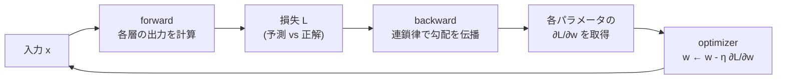
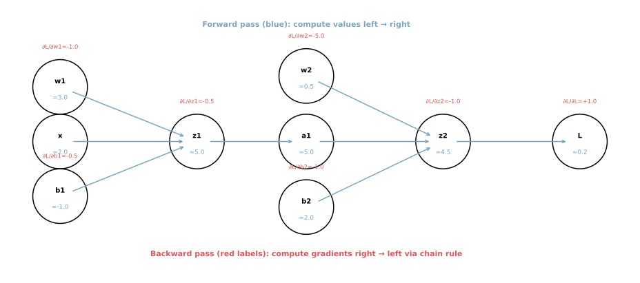
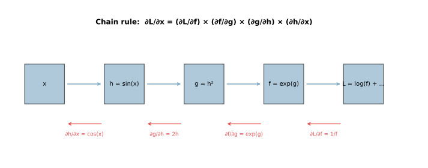
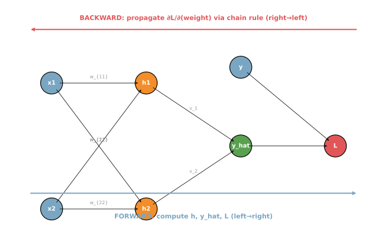
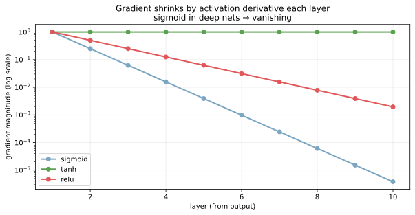

誤差逆伝播法（backpropagation, backprop）は、ニューラルネットの全パラメータについて損失の勾配を効率的に計算するアルゴリズムである。中身は [偏微分と勾配](../../math/partial-derivative-gradient/) のノートで触れた「連鎖律（chain rule）」を、計算グラフに対して系統的に適用したものに過ぎない。だが「あらゆる深さ・幅のネットワークで全パラメータの勾配を `O(forward の計算量)` で取れる」という効率性が革命的で、これが現代の深層学習を可能にした基盤技術となる。

backprop 自体は学習則ではなく、`勾配を計算するだけ` の手続き。求めた勾配を [最急降下法・SGD](../../math/gradient-descent-sgd/) や Adam に渡してパラメータを更新する、という分業構造になっている。`forward → loss → backward → optimizer.step()` の 1 セットが深層学習の学習ループそのものとなる。

### 全体像: forward と backward の対



forward と backward は逆方向に走り、forward で計算した中間値（activations）を backward で使うため、メモリは forward の中間値全部を保持する必要がある。「深いネット = 大量メモリ」と言われるのは、この backward 用の中間値保持が主因。

---

### 最小例で手計算

2 層 NN を 1 サンプルで動かして、forward と backward を全部書き下す。

ネットワーク:

`z_1 = w_1 x + b_1`
`a_1 = ReLU(z_1)`
`z_2 = w_2 a_1 + b_2`
`L = (z_2 - y)^2`

数値: `x=2, w_1=3, b_1=-1, w_2=0.5, b_2=2, y=5`

```python
# Forward
x, w1, b1, w2, b2, y = 2.0, 3.0, -1.0, 0.5, 2.0, 5.0
z1 = w1 * x + b1            # 5
a1 = max(0, z1)              # 5 (ReLU)
z2 = w2 * a1 + b2            # 4.5
L = (z2 - y) ** 2            # 0.25

# Backward (chain rule)
dL_dz2 = 2 * (z2 - y)        # -1
dL_dw2 = dL_dz2 * a1          # -5
dL_db2 = dL_dz2 * 1           # -1
dL_da1 = dL_dz2 * w2          # -0.5
dL_dz1 = dL_da1 * (1 if z1 > 0 else 0)  # -0.5
dL_dw1 = dL_dz1 * x           # -1
dL_db1 = dL_dz1 * 1           # -0.5

print(f"L = {L}")
print(f"∂L/∂w1 = {dL_dw1}, ∂L/∂b1 = {dL_db1}")
print(f"∂L/∂w2 = {dL_dw2}, ∂L/∂b2 = {dL_db2}")
```

出力:

```text
L = 0.25
∂L/∂w1 = -1.0, ∂L/∂b1 = -0.5
∂L/∂w2 = -5.0, ∂L/∂b2 = -1.0
```



青い矢印が forward、各ノードに「値」と「勾配 `∂L/∂node`」が並ぶ。forward を 1 回回せば、backward で各パラメータの勾配が「右から左」に向かって連鎖律で計算できる。重要なのは「同じノードを通る勾配は再利用される」点で、これが backprop の計算効率の源泉となる。

---

### 連鎖律の本質

`L = f(g(h(x)))` のような合成関数の微分は、

`dL/dx = (dL/df) × (df/dg) × (dg/dh) × (dh/dx)`

と「各段階の微分の積」になる。これが連鎖律で、深いネットでは「層数 ぶんの微分の積」を計算することに対応する。



青の forward 矢印が「値の計算」、赤の backward 矢印が「勾配の伝播」。一見複雑だが、各段階で必要なのは「直前のノードの値」と「そのノードの微分」だけなので、深さ N に対して N 回の掛け算で全勾配が取れる。

これを「自分で頭で式変形しなくていい」のが backprop の最大の発明である。連鎖律自体は Newton の時代からあるが、それを「グラフ上で機械的に適用するアルゴリズム」として定式化したのが Rumelhart, Hinton, Williams（1986）の論文で、これが深層学習のスタート地点となった。

---

### 計算グラフとしての見方

複雑な NN を「計算グラフ（computational graph）」として捉えると、backward の方向が「グラフを逆向きに辿る」だけになる。



各ノードは「演算」、エッジは「データの流れ」を表す。forward では入力から損失まで値を計算して保持し、backward では損失から始めて各ノードの勾配を上流に伝播していく。PyTorch / TensorFlow / JAX といったフレームワークは、内部でこの計算グラフを自動構築し、`loss.backward()` 1 行で全勾配を取得できる仕組み（automatic differentiation, autograd）を提供している。

```python
# PyTorch での例
import torch

x = torch.tensor(2.0, requires_grad=True)
w1 = torch.tensor(3.0, requires_grad=True)
b1 = torch.tensor(-1.0, requires_grad=True)
w2 = torch.tensor(0.5, requires_grad=True)
b2 = torch.tensor(2.0, requires_grad=True)
y = torch.tensor(5.0)

z1 = w1 * x + b1
a1 = torch.relu(z1)
z2 = w2 * a1 + b2
L = (z2 - y) ** 2

L.backward()  # 自動で全パラメータの勾配を計算
print(f"∂L/∂w1 = {w1.grad}")  # tensor(-1.)
print(f"∂L/∂w2 = {w2.grad}")  # tensor(-5.)
```

`requires_grad=True` を付けたテンソルは autograd の追跡対象になり、`backward()` で勾配が `.grad` 属性に書き込まれる。これが現代の深層学習フレームワークの基本 API で、ネットワーク構造が複雑になっても backward を手書きする必要は無くなる。

---

### 勾配消失問題: なぜ深いと学習が遅いのか

連鎖律で勾配を掛け合わせるとき、各層の活性化関数の微分が `< 1` なら、層を重ねるほど勾配が指数的に小さくなる。これが [活性化関数](../activation-functions/) のノートでも触れた「勾配消失（vanishing gradient）」問題である。

```python
# 各層の勾配の attenuation (近似)
import numpy as np

def gradient_magnitudes(activation, n_layers=10):
    factor = {"sigmoid": 0.25, "tanh": 1.0, "relu": 0.5}[activation]
    grads = [1.0]
    for _ in range(n_layers - 1):
        grads.append(grads[-1] * factor)
    return np.array(grads)

for act in ["sigmoid", "tanh", "relu"]:
    print(f"{act}: layer 10 gradient ≈ {gradient_magnitudes(act, 10)[-1]:.2e}")
```

出力例:

```text
sigmoid: layer 10 gradient ≈ 3.81e-06
tanh:    layer 10 gradient ≈ 1.00e+00
relu:    layer 10 gradient ≈ 1.95e-03
```



sigmoid を 10 層積むと、出力層からの勾配が下位層に届く頃には `10^-6` まで縮む。これでは下位層の重みがほぼ更新されず、学習が止まる。対策が:

- ReLU 系の [活性化関数](../activation-functions/) を使う（飽和域がなく勾配が消えにくい）
- Residual connection（ResNet）: 勾配を skip 接続で直接下位層に届ける
- Batch normalization: 各層の入力分布を正規化して活性化関数の飽和域を回避
- 適切な重み初期化（Xavier / He）: 初期勾配が極端にならないように調整
- 勾配クリッピング: 勾配爆発の逆問題に対する対策

これらが組み合わさって、現代の 100 層 / 1000 層の超深層モデルが学習可能になっている。

---

### Forward / backward のメモリと計算量

backprop の計算量は「forward と同じオーダー」だが、メモリ使用は「全中間値を保持」する必要があるため大きくなる。

| 量 | forward だけ | backprop |
|---|---|---|
| 計算量 | `O(N)` | `O(N)`（実質 2-3 倍） |
| メモリ | `O(layer width)`（前層のみ保持） | `O(N × layer width)`（全層保持） |

大規模モデル（LLM 等）でメモリが厳しいときの対処:

- Gradient checkpointing: 中間値を保存せず、必要時に再計算（メモリ↓、計算量↑）
- Mixed precision（fp16, bf16）: 中間値の精度を下げてメモリ半減
- Activation offloading: 中間値を CPU や別 GPU に退避

これらは PyTorch / DeepSpeed / Megatron 等のフレームワークが標準サポートしている。

### 数学での使いどころ

- 連鎖律の機械的適用: [偏微分と勾配](../../math/partial-derivative-gradient/) のノートで扱った合成関数の微分そのもの
- 自動微分（automatic differentiation）の理論: forward mode と reverse mode、後者が backprop に対応
- ヤコビ行列の計算: NN の各層は線形変換 + 非線形なので、層ごとにヤコビ行列を計算して掛け合わせる
- 微分可能プログラミング: backprop は NN だけでなく「微分可能な任意の計算」（物理シミュレーション、レンダリング、最適化）に応用される
- 計算複雑性: forward / backward が同じオーダーであることは Baur-Strassen の定理の系として知られる

---

### 機械学習での使いどころ

backprop はニューラルネット学習のあらゆる場面で使われる。

- 教師あり学習: CNN / RNN / Transformer の全モデル
- 強化学習: ポリシー勾配法（REINFORCE）、Actor-Critic
- 生成モデル: VAE、GAN、Diffusion Model
- 自然言語処理: BERT / GPT などの pre-training と fine-tuning
- 画像認識: ResNet, EfficientNet, Vision Transformer
- 音声: WaveNet, Whisper
- 強化学習の世界モデル: backprop through time (BPTT)
- メタ学習: MAML 等の二階微分を含むアルゴリズム
- 微分可能な物理シミュレーション・ニューラル ODE
- 微分可能なレンダリング（NeRF、3D Gaussian Splatting）

すべて「微分可能な計算をグラフ化 → backward で勾配取得 → optimizer で更新」の同じパターンで動いている。

---

### 適さないケース / 落とし穴

- 微分不可能な演算（argmax、サンプリング、整数演算）: 勾配が定義されない。straight-through estimator、Gumbel-Softmax、REINFORCE 等で代用
- 計算グラフが極端に深い（RNN を 1000 step 展開等）: メモリが破裂し、勾配も消える。truncated BPTT、Transformer への切り替え
- forward と backward の不整合: ライブラリ実装のバグや eager mode の中間値破棄でズレが起きる。`torch.autograd.gradcheck` で検証
- 勾配爆発: 連鎖律の積で勾配が指数的に大きくなる現象（消失の逆）。gradient clipping で対処
- バッチサイズが小さすぎる: 勾配の分散が大きく学習が不安定。最低でも 32〜64 を目安に
- detach し忘れ: 「教師信号として固定したいテンソル」を `.detach()` せずに使うと、そこから勾配が流れて学習が壊れる
- in-place 演算: PyTorch で `x += 1` のような in-place 操作は autograd を壊すことがある。`x = x + 1` の方が安全
- 重み初期化が雑: backprop の最初の数 epoch が極端に遅い / 速い。He / Xavier 初期化が標準
- 勾配の数値精度: fp16 で計算すると勾配がアンダーフローする。loss scaling や bf16 で対処
- 「backprop の中身を理解しなくても autograd があるから良い」と思う: アルゴリズムレベルで何が起きているか分かっていないと、勾配消失・爆発・NaN・メモリ不足のデバッグができない
- backprop と勾配降下を混同: backprop は勾配を計算するだけ、勾配降下（SGD / Adam）は計算した勾配を使ってパラメータを更新する別ステップ。両者は分業
- 「backprop は古い、新しい学習則がある」と聞きかじる: forward-forward など実験的な代替はあるが、2026 年時点で主流は依然 backprop。乗り換えるほどの強い理由はまだ無い
