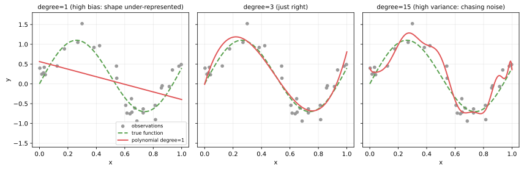
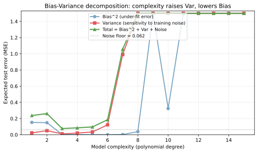
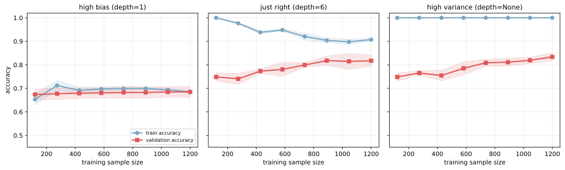
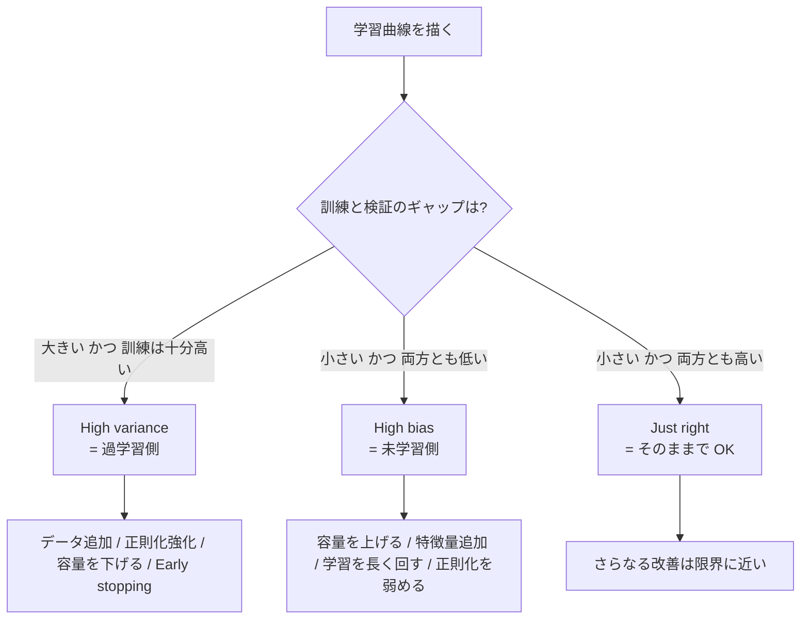

バイアス-バリアンス分解（bias-variance decomposition, バイアス-バリアンス分解）は、教師あり学習の期待誤差を「Bias の 2 乗」「Variance」「ノイズ（既約誤差）」の 3 項に切り分ける枠組みである。モデルが外す原因を「表現力が足りない（high bias）」と「訓練データの揺らぎに過敏（high variance）」のどちらか（あるいは両方）に診断し、次の打ち手を選ぶための判断軸として使う。

[過学習（overfitting）](../overfitting/) は high variance 側の症状、その対概念である未学習（underfitting）は high bias 側の症状にあたる。バイアス-バリアンス分解は両者を同じ式で扱えるようにする道具で、学習曲線や検証誤差の読み解きと組み合わせると、現状のモデルがどちらの方向に偏っているかを判定できる。

### 数式での分解

回帰の二乗誤差で書くと、未知の入力 `x` に対する期待誤差は次の 3 項に分かれる。

```text
E[(y - f_hat(x))^2] = Bias[f_hat(x)]^2 + Var[f_hat(x)] + sigma^2
```

各項の意味:

- Bias = `E[f_hat(x)] - f(x)`。多数の訓練セットで学習を繰り返したときの平均予測と、真の関数 `f(x)` のずれ。モデルの表現力不足を表す
- Variance = `Var[f_hat(x)]`。訓練セットの揺らぎによって予測がどれだけ振れるか。モデルの不安定さを表す
- ノイズ `sigma^2`。データに本質的に含まれる削れない誤差（irreducible error）

期待値・分散はいずれも「訓練セット集団」に対する統計量である点に注意が必要である。1 つの訓練セットで学習した 1 つの予測値だけを見ても Bias と Variance は直接観察できず、データを変えながら再学習した予測の挙動から測ることになる。

---

### Bias と Variance を視覚化する

同じ真の関数 `sin(2πx) + 0.4x` に対して、観測点 30 個から多項式回帰を行い、次数を `1 / 3 / 15` と変えた 3 例を並べる。

```python
import numpy as np
import matplotlib.pyplot as plt
from sklearn.linear_model import LinearRegression
from sklearn.pipeline import make_pipeline
from sklearn.preprocessing import PolynomialFeatures

rng = np.random.default_rng(0)
x_train = rng.uniform(0.0, 1.0, 30)
y_train = np.sin(2 * np.pi * x_train) + 0.4 * x_train + rng.normal(0.0, 0.25, 30)
x_grid = np.linspace(0.0, 1.0, 200)
y_true = np.sin(2 * np.pi * x_grid) + 0.4 * x_grid

fig, axes = plt.subplots(1, 3, figsize=(12, 4), sharey=True)
for ax, deg, title in zip(
    axes,
    [1, 3, 15],
    ["degree=1 (high bias)", "degree=3 (just right)", "degree=15 (high variance)"],
):
    model = make_pipeline(PolynomialFeatures(deg), LinearRegression())
    model.fit(x_train.reshape(-1, 1), y_train)
    ax.scatter(x_train, y_train, color="#999999", s=22)
    ax.plot(x_grid, y_true, color="#59a14f", lw=2, ls="--", label="true f(x)")
    ax.plot(x_grid, model.predict(x_grid.reshape(-1, 1)), color="#e15759", lw=2)
    ax.set_title(title)
plt.tight_layout()
plt.savefig("polyfit_compare.svg", bbox_inches="tight")
```



左端の直線（degree=1）は、波打つ真の関数を 1 次式で押さえ込もうとして全域で外している。これがバイアスの正体で、訓練セットをいくら入れ替えても直線は直線のままなので「平均しても真の関数からずれる」性質を持つ。一方の右端（degree=15）は訓練点の 1 つ 1 つに張り付き、観測点が少し変わるだけで形が大きく揺れる。この揺れがバリアンスである。

degree=3 の真ん中は、真の関数の波を捉えつつも訓練点の個別ノイズには引きずられない位置取りになっており、Bias と Variance の和が小さい領域にいると言える。

---

### モデル複雑度との関係

横軸にモデル複雑度（多項式の次数）、縦軸に「期待される 2 乗誤差」を取り、Bias^2・Variance・Total を分けて描く。実際の数値は、訓練セットを 200 回再サンプリングしてその都度モデルを学習し、テスト点での予測の平均と分散から計算したものである。

```python
import numpy as np
from sklearn.linear_model import LinearRegression
from sklearn.pipeline import make_pipeline
from sklearn.preprocessing import PolynomialFeatures
import matplotlib.pyplot as plt

rng = np.random.default_rng(0)
x_test = np.linspace(0.05, 0.95, 50)
y_true = np.sin(2 * np.pi * x_test) + 0.4 * x_test

bias_sq, variance = [], []
for d in range(1, 16):
    preds = np.zeros((200, len(x_test)))
    for t in range(200):
        x_tr = rng.uniform(0.0, 1.0, 25)
        y_tr = np.sin(2 * np.pi * x_tr) + 0.4 * x_tr + rng.normal(0.0, 0.25, 25)
        m = make_pipeline(PolynomialFeatures(d), LinearRegression())
        m.fit(x_tr.reshape(-1, 1), y_tr)
        preds[t] = m.predict(x_test.reshape(-1, 1))
    bias_sq.append(np.mean((preds.mean(axis=0) - y_true) ** 2))
    variance.append(np.mean(preds.var(axis=0)))

# (描画コード省略、配色は #7aa6c2 / #e15759 / #59a14f を使用)
plt.savefig("decomposition_curve.svg", bbox_inches="tight")
```



3 本の曲線の関係:

- Bias^2（青）: 次数を上げると単調に下がる。複雑なモデルほど真の関数を表現できるため
- Variance（赤）: 次数を上げると単調に上がる。複雑なモデルほど訓練セットの個別ノイズに反応するため
- Total（緑）: U 字を描く。Bias^2 と Variance の和にノイズ床（点線）を足したもので、最小値の位置が「最適な複雑度」になる

逆に言うと、Bias を下げると Variance が上がるトレードオフ関係が、複雑度というハイパーパラメータの背後で起こっている。Total が最小になる複雑度の選び方そのものが、[交差検証](../cross-validation/) や [正則化](../regularization/) の役割と直結する。

---

### 学習曲線で診断する

実モデルで Bias と Variance を直接測るのは難しいので、現場の診断では学習曲線（learning curve, 訓練サンプル数を増やしながら訓練 accuracy と検証 accuracy を追跡したもの）の形を読む方が早い。max_depth を変えた決定木 3 つで、典型的な 3 パターンを並べてみる。

```python
import numpy as np
import matplotlib.pyplot as plt
from sklearn.datasets import make_classification
from sklearn.model_selection import learning_curve
from sklearn.tree import DecisionTreeClassifier

X, y = make_classification(n_samples=1500, n_features=20, n_informative=10,
                          n_redundant=5, n_classes=2, random_state=0)

models = [
    ("high bias (depth=1)", DecisionTreeClassifier(max_depth=1, random_state=0)),
    ("just right (depth=6)", DecisionTreeClassifier(max_depth=6, random_state=0)),
    ("high variance (depth=None)", DecisionTreeClassifier(max_depth=None, random_state=0)),
]

fig, axes = plt.subplots(1, 3, figsize=(13, 4), sharey=True)
for ax, (title, est) in zip(axes, models):
    sizes, tr, va = learning_curve(est, X, y, train_sizes=np.linspace(0.1, 1.0, 8),
                                   cv=5, scoring="accuracy", random_state=0)
    ax.plot(sizes, tr.mean(axis=1), "o-", color="#7aa6c2", label="train")
    ax.plot(sizes, va.mean(axis=1), "s-", color="#e15759", label="validation")
    ax.set_title(title)
plt.tight_layout()
plt.savefig("learning_curves_diagnose.svg", bbox_inches="tight")
```



3 つの図に現れるパターンの読み方:

- 左（high bias）: 訓練・検証ともに低い水準で並走し、データを増やしても上昇しない。モデルが表現力不足
- 中央（just right）: 訓練が少し高い位置に張り、検証はやや下で追随する。ギャップが小さく、両方とも十分高い水準
- 右（high variance）: 訓練は 1.0 近くに張り付き、検証は伸び切らずに下に開く。差（汎化ギャップ）が大きい

この学習曲線の形が、診断の入口となる。同じ「accuracy が目標に届かない」でも、左の形と右の形では効く薬が真逆になる点に注意が必要である。

---

### 診断フロー

学習曲線から打ち手を引くまでの判断の骨格を、フロー図にまとめる。



ギャップが大きく訓練だけ高い場合は high variance、ギャップが小さく両方低い場合は high bias、というのが基本軸となる。フローでは「両方低くてギャップも大きい」というケースを省いているが、これは「両方への薬を順に試す」必要があり、まず容量を上げて high bias を解消してから残った gap を見るのが筋が良い。

---

### 各シナリオの打ち手

判断軸を表でまとめる。symptom 列が学習曲線の見え方、effective 列がそのシナリオで効く打ち手、ineffective 列が「効かない」あるいは「悪化させる」打ち手である。

| 症状 (symptom) | 診断 | 効く薬 (effective) | 効かない・悪化させる薬 (ineffective) |
|---|---|---|---|
| 訓練 ≒ 検証、両方とも目標未満で頭打ち | High bias (未学習) | 容量を上げる（深い木・ブースティング・大きな NN）／ 有用な特徴量追加 ／ 学習エポック増 ／ 正則化を弱める | 正則化強化 ／ 訓練データ追加 ／ Early stopping |
| 訓練 ≫ 検証、ギャップが顕著、訓練は十分高い | High variance (過学習) | 訓練データ追加 ／ 正則化強化 ／ Early stopping ／ 容量を下げる ／ ドロップアウト | 容量をさらに上げる ／ 特徴量をさらに増やす |
| 訓練 ≈ 検証、両方とも十分高い | Just right | そのまま運用 ／ 別軸の改善（推論速度・解釈性）に切り替え | 過剰なチューニング（過学習に振れるリスク） |

ここで効かない薬を選ぶと、改善の労力をかけても結果が動かないか、悪化することがある。例として high bias の状態で訓練データを大量に追加しても、モデルの表現力が変わらないので Total error は下がらない。一方で high variance の状態でモデルを大きくすると、Variance がさらに膨らんで検証スコアは下がる方向に動くと考えられる。

---

### 機械学習での使いどころ

- モデル選定の初期段階で「もっと大きいモデルを試すべきか、データ追加に投資すべきか」の判断に使う
- ハイパーパラメータ探索の方向性決め（深さを上げる方向か、正則化係数を上げる方向か）
- [交差検証](../cross-validation/) で訓練 / 検証スコアを取った後、ギャップの大きさを見て次のサイクルの仮説を立てる
- アンサンブル（[ランダムフォレスト](../random-forest/) / [勾配ブースティング](../gradient-boosting/)）が「なぜ素の決定木より強いか」を理解する枠組みとして。バギングは Variance を平均で打ち消し、ブースティングは弱学習器の Bias を逐次補正する操作と読める
- [kNN](../knn/) のハイパーパラメータ `k` の選び方（`k` が小さい = high variance、`k` が大きい = high bias）

「データ追加か、モデル容量増か」を反射的に決めず、学習曲線を引いてから決めるのが筋の良い習慣と考えられる。

---

### 適さないケース / 限界

バイアス-バリアンス分解は便利な枠組みだが、適用に限界もある。

- 二乗誤差以外への素直な拡張は難しい。Bias-Variance の閉じた分解は MSE で綺麗に成り立つが、0-1 損失や交差エントロピーへの拡張は厳密には別の式が必要になる。実用上は「同じ直感を分類タスクの学習曲線で読む」運用で代用する
- 「Bias と Variance の値」を 1 つの訓練セットから直接出すことはできない。本ノートの図 2 のように複数訓練セットの再サンプリングが必要で、現場では学習曲線の形による定性診断で代用するのが普通である
- 深層学習の過剰パラメータ領域では、複雑度を上げるほど Variance が下がる「double descent」現象が報告されている。古典的な U 字曲線の枠から外れる挙動なので、超大規模モデルにはそのまま適用しにくい
- 分布シフト下では「訓練と検証が同じ分布から来る」という前提が崩れるため、ギャップの原因が Variance なのか [データドリフト](../../mlops/data-drift/) なのかを別途切り分ける必要がある
