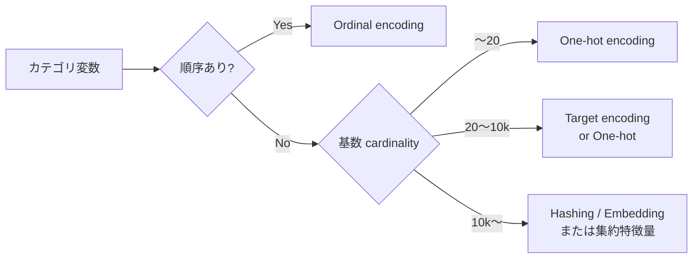
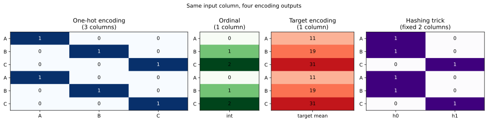
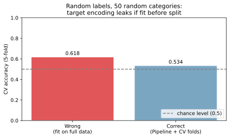
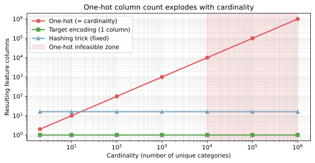

カテゴリ変数のエンコーディング（categorical encoding）は、文字列やカテゴリ値で表された特徴量を数値ベクトルに変換する前処理操作の総称である。機械学習モデルの大半（[ロジスティック回帰](../logistic-regression/) / [kNN](../knn/) / ニューラルネット / [GradientBoosting](../gradient-boosting/) など）は数値入力を前提とするため、`category='electronics'` や `prefecture='東京'` のような値はそのままでは渡せない。

選び方を間違えると、列数の爆発で計算不能になる、順序を勝手に持ち込んでしまう、[データリーク](../data-leakage/) を起こすといった事故につながる。判断の核は「カテゴリの基数（cardinality, 種類数）」「順序の有無」「目的変数との関係を埋め込んでよいか」の 3 軸と考えられる。

### 基数で第一候補が決まる



順序があれば Ordinal、なければ基数で分岐するというのが大筋。基数が極端に多いとき（ユーザー ID、商品 ID、URL など）はそもそも「カテゴリ」として扱うのではなく集約特徴量への変換を検討すべきで、これは後述する。

---

### 4 種類のエンコーディングを並べて見る

同じ入力 `["A", "B", "C", "A", "B", "C"]` に対して、4 つの方式がどんな出力を返すかを並べる。`scikit-learn` で簡単に確認できる。

```python
import matplotlib.pyplot as plt
import numpy as np
import pandas as pd
from sklearn.preprocessing import OneHotEncoder, OrdinalEncoder

data = pd.DataFrame({
    "category": ["A", "B", "C", "A", "B", "C"],
    "target":   [10,  20,  30,  12,  18,  32],
})

# 4 方式の出力
oh = OneHotEncoder(sparse_output=False).fit_transform(data[["category"]])
ord_enc = OrdinalEncoder().fit_transform(data[["category"]])
target_map = data.groupby("category")["target"].mean()
te = data["category"].map(target_map).values.reshape(-1, 1)
hash_dim = 2
hash_result = np.zeros((len(data), hash_dim))
for i, c in enumerate(data["category"]):
    hash_result[i, hash(c) % hash_dim] = 1

fig = plt.figure(figsize=(14, 3.5))
gs = fig.add_gridspec(1, 4, width_ratios=[3, 1, 1.4, 2])
axes = [fig.add_subplot(gs[0, i]) for i in range(4)]
for ax, arr, title, cmap in zip(
    axes,
    [oh, ord_enc, te, hash_result],
    ["One-hot (3 cols)", "Ordinal (1 col)",
     "Target encoding (1 col)", "Hashing (fixed 2 cols)"],
    ["Blues", "Greens", "Reds", "Purples"],
):
    ax.imshow(arr, cmap=cmap, aspect="auto")
    ax.set_title(title)
fig.suptitle("Same input column, four encoding outputs")
plt.tight_layout()
plt.savefig("categorical-encoding_methods.svg", bbox_inches="tight")
```



入力 6 行が共通で、出力の「列数」と「値の意味」が方式ごとに違うのが見て取れる。One-hot は基数と同じ列数になるが、Ordinal は 1 列、Target encoding も 1 列、Hashing は事前に決めた固定列数で押し込む。

---

### One-hot encoding

各カテゴリに対して 0/1 の独立した列を割り当てる。最も基本で、解釈が明確で、順序を勝手に持ち込まない。

- 利点: 順序を導入しない（モデルが「A < B」のような誤解釈をしない）、解釈が明確、ほぼ全ての ML モデルに使える
- 欠点: 基数と同じだけ列数が増える。基数が大きいと列爆発する
- scikit-learn: `OneHotEncoder` または `pd.get_dummies`
- 適切な使用場面: 基数が 20 程度以下、順序なし

---

### Ordinal encoding

各カテゴリに整数を割り当てて 1 列で済ます。

- 利点: 1 列で完結する、ストレージ・計算が軽い
- 欠点: 整数の大小関係に意味を持たせてしまう（`'electronics'=0` `'food'=1` `'books'=2` だと「electronics と food は近く、books は遠い」と線形モデルが解釈する）
- scikit-learn: `OrdinalEncoder`
- 適切な使用場面: 順序があるカテゴリ（`low < medium < high`、星評価、学年など）。順序なしには使ってはならない

決定木系（[RandomForest](../random-forest/) / [GradientBoosting](../gradient-boosting/)）は順序ベース判定なので Ordinal でも崩壊しないが、それでも「順序の意味付け」の罠は残る（カテゴリ A, B, C の順番がアルファベット順なだけで、モデルが C を A の上位とみなしてしまう）と考えられる。

---

### Target encoding

各カテゴリを「そのカテゴリでの目的変数の集約値」に置き換える。1 列で目的変数との関係を埋め込めるため、高基数カテゴリで効きやすい。

- 利点: 1 列で完結、目的変数との関係を直接エンコード、高基数に強い
- 欠点: [データリーク](../data-leakage/) のリスクが極めて高い。素朴に全データで集約してから CV すると、テスト fold の目的変数情報が訓練 fold に漏れる
- 必須の防御: `cross_val_score` / `GridSearchCV` の中で `TargetEncoder` を `Pipeline` に組み込む。scikit-learn の `TargetEncoder` （1.3 以降）は内部で cross-fitting を行ってリークを抑える設計になっている
- 適切な使用場面: 基数が 20〜数万のカテゴリ（都道府県、商品カテゴリ、ユーザーセグメントなど）

リークが入るとどう見えるかを、真の信号が無いランダムデータで確認する。50 個のランダムカテゴリ × 二値ランダムラベルなら、正しく CV 内で集約すれば accuracy は chance level（0.5）付近になるはずだが、全データで集約してから CV すると 0.6 を超える「見せかけの精度」が出る。

```python
from sklearn.linear_model import LogisticRegression
from sklearn.model_selection import cross_val_score
from sklearn.pipeline import Pipeline
from sklearn.preprocessing import TargetEncoder

rng = np.random.default_rng(0)
n = 500
df = pd.DataFrame({"cat": rng.integers(0, 50, n).astype(str)})
y = rng.integers(0, 2, n)

# Wrong: 全データで集約してから CV
target_map = (pd.DataFrame({"cat": df["cat"], "y": y})
              .groupby("cat")["y"].mean())
X_wrong = df["cat"].map(target_map).values.reshape(-1, 1)
cv_wrong = cross_val_score(
    LogisticRegression(max_iter=2000), X_wrong, y, cv=5,
).mean()

# Correct: Pipeline で TargetEncoder を CV fold 内に閉じる
pipe = Pipeline([
    ("te", TargetEncoder(target_type="binary", smooth="auto", random_state=0)),
    ("clf", LogisticRegression(max_iter=2000)),
])
cv_correct = cross_val_score(pipe, df[["cat"]], y, cv=5).mean()

fig, ax = plt.subplots(figsize=(6.5, 4))
ax.bar(["Wrong\n(fit on full data)", "Correct\n(Pipeline + CV folds)"],
       [cv_wrong, cv_correct],
       color=["#e15759", "#7aa6c2"], edgecolor="white")
ax.axhline(0.5, color="gray", linestyle="--", label="chance level (0.5)")
ax.set_ylim(0, 1.0); ax.set_ylabel("CV accuracy (5-fold)")
ax.set_title("Target encoding leaks if fit before CV split")
ax.legend(loc="lower right")
plt.tight_layout()
plt.savefig("categorical-encoding_leak.svg", bbox_inches="tight")
```

出力例:

```text
Wrong (full-data fit): CV accuracy = 0.618
Correct (Pipeline):    CV accuracy = 0.534  (≈ chance level)
```



真の信号が無いはずなのに wrong way では 0.618 まで上振れする。Pipeline で正しく閉じれば 0.534 とほぼ chance level に収まる。Target encoding を使う場面では「集約は CV fold の中だけで行う」が絶対条件と言える。

---

### Hashing trick と Embedding

基数が極端に大きい場面（URL、商品 ID、トークンなど）では、One-hot は不可能、Target encoding もカテゴリごとのサンプル数が少なすぎて機能しないことがある。

- Hashing trick: ハッシュ関数で「固定次元のビット列」に押し込む。例: `dim=16` なら基数が 100 万でも 16 列に収まる。代償として「衝突」（別カテゴリが同じビン）が起きるが、線形モデルなら衝突の影響は平均的に小さい
- Embedding: 深層学習で密ベクトル表現を学習する。意味的に近いカテゴリが近いベクトルになる利点があるが、ニューラルネットの訓練が前提

scikit-learn なら `FeatureHasher`、TensorFlow / PyTorch なら `Embedding` 層を使う。

---

### 基数で選ぶ判断軸

基数が増えると、One-hot は列数が線形に爆発する一方、Target encoding と Hashing は列数が一定に保たれる。



判断軸の整理:

| 基数（種類数） | 第一候補 | 注意点 |
|---|---|---|
| 〜20 | One-hot | 順序があれば Ordinal |
| 20〜10,000 | One-hot または Target encoding | Target は CV 内で集約必須 |
| 10,000〜 | Hashing trick / Embedding / 集約特徴量 | One-hot は実質不可能 |

数値はあくまで目安で、サンプル数・モデル種別・メモリ予算と合わせて決める。木系モデルなら One-hot より Ordinal の方が分割効率が良いこともある、といった例外もある。

---

### ID 系は「カテゴリ」ではなく「集約特徴量」にする

ユーザー ID（100 万種類）、商品 ID（数十万種類）、注文 ID といった「識別子」を One-hot や Target encoding でそのままエンコードすると次の問題が起きる。

- メモリ・計算量が破綻する（100 万列の sparse 行列を作っても後段モデルに渡せない）
- 推論時に新規 ID が来ると OOV（out of vocabulary, 未知カテゴリ）になり予測不能
- ID ごとの「個性」を学習しているだけで汎化能力がほぼゼロ
- 個人情報保護の観点でも好ましくない（モデルに ID 自体が乗る）

打ち手は「ID をやめて、その ID に紐づく行動を集約した数値特徴量に変換する」こと。例:

- ユーザー ID → 過去 30 日の購入回数、平均購入額、最終購入からの経過日数、利用カテゴリ数
- 商品 ID → 過去 7 日の販売数、平均レビュー点、在庫日数
- 注文 ID → そもそも特徴量化しない（識別子は集計の主キーとして使う）

ID は「識別子」であって「カテゴリ」ではない、という区別をつけるのが定石となる。

---

### 機械学習での使いどころ

エンコーディングは Claude にテーブルデータの前処理を任せたときに必ず登場する操作で、ここを押さえると Claude の出力コードを読むときの判断軸が増える。

- 受領したテーブルの各列に対して、エンコーディング方法と理由を明示する
- 高基数カテゴリ（ID 系を含む）の扱い方を最初に決める
- Target encoding を使うなら必ず `Pipeline` + CV と組み合わせて [データリーク](../data-leakage/) を回避する
- One-hot の列数が数千を超えそうなときは [次元の呪い](../curse-of-dimensionality/) を意識して方式を変える
- 新規カテゴリが来る前提のサービスでは Hashing trick / Embedding を選ぶ
- 木系モデルなら One-hot / Ordinal で十分、線形・距離ベースモデルなら One-hot か Target encoding を優先する

---

### よくある誤解

- 「Ordinal encoding が一番コンパクトで効率的」とは限らない: 順序のないカテゴリに整数を割り当てると、線形モデルや距離ベース手法は「整数の大小」を関係性として解釈してしまう。木系以外ではほぼ NG
- 「Target encoding は便利、無条件で使える」ではない: 素朴に全データで集約すれば必ず [リーク](../data-leakage/) する。`Pipeline` 必須
- 「One-hot encoding はカテゴリ数が多くても sparse 行列で乗り切れる」とは限らない: メモリには載っても、後段モデルが密行列を要求する場合（kNN, ニューラルネット）は実質不可能。たとえ通っても [次元の呪い](../curse-of-dimensionality/) でモデル性能が落ちる
- 「ユーザー ID をエンコードするのが普通」ではない: ID は識別子であってカテゴリ変数ではない。集約特徴量に変換するのが特徴量設計の定石
- 「encoding は精度に影響しない」ではない: 同じデータ・同じモデルでもエンコーディング選択次第で精度が大きく変わる。Claude が提示してくる前処理コードは必ず方式と基数を確認する習慣をつけたほうが良い
