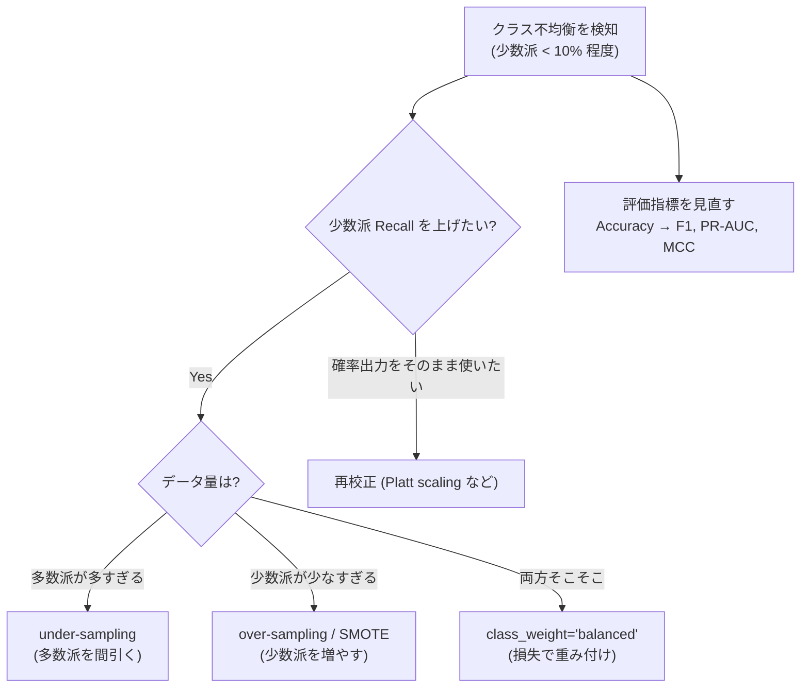
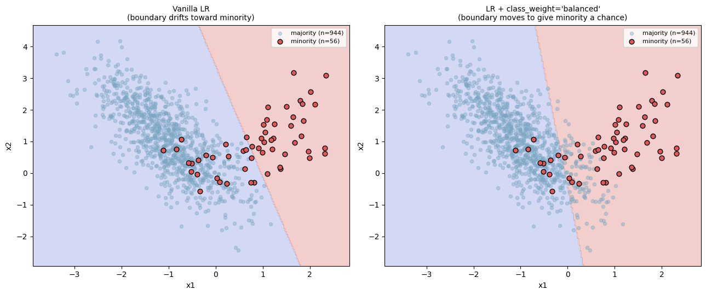
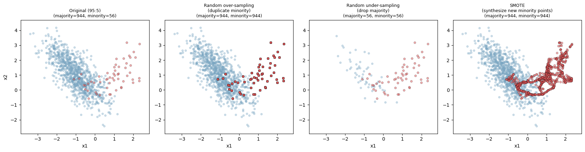
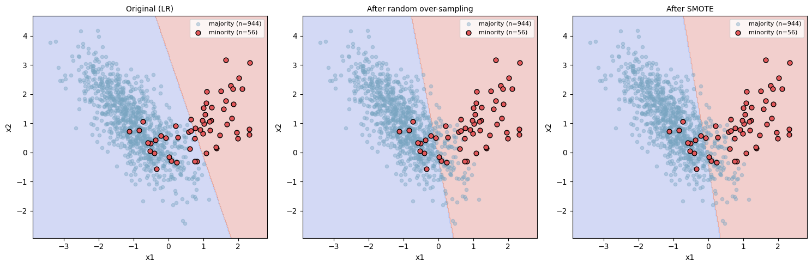
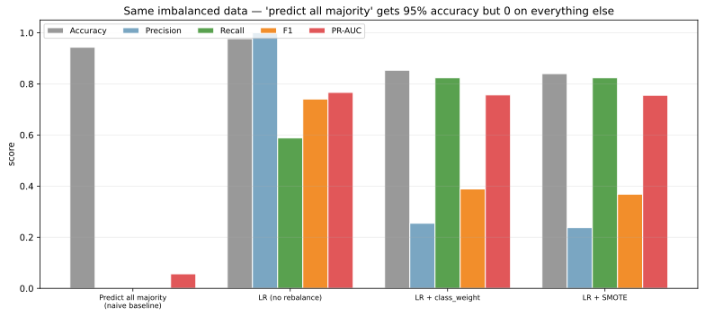

クラス不均衡（class imbalance）は、分類問題でクラス間のサンプル数が大きく偏っている状況を指す。不正検知（不正取引 1% 未満）、希少疾患の診断（陽性 0.1% 程度）、迷惑メール（ハム多数）など、実問題では「興味のあるクラスが少数派」というのが典型的なパターンとなる。

不均衡データで何も対策しないと、(1) 多数派クラスに引きずられた決定境界が引かれる、(2) Accuracy が高くても少数派の Recall がほぼ 0、(3) 確率出力の校正が崩れる、という 3 つの問題が同時に起きる。対処は「データ側で再サンプリングする」「損失側でクラスに重みを付ける」「評価指標を不均衡に強いものに切り替える」の 3 系統に大別できる。

[ROC-AUC / PR-AUC](../roc-pr-auc/)、[混同行列](../confusion-matrix/) のノートで触れた評価指標の話とセットで使う場面が多い。

### 不均衡対処の判断軸



判断軸の核心:

- 少数派の Recall を上げるなら resampling か class_weight が有効
- 確率出力をそのまま使うなら resampling は校正を歪めるので注意
- 評価指標を見直さないと、対策の効果すら測れない

---

### Accuracy が高くても意味が無いケース

95:5 の不均衡データで「全部多数派と予測する」だけのモデルは Accuracy 95% を取る。これがいかに役に立たないかを数字で見る。

```python
import numpy as np
from sklearn.datasets import make_classification
from sklearn.linear_model import LogisticRegression
from sklearn.metrics import accuracy_score, recall_score, f1_score, average_precision_score
from sklearn.model_selection import train_test_split

X, y = make_classification(n_samples=1000, n_features=2, n_informative=2,
                            n_redundant=0, weights=[0.95, 0.05], random_state=0)
X_tr, X_te, y_tr, y_te = train_test_split(X, y, test_size=0.3, stratify=y, random_state=0)

predict_all_majority = np.zeros_like(y_te)
print(f"Accuracy = {accuracy_score(y_te, predict_all_majority):.3f}")
print(f"Recall   = {recall_score(y_te, predict_all_majority, zero_division=0):.3f}")
print(f"F1       = {f1_score(y_te, predict_all_majority, zero_division=0):.3f}")
```

出力:

```text
Accuracy = 0.953
Recall   = 0.000
F1       = 0.000
```

Accuracy だけ見ると 95% で「良いモデル」に見えるが、Recall も F1 も 0 で少数派を 1 件も検出できていない。不均衡データでは Accuracy を主指標にすると意思決定を完全に誤る、というのがこの数字の意味するところとなる。

不均衡データで使うべき評価指標は次の通り。

- Precision・Recall（[混同行列](../confusion-matrix/) のノート参照）
- F1 スコア（Precision と Recall の調和平均）
- PR-AUC（[ROC-AUC / PR-AUC](../roc-pr-auc/) のノート参照）
- MCC（Matthews correlation coefficient）

---

### 対処 1: 損失の重み付け（class_weight）

最も軽量な対処が、損失関数に「少数派サンプルの誤りを重く罰する」重みを掛けることである。`scikit-learn` では `class_weight="balanced"` 1 行で利用できる。

```python
from sklearn.linear_model import LogisticRegression

plain = LogisticRegression(max_iter=2000).fit(X, y)
weighted = LogisticRegression(class_weight="balanced", max_iter=2000).fit(X, y)
# 描画は scripts 側を参照
plt.savefig("imbalance_class_weight.png", bbox_inches="tight")
```



左の素のロジスティック回帰では、決定境界が多数派側（青）にかなり寄っており、少数派（赤）の領域に入り込んでいる。右では `class_weight="balanced"`（多数派と少数派の損失の重みを反比例で調整）を加えただけで、境界が少数派を救う方向に動く。Recall が向上する代償として、Precision はやや下がる。

`balanced` は自動的に `n_samples / (n_classes × bincount(y))` で重みを計算するが、業務上の損失（誤検出と見逃しのコスト）が分かるなら明示的に `class_weight={0: 1, 1: 20}` のように与える方が筋がよい。

---

### 対処 2: リサンプリング

データ側でクラス比率を変える方法。`imbalanced-learn` ライブラリが定番で、scikit-learn と互換性のある API で提供される。

```python
from imblearn.over_sampling import RandomOverSampler, SMOTE
from imblearn.under_sampling import RandomUnderSampler

samplers = {
    "Random over": RandomOverSampler(random_state=0).fit_resample(X, y),
    "Random under": RandomUnderSampler(random_state=0).fit_resample(X, y),
    "SMOTE": SMOTE(random_state=0).fit_resample(X, y),
}
# 散布図は scripts 側を参照
plt.savefig("imbalance_resampling.png", bbox_inches="tight")
```



3 つのアプローチの違い:

- Random over-sampling: 少数派のサンプルを単純に複製。情報量は増えないが学習器が「少数派を真剣に扱う」ようになる
- Random under-sampling: 多数派からランダムに間引く。多数派の情報を失うが計算が軽い
- SMOTE（Synthetic Minority Over-sampling Technique）: 少数派サンプル同士を結ぶ線分上に「合成サンプル」を作る。単純複製と違い決定境界を滑らかにする

決定境界の違いも見ておく。

```python
# 各リサンプリング後にロジスティック回帰を当てる
plt.savefig("imbalance_boundary_resampling.png", bbox_inches="tight")
```



リサンプリング後はいずれも境界が少数派側に押し戻され、少数派を捕まえやすい形になる。SMOTE は合成点が散布図の薄い赤点として可視化される（黒縁の点）。

注意: リサンプリングは訓練データだけに適用する。テストデータも resample してしまうと、評価が現実と乖離する（[data leakage](../data-leakage/) と同じ罠）。`Pipeline` の代わりに `imblearn.pipeline.Pipeline` を使うと、CV 時に fold ごとに正しく resampling される。

---

### 対処 3: 評価指標を変える

不均衡データでは Accuracy をやめ、Precision / Recall / F1 / PR-AUC を主指標にする。クラス比率に依存しない指標として MCC（Matthews correlation coefficient）も使いやすい。

4 つのモデル（naive baseline、素 LR、class_weight、SMOTE）で評価指標を並べると、Accuracy がいかに誤った印象を与えるかが明確になる。

```python
# 詳細な評価は scripts 側を参照
plt.savefig("imbalance_metrics_breakdown.svg", bbox_inches="tight")
```



「全部多数派と予測」のベースラインを見ると、Accuracy（灰色）は 0.95 で他のモデルとほぼ並ぶが、Precision・Recall・F1・PR-AUC（青〜赤）は軒並み 0。Accuracy だけで判断すると、何もしないモデルが「最良」に見えてしまう。

class_weight と SMOTE を入れると Recall（緑）が大きく改善し、F1（橙）と PR-AUC（赤）が伸びる。素の LR は Accuracy 高めだが Recall が低く、少数派を捕まえられていない様子が見える。

「どの対策を選ぶか」は業務目線で:

- 見逃しのコストが高い（医療、不正検知） → Recall を最大化、class_weight / SMOTE
- 誤検出のコストが高い（迷惑メール誤判定） → Precision を維持しつつ Recall を上げる、閾値調整
- 両方をバランス → F1 を最大化、PR-AUC で総合評価

---

### 閾値調整: 同じモデルで Precision/Recall を動かす

確率出力を持つモデルなら、リサンプリングや重み付けをしなくても、判定閾値を動かすだけで Precision と Recall を交換できる。デフォルト閾値 0.5 を 0.3 に下げれば、少数派を取りこぼしにくくなる（Recall 上昇）が、誤検出も増える（Precision 低下）。

```python
proba = LogisticRegression(max_iter=2000).fit(X_tr, y_tr).predict_proba(X_te)[:, 1]
for thr in [0.5, 0.3, 0.1]:
    pred = (proba >= thr).astype(int)
    print(f"thr={thr}: precision={precision_score(y_te, pred):.2f}, recall={recall_score(y_te, pred):.2f}")
```

PR 曲線（[ROC-AUC / PR-AUC](../roc-pr-auc/)）の上で「業務上ちょうど良い閾値」を選ぶ運用は、リサンプリングをしないシンプルな対処として有力である。

### 数学での使いどころ

- 事前確率の歪み: ベイズの定理の `P(y)` が訓練と本番で違うときの補正（label shift）
- 期待リスクの再定義: クラスごとの誤分類コストを取り込んだ目的関数
- F1 / F_β スコアの導出: Precision と Recall の調和平均、`β` でどちらを重視するかを制御
- ROC 曲線とコスト曲線: 閾値変化に対する FPR / TPR の軌跡
- MCC: 不均衡データでも安定する相関ベースの指標 `MCC = (TP·TN - FP·FN) / √((TP+FP)(TP+FN)(TN+FP)(TN+FN))`

---

### 機械学習での使いどころ

- 不正検知（カード決済、ログイン、口座開設）: 陽性 1% 未満が普通。class_weight + 閾値調整が定番
- 医療診断（希少疾患スクリーニング）: Recall 最優先で閾値を下げる、専門医レビューと組み合わせる
- 故障予測 / 異常検知: 異常率 1% 程度で、SMOTE が使えるならまず試す
- スパムフィルタ: ハム多数 + スパム少数。class_weight だけで足りることが多い
- レコメンド（クリック予測）: 多くは負例（クリックしない）多数の不均衡。負例サンプリング + 校正
- 自然言語処理の希少クラス分類: 多数クラスの down-sampling か Focal loss
- セグメンテーション（画像）: 背景 vs 物体ピクセル比が極端な不均衡。Dice loss、Focal loss
- 不均衡時系列予測: 異常イベント前後の窓を切り出して再サンプリング

scikit-learn の `class_weight="balanced"` はロジスティック回帰、SVM、決定木、ランダムフォレストで一律に効く。勾配ブースティング系（XGBoost、LightGBM）でも `scale_pos_weight` パラメータで同等の効果が得られる。

---

### 適さないケース / 落とし穴

- テストデータも resample する: 評価が歪む。訓練だけに適用するのが原則
- 評価指標を Accuracy のままにする: 対策の効果が見えない。F1 / PR-AUC に切り替える
- SMOTE をテキストや画像に直接当てる: 合成サンプルが意味不明になる。埋め込み空間で合成するか、データ拡張（augmentation）を使う
- SMOTE を高次元データに使う: [次元の呪い](../curse-of-dimensionality/) で「近傍」が信頼できず、変な合成点ができる
- 確率出力をそのまま使う: リサンプリングで確率分布が訓練と本番で乖離する。校正（Platt scaling、isotonic regression）が必要
- 閾値を 0.5 のまま運用: デフォルト閾値は「クラス確率が等しい」想定で、不均衡データには不適切。PR 曲線で運用閾値を選ぶ
- リサンプリングを CV の外でやる: テスト fold にも合成サンプルが流れ込み、過大評価される。`imblearn.pipeline.Pipeline` を使う
- 「不均衡だからとりあえず SMOTE」: 木系（[ランダムフォレスト](../random-forest/)、[勾配ブースティング](../gradient-boosting/)）は class_weight や `scale_pos_weight` で十分なことが多く、SMOTE がむしろ悪化させるケースもある
- クラス数が極端に多い（100 クラス以上）多クラス不均衡: 二値の class_weight や SMOTE がそのまま効かない。階層分類、ロングテール専用手法（focal loss、class-balanced loss）を検討
- 不均衡の根本原因がデータ収集バイアス: モデル側の対処だけでは不十分。データ収集を見直すのが本筋
