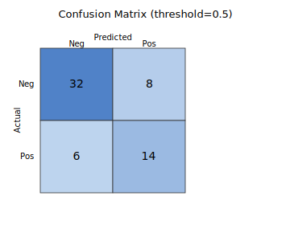

混同行列（confusion matrix）は、分類結果を「正解/不正解」と「陽性/陰性」の組み合わせで整理した 2×2 の表である。偽陽性（False Positive, FP）と偽陰性（False Negative, FN）のバランスを見ることで、誤りの種類を把握できる。

陽性が極端に少ない [クラス不均衡](../class-imbalance/) のデータでは、Accuracy 1 つだけ見ると「全部陰性と予測するだけのモデル」が高スコアを取ってしまうため、Precision・Recall・F1 のように混同行列の各セル比から計算される指標を併用するのが必須となる。確率出力の閾値を動かしたときの軌跡は [ROC-AUC / PR-AUC](../roc-pr-auc/) で連続的に見える。

### 用語

- TP（True Positive）: 実際に陽性で、予測も陽性
- FP（False Positive）: 実際は陰性だが、予測は陽性（誤検知）
- TN（True Negative）: 実際に陰性で、予測も陰性
- FN（False Negative）: 実際は陽性だが、予測は陰性（見逃し）

---

### 閾値調整の考え方

多くの分類モデルは「陽性である確率（スコア）」を出力する。このスコアに対してしきい値を動かすと、FP と FN のバランスが変わる。

しきい値は「陽性/陰性に分ける境界値」で、例えば 0.5 ならスコアが 0.5 以上を陽性と判定する。しきい値を変えることで、誤検知（FP）と見逃し（FN）のどちらを重視するかを調整できる。

- しきい値を下げる: 陽性と判定しやすくなり、FN は減るが FP は増える
- しきい値を上げる: 陽性と判定しづらくなり、FP は減るが FN は増える

---

## Python での実例

しきい値 0.5 で混同行列を作り、可視化する例。

```python
import matplotlib.pyplot as plt
from sklearn.metrics import confusion_matrix

y_true = [0, 0, 0, 0, 1, 1, 1, 1]
y_score = [0.1, 0.3, 0.4, 0.8, 0.2, 0.6, 0.7, 0.9]
y_pred = [1 if s >= 0.5 else 0 for s in y_score]

cm = confusion_matrix(y_true, y_pred)
plt.imshow(cm, cmap="Blues")
plt.xticks([0, 1], ["Negative", "Positive"])
plt.yticks([0, 1], ["Negative", "Positive"])
plt.title("Confusion Matrix (threshold=0.5)")
plt.colorbar()
plt.tight_layout()
plt.show()
```

出力:



---

### 数学での使いどころ

- 二値分類の誤りを構造的に把握する
- 指標（Accuracy, Precision, Recall）の分解

---

### 機械学習での使いどころ

- 偽陽性/偽陰性のどちらを重視するか判断する
- 業務コストに応じたしきい値の設定

---

### 適さないケース

- ラベルが未定義・曖昧なデータ
- 多クラスでは集約方法（macro/micro）を設計する必要がある
