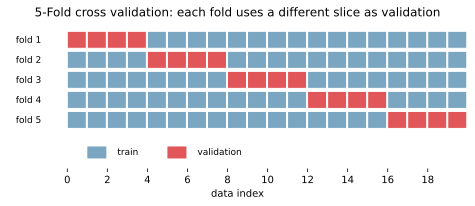
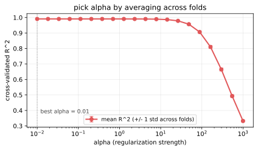

交差検証（cross validation, CV）は、限られた学習データを「訓練用」と「検証用」に何通りも分け直して評価することで、モデルの性能をより安定して見積もる手法である。  
1 回だけの分割では「たまたま簡単／難しい分割を引いた」せいで結果がブレるので、分割の組み合わせを変えながら平均を取って判断する。

[過学習](../overfitting/)を検出する道具であり、[正則化](../regularization/)の `alpha` のような[ハイパーパラメータ](../hyperparameter/)を安定的に選ぶ道具でもある。

### 最もよく使う K-Fold

データを `k` 等分（fold）し、毎回 1 つを検証用、残り `k-1` 個を訓練用に使う。これを `k` 回繰り返して、各回の検証スコアを平均する。`k=5` または `k=10` が定番。



赤いブロックがその回の検証データ、青が訓練データ。`fold 1` から `fold 5` まで検証スライスをずらしていき、得られた 5 つのスコアの平均をモデル評価値とする。

ポイント:

- データ全体を 1 度ずつ検証側に回せる（評価が安定する）
- 各回でモデルを再学習するので、計算コストは単純評価の `k` 倍
- データの並びに偏りがある場合は事前に `shuffle=True` でシャッフルする
- 分類で各クラスの比率を保ちたいときは StratifiedKFold を使う
- 時系列データには使えない（未来情報のリーク）。代わりに TimeSeriesSplit を使う

---

### CV でハイパーパラメータを選ぶ

[正則化](../regularization/)の `alpha` のように「強さ」を持つハイパーパラメータは、訓練データだけ見て決められない（訓練誤差は `alpha=0` で最小になり常に過学習側を選んでしまう）。CV を使い、各候補で `k` 回の検証スコアを平均し、最も良いものを選ぶ。



縦の点線が CV スコアの最大点。`alpha` が小さすぎると過学習で平均スコアが下がり、大きすぎると未学習で下がる。中間にスイートスポットがあり、CV で見つけにいく。エラーバーは fold 間のばらつきで、これが大きい候補は「平均は良くても安定しない」と判断できる。

---

### Python での実例

scikit-learn は `cross_val_score` と `GridSearchCV` が主要 API。

```python
import numpy as np
from sklearn.datasets import make_regression
from sklearn.linear_model import Ridge
from sklearn.model_selection import KFold, cross_val_score, GridSearchCV

X, y = make_regression(n_samples=300, n_features=20, n_informative=8,
                       noise=15, random_state=0)

cv = KFold(n_splits=5, shuffle=True, random_state=0)

# 1) ひとつのモデルを CV 評価
scores = cross_val_score(Ridge(alpha=1.0), X, y, cv=cv, scoring="r2")
print(f"R^2 mean = {scores.mean():.3f}  std = {scores.std():.3f}")

# 2) GridSearchCV でハイパーパラメータを CV で探す
grid = GridSearchCV(
    Ridge(),
    param_grid={"alpha": np.logspace(-2, 3, 20)},
    cv=cv,
    scoring="r2",
).fit(X, y)
print("best alpha:", grid.best_params_)
print("best CV R^2:", grid.best_score_)
```

出力の例:

```
R^2 mean = 0.962  std = 0.013
best alpha: {'alpha': 1.4384498882876631}
best CV R^2: 0.9627
```

---

### CV と train/validation/test の関係

データを 3 つに分ける場合の役割整理:

- 訓練 (train): モデルのパラメータを学習する
- 検証 (validation): ハイパーパラメータを選ぶ。CV はこれを内部で複数回繰り返す仕組み
- テスト (test): 最終的なモデルの性能を見積もる。最後に 1 回だけ使う

CV を使うと検証データを明示的に分けなくて済むが、テストデータは必ず別に確保しておく（CV 内で何度もスコアを見て選んだモデルは、CV スコア自体も少し楽観的に出るため）。

---

### 機械学習での使いどころ

- ハイパーパラメータの選定（[正則化](../regularization/)の `alpha`、[RandomForest](../random-forest/) の `max_depth`、[kNN](../knn/) の `k`、[GradientBoosting](../gradient-boosting/) の学習率など）
- モデル間の比較（同じ CV で複数モデルを評価して平均スコアで選ぶ）
- 評価指標の安定した見積もり（[ROC-AUC / PR-AUC](../roc-pr-auc/) を CV で平均すると 1 分割よりブレが減る）
- データ数が少ない案件（テスト用に大きく取れないとき、CV で全データを評価に回せるのが効く）

一般に、単なる train/test 分割ではなく CV で評価する方が、出てきた数字を信用しやすくなると考えられる。`cross_val_score` で 5-fold の平均と[標準偏差](../../math/stddev/)を出すのが定番の最小構成。

---

### 適さないケース

- データが極端に多い場合: 1 回の評価で十分安定するので、CV のコスト（k 倍）が見合わない
- 時系列データに普通の KFold を使う: 未来のデータで訓練して過去を当てることになり、汎化性能を大きく過大評価する。TimeSeriesSplit を使う
- グループ構造のあるデータ（同じユーザー・同じ患者の複数記録など）にランダム分割を使う: 同じグループが訓練と検証両方に入ると評価が楽観的に出る。GroupKFold を使う
- 「CV をやれば過学習しない」と思い込むこと: CV はあくまで評価方法。モデル側で[正則化](../regularization/)などの対策を打って初めて[過学習](../overfitting/)が抑えられる
