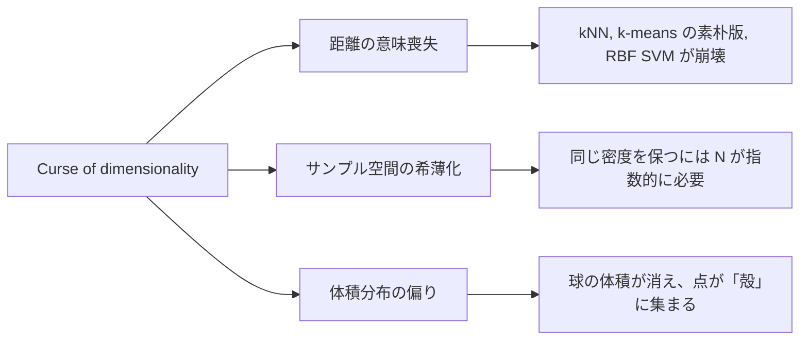
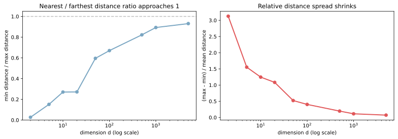
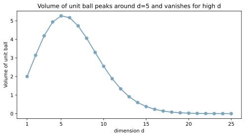
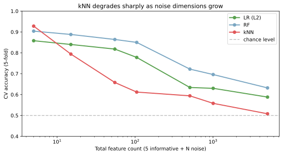

次元の呪い（curse of dimensionality）は、特徴量の次元が高くなるにつれて距離・体積・サンプル密度の常識的な感覚が崩れ、距離ベースのアルゴリズムが機能しなくなる現象群の総称である。1961 年に Bellman が制御理論の文脈で命名した古い用語だが、機械学習の文脈では「特徴量を増やすほど精度が上がるとは限らない、むしろ kNN や RBF カーネルがほぼ動かなくなる」という現実問題として現れる。

[kNN](../knn/) を 5000 次元のデータに使うと精度が大きく落ち、[ロジスティック回帰](../logistic-regression/) や [RandomForest](../random-forest/) は耐えられる、というような差が出る背景にこの現象がある。対処としては [PCA](../pca/) などの次元削減、[L1 正則化](../regularization/) による特徴量選択、距離指標の見直しがある。

### 3 つの症状に分解できる

次元の呪いは「ひとつの病気」ではなく、3 つの違う現象がまとまった呼び名である。それぞれ別のアルゴリズムを別の方向に痛めつける。



3 つはすべて「高次元では直感が通用しない」という共通性を持つが、対処の打ち手は症状ごとに違うため、まずどれが効いているかを把握するのが出発点になる。

---

### 症状 1: 距離の意味喪失

`d` 次元空間にランダムに配置した `N` 点について、ある 1 点から見た「最近傍点までの距離」と「最遠点までの距離」の比 `min / max` は、`d` が大きくなるほど 1 に近づく。距離が「近さ」を意味しなくなり、距離ベースの判定が機能しなくなる。

```python
import matplotlib.pyplot as plt
import numpy as np

rng = np.random.default_rng(0)
dims = [2, 5, 10, 20, 50, 100, 500, 1000, 5000]
ratios = []
for d in dims:
    points = rng.standard_normal((1000, d))
    dists = np.linalg.norm(points[1:] - points[0], axis=1)
    ratios.append(dists.min() / dists.max())

fig, axes = plt.subplots(1, 2, figsize=(11, 4))
axes[0].plot(dims, ratios, "o-", color="#7aa6c2", linewidth=2)
axes[0].set_xscale("log")
axes[0].set_xlabel("dimension d (log scale)")
axes[0].set_ylabel("min distance / max distance")
axes[0].set_title("Nearest / farthest distance ratio approaches 1")
axes[0].axhline(1.0, color="gray", linestyle="--", alpha=0.5)
axes[0].set_ylim(0, 1.05)
spreads = []
for d in dims:
    points = rng.standard_normal((1000, d))
    dists = np.linalg.norm(points[1:] - points[0], axis=1)
    spreads.append((dists.max() - dists.min()) / dists.mean())
axes[1].plot(dims, spreads, "o-", color="#e15759", linewidth=2)
axes[1].set_xscale("log")
axes[1].set_xlabel("dimension d (log scale)")
axes[1].set_ylabel("(max - min) / mean distance")
axes[1].set_title("Relative distance spread shrinks")
plt.tight_layout()
plt.savefig("curse-of-dimensionality_distance.svg", bbox_inches="tight")
```

出力例:

```text
d=2     min/max = 0.027
d=10    min/max = 0.270
d=100   min/max = 0.670
d=1000  min/max = 0.893
d=5000  min/max = 0.931
```



低次元では最近傍と最遠点が明確に分かれるが、5000 次元ではほぼすべての点ペアが「同じくらいの距離」になる。kNN の「k 個の最近傍を取る」操作が、実質的に「ランダムに k 点取る」と変わらなくなるのがこの現象の正体と考えられる。

---

### 症状 2: サンプル空間の希薄化

`d` 次元空間で「同じ密度」を保ったままサンプルを配置しようとすると、必要なサンプル数が `d` に対して指数的に増える。例として、各次元を 10 個のビンに切ると、`d` 次元では `10^d` 個のビンがある。

- `d=2`: 100 ビン → 1000 サンプルあれば各ビン平均 10 個
- `d=5`: 100,000 ビン → 1000 サンプルなら各ビンほぼ空
- `d=10`: 100 億ビン → 銀河系規模のサンプルでも各ビン空

機械学習の文脈では「学習データが特徴量空間を覆い尽くせなくなる」結果として現れる。kNN は「近傍点を見つけて多数決」が前提だが、空間が希薄だと近傍がそもそも存在しない（or 遠い別物が「近傍」扱いになる）。

---

### 症状 3: 体積分布の偏り

`d` 次元の単位球（半径 1 の球）の体積は、`V_d = π^(d/2) / Γ(d/2 + 1)` で表される。これは `d=5` 付近で最大（約 5.26）になり、それ以降は急減して `d=20` では約 0.026 になる。

```python
import math

d_values = list(range(1, 26))
volumes = [math.pi ** (d / 2) / math.gamma(d / 2 + 1) for d in d_values]

fig, ax = plt.subplots(figsize=(7, 4))
ax.plot(d_values, volumes, "o-", color="#7aa6c2", linewidth=2)
ax.set_xlabel("dimension d"); ax.set_ylabel("Volume of unit ball")
ax.set_title("Volume of unit ball peaks around d=5 and shrinks for high d")
ax.set_xticks([1, 5, 10, 15, 20, 25])
plt.tight_layout()
plt.savefig("curse-of-dimensionality_volume.svg", bbox_inches="tight")
```



体積の偏りはもう 1 つ重要な副作用を生む。高次元の球では、中心からほぼ表面まで体積が「殻」に集中し、内部はほぼ空になる。これは「高次元のランダム点は原点からほぼ等距離にある」という現象と表裏一体で、距離の意味喪失とも繋がる。

---

### kNN だけが極端に弱い理由

[kNN](../knn/) と [ロジスティック回帰](../logistic-regression/) と [RandomForest](../random-forest/) を、信号特徴量 5 個 + ノイズ特徴量 N 個のデータで比較すると次のようになる。

```python
from sklearn.datasets import make_classification
from sklearn.ensemble import RandomForestClassifier
from sklearn.linear_model import LogisticRegression
from sklearn.model_selection import cross_val_score
from sklearn.neighbors import KNeighborsClassifier
from sklearn.preprocessing import StandardScaler


def make_dataset(n_noise: int, seed: int = 0):
    X_sig, y = make_classification(
        n_samples=500, n_features=5, n_informative=5,
        n_redundant=0, random_state=seed,
    )
    if n_noise > 0:
        X_noise = np.random.default_rng(seed).standard_normal((500, n_noise))
        return np.column_stack([X_sig, X_noise]), y
    return X_sig, y


noise_levels = [0, 10, 50, 100, 500, 1000, 5000]
scores = {"kNN": [], "LR (L2)": [], "RF": []}
for n in noise_levels:
    X, y = make_dataset(n)
    X_std = StandardScaler().fit_transform(X)
    scores["kNN"].append(cross_val_score(
        KNeighborsClassifier(n_neighbors=5), X_std, y, cv=5).mean())
    scores["LR (L2)"].append(cross_val_score(
        LogisticRegression(max_iter=2000), X_std, y, cv=5).mean())
    scores["RF"].append(cross_val_score(
        RandomForestClassifier(n_estimators=100, random_state=0),
        X_std, y, cv=5).mean())

dims_total = [5 + n for n in noise_levels]
fig, ax = plt.subplots(figsize=(8, 4.5))
for name, color in zip(["LR (L2)", "RF", "kNN"],
                       ["#59a14f", "#7aa6c2", "#e15759"]):
    ax.plot(dims_total, scores[name], "o-", color=color, linewidth=2,
            label=name)
ax.set_xscale("log")
ax.set_xlabel("Total feature count (5 informative + N noise)")
ax.set_ylabel("CV accuracy (5-fold)")
ax.set_title("kNN degrades sharply as noise dimensions grow")
ax.axhline(0.5, color="gray", linestyle="--", alpha=0.5,
           label="chance level")
ax.set_ylim(0.4, 1.0); ax.legend()
plt.tight_layout()
plt.savefig("curse-of-dimensionality_knn_decay.svg", bbox_inches="tight")
```

出力例:

```text
  dim       LR       RF      kNN
    5    0.858    0.904    0.928
   55    0.818    0.864    0.658
  505    0.634    0.722    0.594
 5005    0.588    0.632    0.508    ← kNN はほぼランダム
```



3 モデルの挙動の違いは、それぞれが何に依存しているかで説明できる。

- LR: 各特徴量の係数を直接学習。距離概念を使わない。ノイズ特徴量は係数が 0 付近に縮むだけ。[L2 正則化](../regularization/) で過学習も抑えられる
- RF: 各分割は「特徴量 `X` が閾値 `t` 以下か」の 1 次元判定の連鎖。距離概念を使わない。各木は特徴量サブセットだけ見るため高次元耐性がさらに高い
- kNN: 全特徴量を使った距離計算が核。距離が意味を失った瞬間に動かなくなる

距離が「近さ」を意味しなくなれば、近傍を選んでも多数決の対象が無関係なサンプルになり、精度が chance level に落ちる、という流れ。

---

### 対処

高次元のままで全アルゴリズムを使うのは現実的でないため、次元を減らすか、距離に頼らないアルゴリズムを選ぶかの 2 系統に分かれる。

1. 次元削減で本質的な次元だけ残す
    - [PCA](../pca/): 分散を最大化する方向に射影。線形手法でスケール感を残す
    - t-SNE / UMAP: 2D 可視化用。距離関係を保つ非線形射影
    - オートエンコーダー: ニューラルネットで非線形圧縮
2. 特徴量選択で意味のある列だけ残す
    - [L1 正則化](../regularization/)（Lasso）: 不要な係数を 0 にする副作用で特徴量選択になる
    - 相互情報量や F 値: 目的変数との関連度で上位を選ぶ
    - SHAP / 特徴量重要度: 学習後に効いている特徴を抽出して再学習
3. 距離指標を見直す
    - コサイン距離: スパースな高次元ベクトル（テキスト埋め込み、bag-of-words）で有効
    - マハラノビス距離: 特徴量の共分散を考慮した距離
4. 距離に頼らないアルゴリズムを選ぶ
    - 線形モデル: LR, Ridge, Lasso
    - 木系: 決定木, [RandomForest](../random-forest/), [GradientBoosting](../gradient-boosting/)
    - 確率モデル: Naive Bayes

「kNN を試す前に次元を 50 以下程度に落とす」のが定石と言える。

---

### 機械学習での使いどころ

次元の呪いそのものは避けたい現象だが、概念として押さえておくと判断軸が増える。

- アルゴリズム選択: 高次元データに対して kNN / k-means の素朴版 / RBF SVM を第一候補にしない
- 前処理設計: 5000 次元以上を扱う場面では PCA / L1 を前段に組み込むのが定石
- 特徴量設計レビュー: 「特徴量を増やせば精度が上がる」という素朴な発想に歯止めをかける
- テキスト・画像のように本質的に高次元なデータでは、距離指標を見直す or 埋め込みで次元圧縮を組み合わせる
- [ハイパーパラメータ](../hyperparameter/)探索の難しさ: 次元が増えるとパラメータ空間も指数的に広がり、GridSearch では実質的に探索不能になる（ベイズ最適化が有利になる理由のひとつ）

---

### よくある誤解

- 「次元の呪いはスケール問題と同じ」ではない: スケール問題は [標準化](../standardization/) で解決するが、次元の呪いは標準化しても残る。シミュレーションでは標準化済みデータで kNN が落ちている
- 「特徴量を増やせば精度が上がる」とは限らない: 信号が無いノイズ特徴量を増やすと、距離ベース手法では逆に精度が下がる
- 「次元削減すれば必ず良くなる」とは限らない: PCA は線形な分散最大化なので、非線形な構造を持つデータでは情報を失う。t-SNE / UMAP も可視化向きで、後段の予測に使うと結果が不安定になる場合がある
- 「次元の呪いは木系も等しく被害を受ける」ではない: 木系は閾値分割で 1 次元ずつ判断するため、ノイズ次元が増えても直接の距離崩壊は受けない。ただしハイパラチューニングや過学習リスクは増える
- 「自然界のデータは大体高次元」は半分本当: 画像・テキスト・音声は素の次元は高いが、実際のデータは低次元の多様体に乗っていることが多い（manifold hypothesis）。だから次元削減や深層学習の埋め込みが効く
