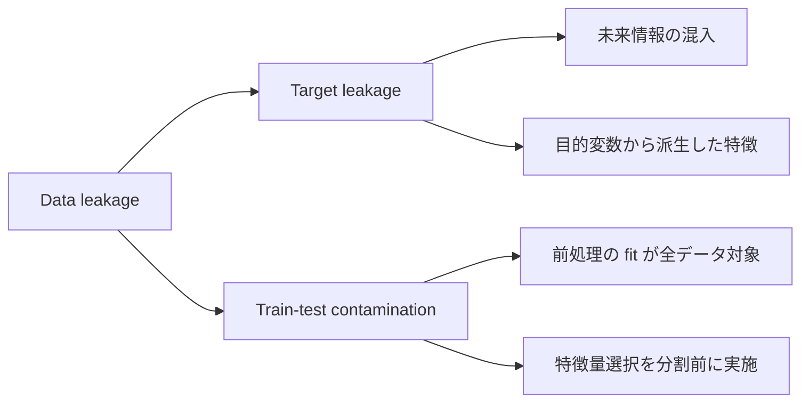
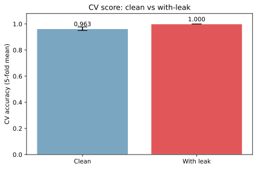
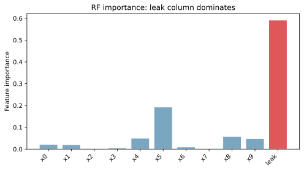
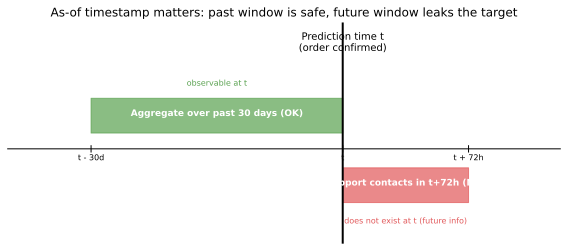
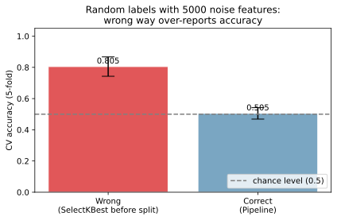

データリーク（data leakage）は、学習時には観測できるはずのない情報がモデルに混入し、評価指標を不当に高く出してしまう現象である。[過学習](../overfitting/) と紛らわしいが、過学習が「複雑なモデルが訓練データを覚えすぎる」のに対し、データリークは「特徴量や前処理の組み方が予測対象の情報を漏らしている」点で原因が違う。

最大の怖さは「気づきにくさ」にある。学習時に [交差検証](../cross-validation/) でも高スコアが出るため、テスト分割を厳密にしても検出できないことがあり、本番投入してはじめて精度が崩れる、という事故が起きる。

### 2 系統に分類できる

データリークは混入経路で大きく 2 系統に分かれる。



ターゲットリーク（target leakage）は「予測したい瞬間にはまだ存在しない情報」を特徴量に入れてしまうパターン。訓練・テスト汚染（train-test contamination）は「テストデータの情報が前処理経由で学習に染み込む」パターン。両者は別物だが、症状（学習時の異常な高スコア）は似るため、対処も別々に押さえておく必要がある。

---

### 典型症状: 学習時のスコアが不当に高い

リークが入った状態では、 [交差検証](../cross-validation/)（CV, cross-validation。データを `k` 個の fold に分けて、`k-1` 個で学習・1 個で評価を回しながら平均スコアを取る検証手法）のスコアが現実離れした水準（Accuracy 0.99 以上、ROC-AUC ほぼ 1.0 など）に達することが多い。普段の精度感を 0.05〜0.10 上回るスコアが急に出たら、まずリークを疑うのが筋と言える。以降、本文では「CV」と表記する。

以下では、scikit-learn の `make_classification` で作った二値分類タスクに「目的変数 `y` にごく小さなノイズを加えた列」を 1 本足し、ありなしで CV スコアを比較する。リーク列は推論時には手に入らない情報を意図的に流し込んだもので、これがあると CV Accuracy が 1.000 まで貼り付く。

```python
import matplotlib.pyplot as plt
import numpy as np
from sklearn.datasets import make_classification
from sklearn.ensemble import RandomForestClassifier
from sklearn.model_selection import cross_val_score

X, y = make_classification(
    n_samples=1000, n_features=10, n_informative=5,
    n_redundant=3, random_state=0,
)
rng = np.random.default_rng(0)
leak_feature = y + 0.05 * rng.standard_normal(len(y))  # 目的変数 + 小ノイズ
X_leak = np.column_stack([X, leak_feature])

cv_clean = cross_val_score(RandomForestClassifier(random_state=0), X, y, cv=5)
cv_leak = cross_val_score(RandomForestClassifier(random_state=0), X_leak, y, cv=5)

fig, ax = plt.subplots(figsize=(6, 4))
ax.bar(["Clean", "With leak"],
       [cv_clean.mean(), cv_leak.mean()],
       yerr=[cv_clean.std(), cv_leak.std()],
       color=["#7aa6c2", "#e15759"], capsize=8, edgecolor="white")
ax.set_ylim(0, 1.08)
ax.set_ylabel("CV accuracy (5-fold mean)")
ax.set_title("CV score: clean vs with-leak")
plt.tight_layout()
plt.savefig("data-leakage_cv_score.svg", bbox_inches="tight")
```

出力:

```text
CV clean:  0.963 +/- 0.014
CV leak:   1.000 +/- 0.000
```



CV スコアだけでなく、[RandomForest](../random-forest/) の特徴量重要度を出すとリーク列に重要度が集中する傾向も観察できる。

```python
rf_leak = RandomForestClassifier(n_estimators=100, random_state=0).fit(X_leak, y)
importances = rf_leak.feature_importances_
names = [f"x{i}" for i in range(10)] + ["leak"]

fig, ax = plt.subplots(figsize=(7, 4))
colors = ["#7aa6c2"] * 10 + ["#e15759"]
ax.bar(names, importances, color=colors, edgecolor="white")
ax.set_xticklabels(names, rotation=45, ha="right")
ax.set_ylabel("Feature importance")
ax.set_title("RF importance: leak column dominates")
plt.tight_layout()
plt.savefig("data-leakage_importance.svg", bbox_inches="tight")
```



良いスコアが出たときほど疑う、というのが運用上の鉄則と考えられる。

---

### ターゲットリーク（target leakage）

ターゲットリークは「予測したい時点では存在しないはずの情報」を特徴量に入れてしまう過ちである。典型例として、注文確定の瞬間に「その注文がキャンセル／返品されるか」を予測するタスクを考える。各特徴量の安全性は次のように分かれる。

- 注文金額: 確定時に既知 → OK
- 過去 30 日の注文回数: 確定時に既知 → OK
- 注文確定後 72 時間以内の問い合わせ回数: 確定時には未来 → NG
- 商品カテゴリ: 確定時に既知 → OK

問題は 3 つ目で、「確定後 72 時間以内の問い合わせ」は注文確定時刻にはまだ起きていない事象であり、運用時の推論コードには渡せない量である。加えて「問い合わせ」自体がキャンセル・返品の前兆シグナルなので目的変数と強く相関し、学習データ上ではモデルが超高精度に見えてしまう。



各特徴量について「予測したい時点 `t` に、その値は本当に観測可能か」を機械的に問うことで検出できる。すべての特徴量に as-of timestamp（その値が確定した時点）を明示し、`as_of <= t` を満たすものだけを使う設計が安全と言える。

ターゲットリークは時系列が絡まなくても起きる。例として、与信スコアの説明変数に「最終承認担当者の経験年数」が入っていたケースが報告されている。承認担当者の割当ては与信判定の難易度に応じて変わるため、結果ラベルと相関するが、申込時点では未確定である。「対象タスクの結果が決まる過程で生まれる量」は、それが時間的に未来でなくても疑った方が良い。

---

### 訓練・テスト汚染（train-test contamination）

もう 1 系統のリークは、前処理パイプラインの組み方によって生まれる。[標準化](../standardization/) の `StandardScaler.fit` をデータ全体に適用してから train / test に分けると、テストデータの平均・分散の情報が train の前処理に紛れ込む。同様に、特徴量選択や次元削減（[PCA](../pca/) など）、[欠損値処理](../missing-values/) の imputation 統計計算をデータ全体に対して先に行うと、テストの分布情報が漏れる。

特に分かりやすい例は「ランダムなラベル＋大量の無関係特徴量」で起きる現象である。真の信号が無いにもかかわらず、特徴量選択を分割前に実行すると CV Accuracy が偶然 0.7〜0.8 まで上がる。これは「全データに対して `y` と相関の高い列を 20 本選んだあとで CV」のため、選別の段階で `y` を使った情報がテスト fold にも染み込んでいるためと考えられる。

```python
from sklearn.feature_selection import SelectKBest, f_classif
from sklearn.linear_model import LogisticRegression
from sklearn.model_selection import cross_val_score
from sklearn.pipeline import Pipeline

rng = np.random.default_rng(0)
X_noise = rng.standard_normal((200, 5000))
y_noise = rng.integers(0, 2, 200)

# 誤: SelectKBest を全データで fit してから CV
sel = SelectKBest(f_classif, k=20).fit(X_noise, y_noise)
cv_wrong = cross_val_score(LogisticRegression(max_iter=2000),
                           sel.transform(X_noise), y_noise, cv=5)

# 正: Pipeline で SelectKBest を train fold 内に閉じる
pipe = Pipeline([
    ("select", SelectKBest(f_classif, k=20)),
    ("clf", LogisticRegression(max_iter=2000)),
])
cv_correct = cross_val_score(pipe, X_noise, y_noise, cv=5)

fig, ax = plt.subplots(figsize=(6, 4))
ax.bar(["Wrong\n(fit before split)", "Correct\n(Pipeline)"],
       [cv_wrong.mean(), cv_correct.mean()],
       yerr=[cv_wrong.std(), cv_correct.std()],
       color=["#e15759", "#7aa6c2"], capsize=8, edgecolor="white")
ax.axhline(0.5, color="gray", linestyle="--", label="chance level (0.5)")
ax.set_ylim(0, 1.05); ax.set_ylabel("CV accuracy (5-fold)")
ax.set_title("Random labels, 5000 noise features:\nwrong way over-reports")
ax.legend(loc="lower right")
plt.tight_layout()
plt.savefig("data-leakage_contamination.svg", bbox_inches="tight")
```

出力:

```text
Wrong CV (contamination):  0.805
Correct CV (pipeline):     0.505
```



正解は chance level（ランダム予測の精度）である 0.5 付近である一方、誤った手順では 0.8 付近まで上振れする。CV を「分割そのもの」だけで信頼するのではなく、「前処理を含めたパイプライン全体を fold ごとに閉じているか」までセットで確認する必要がある。

---

### 検出の手がかり

データリークは事前検出が難しい代わり、いくつかの状況証拠で疑いを持てる。

- CV のスコアが現実離れして高い（Accuracy 0.99 以上、ROC-AUC ほぼ 1.0）
- 特徴量重要度が 1 本に集中している
- ベースライン手法（[ロジスティック回帰](../logistic-regression/) や常に多数クラスを返す予測）との差が異常に大きい
- 訓練と本番の精度に大きな乖離が後から判明する
- 「この特徴量はいつ確定する量か」を答えられない列が存在する

これらに 1 つでも当てはまったら、特徴量の as-of timestamp と前処理の fit 対象を順に追っていくのが定石である。逆に、すべての特徴量について「予測時点で観測可能」「目的変数の決定過程に関与していない」が即答できるなら、ターゲットリークの大半は防げる。

---

### 防ぎ方

リスクの大きい順に対処の方針を並べると次のようになる。

1. 特徴量を追加するときに 2 つ確認する
    - その値は推論時刻にも観測できるか（as-of timestamp が予測時点以前か）
    - その値は目的変数から派生していないか（過去の解約フラグ、過去のクレーム ID、結果由来の担当者割当てなど）
2. 前処理を Pipeline 内に閉じ込める
    - `StandardScaler`、`SelectKBest`、`PCA` のような fit 系操作は `Pipeline` に組み込み、`cross_val_score` / `GridSearchCV` と組み合わせる
    - fit を学習 fold だけに閉じることで、テスト fold への情報染み込みを構造的に防げる
3. 時系列タスクでは時系列に合わせた CV を使う
    - 通常の `KFold` ではなく `TimeSeriesSplit` を使い、未来データで過去を予測する漏れを排除する
    - ラグ特徴量を作るときも、ラグ計算の起点を予測時点に揃える
4. テストデータは最後の最後だけ触る
    - [ハイパーパラメータ](../hyperparameter/) 調整・特徴量選択は train + valid 内で完結させる
    - テストデータでのスコアを見ながら何度も意思決定するのも「テストへのリーク」になる
5. ベースラインを並走させる
    - 「常に多数クラスを返す予測」「目的変数と無関係な特徴量だけのモデル」を必ず比較対象に出す
    - ベースラインと差が大きすぎる場合、リーク疑いとして特徴量を 1 本ずつ外して原因を切り分ける

---

### 機械学習での使いどころ

データリークそのものは避けたい現象だが、概念として押さえておくと判断軸が増える。

- 特徴量設計レビュー: 各列の as-of timestamp と目的変数との因果関係を確認する観点
- CV 結果の解釈: 高スコアが出たときに「実力か、リークか」を分けて疑う判断軸
- 本番監視: 訓練時と本番で精度差が大きい場合の原因分析の起点
- データ受領時の確認: 受け取ったテーブルに「将来時点の集計列」が混じっていないかの監査
- 競技 ML（Kaggle 等）: 不自然に高いスコアの上位解法に「データセット由来のリーク」が含まれることがあり、本番運用に持ち込めない解になりがち

一般に、CV を信用しすぎないこと、Pipeline で前処理を閉じること、特徴量に as-of timestamp を付ける文化を持ち込むこと、の 3 点を守るだけでほとんどのリーク事故は未然に防げると言える。

---

### よくある誤解

- 「CV で評価しているからリークは起きない」とは限らない: 前処理を分割前に fit していれば CV を回しても情報が漏れる
- 「目的変数と相関が高い特徴量を入れるとリーク」ではない: 強相関でも、推論時刻に観測可能で、目的変数から派生していなければリークではない（むしろ良い特徴量）
- 「テスト精度が高ければ本番でも当たる」とは限らない: テストデータも訓練データと同じ前処理パイプラインを通過しているなら、その前処理に汚染がある時点でテスト精度も信頼できない
- 「リークは個人開発の小さい問題」ではない: 医療画像で病院ごとに撮影機材が違い、機材由来のメタデータ（解像度・コントラスト）が病名と相関する、といった大型事例が論文で複数報告されている
- [過学習](../overfitting/) と同じ現象ではない: 過学習はモデルの複雑さが原因、データリークは特徴量・前処理の設計が原因。リークがあると過学習対策（正則化・early stopping）は効かない
