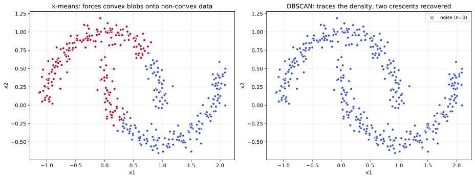
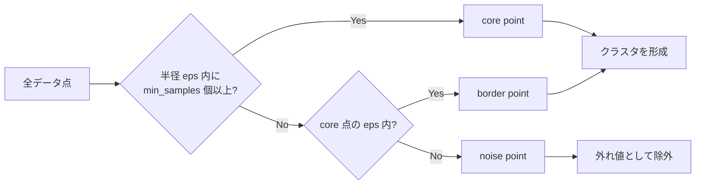
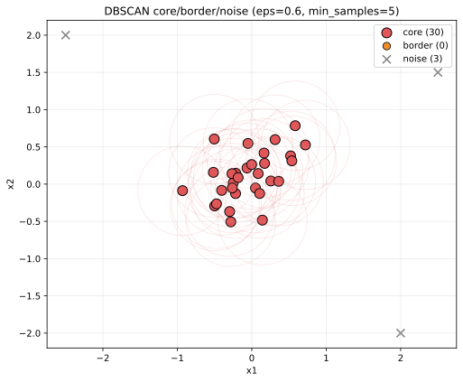
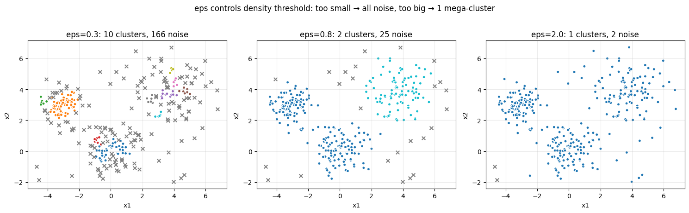
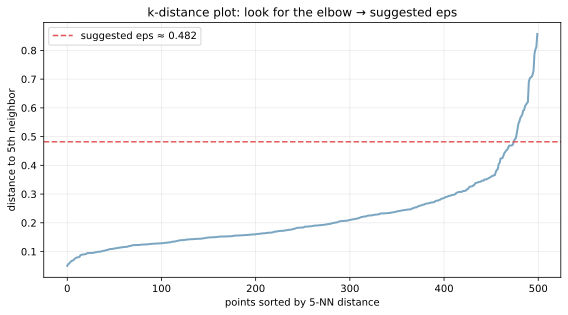

DBSCAN（Density-Based Spatial Clustering of Applications with Noise）は、点の密度に基づいてクラスタを構成するクラスタリングアルゴリズムである。[k-means](../k-means/) と違い「クラスタ数 `k` を事前に決める必要がない」「非凸（曲がった）形状のクラスタも見つけられる」「外れ値（noise）を別カテゴリとして扱う」という 3 つの強みを持ち、形状が不規則だったりノイズが混じるデータで威力を発揮する。

代表的な使い分けの判断軸: クラスタが「球形に近く `k` が分かっている」なら [k-means](../k-means/)、「密度の濃淡が手がかりで `k` 不明 + 外れ値あり」なら DBSCAN、「階層関係を見たい」なら [階層的クラスタリング](../hierarchical-clustering/)。

### k-means との対比

非凸データ（三日月型）に対する両者の挙動。

```python
from sklearn.cluster import DBSCAN, KMeans
from sklearn.datasets import make_moons

X, _ = make_moons(n_samples=400, noise=0.08, random_state=0)
km = KMeans(n_clusters=2, random_state=0).fit(X)
db = DBSCAN(eps=0.2, min_samples=5).fit(X)
plt.savefig("dbscan_vs_kmeans.svg", bbox_inches="tight")
```



k-means（左）はクラスタを「球形」で近似するため、三日月型データを縦に分けてしまい間違える。DBSCAN（右）は「密につながった点同士は同じクラスタ」と判定するので、月の形をそのまま 2 クラスタに分けられる。さらに端の数点が「noise」として `×` 印で別扱いされている。

---

### コア・ボーダー・ノイズの 3 分類

DBSCAN は各点を 3 種類に分類する。

- core point（コア点）: 半径 `eps` 以内に `min_samples` 個以上の点を持つ
- border point（ボーダー点）: コア点ではないが、コア点の近傍 `eps` に入る
- noise point（ノイズ点）: どちらでもない外れ値



```python
from sklearn.cluster import DBSCAN
db = DBSCAN(eps=0.6, min_samples=5).fit(X)
print(f"core: {len(db.core_sample_indices_)}, "
      f"noise: {sum(db.labels_ == -1)}")
plt.savefig("dbscan_core_border_noise.svg", bbox_inches="tight")
```



赤い円が各 core 点の `eps` 範囲。密集地帯にあるコア点同士が「density-reachable」（相互に近傍を辿れる）であれば、同じクラスタにまとめられる。ボーダー点はコアではないがクラスタの縁に属し、ノイズ点は外れ値として `label = -1` で返される。

---

### eps と min_samples の選び方

DBSCAN の 2 つのハイパーパラメータ:

- `eps`（半径）: クラスタの「密度しきい値」を間接的に決める
- `min_samples`（最小サンプル数）: コア点の判定基準

`eps` の効果を見る。

```python
for eps in [0.3, 0.8, 2.0]:
    db = DBSCAN(eps=eps, min_samples=5).fit(X)
plt.savefig("dbscan_eps_sensitivity.png", bbox_inches="tight")
```



- `eps = 0.3`: 密度しきい値が高すぎる。多くの点が noise に
- `eps = 0.8`: 適切。3 つのクラスタが正しく分離される
- `eps = 2.0`: 密度しきい値が低すぎる。すべてが 1 つの大クラスタに

`eps` の選び方の定石として「k-distance プロット」がある。各点の `k` 番目近傍までの距離をソートしてグラフ化し、曲がり角（elbow）の高さを `eps` の目安にする。

```python
from sklearn.neighbors import NearestNeighbors

k = 5  # min_samples と同じ値を使う
nbrs = NearestNeighbors(n_neighbors=k).fit(X)
distances, _ = nbrs.kneighbors(X)
k_distances = np.sort(distances[:, -1])
plt.plot(k_distances)
plt.savefig("dbscan_k_distance_elbow.svg", bbox_inches="tight")
```



横軸が「ソートされた点」、縦軸が「k 番目近傍までの距離」。曲がり角（多くの場合 95 パーセンタイル付近）が「ここから先は外れ値」の境界で、その高さを `eps` の初期値にする。

`min_samples` は次の目安で選ぶ:

- 2D データなら `min_samples ≥ 4`、3D 以上なら `min_samples = 2 × n_features`
- ノイズが多いデータほど大きく
- 「最小限のクラスタサイズ」と捉えて、ドメイン的に意味のある最小サンプル数で

### 数学での使いどころ

- density-reachable / density-connected の概念: グラフ理論との接続
- ε-近傍：[距離関数](../knn/) ベースの幾何
- k-distance plot: [四分位点](../../math/quantile/) を活用した hyperparameter 選定
- 密度推定の応用: [KDE](../../math/kde/) との発想の共通性
- 高次元での「密度」の崩壊: [次元の呪い](../curse-of-dimensionality/) で eps の選択が困難に

---

### 機械学習での使いどころ

- 地理データのクラスタリング（GPS 座標から「人が集まる場所」の検出）
- 画像セグメンテーション（カラー空間でのクラスタリング）
- センサーデータの異常検知（[anomaly-detection](../anomaly-detection/) と組み合わせ）
- 顧客セグメンテーション（外れ値顧客を別扱い）
- DNA / RNA の配列クラスタリング
- ソーシャルネットワークのコミュニティ検出
- 不正検知（クラスタに属さない取引を異常としてフラグ）
- 形状認識（非凸オブジェクトの抽出）
- ストリーミング応用: streaming-DBSCAN、ST-DBSCAN

scikit-learn では `sklearn.cluster.DBSCAN`、大規模データ向けに `HDBSCAN`（階層型 DBSCAN、`hdbscan` パッケージ）がある。HDBSCAN は `eps` を自動で選ぶため使いやすい。

---

### 適さないケース / 落とし穴

- 高次元データ（>10〜20 次元）: [次元の呪い](../curse-of-dimensionality/) で密度の概念が崩れる。先に [PCA](../pca/) や [t-SNE/UMAP](../tsne-umap/) で次元削減
- 密度が大きく異なる複数クラスタ: 単一の `eps` では全部をうまく扱えない。HDBSCAN を検討
- スケールが揃っていない: 距離計算が歪む。[標準化](../standardization/) を必ず先に
- `eps` を当てずっぽうで決める: k-distance プロットで根拠を持って選ぶ
- 巨大データ（n > 10⁶）で素朴な DBSCAN: 計算量が `O(n²)` で破綻。Ball Tree / KD Tree で `O(n log n)` に
- カテゴリ変数を含むデータ: ユークリッド距離が意味を持たない。Gower 距離か、別のクラスタリングを検討
- noise を必ず捨てる: 業務によっては noise こそ重要（不正検知、希少事例）
- `eps` を本番運用中も固定: データ分布が変わると noise 率が変動する。定期的に再校正
- min_samples = 1 の罠: 全点がコアになり、ほぼ単純な linked-cluster になる
- クラスタの「中心」が欲しいケース: DBSCAN は中心を返さない。代わりに各クラスタの centroid を後計算する
- 可視化なしで結果を判断: 2D / 3D なら必ず散布図で形状を確認。それ以上の次元は次元削減してから
- HDBSCAN を使わない: 最新の研究では HDBSCAN の方が頑健で使いやすいことが知られている。DBSCAN の代替として検討
