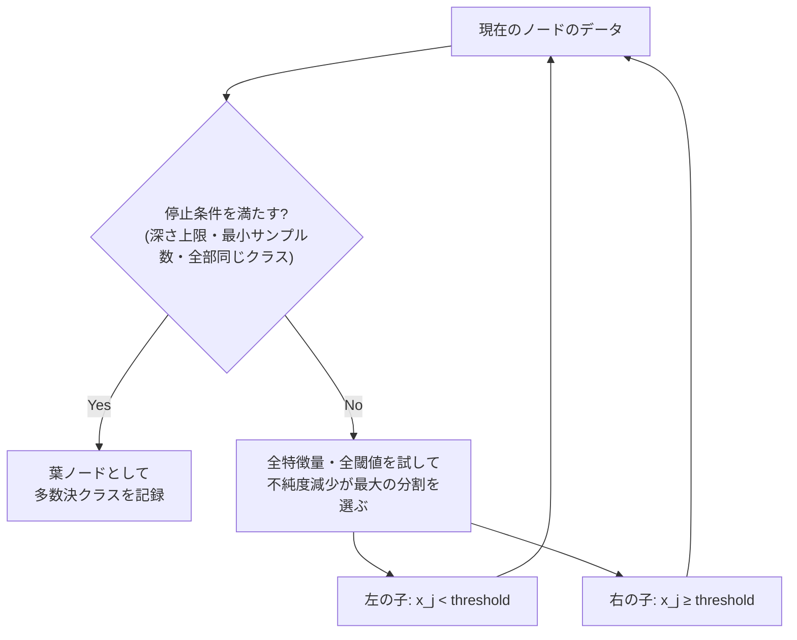
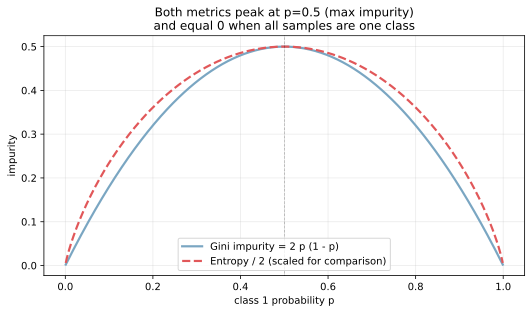
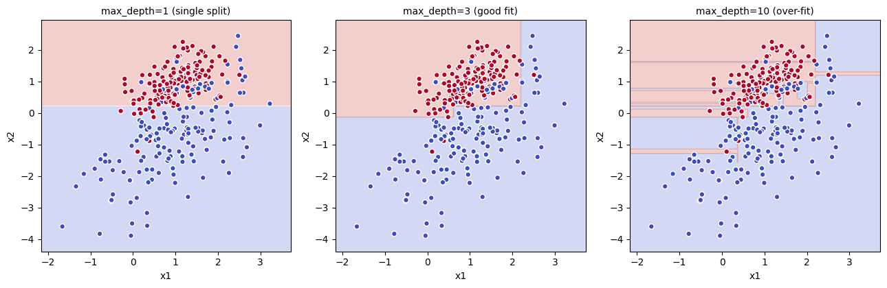
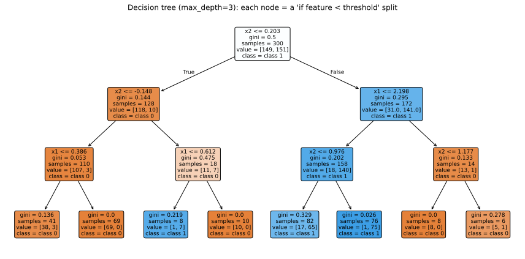
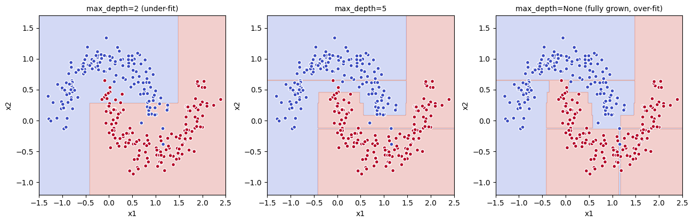

決定木（decision tree）は、入力空間を「if-then-else」の分割で繰り返し切り分け、葉ノードに到達した時点でクラス（分類）または値（回帰）を出すモデルである。学習は「分割すると不純度が最も下がる特徴量と閾値」を貪欲的に選ぶことを再帰的に繰り返すアルゴリズムで、最終的には軸に平行な階段状の決定境界を作る。

直感的・解釈可能・スケール不要・カテゴリ変数も自然に扱える、という実用上の強みが大きく、[ランダムフォレスト](../random-forest/) や [勾配ブースティング](../gradient-boosting/) など、現代の表データ向け最強クラスのアルゴリズムの構成要素にもなっている。素の決定木は過学習しやすいので、アンサンブルで使うか正則化（depth 制限、leaf サイズ下限）を効かせる運用が標準となる。

### 決定木の学習アルゴリズム

学習はトップダウンに次の手順を再帰的に繰り返す。



分割の良し悪しは「不純度（impurity）の減少量」で測る。分割前のノードの不純度から、分割後の 2 つのノードの不純度（サンプル数で重み付け平均）を引いたものを「情報利得（information gain）」と呼ぶ。情報利得が最大になる `(特徴量, 閾値)` のペアを選ぶ、というのが各ノードでの局所最適化となる。

---

### 不純度の指標: Gini と Entropy

分類木の不純度として最もよく使われるのが Gini 不純度と交差エントロピーである。

- Gini: `G(p) = Σ_k p_k (1 - p_k) = 1 - Σ_k p_k^2`
- Entropy: `H(p) = -Σ_k p_k log_2 p_k`

二値分類（`p_1 = p, p_0 = 1 - p`）の場合、両者は次の形をしている。

```python
import numpy as np
import matplotlib.pyplot as plt

p = np.linspace(0.001, 0.999, 400)
gini = 2 * p * (1 - p)
entropy = -(p * np.log2(p) + (1 - p) * np.log2(1 - p))

plt.plot(p, gini, color="#7aa6c2", lw=2, label="Gini")
plt.plot(p, entropy / 2, color="#e15759", lw=2, ls="--", label="Entropy / 2")
plt.savefig("decision_tree_impurity.svg", bbox_inches="tight")
```



両者とも `p = 0.5`（クラスが半々で最も予測しにくい）で最大値を取り、`p = 0` または `p = 1`（全部同じクラス = 不純度ゼロ）で 0 になる。形は似ているが、Entropy の方が `p = 0` 付近でわずかに尖っており、Gini の方が計算が軽い（log 計算が要らない）。実用上は両者で性能差はほぼ無く、scikit-learn のデフォルトは Gini である。

回帰木では不純度の代わりに「分散」を最小化する（分割後のグループ内の `y` の分散の和が最小になるように分割する）。これは MSE 損失で OLS をやっているのと同じ発想で、[損失関数](../loss-functions/) の選び方の話と直結する。

---

### 軸に平行な決定境界

決定木の決定境界は必ず「軸に平行（axis-aligned）」になる。これは各分割が単一特徴量の閾値で決まるため、境界が `x_1 = c` や `x_2 = c` のような直線でしか引けないことに起因する。

```python
from sklearn.datasets import make_classification
from sklearn.tree import DecisionTreeClassifier

X, y = make_classification(n_samples=300, n_features=2, n_informative=2,
                           n_redundant=0, class_sep=0.9, random_state=0)
for depth in [1, 3, 10]:
    clf = DecisionTreeClassifier(max_depth=depth, random_state=0).fit(X, y)
    # 描画は scripts 側を参照
plt.savefig("decision_tree_boundary.png", bbox_inches="tight")
```



- depth=1: 1 本の縦線か横線でしか分けられない（最も単純な決定）
- depth=3: 階段状の境界が複雑になり、データの構造を捉えられる
- depth=10: 各サンプルに張り付く形で過学習している（小さな「島」が大量に生まれる）

軸に平行な境界しか作れない、という制約は線形回帰の「直線しか作れない」と対称的な構造で、両者を組み合わせるアプローチもある（決定木で領域を切ってから各領域内で線形回帰、など）。

---

### 木構造を直接見る

決定木のもう一つの強みは「学習結果そのものを人間が読める」点である。scikit-learn の `plot_tree` でツリーをそのまま図にできる。

```python
from sklearn.tree import plot_tree
clf3 = DecisionTreeClassifier(max_depth=3, random_state=0).fit(X, y)
plot_tree(clf3, feature_names=["x1", "x2"], class_names=["class 0", "class 1"],
          filled=True, rounded=True)
plt.savefig("decision_tree_structure.svg", bbox_inches="tight")
```



各ノードに `(特徴量, 閾値)` と Gini 値、サンプル数、クラス分布が書かれる。葉ノードの色の濃さがクラスの偏りに対応し、濃いほど純粋なクラスの集まり。新しいサンプルがどの葉に落ちるかを追えば、予測の根拠を文章で説明できる（「もし x1 が xxx 以下なら…」のように）。

この説明性は、規制業界（金融、医療、保険）や、モデルの判断根拠を顧客に提示する必要のあるシステムで決定的な利点となる。一方で深い木は「説明できるが読めない」状態になりやすく、可視化の意味では `max_depth ≤ 5` 程度に抑えるのが現実的と考えられる。

---

### 非線形・非凸データへの強さ

線形モデルが苦手とする「曲がった境界」や「クラスタが入り組んだ配置」も、決定木は階段状の境界で覆える。

```python
from sklearn.datasets import make_moons
X_m, y_m = make_moons(n_samples=300, noise=0.15, random_state=0)
for depth in [2, 5, None]:
    clf = DecisionTreeClassifier(max_depth=depth, random_state=0).fit(X_m, y_m)
    # 描画は scripts 側を参照
plt.savefig("decision_tree_moons.png", bbox_inches="tight")
```



- max_depth=2: 階段が粗すぎて月の形を表現できない（under-fit）
- max_depth=5: 月の輪郭をうまく捉えている
- max_depth=None（制限なし）: 訓練ノイズの 1 点 1 点に張り付く（明らかな過学習）

過学習を防ぐには `max_depth`、`min_samples_split`、`min_samples_leaf`、`ccp_alpha`（コスト複雑性枝刈り）などのハイパーパラメータを [交差検証](../cross-validation/) で選ぶ。あるいは [ランダムフォレスト](../random-forest/) や [勾配ブースティング](../gradient-boosting/) のように多数の木を平均化することで過学習を抑える方向もある。

### 数学での使いどころ

- 情報理論との対応: 情報利得（IG, information gain）はエントロピーの減少量。決定木は ID3/C4.5 アルゴリズムの直系
- 階段関数による分割: 入力空間を矩形領域に分割し、各領域で定数を予測する近似器
- 関数空間での貪欲法: 各分割は局所最適だが、全体最適は NP 困難
- 弱学習器: PAC 学習・boosting 理論で「弱学習器」の定義そのものを満たす
- 情報幾何: クラス確率分布の集合上での KL ダイバージェンス減少と見ることもできる

---

### 機械学習での使いどころ

- 説明性が必須の分類・回帰: 1 本の決定木をそのまま運用するケース（医療判断補助、信用スコアの簡易モデル）
- [アンサンブル学習](../ensemble-learning/) の構成要素: [ランダムフォレスト](../random-forest/) は決定木を bagging、[勾配ブースティング](../gradient-boosting/) は決定木を boosting で組み合わせる
- 特徴量重要度の取得: 各分割で減らした不純度の合計でランキング（[特徴量重要度](../feature-importance/)）
- ルールベースの抽出: 学習済み木を if-then 規則に変換して別システムに移植
- 多クラス・カテゴリ変数対応: 別の前処理（[標準化](../standardization/)、ダミー化）なしで動く
- 欠損値対応: 一部実装（XGBoost、LightGBM、CatBoost）では欠損値を自動的に良い分岐に振り分ける
- 不均衡データ: `class_weight="balanced"` で重み付き不純度を使える（[クラス不均衡](../class-imbalance/) 参照）

実装上、scikit-learn の `DecisionTreeClassifier` / `DecisionTreeRegressor` がベース。表データのほぼすべての場面で、まずは [ランダムフォレスト](../random-forest/) か [勾配ブースティング](../gradient-boosting/) のラッパー実装（XGBoost、LightGBM、CatBoost）を試すのが現実的な選択肢となる。

---

### 適さないケース / 落とし穴

- 1 本の決定木で高精度を狙う: 単体は過学習しやすい上に不安定。原則アンサンブル前提で使う
- 軸に対して傾いた線形境界が本質: 階段状の境界では非効率になる。線形モデルや SVM の方が適切
- 訓練データの極端な小変化で木が変わる: 学習が高分散。アンサンブルで吸収する
- 連続値の細かい数値を予測する: 葉ノードでの予測は定数なので、滑らかな関数を当てるのは苦手。回帰木より [線形回帰](../linear-regression/) や勾配ブースティング回帰の方が良いことが多い
- 外挿: 訓練データの範囲外では「最も近い葉の値」を返すだけで、傾向の外挿はできない。時系列の傾向予測には不向き
- 多重共線性の特徴量: 似た特徴量が複数あると、貪欲な分割選択が不安定になる。事前の特徴量選択や PCA を検討
- 連続変数を含むカテゴリ変数の扱い: scikit-learn は数値しか受け付けないので [カテゴリ変数のエンコーディング](../categorical-encoding/) が必要（LightGBM などは内部で扱える）
- 不純度ベースの特徴量重要度を過信する: 連続値・高カーディナリティの特徴量に重要度がバイアスする。[permutation importance](../feature-importance/) で再検証する
