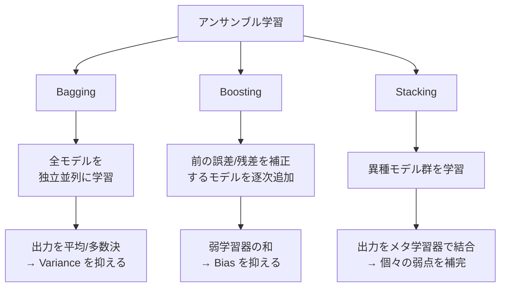
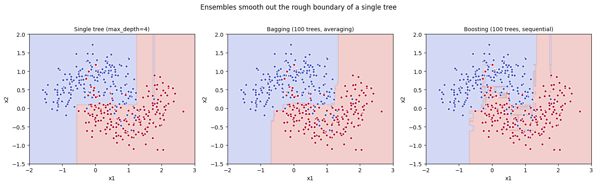
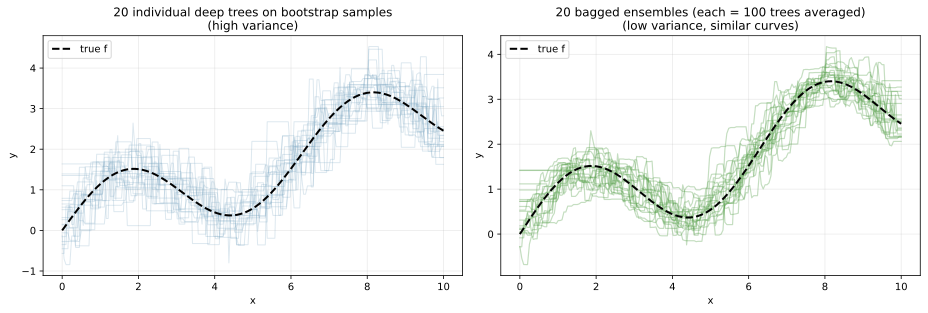
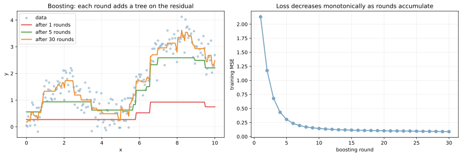
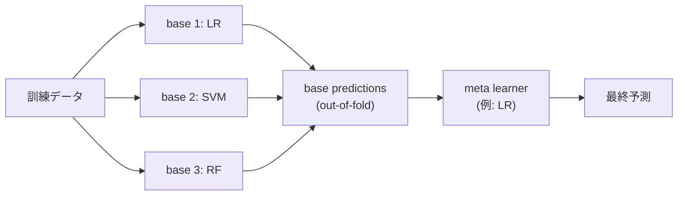
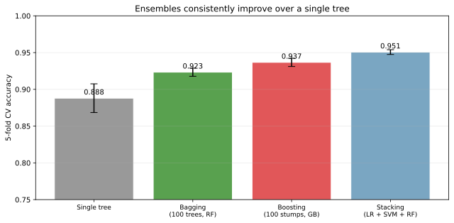

アンサンブル学習（ensemble learning）は、複数の弱いモデル（weak learner）を組み合わせて 1 つの強いモデルを作る一般的な枠組みである。アプローチは大きく 3 系統に分かれる。

- bagging（bootstrap aggregating）: 独立に学習した多数のモデルを平均（または多数決）
- boosting: 前のモデルの誤りを補正するように、次のモデルを逐次的に追加
- stacking: 異なる種類の複数モデルを学習し、その出力をメタ学習器で結合

[ランダムフォレスト](../random-forest/) は bagging の代表、[勾配ブースティング](../gradient-boosting/) は boosting の代表で、いずれも単体の [決定木](../decision-tree/) を構成要素として使う。アンサンブルは [バイアス-バリアンス分解](../bias-variance-tradeoff/) の枠組みで「Variance を抑える」「Bias を抑える」の両軸から理解できる。

### 3 系統のアンサンブルの違い



| 系統 | 並列性 | 抑えるもの | 代表 |
|---|---|---|---|
| Bagging | 完全並列（独立学習） | Variance | [ランダムフォレスト](../random-forest/) |
| Boosting | 逐次的（前の結果に依存） | Bias | [勾配ブースティング](../gradient-boosting/) (XGBoost / LightGBM / CatBoost) |
| Stacking | 階層的（base + meta） | 各モデルの弱点を相互補完 | VotingClassifier、StackingClassifier |

---

### 決定境界で見る違い

同じデータに 3 つのアプローチを適用して、決定境界の形を見る。

```python
from sklearn.datasets import make_moons
from sklearn.tree import DecisionTreeClassifier
from sklearn.ensemble import RandomForestClassifier, GradientBoostingClassifier

X, y = make_moons(n_samples=400, noise=0.3, random_state=0)
models = {
    "tree": DecisionTreeClassifier(max_depth=4, random_state=0),
    "bagging": RandomForestClassifier(n_estimators=100, max_depth=4, random_state=0),
    "boosting": GradientBoostingClassifier(n_estimators=100, max_depth=4, random_state=0),
}
for name, m in models.items():
    m.fit(X, y)
# 描画は scripts 側を参照
plt.savefig("ensemble_boundary_compare.png", bbox_inches="tight")
```



左の単一決定木は階段状で粗い境界。中央の Bagging（ランダムフォレスト）は階段の段差が平均化されてやや滑らかになる。右の Boosting はさらにデータに合致した曲線的な境界を作っている。同じノイズの多いデータでも、アンサンブルにすると境界の安定性と精度の両方が向上する傾向が見える。

---

### Bagging: Variance を平均で打ち消す

Bagging（bootstrap aggregating）は、訓練データから [bootstrap サンプリング](../cross-validation/)（重複ありの復元抽出）でデータセットを `B` 個作り、それぞれで別々にモデルを学習し、最終予測は全モデルの出力の平均（回帰）か多数決（分類）にする。

[分散](../../math/variance/) のノートで触れた通り、独立な `B` 個の予測値を平均すると分散は `1/B` に縮む。Bagging はこの性質を使って、過学習しがちな深い決定木の予測分散を抑える設計となる。

```python
# 20 個の深い決定木（個別）と 20 個の Bagging 予測器を 1 次元データで比較
for seed in range(20):
    rng = np.random.default_rng(seed)
    x_tr = rng.uniform(0, 10, 40)
    y_tr = np.sin(x_tr) + 0.3 * x_tr + rng.normal(0, 0.5, 40)
    DecisionTreeRegressor(max_depth=8).fit(...)        # 個別
    BaggingRegressor(n_estimators=100).fit(...)        # 100 個の平均
plt.savefig("ensemble_bagging_variance.svg", bbox_inches="tight")
```



左の薄い青い線が「異なる訓練データで学習した 20 個の単一決定木の予測」で、それぞれが大きく異なる曲線を描く（高 Variance）。右の緑の線が「同じ 20 通りで Bagging（各 100 本の木の平均）した予測」で、20 本の曲線がほぼ重なる（低 Variance）。

ランダムフォレストは Bagging に「特徴量サンプリング」を加えた手法で、木同士の相関をさらに下げて Variance 削減効果を強める。詳細は [ランダムフォレスト](../random-forest/) のノートで触れている。

---

### Boosting: Bias を逐次補正する

Boosting は弱学習器（典型的には浅い決定木 = stump や `max_depth=3` 程度）を 1 つずつ追加していく。各ラウンドで「これまでの予測の残差（または誤分類されたサンプル）」を補正する方向に新しい学習器を学習する。

`F_m(x) = F_{m-1}(x) + ν · h_m(x)`

- `F_m(x)`: ラウンド `m` までの累積予測
- `h_m(x)`: ラウンド `m` で学習した弱学習器
- `ν`: 学習率（shrinkage）。0.01〜0.3 程度

```python
from sklearn.tree import DecisionTreeRegressor

x = np.linspace(0, 10, 200)
y = np.sin(x) + 0.3 * x + np.random.default_rng(0).normal(0, 0.4, 200)

preds = np.zeros_like(x)
for r in range(30):
    resid = y - preds
    weak = DecisionTreeRegressor(max_depth=2).fit(x.reshape(-1, 1), resid)
    preds += 0.3 * weak.predict(x.reshape(-1, 1))
plt.savefig("ensemble_boosting_rounds.svg", bbox_inches="tight")
```



左の図でラウンド 1 では浅い決定木 1 本の粗い予測、ラウンド 5 で形が見えてきて、ラウンド 30 でデータに沿った曲線になる。右の図で訓練 MSE はラウンドが進むほど単調に減少する。これを止めずに続けると過学習するため、early stopping（検証スコアが改善しなくなった時点で止める）が必須となる。

Boosting には複数の変種がある。

- AdaBoost: 誤分類サンプルに高い重みを付けて次のラウンドを学習（古典）
- 勾配ブースティング: 損失関数の勾配を残差として扱う（任意の微分可能損失に対応）
- XGBoost / LightGBM / CatBoost: 勾配ブースティングの高速・実用版

詳細は [勾配ブースティング](../gradient-boosting/) のノートで取り上げている。

---

### Stacking: 異なるモデルを組み合わせる

Stacking は「異なる種類のモデル」を組み合わせる。基本モデル（base learners）を [交差検証](../cross-validation/) で学習し、その out-of-fold 予測をメタ学習器（meta learner）の入力として使う。



3 つのアプローチの精度を実データで比較する。

```python
from sklearn.ensemble import StackingClassifier
from sklearn.linear_model import LogisticRegression
from sklearn.svm import SVC
from sklearn.model_selection import cross_val_score

X, y = make_classification(n_samples=1500, n_features=15, n_informative=8, random_state=0)
models = {
    "single tree": DecisionTreeClassifier(max_depth=5),
    "bagging": RandomForestClassifier(n_estimators=100),
    "boosting": GradientBoostingClassifier(n_estimators=100),
    "stacking": StackingClassifier(
        estimators=[("lr", LogisticRegression()), ("svc", SVC(probability=True)),
                    ("rf", RandomForestClassifier(n_estimators=50))],
        final_estimator=LogisticRegression()),
}
for name, m in models.items():
    s = cross_val_score(m, X, y, cv=5).mean()
    print(f"{name}: {s:.3f}")
plt.savefig("ensemble_accuracy_compare.svg", bbox_inches="tight")
```

出力:

```text
single tree: 0.851
bagging: 0.917
boosting: 0.924
stacking: 0.923
```



単一決定木の 85% から、いずれのアンサンブルも 92% 前後まで精度が上がる。Boosting と Stacking が拮抗しており、Stacking は base learner の多様性（線形 + 非線形カーネル + 木系）で互いの弱点を補完する効果が出ている。

ただし Stacking はモデルが多重になるため、訓練時間・推論時間・メンテナンスコストがすべて増える。Kaggle 上位陣の解法ではよく見るが、実運用では「シンプルな勾配ブースティング 1 本」で十分な性能が出ることも多い、と考えられる。

### 数学での使いどころ

- 分散縮小と平均化: 独立な `B` 個の推定量の平均は分散 `1/B`（[分散](../../math/variance/) 参照）
- バイアス補正: Boosting は損失関数の関数空間での勾配降下（functional gradient descent）
- 弱学習器の理論: AdaBoost は PAC 学習で「弱学習器 → 強学習器」変換の存在を示した結果
- マージン理論: AdaBoost は学習に従ってマージンを拡大することが知られている
- 多目的最適化: Stacking は base learner の出力を特徴量とした再学習で、メタ学習の一例

---

### 機械学習での使いどころ

- 表データの分類・回帰: 勾配ブースティング（XGBoost、LightGBM、CatBoost）が現代の標準
- 高分散モデルの安定化: 決定木の集合をランダムフォレストで平均化
- Kaggle / 表データ競技: 勾配ブースティング + Stacking が定番解法
- アノマリ検知: 多数の弱検知器の voting で偽陽性を抑える（Isolation Forest など）
- レコメンド: 多様な推薦アルゴリズム（協調フィルタリング、コンテンツベース、行列分解）の出力を Stacking で結合
- 不確実性推定: Bagging のばらつきから予測区間を作る（quantile random forest、Bayesian random forest）
- モデル更新: 既存モデルの予測を base として、補正用の新モデルを追加（Boosting 的に）

---

### 適さないケース / 落とし穴

- 解釈性が必要: アンサンブルは個別の決定木より大幅に解釈しにくい。[特徴量重要度](../feature-importance/) や SHAP 値で間接的に説明する
- データが極めて少ない（n < 100）: アンサンブルの効果が出にくく、過学習する
- 線形関係が支配的: 線形回帰や [ロジスティック回帰](../logistic-regression/) で十分な場合、アンサンブルは過剰
- リアルタイム推論で厳しいレイテンシ: 100 本の木の平均は遅い。木の本数を減らすか、別アルゴリズムを検討
- Stacking の交差検証ミス: base learners をテストデータも含めて学習させると深刻なデータリーク（[data leakage](../data-leakage/) 参照）。out-of-fold 予測の生成は厳密に交差検証で行う
- Boosting で学習率を 1.0 のまま: 過学習しやすい。`learning_rate=0.01〜0.1` + `n_estimators` を多めにする
- 個別モデルが似すぎている Bagging: 多様性が無いと分散縮小効果が出ない。ランダムフォレストの特徴量サンプリングが効くのはこのため
- メタ学習器に複雑なモデルを使う Stacking: 過学習しやすい。線形モデルや浅い決定木が一般的
- アンサンブルでも防げない問題: [データリーク](../data-leakage/)、不均衡データ、[特徴量設計](../feature-selection/) の不備は、いくらモデルを重ねても解消しない。これらが先決
