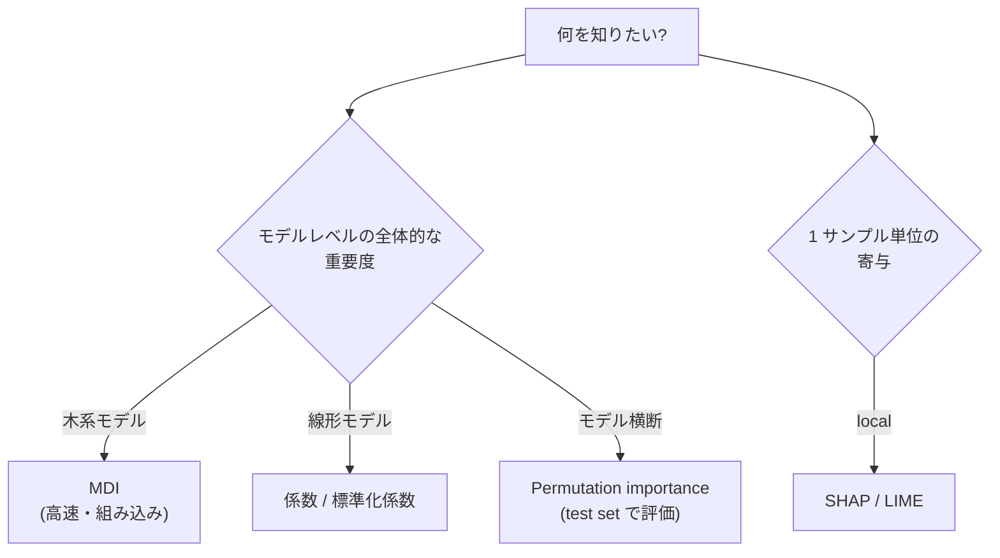
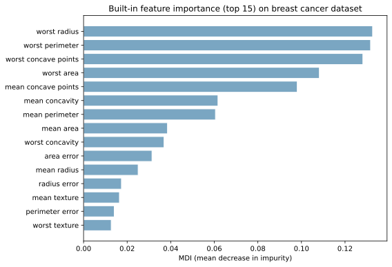
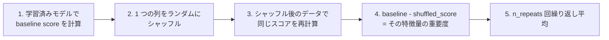
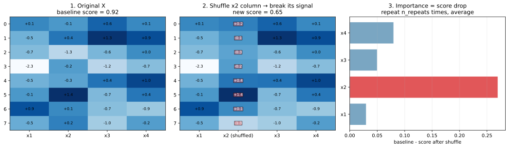
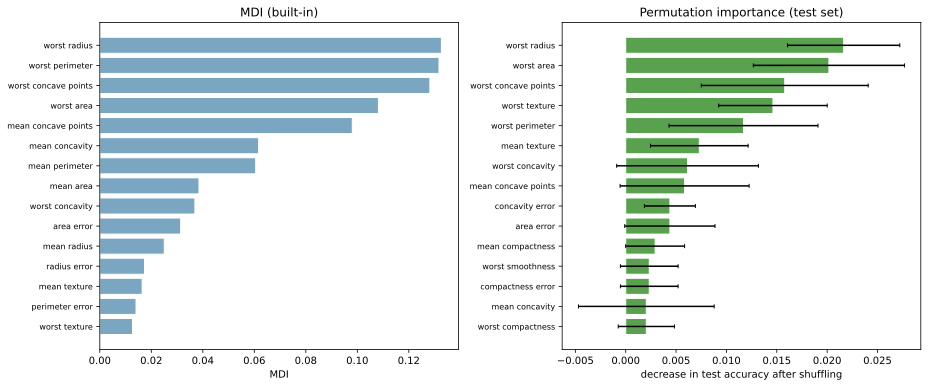
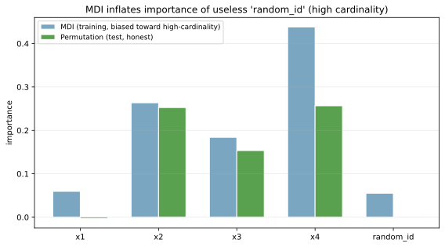

特徴量重要度（feature importance）は、「学習済みモデルにとってどの特徴量がどれだけ予測に効いているか」を定量化する値である。モデルの説明性を上げる、不要な特徴量を捨てる、データ収集の優先順位を決める、といった目的で使われる。

代表的な手法は 3 系統に大別できる。

- 組み込み重要度（model-specific）: 木系モデルの MDI（mean decrease in impurity）、線形モデルの係数の絶対値
- 並べ替え重要度（permutation importance）: 1 列をシャッフルしたときのスコア低下を測る
- SHAP 値（model-agnostic, ゲーム理論ベース）: 各サンプル × 各特徴量に対する寄与を協力ゲーム理論の枠組みで分配

このうち permutation importance は実装がシンプルで偏りが少なく、モデルに依存しないため第一選択肢として使いやすい。組み込み重要度は学習データから直接取れるので速いが、いくつかの落とし穴（高カーディナリティバイアス）がある。

### 3 系統の使い分け



判断軸:

- 速度優先 → 木系の MDI
- 偏りの少なさ・モデル横断 → permutation importance
- 個別予測の説明 → SHAP

---

### 組み込み重要度（MDI）: 速いが偏る

[ランダムフォレスト](../random-forest/) や [勾配ブースティング](../gradient-boosting/) では、各特徴量で分割したときの「不純度の減少量の合計」が `feature_importances_` として取れる。これが MDI（mean decrease in impurity）である。

```python
from sklearn.datasets import load_breast_cancer
from sklearn.ensemble import RandomForestClassifier
from sklearn.model_selection import train_test_split

data = load_breast_cancer()
X_tr, X_te, y_tr, y_te = train_test_split(data.data, data.target,
                                            test_size=0.3, stratify=data.target,
                                            random_state=0)
rf = RandomForestClassifier(n_estimators=200, random_state=0).fit(X_tr, y_tr)
mdi = rf.feature_importances_
# 描画は scripts 側を参照
plt.savefig("featimp_mdi.svg", bbox_inches="tight")
```



`worst perimeter`、`worst area`、`worst concave points` あたりが上位に来ている。MDI の利点は (1) 学習中に副産物として計算できるので高速、(2) すべての訓練サンプルを使うので分散が小さい、という 2 点。

ただし MDI には 2 つの偏りがある。

- 高カーディナリティバイアス: 連続値や値の種類が多い特徴量に高い重要度を付けやすい
- 相関する特徴量への分散: 似た特徴量があると重要度が分散して、本来重要なはずの特徴量の値が薄まる

---

### Permutation importance: モデル横断で偏りが少ない

Permutation importance（並べ替え重要度）の手順:



「その特徴量を壊したらどれだけスコアが落ちるか」を測る、というシンプルな発想である。

```python
import numpy as np

rng = np.random.default_rng(0)
data4 = rng.normal(0, 1, (8, 4))
shuffled = data4.copy()
shuffled[:, 1] = rng.permutation(shuffled[:, 1])  # x2 列だけシャッフル
# 詳細な可視化は scripts 側を参照
plt.savefig("featimp_permutation_steps.svg", bbox_inches="tight")
```



左: 元のデータ X、中央: x2 列だけランダムに並べ替えたデータ、右: スコア低下から計算した重要度。x2 列をシャッフルするとスコアが大きく落ちるので、x2 の重要度が高いと判定される。x1 や x3 の重要度はほぼ 0、x4 もわずかにスコアに寄与している、という読みになる。

実装は scikit-learn の `permutation_importance` 1 行で済む。

```python
from sklearn.inspection import permutation_importance
perm = permutation_importance(rf, X_te, y_te, n_repeats=20, random_state=0)
print(perm.importances_mean)  # 各特徴量の平均重要度
print(perm.importances_std)   # 重要度のばらつき
plt.savefig("featimp_mdi_vs_permutation.svg", bbox_inches="tight")
```



左が MDI（訓練データから計算）、右が permutation importance（テストデータから計算）。上位の特徴量はおおむね一致するが、順位や相対的な大きさが微妙に異なる。permutation importance は誤差バー（黒い線）も出すので、「重要度の差は誤差範囲か」も判断できる。

注意点として、permutation importance は次の特性を持つ。

- テストデータ（または validation データ）で計算する: 訓練データで計算すると過学習を含んだ重要度になる
- 計算コストが高い: 特徴量数 × n_repeats 回の評価が必要
- 相関の強い特徴量があると、片方をシャッフルしてもモデルが他方から情報を取れるため、両方とも重要度が低めに出る

---

### MDI のバイアスを permutation で見破る

「高カーディナリティ特徴量に MDI がバイアスする」現象を、ランダムな ID 列を加えて確認する。

```python
from sklearn.datasets import make_classification

X_base, y = make_classification(n_samples=2000, n_features=4, n_informative=3,
                                 random_state=0)
# ノイズ高カーディナリティ列を追加
noise_id = np.random.default_rng(0).integers(0, 2000, size=2000)
X_full = np.hstack([X_base, noise_id.reshape(-1, 1)])
# X1..X4 が本物の特徴量、random_id は予測に無関係
# 学習して MDI と permutation importance を比較
plt.savefig("featimp_mdi_bias.svg", bbox_inches="tight")
```



`random_id` は予測に全く無関係なランダム列だが、MDI（青）では `x1` `x2` と並ぶ重要度を獲得している。これは木が「分割の候補」として連続値や値の種類の多い列を選びやすく、訓練データ上ではたまたま不純度を下げる分割を見つけられてしまうため。

一方、permutation importance（緑）では `random_id` の値はほぼ 0 で、本物の `x1〜x3` だけが正しく高い重要度を持つ。テストデータでシャッフルしても、もともと予測に効いていないのでスコアが落ちないからである。

教訓: 木系モデルの MDI を信じる前に、permutation importance で再検証するのが安全。実装が `from sklearn.inspection import permutation_importance` で 1 行なので、コストはほぼ無い。

---

### 相関のある特徴量は重要度が分散する

互いに相関の強い特徴量があると、permutation importance は両者の重要度を「半分ずつ」分配しがちになる。`A` と `B` が同じ情報を持つなら、`A` をシャッフルしても `B` から情報を引けるのでスコアが落ちにくく、`B` をシャッフルしても同様、という現象である。

対策:

- 事前に特徴量の相関を確認し、強相関のグループは 1 つに絞る（[特徴量選択](../feature-selection/) のノート参照）
- 階層的な permutation: 相関グループを同時にシャッフルし、グループ単位の重要度を測る
- SHAP の `TreeExplainer` を使う（相関の扱いがより理論的に整理されている）

### 数学での使いどころ

- MDI の理論: 各分割の不純度減少量 × その分割を通るサンプル数の合計
- Permutation importance とランダム置換の検定: 帰無仮説「この特徴量は予測に寄与しない」の検定統計量に近い解釈
- SHAP value: Shapley value（協力ゲーム理論）に基づく特徴量への寄与の分配
- Sobol 感度指標: 各特徴量の分散寄与（数値解析・物理シミュレーションで頻出）
- 部分依存プロット（PDP）と ICE プロット: 重要度に加えて「効きの方向」を見る

---

### 機械学習での使いどころ

- EDA と特徴量設計: 重要度が高いトップ N に絞ってドメイン的な解釈を進める
- [特徴量選択](../feature-selection/): 重要度の低い特徴量を順に削って評価する recursive feature elimination
- モデルデバッグ: 不自然に重要度が高い特徴量がないか確認（[データリーク](../data-leakage/) の早期発見）
- ステークホルダー説明: 「このモデルはこれらの変数で予測している」と提示する
- 不公平性監査: 保護属性（性別、年齢、人種）の重要度が高すぎないかチェック
- 異常検知の根拠提示: 異常スコアが高いサンプルに対して、どの特徴量が貢献したか（SHAP）
- データ収集の優先順位: 重要度の高い特徴量のデータ品質改善に投資
- A/B テストの効果分解: 各セグメントで重要度が変わるかを見て、ヘテロな効果を発見

実装の選び方:

- 速度優先: `model.feature_importances_`（MDI）
- 信頼性優先: `permutation_importance(model, X_test, y_test)`
- 詳細な説明性: `shap.TreeExplainer(model)` または `shap.KernelExplainer(model.predict, X_train)`

---

### 適さないケース / 落とし穴

- MDI を「目的変数との相関」と誤解する: MDI は「モデルが使った量」であって、未使用の重要特徴量があれば見落とす
- 訓練データで permutation importance を計算: 過学習を含んだ重要度になる。必ずテスト or validation で
- 相関の強い特徴量グループに対する MDI / permutation: 重要度が分散する。グループ単位で分析するか、SHAP に切り替える
- カテゴリ変数のエンコーディング後に MDI を比較: ダミー変数 1 つの重要度と元のカテゴリ全体の重要度は別物。グループ集計が必要
- スケールが違う特徴量で線形係数を比較: [標準化](../standardization/) しないと係数の大きさが意味を持たない
- 重要度ランキングだけで因果を主張: 重要度はあくまでモデルの予測上の効き方で、因果関係とは別。介入実験や因果推論の枠組みが別途必要
- 不均衡データで accuracy ベースの permutation: スコア低下が見えにくい。`scoring="f1"` や `"roc_auc"` を指定する
- `n_repeats=1` で済ます: ばらつきが分からない。最低 5、できれば 20 以上
- データリークしたモデルの重要度: 漏洩した特徴量が極端に高い重要度を得るので、信頼性 0。先にリークを除去する
- SHAP の値を「特徴量が増えるとスコアが増える」と単純解釈: SHAP は「他の特徴量の値が決まった条件下での寄与」なので、相互作用を含む。単独効果ではない
