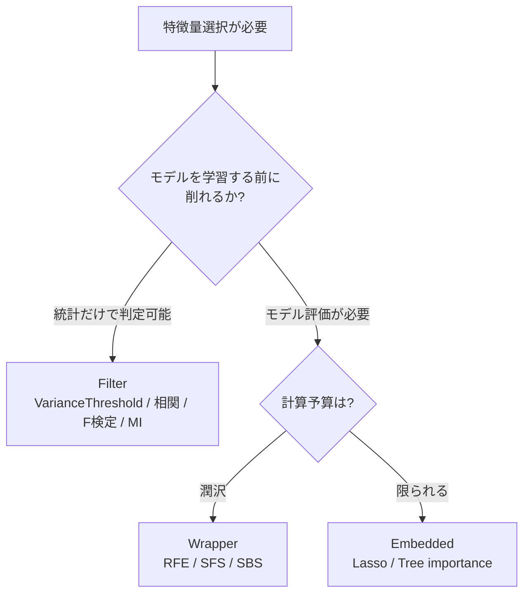
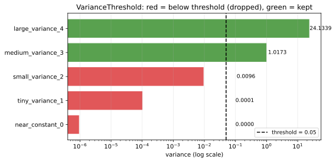
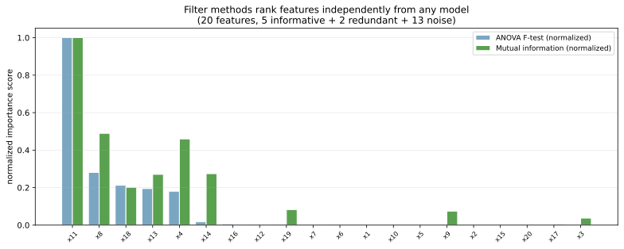
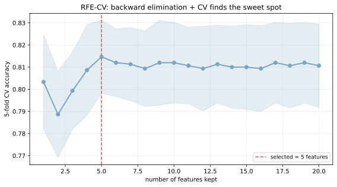
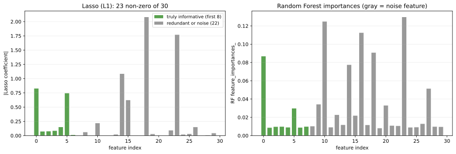

特徴量選択（feature selection）は、使える特徴量の中からモデルにとって有用な部分集合を選び出し、それ以外を捨てる前処理である。目的は (1) [過学習](../overfitting/) の抑制、(2) 学習・推論コストの削減、(3) モデルの説明性向上、(4) [次元の呪い](../curse-of-dimensionality/) の緩和、の 4 点に集約される。

手法は 3 系統に分かれる。

- フィルタ法（filter）: モデルに依存せず、統計的指標（分散、相関、相互情報量、F 値）で特徴量をランク付け
- ラッパー法（wrapper）: モデルを実際に学習・評価しながら、特徴量を入れたり外したりを繰り返す（RFE、forward / backward selection）
- 埋め込み法（embedded）: 学習アルゴリズム自身が特徴量選択を兼ねる（Lasso、決定木の重要度）

[特徴量重要度](../feature-importance/) と密接に関連するが、重要度は「学習済みモデルの解釈」、特徴量選択は「学習前の特徴量の絞り込み」という違いがある（実際には重要度ベースの選択もあるので境界はあいまい）。

### 3 系統の使い分け



判断軸:

- 速度優先・特徴量が大量 → Filter
- 精度優先・特徴量数が中程度（数十〜数百） → Wrapper
- 中規模で線形 or 木モデルを使う → Embedded（Lasso / Tree）

---

### Filter 法 1: VarianceThreshold

最も軽量な手法。分散がほぼゼロ（= 全サンプルでほぼ同じ値）の特徴量はモデルへの寄与が薄いので捨てる。

```python
import numpy as np
import matplotlib.pyplot as plt
from sklearn.feature_selection import VarianceThreshold

# 各列の分散が異なる 5 つの特徴量
X = np.column_stack([
    np.zeros(1000) + np.random.normal(0, 0.001, 1000),  # ほぼ定数
    np.random.normal(0, 0.01, 1000),                     # 小分散
    np.random.normal(0, 0.1, 1000),
    np.random.normal(0, 1.0, 1000),
    np.random.normal(0, 5.0, 1000),
])
vt = VarianceThreshold(threshold=0.05)
X_reduced = vt.fit_transform(X)
print(f"shape: {X.shape} -> {X_reduced.shape}")
plt.savefig("featsel_variance_threshold.svg", bbox_inches="tight")
```

出力:

```text
shape: (1000, 5) -> (1000, 3)
```



赤い棒（分散 < 0.05）が閾値以下で除外される特徴量、緑が保持される特徴量。`VarianceThreshold(threshold=0.0)` で「全く動かない定数列」だけ落とすのが安全。閾値を厳しくすると本物の特徴量も落ちる危険があるので、低めに設定するのが現実的と考えられる。

注意点: 標準化していない生のスケールに依存するので、[標準化](../standardization/) との順序で結果が変わる。普通は VarianceThreshold を先に当てる。

---

### Filter 法 2: SelectKBest（F 検定・相互情報量）

統計的な指標で「目的変数との関係が強い」上位 `k` 個を残す。代表的なスコアは次の通り。

- ANOVA F 値（`f_classif`）: 分類で各特徴量と目的変数の分散比。線形関係を測る
- 相互情報量（`mutual_info_classif`）: 非線形依存も含めた一般的な依存性
- カイ二乗（`chi2`）: 非負特徴量とカテゴリ目的変数（テキスト分類で頻出）

```python
from sklearn.feature_selection import SelectKBest, f_classif, mutual_info_classif
from sklearn.datasets import make_classification

X, y = make_classification(n_samples=1500, n_features=20, n_informative=5, random_state=0)
f_scores, _ = f_classif(X, y)
mi_scores = mutual_info_classif(X, y, random_state=0)
print(f"top-5 by F-test: {np.argsort(f_scores)[::-1][:5]}")
print(f"top-5 by MI:     {np.argsort(mi_scores)[::-1][:5]}")
plt.savefig("featsel_filter_scores.svg", bbox_inches="tight")
```



F 検定（青）と MI（緑）はどちらも「予測に効く特徴量を上位に出す」点では共通するが、F 検定は線形関係に特化し、MI は非線形依存も拾う。両者がほぼ一致するなら関係が線形的、大きく食い違うなら非線形成分が強い、と読める。

`SelectKBest(score_func=f_classif, k=10).fit_transform(X, y)` のように 1 行で上位 `k` 個を取り出せる。

---

### Wrapper 法: RFE（recursive feature elimination）

RFE は「全特徴量で学習 → 最も重要度の低い特徴量を 1 つ削除 → 残りで再学習」を繰り返し、最終的に指定した数の特徴量に絞る。`RFECV` は CV と組み合わせて「精度が最大になる特徴量数」を自動探索する。

```python
from sklearn.feature_selection import RFECV
from sklearn.linear_model import LogisticRegression

estimator = LogisticRegression(max_iter=2000)
rfecv = RFECV(estimator, step=1, cv=5, scoring="accuracy").fit(X, y)
print(f"optimal n_features: {rfecv.n_features_}")
plt.savefig("featsel_rfe_cv.svg", bbox_inches="tight")
```



横軸が「残した特徴量数」、縦軸が CV スコアの平均（青の帯は標準偏差）。少ない特徴量だと表現力不足で under-fit、増やすと頭打ちになり、最終的にノイズが入ってわずかに下がる。赤い破線が CV スコアが最大の点で、ここを「最適な特徴量数」として採用する。

RFE は精度が高いが、(特徴量数 × 評価回数) のオーダーで計算量が増えるため、特徴量が数百を超えると現実的でなくなる。中規模データでの「ガチで効く手法」だが、いつも使えるわけではないと考えられる。

---

### Embedded 法: Lasso と Tree importance

学習自体が特徴量選択を兼ねるアプローチ。代表は Lasso（L1 [正則化](../regularization/)）と木系モデルの組み込み重要度。

- Lasso: L1 正則化で重要でない特徴量の係数を厳密に 0 にする
- Tree importance: 分割で使われなかった特徴量は重要度 0

```python
from sklearn.linear_model import LogisticRegression
from sklearn.ensemble import RandomForestClassifier
from sklearn.pipeline import make_pipeline
from sklearn.preprocessing import StandardScaler

X, y = make_classification(n_samples=2000, n_features=30, n_informative=8, random_state=0)
lasso = make_pipeline(StandardScaler(),
                      LogisticRegression(penalty="l1", solver="liblinear", C=0.5,
                                          max_iter=5000)).fit(X, y)
rf = RandomForestClassifier(n_estimators=200, random_state=0).fit(X, y)
print(f"Lasso non-zero: {(np.abs(lasso[-1].coef_[0]) > 1e-6).sum()} of 30")
plt.savefig("featsel_embedded_compare.svg", bbox_inches="tight")
```



左の Lasso は L1 で多くの係数を 0 に潰し、真の informative 特徴量（緑、最初の 8 つ）を中心に残している。右の RF は重要度が連続値で、informative はおおむね高く出るがノイズの一部にも値が入る。

両者の使い分け:

- Lasso: 線形関係が支配的、係数の解釈が欲しい
- Tree importance: 非線形・相互作用が重要、ロバスト性が欲しい

実装上は `SelectFromModel(LassoCV()).fit_transform(X, y)` や `SelectFromModel(RandomForestClassifier(), threshold="median").fit_transform(X, y)` のように、しきい値で自動的に切ることができる。

---

### 多重共線性対策: 相関の強い特徴量を 1 つにまとめる

[相関係数](../../math/correlation/) のノートで触れた通り、相関の強い特徴量は (1) 線形モデルの係数を不安定にする、(2) ツリーの分割で重要度が分散する、という問題を起こす。相関行列を計算して、しきい値（例: `|r| > 0.9`）を超えるペアの片方を捨てるのも有効な特徴量選択になる。

```python
import pandas as pd

corr = pd.DataFrame(X).corr().abs()
upper = corr.where(np.triu(np.ones(corr.shape), k=1).astype(bool))
to_drop = [col for col in upper.columns if any(upper[col] > 0.9)]
X_reduced = pd.DataFrame(X).drop(columns=to_drop)
```

これは [PCA](../pca/) との対比で見ると分かりやすい。PCA は相関のある特徴量を線形結合で集約して新しい軸を作るのに対し、こちらは元の特徴量から代表 1 つを残す。解釈性を優先するなら後者、精度を優先するなら PCA / Lasso のどちらかが現実的となる。

### 数学での使いどころ

- 分散ベース指標: VarianceThreshold、PCA の分散基準
- 情報理論的指標: 相互情報量 `I(X; Y) = Σ_xy P(x,y) log(P(x,y) / (P(x) P(y)))`
- 統計的検定: ANOVA F、`χ²`、t 検定
- L1 正則化の幾何: Lasso の制約集合が `|w|_1 ≤ c` で頂点を持つため、頂点で `w_k = 0` が選ばれやすい
- マルコフブランケット: 確率モデルで「目的変数の予測に必要十分な特徴量集合」
- 部分集合選択の組合せ爆発: `2^d` の選択肢から最適を探すのは NP 困難（greedy で近似）

---

### 機械学習での使いどころ

- 高次元データ（テキスト、ゲノム、画像）: 数千〜数万の特徴量があっても、本当に効くのは数十〜数百
- 計算予算が限られた推論: 入力次元を減らしてレイテンシを下げる
- ステークホルダー説明: 「これらの 10 個の特徴量で予測している」と提示
- 過学習が疑われるとき: 特徴量を絞ることで [バイアス-バリアンス](../bias-variance-tradeoff/) のバリアンス側を抑える
- データ品質改善の優先順位: 重要度の高い特徴量のクリーニングに投資
- A/B テスト後の特徴量効果検証: 新しい特徴量がモデルに採用されるか
- 特徴量エンジニアリングの反復: 仮設で作った特徴量が effective かを定量化
- データ収集コスト削減: 効かない特徴量の収集を止める

scikit-learn の主要 API:

- `VarianceThreshold`
- `SelectKBest` / `SelectPercentile` + `f_classif` / `mutual_info_classif` / `chi2`
- `RFE` / `RFECV`
- `SelectFromModel`（Lasso、Tree などをラップ）
- `SequentialFeatureSelector`（forward / backward selection）

---

### 適さないケース / 落とし穴

- データリーク: テストデータも含めて特徴量選択すると、テストの情報が訓練に流れ込む（[data leakage](../data-leakage/)）。CV の中で fold ごとに選択する
- 解釈性のための選択 vs 精度のための選択を混同: 「説明しやすい少数特徴量」と「精度最高の特徴量集合」は別物
- Filter で削った特徴量がモデル特有に重要だった: filter は単変量で評価するので、相互作用で効く特徴量を見落とす
- RFE をデータが少ない状態で使う: 削除の判断が不安定になる。CV を必ず併用する
- Lasso で重要だが相関した特徴量の片方が消える: ペアのうちどちらが残るかは恣意的。グループ Lasso か事前の相関ベース選択を併用する
- 木系の組み込み重要度を信じすぎる: 高カーディナリティバイアスがある（[特徴量重要度](../feature-importance/) 参照）
- 特徴量選択後に評価指標を再評価しない: 「削っても精度は変わらない」のはずが、実は微減していた、というのが起きる。CV で必ず確認する
- 特徴量設計を諦めて特徴量選択に頼る: 元データに情報が無ければ、いくら選択しても精度は上がらない。データ品質と特徴量エンジニアリングが先
- カテゴリ変数のダミー化前に選択: ダミーの個別列ごとに選ばれると、カテゴリの一部だけ残るような奇妙な結果になる。グループ単位で扱うか、ダミー化前にカテゴリ全体で評価する
- 次元削減（PCA）と混同: PCA は新しい軸を作るので元の特徴量は消えるが、特徴量選択は元のまま部分集合を残す。説明性目的なら特徴量選択、情報集約目的なら PCA、と用途が違う
