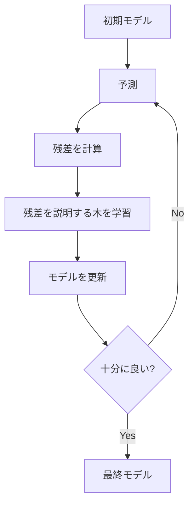
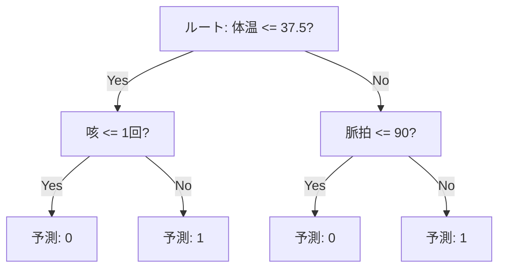

GradientBoosting は、弱い学習器（主に浅い決定木）を順番に足していくアンサンブル手法。前のモデルの誤差（残差）を次のモデルが補正するように学習し、加法モデルとして精度を高める。

- アンサンブル手法：複数モデルの出力をまとめて、単体より安定・高精度を狙う方法。  
- ブースティング：前のモデルの誤差を次で補正する「順番に積み上げる」やり方。  
- 弱い学習器*：単体だと少し良い程度のモデルで、ここでは浅い決定木を使うことが多い。
- 加法モデル：各木の予測を足し合わせた合計で最終予測を作る考え方。

### 仕組み（概要）

1. 初期モデルで予測し、誤差（残差）を計算
2. 残差を説明する木を学習して追加
3. 学習率（learning_rate）で寄与を調整しながら繰り返す



---

### 決定木の分岐例（しきい値）

GradientBoosting で使う弱い学習器は、浅い決定木が代表的。  
決定木は「しきい値でデータを分ける」を繰り返して予測する。



---

### 残差と学習率の捉え方

残差は「正解 - 予測」。  
次の木は、この残差を小さくする方向に学習する。

学習率は、追加する木の影響の強さを調整する係数。  
小さいほど安全に学習できるが、木の数が必要になる。

---

### 前提・注意

* 学習率と木の数のバランスが性能に強く影響する
* 学習は順次で並列化しにくい
* [過学習](../overfitting/)しやすいので早期停止や[交差検証](../cross-validation/)が重要

---

### 利点
* 精度が高く、非線形・相互作用に強い
* 前処理が比較的少なくて済む
* 特徴量の重要度を見られる

---

### 欠点
* [ハイパーパラメータ](../hyperparameter/)調整が必須になりがち
* 学習に時間がかかる
* 外れ値に敏感なケースがある

---

## Python での実例

```python
import pandas as pd
from sklearn.model_selection import train_test_split
from sklearn.ensemble import GradientBoostingClassifier
from sklearn.metrics import roc_auc_score

X = df.drop(columns=["target"])
y = df["target"]

X_train, X_valid, y_train, y_valid = train_test_split(
    X, y, test_size=0.2, random_state=0, stratify=y
)

model = GradientBoostingClassifier(
    n_estimators=300,
    learning_rate=0.05,
    max_depth=3,
    random_state=0,
)
model.fit(X_train, y_train)
proba = model.predict_proba(X_valid)[:, 1]
print("ROC-AUC:", roc_auc_score(y_valid, proba))
```

---

### 機械学習での使いどころ

* 高精度が必要な分類・回帰
* 特徴量が多く複雑な関係を含むデータ
* XGBoost / LightGBM / CatBoost の前提理解

---

### 適さないケース

* 学習時間や計算資源が厳しい場合
* 強いノイズがあり過学習が支配的な場合
