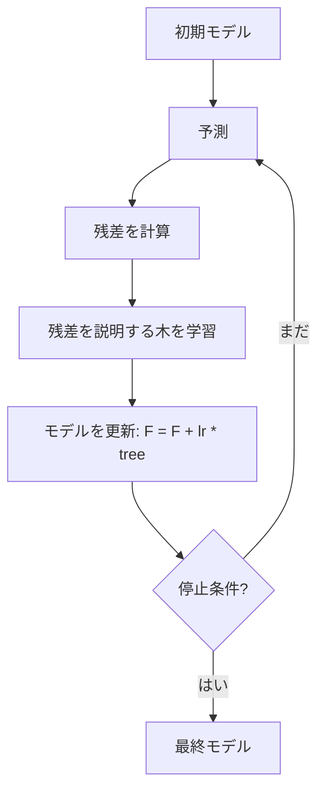
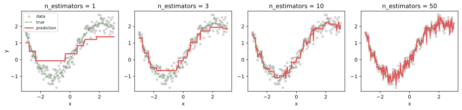
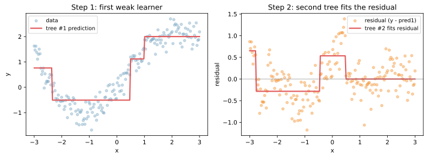
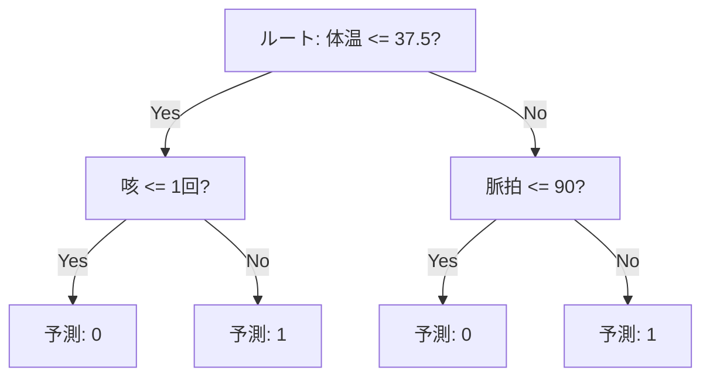
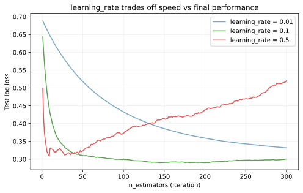
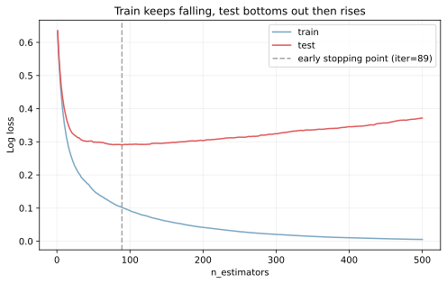

GradientBoosting（勾配ブースティング）は、浅い [決定木](../decision-tree/) のような弱い学習器を 1 本ずつ順番に足していき、前のモデルが取りこぼした「誤差（残差）」を次の木で説明させることで予測精度を高める教師あり学習の手法である。最終的な予測は、これまで足したすべての木の出力を足し合わせた加法モデル `F(x) = f_1(x) + f_2(x) + ... + f_M(x)` として表される。

[RandomForest](../random-forest/) と並ぶ [アンサンブル学習](../ensemble-learning/) の代表だが、考え方の方向が逆になっている。RandomForest は複数の独立な木を並列に作って平均（バギング）するのに対し、GradientBoosting は前の予測の残差を見て次の木を作る「逐次的・依存的」な構造を取る。RandomForest が「多様な意見を平均して安定させる」のに対し、GradientBoosting は「直前の誤りを少しずつ削っていく」発想と言える。

「残差」は厳密には [損失関数](../loss-functions/) の負の勾配で、回帰なら MSE の勾配（= 残差そのもの）、分類なら交差エントロピーの勾配が使われる。損失関数を切り替えれば回帰・分類・分位回帰・ランキングなど多用途に適用できる柔軟さが、勾配ブースティングの強みの 1 つとなる。

| | RandomForest（Bagging） | GradientBoosting（Boosting） |
|---|---|---|
| 木の作り方 | 並列・独立 | 逐次・依存 |
| 個々の木の深さ | 深め（フル成長まで） | 浅め（depth=3〜8） |
| 集約方法 | 平均/多数決 | 加法（足し合わせ） |
| 過学習の傾向 | 起きにくい（平均で抑制） | 起きやすい（残差を追い続ける） |
| 学習の並列化 | 容易（木同士が独立） | 木単位では困難（依存関係あり） |
| 代表実装 | scikit-learn `RandomForestClassifier` | scikit-learn `HistGradientBoostingClassifier`、LightGBM、XGBoost、CatBoost |

表形式データ（テーブルデータ）のコンペや実運用では、Kaggle 系を中心に GradientBoosting 系（特に LightGBM / XGBoost）が最強クラスのモデルとして使われることが多いと言える。一方でハイパーパラメータの感度が高く、調整なしでは [RandomForest](../random-forest/) に負けることもあるため、`learning_rate` と `n_estimators` と `max_depth` のバランス取りが運用上の中核となる。

### 用語の整理

- アンサンブル手法: 複数モデルの出力をまとめて、単体より安定・高精度を狙う方法
- ブースティング: 前のモデルの誤差を次で補正する「順番に積み上げる」やり方
- 弱い学習器（weak learner）: 単体だと「ランダムよりちょっと良い」程度のモデル。GradientBoosting では浅い決定木（depth=3〜8）が代表
- 加法モデル: 各木の予測を足し合わせた合計で最終予測を作る考え方。線形回帰の係数和と同じ発想

---

### 仕組み（概要）

1. 初期モデル（多くの場合「全データの平均値や対数オッズ」のような単純な定数）で予測し、誤差（残差）を計算
2. 残差を説明する木を学習して、その予測を `learning_rate * tree_prediction` の形で加える
3. 残差を再計算して、また次の木を学習する
4. これを `n_estimators` 回繰り返す（あるいは early stopping で打ち切る）



「勾配」という名前は、損失関数を最小化する方向（勾配方向）に予測を更新していくことから来ている。回帰での二乗誤差なら勾配は単純な残差そのものになるが、分類のロジスティック損失では勾配がもう少し複雑な形になる。詳細はライブラリが自動で扱うので、利用側は「残差を埋めていく」と理解しておけば十分と考えられる。

---

### 残差を埋めていく直感

弱い学習器（浅い木）を 1, 3, 10, 50 本と積み上げると、予測曲線が真の関数（緑の点線）に徐々に近づいていく。



1 本だけだと階段関数のような粗い形にしかならない。3 本足すと細かい階段が増え、10 本で大まかな形が見えてくる。50 本では真の関数によく一致するが、訓練点のノイズに引っ張られ始めている兆候も見える（これが過学習の入口）。

各イテレーションで何が起きているかをもう少し細かく見ると、次のような流れになる。



左図: 1 本目の木は元データを粗く近似する。残差（真値 - 予測）が残っている。
右図: 2 本目の木は、その残差を入力にして「残差を説明する木」を学習する。これを元の予測に足し合わせると、組み合わさった予測は元データにより近くなる。これを繰り返すのが GradientBoosting の本質である。

---

### 決定木の分岐例（しきい値）

GradientBoosting で使う弱い学習器は、典型的には深さ 3〜8 の決定木である。決定木は「ある特徴量がしきい値以下か」で分岐を作り、葉に予測値を持つ。



GradientBoosting は、こうした浅い木を何百本も足し合わせる。1 本の木の表現力は限定的だが、足し合わせることで滑らかな関数や複雑な相互作用を表現できるようになる。

---

### ハイパーパラメータのトレードオフ

GradientBoosting の挙動を決める主要なハイパーパラメータは 3 つあり、互いに強く絡み合っている。[ハイパーパラメータ](../hyperparameter/)の選定はこの 3 つから入る。

- `learning_rate` （学習率、典型値 0.01〜0.3）: 各木の寄与の大きさ。小さいほど慎重に学習する
- `n_estimators` （木の本数、典型値 100〜2000）: 何本まで足すか
- `max_depth` （各木の深さ、典型値 3〜8）: 個々の木の複雑さ

`learning_rate` と `n_estimators` は「ほぼ反比例」の関係にある。`learning_rate=0.5` なら 50 本で十分でも、`learning_rate=0.01` なら 500〜1000 本必要、という具合に動く。下の図は同じデータで `learning_rate` だけ変えた 3 ケースの test log loss を `n_estimators` ごとに描いたもの。



- `learning_rate=0.5` は速く下がるが、底に達した後に上に跳ね始める（過学習）
- `learning_rate=0.1` はバランスが良く、安定して低い loss に届く
- `learning_rate=0.01` はゆっくり下がるが、300 本ではまだ底に届いていない

経験則として、`learning_rate=0.05〜0.1` に固定し、`n_estimators` を大きめに取って early stopping で打ち切る、というやり方が安定する。

```python
from sklearn.ensemble import HistGradientBoostingClassifier

model = HistGradientBoostingClassifier(
    learning_rate=0.05,
    max_iter=1000,           # 最大の木数
    max_depth=6,
    early_stopping=True,      # 自動で early stopping
    validation_fraction=0.2,  # 内部 validation 用に 20% を切り出す
    n_iter_no_change=20,     # 検証 loss が 20 回改善しなければ停止
    random_state=0,
)
```

`HistGradientBoostingClassifier` は scikit-learn 0.21 から導入された高速実装で、ヒストグラム化により大規模データでも実用的に動く。`GradientBoostingClassifier` より一桁速いことが多いので、特別な理由がなければこちらを使うのが標準的と考えられる。

---

### 過学習と早期停止

GradientBoosting は「残差を追い続ける」性質上、`n_estimators` を増やすほど訓練誤差は下がり続ける。一方でテスト誤差はある時点で底を打ち、その後上昇に転じる。これが GradientBoosting の典型的な過学習パターンである。



このデータでは test log loss は 89 イテレーション付近で最小（0.291）に到達し、その後 500 イテレーションまで進めると 0.371 まで悪化する。500 本も学習させると 27% も loss が悪化する勘定で、early stopping を入れないと無駄な計算をしながら過学習を進めることになる。

[過学習](../overfitting/)対策として、GradientBoosting 系では次の手段が標準的に用意されている。

- early stopping: 検証 loss が改善しなくなったら学習を打ち切る
- `learning_rate` を小さく: 1 本あたりの影響を抑えて、慎重に進む
- `max_depth` を浅く: 個々の木の表現力を制限
- `min_samples_leaf` / `min_child_samples` を大きく: 葉ノードに最低サンプル数を要求
- `subsample` を 1 未満に: 各木の学習に使うサンプル比率を絞る（stochastic gradient boosting）
- `colsample_bytree` / `max_features` を 1 未満に: 各木の学習に使う特徴量比率を絞る

---

### 前提・注意

- 学習率と木の数のバランスが性能に強く影響する（前節）
- 学習は逐次的なので、木単位での並列化はできない。ヒストグラム化や葉単位の並列化で速度を稼ぐ
- [過学習](../overfitting/)しやすいので early stopping や [交差検証](../cross-validation/) が重要
- 特徴量のスケーリングは不要（[標準化](../standardization/)の表参照）。[RandomForest](../random-forest/) と同じく順序ベース
- 木の数が多くなるとモデルが重く、推論時間にも影響する

---

### 利点

- 表形式データで実質的に最強クラスの精度（Kaggle 系で常勝）
- 非線形・特徴量の相互作用を自然に捉える
- 前処理コストが低い（標準化・外れ値処理がほぼ不要、欠損も実装によっては対応）
- 特徴量重要度を出せる（ただし [RandomForest](../random-forest/) と同様にバイアスがあるので `permutation_importance` 推奨）
- `predict_proba` で確率出力もそれなりに校正された値が出る
- LightGBM / XGBoost / CatBoost など最適化実装が豊富で、規模が大きくなっても動く

---

### 欠点

- [ハイパーパラメータ](../hyperparameter/) 調整が事実上必須で、`learning_rate` × `n_estimators` × `max_depth` のグリッドサーチや Optuna によるベイズ最適化が必要
- 学習に時間がかかる（早期停止しないと特に）
- 外れ値の影響を受けやすい（残差を追うため、外れ値が次の木で取り上げられる）
- モデルのサイズが大きくなりがちで、`n_estimators=1000`、`max_depth=8` だと数百 MB に達することもある
- 並列学習が限定的（GPU 対応 LightGBM などはあるが）
- 線形構造が強いデータでは [LogisticRegression](../logistic-regression/) より複雑なだけでメリットが薄い

---

## Python での実例

scikit-learn には 2 種類の実装がある。新しめのプロジェクトでは `HistGradientBoostingClassifier` を選ぶのが標準的。

```python
import pandas as pd
from sklearn.model_selection import train_test_split
from sklearn.ensemble import HistGradientBoostingClassifier
from sklearn.metrics import roc_auc_score

X = df.drop(columns=["target"])
y = df["target"]

X_train, X_valid, y_train, y_valid = train_test_split(
    X, y, test_size=0.2, random_state=0, stratify=y
)

model = HistGradientBoostingClassifier(
    learning_rate=0.05,
    max_iter=1000,
    max_depth=6,
    early_stopping=True,
    validation_fraction=0.2,
    n_iter_no_change=20,
    random_state=0,
)
model.fit(X_train, y_train)
proba = model.predict_proba(X_valid)[:, 1]
print("ROC-AUC:", roc_auc_score(y_valid, proba))
print("Trees actually used:", model.n_iter_)
```

`n_iter_` で実際に学習された木の本数を確認できる。`max_iter=1000` でも early stopping で 100〜300 本で止まることが多い。

より高速・高性能が必要な場合は LightGBM / XGBoost / CatBoost への乗り換えを検討する。インターフェースは scikit-learn 互換のラッパーがあるので、置き換えは小さな差分で済む。

| 実装 | 特徴 |
|---|---|
| `HistGradientBoostingClassifier` (sklearn) | 標準で入っている。中規模データなら十分速い |
| LightGBM | Microsoft 製。葉単位の成長で非常に高速。Kaggle 系で最も使われる |
| XGBoost | 老舗。安定性が高く、GPU 対応も成熟 |
| CatBoost | Yandex 製。カテゴリ変数を生のまま扱える点が強み |

---

### 機械学習での使いどころ

表形式データの分類・回帰では、まず [LogisticRegression](../logistic-regression/) と [RandomForest](../random-forest/) でベースラインを取り、その後 GradientBoosting 系で本命を狙う、という流れが定番になっていると言える。

- 高精度が必要な分類・回帰: Kaggle のテーブルコンペで上位常連
- 特徴量が多く複雑な関係を含むデータ: 非線形・相互作用に強い
- 不正検知・与信スコア・需要予測など、表形式データを扱う実運用
- `predict_proba` の確率を使いたいタスク（ROC-AUC / PR-AUC で評価する場面）

具体的な利用例:

- 不正取引検知で [PR-AUC](../roc-pr-auc/) を最大化する本命モデル
- 与信スコアリングで線形モデルの精度上限を超えたい場合
- ECサイトのクリック率予測（CTR）で大規模データを扱う場面
- 医療データで非線形な閾値効果を取りに行く場面

---

### 適さないケース

- 学習時間や計算資源が厳しい場合（リアルタイム学習・モバイル端末上の学習など）
- 強いノイズがあり過学習が支配的な場面: ノイズの残差まで追ってしまうので、[RandomForest](../random-forest/) の方が安定することがある
- 線形構造が支配的なデータ: [LogisticRegression](../logistic-regression/) で十分。GBDT は過剰
- 系列性・空間性が本質のデータ（時系列・画像・テキスト）: 専用モデル（RNN/CNN/Transformer）の方が適切
- 非常に小規模なデータ（数百件以下）: 木を 100 本も足す前にデータが足りない。`RandomForest` か線形モデルを選ぶ
