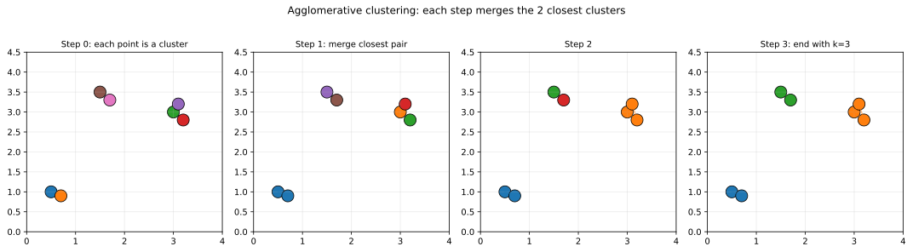
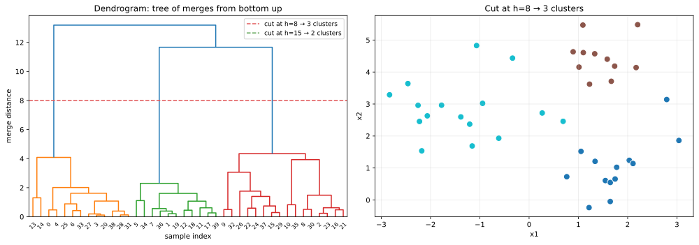
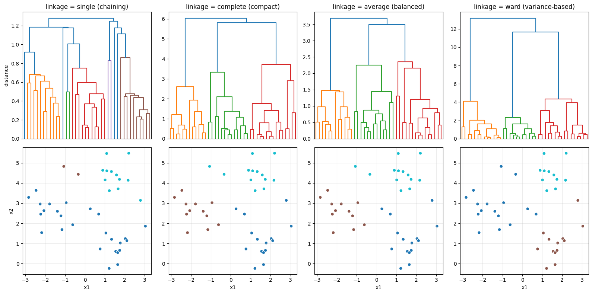

階層的クラスタリング（hierarchical clustering）は、データ点を徐々にマージしていく（または分割していく）ことで、樹形図（dendrogram）として全階層のクラスタ構造を可視化するアルゴリズムである。[k-means](../k-means/) や [DBSCAN](../dbscan/) のように「事前に `k` やパラメータを決める」必要がなく、樹形図を見てから「どこで切るか」で粒度を選べる。

代表的な使い分けの判断軸: 「`k` が決まらない、まず構造を見たい」「樹形図で説明したい」「クラスタの粒度を後から変えたい」場合に階層的が向く。ただし計算量 `O(n²)` 〜 `O(n³)` で大規模データには不向き。

### 凝集型と分割型

- 凝集型（agglomerative, bottom-up）: 各点を 1 クラスタとして始め、最も近い 2 クラスタを順にマージ
- 分割型（divisive, top-down）: 全データを 1 クラスタとして始め、繰り返し 2 分割

実装はほぼ凝集型が標準（scikit-learn の `AgglomerativeClustering`、`scipy.cluster.hierarchy`）。分割型は計算量が大きく、`scipy` の `cluster.hierarchy.bisect_kmeans` 程度。

```python
import numpy as np
from scipy.spatial import ConvexHull
import matplotlib.pyplot as plt

points = np.array([[0.5, 1.0], [0.7, 0.9], [3.0, 3.0], [3.2, 2.8],
                    [3.1, 3.2], [1.5, 3.5], [1.7, 3.3]])
# 各ステップで最も近い 2 クラスタを merge してゆく
plt.savefig("hierarchical_steps.svg", bbox_inches="tight")
```



ステップ 0 では各点が独立したクラスタ。ステップ 1 で最も近い 2 点（左下のペア）をマージ、ステップ 2 では別の点群がまとまり、ステップ 3 で `k = 3` の状態に到達。各ステップで「最近接の 2 クラスタ」を選ぶ単純なアルゴリズムだが、最近接の定義（リンク方法）で結果が変わる。

---

### 樹形図（dendrogram）と切り方

凝集型の出力は「樹形図」で可視化する。

```python
from scipy.cluster.hierarchy import linkage, dendrogram, fcluster
from sklearn.datasets import make_blobs

X, _ = make_blobs(n_samples=40, centers=3, cluster_std=0.8, random_state=0)
Z = linkage(X, method="ward")

dendrogram(Z, color_threshold=8)
labels = fcluster(Z, t=8, criterion="distance")  # 高さ 8 で切ってクラスタを得る
plt.savefig("hierarchical_dendrogram.svg", bbox_inches="tight")
```



左の樹形図は「下からマージしていく階層」を表す。高さ `h` で水平に切ると、その時点での「未マージのサブツリー数」がクラスタ数になる。

- 高さ 8 で切る: 3 つのクラスタ
- 高さ 15 で切る: 2 つのクラスタ
- 高さ 0 で切る: n 個のクラスタ（各点独立）

右の散布図は `h = 8` で切った結果。`k` を事前に決めなくても、樹形図を眺めて「どの高さで切るのが自然か」を判断できる。「縦に伸びた gap」（マージ間隔が大きい高さ）が自然な切れ目の候補となる。

---

### リンク方法（linkage method）

「2 つのクラスタ間の距離」をどう定義するかで、樹形図の形と結果が変わる。

| 手法 | クラスタ間距離 | 性質 |
|---|---|---|
| single | 最近接 2 点 | チェーン状にくっつく |
| complete | 最遠接 2 点 | コンパクトな球形クラスタ |
| average | 全ペアの平均距離 | balanced |
| ward | マージ前後の分散増加 | 球形 + クラスタサイズ均等 |

```python
from sklearn.cluster import AgglomerativeClustering

for method in ["single", "complete", "average", "ward"]:
    Z = linkage(X, method=method)
    ac = AgglomerativeClustering(n_clusters=3, linkage=method).fit(X)
plt.savefig("hierarchical_linkage_compare.png", bbox_inches="tight")
```



上段が樹形図、下段が `k = 3` で切った結果のクラスタ。

- single: 樹形図が縦に長いチェーン構造。ノイズに弱く、しばしば「巨大な 1 クラスタ + 小クラスタ」に
- complete: コンパクトな樹形図。外れ値の影響を受けやすい
- average: 安定的に動く、中庸の選択
- ward: 最も「均等な大きさのクラスタ」を作る。scikit-learn のデフォルト

実用ではまず ward から試すのが定石。データに非凸な構造（チェーン状の伸び）があれば single も試す価値がある。

### コフェネティック相関係数で linkage を選ぶ

「どの linkage が今のデータに合うか」を客観的に評価する指標がコフェネティック相関係数（cophenetic correlation coefficient）。元の距離行列と樹形図上の距離行列の相関で、1 に近いほど樹形図がデータの距離関係をよく保存している。

```python
from scipy.cluster.hierarchy import linkage, cophenet
from scipy.spatial.distance import pdist

dist_orig = pdist(X)
for method in ["single", "complete", "average", "ward"]:
    Z = linkage(X, method=method)
    c, _ = cophenet(Z, dist_orig)
    print(f"{method}: cophenetic r = {c:.3f}")
```

出力例:

```text
single: cophenetic r = 0.683
complete: cophenetic r = 0.762
average: cophenetic r = 0.844
ward: cophenetic r = 0.751
```

この場合 average が最も距離関係を保存している、と分かる。ただし「最良の linkage = 最大の精度」ではないので、ドメイン的に意味があるクラスタが出るかどうかは別途確認が必要。

### 数学での使いどころ

- 距離行列の計算（[ベクトル/行列の演算](../../math/vector-matrix-ops/) 参照）
- ward 法と分散減少（[分散](../../math/variance/)）
- 樹形図と二分木構造
- ultrametric 不等式（cophenetic distance の性質）
- 系統樹（phylogenetic tree）との関係

---

### 機械学習での使いどころ

- 遺伝子発現データのクラスタリング: heatmap + dendrogram の組み合わせ
- 顧客のセグメンテーション: 階層的な親和性
- 文書のトピック階層化（NLP）
- 画像のセグメンテーション
- ネットワークのコミュニティ階層
- データ探索（EDA）: 「とりあえず構造を見たい」
- 動物・植物の系統分類
- 言語の系統分類
- マーケットセグメンテーション（顧客層を 2 / 5 / 20 階層で切り替え）
- レコメンドのアイテム類似性ツリー
- 質的データの分類（カテゴリ間の距離）

scikit-learn の `AgglomerativeClustering`、`scipy.cluster.hierarchy` の `linkage / dendrogram / fcluster` がメイン。seaborn の `clustermap` は heatmap + dendrogram を同時に描けるので EDA で重宝する。

---

### 適さないケース / 落とし穴

- 大規模データ（n > 10⁴ 〜 10⁵）: 計算量 `O(n²)` でメモリ・時間が破綻。`MiniBatchKMeans` か `BIRCH` を検討
- 一度マージしたら撤回できない: greedy なので、初期の誤りが最後まで残る
- ノイズに弱い（特に single linkage）: 外れ値が「chain effect」で他のクラスタを橋渡しすることがある
- スケールが揃っていない: 距離が歪む。[標準化](../standardization/) を必ず先に
- 樹形図を読み間違える: x 軸の点の並び順は意味を持たない（垂直方向の高さだけが重要）
- linkage 選択を考えずに ward を使う: データ構造によって最適は変わる。コフェネティック相関で複数比較
- ward は euclidean 距離のみ: 他の距離（manhattan、cosine）では single / complete / average を使う
- 樹形図の縦軸の単位を無視: linkage によって意味が異なる（average なら平均距離、ward なら分散増加）
- 「自然な切れ目」が無い: gap が見えない場合は別のクラスタリング（[DBSCAN](../dbscan/)、k-means + silhouette）を検討
- 階層構造が無いデータに無理やり適用: フラットなクラスタなら [k-means](../k-means/) で十分
- カテゴリ変数を含む: 距離が定義しにくい。Gower 距離、または one-hot 後にコサイン類似度
- 切る高さを自動決定: silhouette score、Calinski-Harabasz index、gap statistic などで複数候補を比較
- 解釈時の罠: dendrogram の左右の枝の並びは恣意的（同じ高さで枝を入れ替えても木は変わらない）
