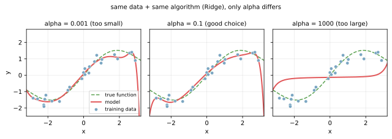

ハイパーパラメータ（hyperparameter）は、機械学習モデルを学習させる前に人間が決める設定値のこと。  
データから自動で決まる「パラメータ（parameter）」と区別される。

### パラメータとの違い

両者は「いつ・誰が決めるか」で分かれる。

- パラメータ (parameter): 学習の結果としてデータから決まる値。線形回帰の係数 `w_i`、ニューラルネットの重み、決定木の分岐条件など。人間は直接いじらない
- ハイパーパラメータ (hyperparameter): 学習を始める前に人間が決めて固定する値。[正則化](../regularization/)の `alpha`、[kNN](../knn/) の `k`、[RandomForest](../random-forest/) の `max_depth`、[GradientBoosting](../gradient-boosting/) の学習率 `learning_rate` など

scikit-learn の API で言うと、`Ridge(alpha=1.0).fit(X, y)` の `alpha=1.0` がハイパーパラメータ、`.fit()` した後にモデルが内部に持つ `.coef_` がパラメータである。

---

### 同じアルゴリズムでも全然違う挙動になる

データとアルゴリズムを固定して、ハイパーパラメータだけ変えた例。Ridge 回帰の正則化強度 `alpha` を 3 段階。

- `alpha=0.001`: 弱すぎてノイズまで拾い、訓練点をなぞる暴れた曲線
- `alpha=0.1`: 緑の真の関数（点線）にほぼ沿う
- `alpha=1000`: 強すぎて直線に潰れ、データの特徴を捉えきれない

同じ Ridge クラス、同じデータ、同じ `.fit()` を呼んでいるのに、人間が選ぶ 1 つの数字でモデルの性能が大きく変わる。ハイパーパラメータの選択がモデル性能に直結する典型例である。

---

### よく出会うハイパーパラメータ

| モデル | 代表的なハイパーパラメータ |
|---|---|
| [kNN](../knn/) | `n_neighbors` (k)、`weights`、`metric` |
| [ロジスティック回帰](../logistic-regression/) | `C` (正則化の逆数)、`penalty` (`l1`/`l2`) |
| [Ridge / Lasso](../regularization/) | `alpha` |
| [RandomForest](../random-forest/) | `n_estimators`、`max_depth`、`min_samples_leaf`、`max_features` |
| [GradientBoosting](../gradient-boosting/) | `learning_rate`、`n_estimators`、`max_depth`、`subsample` |
| ニューラルネット | 学習率、層の数、ユニット数、`batch_size`、`epochs`、`dropout` 率 |

---

### 選び方

ハイパーパラメータは「データに合わせて選ぶ」もので、決め打ち定数ではない。教科書的な定番手順は以下の通り。

1. 候補を絞る (例: `alpha ∈ [0.01, 0.1, 1.0, 10, 100]`)
2. [交差検証](../cross-validation/)で各候補の平均スコアを出す
3. 一番良かったものを採用
4. 必要なら 1 で外した範囲を再探索

scikit-learn では `GridSearchCV`（網羅探索）や `RandomizedSearchCV`（ランダム探索）が用意されている。候補数が多くなる[勾配ブースティング](../gradient-boosting/)系では Optuna のようなベイズ最適化系ツールも使われる。

---

### 機械学習での使いどころ

ハイパーパラメータの理解は、scikit-learn のコードを読む場面で常に必要になる。

- `RandomForestClassifier(max_depth=4, n_estimators=100, random_state=0)` のような呼び出しを見たとき、何が固定で何が学習されるか判断できる
- 結果が想定と違うとき、データを疑う前にハイパーパラメータの設定を確認できる
- 「テスト精度が低い」と相談されたら、`max_depth=None` のような無制限設定になっていないか、`alpha` が極端ではないかをまず聞ける

「ハイパーパラメータ調整した？」と聞かれて何を答えれば良いかが分かれば、議論の土俵に乗れると言える。

---

### よくある混乱

- ハイパーパラメータと「[過学習](../overfitting/)対策」を分けて考えてしまう: 多くの場合、両者は一体（`max_depth` を絞る = 過学習対策、かつハイパーパラメータ調整）
- `random_state` をハイパーパラメータと混同する: `random_state` は再現性のための乱数シードであって、性能に系統的な影響は与えない（探索対象に含めない）
- ハイパーパラメータ調整に固執しすぎる: 多くの問題ではデータの質や特徴量設計の方が効く。チューニングは効果が頭打ちになりやすい
