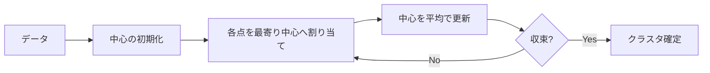

k-means（k平均法）は、データを「k個のクラスタ」に分け、各クラスタの中心（重心）に最も近い点同士を集める教師なし学習の手法である。  
目的は「クラスタ内のばらつきを最小化し、クラスタ間の分離を良くする」こと。分類器ではなく、分割・要約のための手法。

ここでの「クラスタ内平方和（SSE）を最小化」とは、次を意味する。  
1. 初期中心の設定：ランダムまたはk-means++でk個の中心を決める
2. 割り当て：各点を最も近い中心に割り当てる
3. 更新：割り当てられた点の平均を新しい中心にする
4. 収束：中心がほぼ動かなくなるまで2〜3を繰り返す



### 前提・注意

* k（クラスタ数）は事前に決める必要がある
* 初期値により結果が変わる（局所解）
* 距離は通常ユークリッド距離（連続値が前提）
* スケールが違うと結果が歪むので標準化が基本

**利点：**
* 実装が簡単で高速
* 大規模データに向く
* 結果が直感的（中心と距離）

**欠点：**
* kを事前に決める必要がある
* 非凸形状のクラスタに弱い
* 外れ値に引っ張られやすい
* カテゴリ変数が扱いにくい

## Python での実例

**元データ + クラスタ中心**
* 点群：元のデータ（x1, x2）
* 大きな点：各クラスタの中心

**クラスタ割り当て後**
* 色：割り当てられたクラスタ
* 中心：各クラスタの平均位置

```python
import numpy as np
import matplotlib.pyplot as plt

# 分かりやすい人工データ（3クラスタ）
rng = np.random.RandomState(0)
X1 = rng.randn(100, 2) + np.array([0, 0])
X2 = rng.randn(100, 2) + np.array([3, 3])
X3 = rng.randn(100, 2) + np.array([0, 4])
X = np.vstack([X1, X2, X3])

def kmeans(X, k, max_iter=100):
    # 初期中心をランダムに選ぶ
    rng = np.random.RandomState(0)
    centers = X[rng.choice(len(X), k, replace=False)]

    for _ in range(max_iter):
        # 各点を最も近い中心へ割り当て
        dists = np.linalg.norm(X[:, None, :] - centers[None, :, :], axis=2)
        labels = np.argmin(dists, axis=1)

        # 新しい中心を計算
        new_centers = np.array([X[labels == i].mean(axis=0) for i in range(k)])

        # 収束判定
        if np.allclose(centers, new_centers, atol=1e-4):
            break
        centers = new_centers

    return labels, centers

labels, centers = kmeans(X, k=3)

# 図1：元データ + 初期中心
plt.figure()
plt.scatter(X[:, 0], X[:, 1], alpha=0.3)
plt.title("Original data")
plt.xlabel("x1")
plt.ylabel("x2")
plt.axis("equal")
plt.show()

# 図2：k-means後
plt.figure()
plt.scatter(X[:, 0], X[:, 1], c=labels, cmap="tab10", alpha=0.5)
plt.scatter(centers[:, 0], centers[:, 1], c="black", s=120, marker="x")
plt.title("k-means clustering")
plt.xlabel("x1")
plt.ylabel("x2")
plt.axis("equal")
plt.show()
```

**Output:**


### 数学での使いどころ

数学・統計の文脈では、k-meansは以下の用途で使われる。

* データの代表点（プロトタイプ）抽出
* データの量子化（ベクトル量子化）
* 距離に基づく分割の理解

数学的には、以下で定式化される。

* 目的関数：クラスタ内平方和（SSE, Sum of Squared Errors）の最小化
* 「割り当て」と「中心更新」を交互に行う最適化
* k-meansはEMアルゴリズムの特例とみなせる

### 機械学習での使いどころ

機械学習では、k-meansは主に教師なし学習として使われる。

* クラスタリングの基礎手法
* 特徴量の要約・圧縮（Bag of Visual Wordsなど）
* セグメンテーション（画像や顧客のグルーピング）

具体的な利用例：

* 顧客の購買パターン分割
* 画像の色クラスタリング
* 文書のトピック概略の抽出
* k-meansでのクラスタラベルを特徴量として使う

### 適さないケース

* 非凸形状のクラスタ（同心円など）
* クラスタサイズ・密度が大きく違うデータ
* 外れ値が多いデータ
* 距離の意味が弱いカテゴリ中心のデータ
