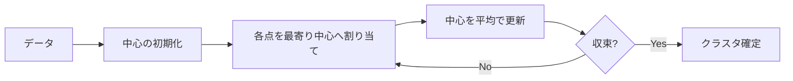
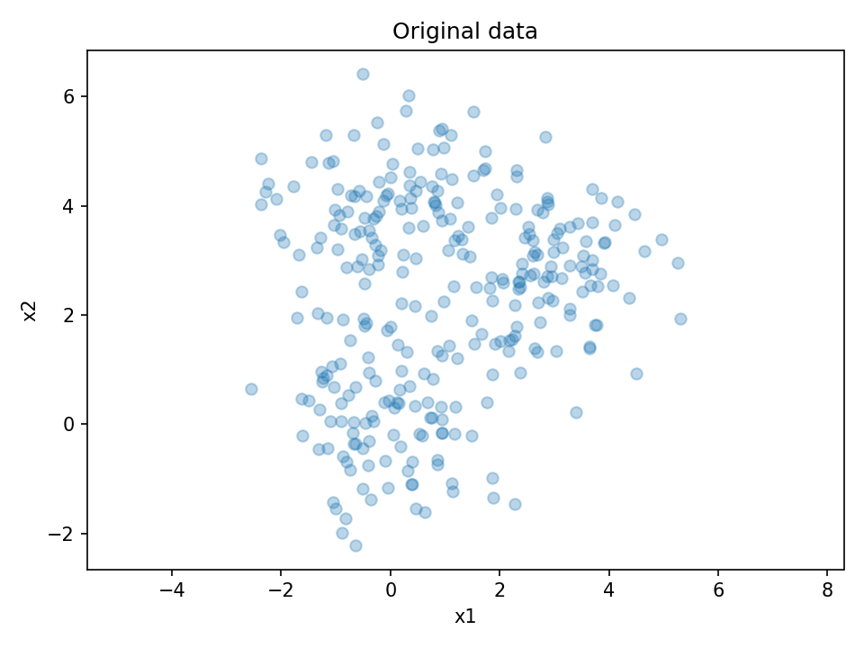
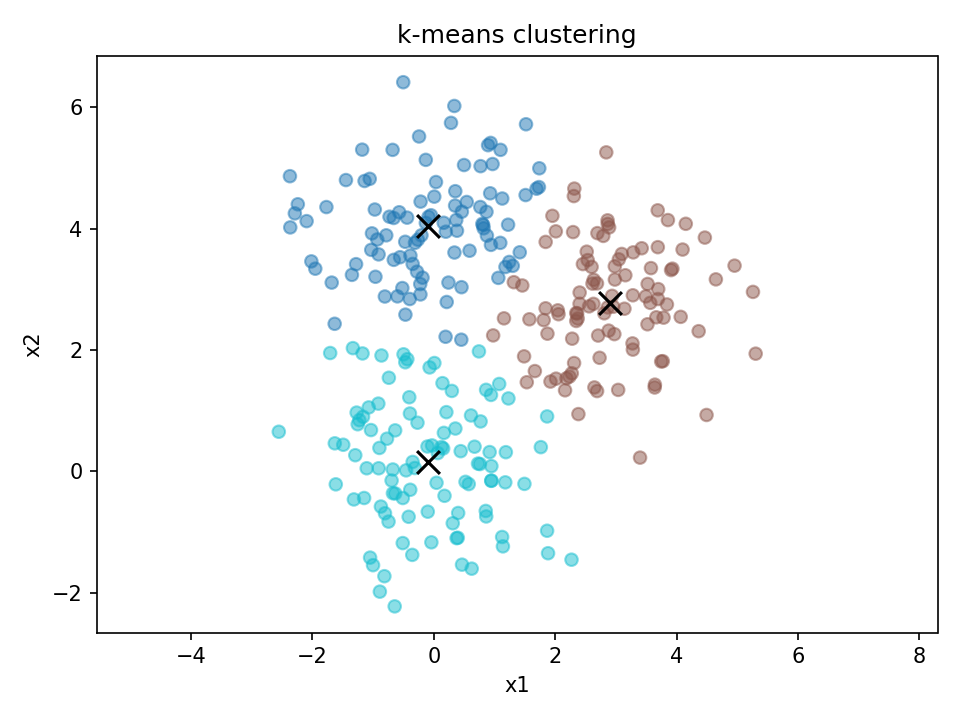
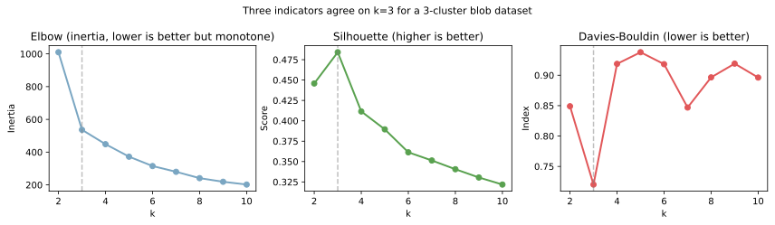

k-means（k平均法）は、データを「k個のクラスタ」に分け、各クラスタの中心（重心）に最も近い点同士を集める教師なし学習の手法である。  
目的は「クラスタ内のばらつきを最小化し、クラスタ間の分離を良くする」こと。分類器ではなく、分割・要約のための手法。

ここでの「クラスタ内平方和（SSE）を最小化」とは、次を意味する。  
1. 初期中心の設定：ランダムまたはk-means++でk個の中心を決める
2. 割り当て：各点を最も近い中心に割り当てる
3. 更新：割り当てられた点の平均を新しい中心にする
4. 収束：中心がほぼ動かなくなるまで2〜3を繰り返す



### 前提・注意

- k（クラスタ数）は事前に決める必要がある
- 初期値により結果が変わる（局所解）
- 距離は通常ユークリッド距離（連続値が前提）
- スケールが違うと結果が歪むので[標準化](../standardization/)が基本

---

### 利点
- 実装が簡単で高速
- 大規模データに向く
- 結果が直感的（中心と距離）

---

### 欠点
- kを事前に決める必要がある
- 非凸形状のクラスタに弱い
- 外れ値に引っ張られやすい
- カテゴリ変数が扱いにくい

---

## Python での実例

---

### 元データ + クラスタ中心
- 点群：元のデータ（x1, x2）
- 大きな点：各クラスタの中心

---

### クラスタ割り当て後
- 色：割り当てられたクラスタ
- 中心：各クラスタの平均位置

```python
import numpy as np
import matplotlib.pyplot as plt

# 分かりやすい人工データ（3クラスタ）
rng = np.random.RandomState(0)
X1 = rng.randn(100, 2) + np.array([0, 0])
X2 = rng.randn(100, 2) + np.array([3, 3])
X3 = rng.randn(100, 2) + np.array([0, 4])
X = np.vstack([X1, X2, X3])

def kmeans(X, k, max_iter=100):
    # 初期中心をランダムに選ぶ
    rng = np.random.RandomState(0)
    centers = X[rng.choice(len(X), k, replace=False)]

    for _ in range(max_iter):
        # 各点を最も近い中心へ割り当て
        dists = np.linalg.norm(X[:, None, :] - centers[None, :, :], axis=2)
        labels = np.argmin(dists, axis=1)

        # 新しい中心を計算
        new_centers = np.array([X[labels == i].mean(axis=0) for i in range(k)])

        # 収束判定
        if np.allclose(centers, new_centers, atol=1e-4):
            break
        centers = new_centers

    return labels, centers

labels, centers = kmeans(X, k=3)

# 図1：元データ + 初期中心
plt.figure()
plt.scatter(X[:, 0], X[:, 1], alpha=0.3)
plt.title("Original data")
plt.xlabel("x1")
plt.ylabel("x2")
plt.axis("equal")
plt.show()

# 図2：k-means後
plt.figure()
plt.scatter(X[:, 0], X[:, 1], c=labels, cmap="tab10", alpha=0.5)
plt.scatter(centers[:, 0], centers[:, 1], c="black", s=120, marker="x")
plt.title("k-means clustering")
plt.xlabel("x1")
plt.ylabel("x2")
plt.axis("equal")
plt.show()
```

出力:




---

### k の選び方

「クラスタ数 `k` を事前に決める必要がある」のが k-means の最大の制約で、`k` をどう決めるかは独立した問題になる。

最初に注意したいのは、イナーシャ（クラスタ内分散の合計, SSE）は「`k` を増やすほど単調に減る量」という性質である。極端には `k = n`（サンプル数と同じ）にすればイナーシャ = 0 になる。「イナーシャ最小だから良いクラスタ」という選び方は「訓練精度 100% だから良いモデル」と同型の誤りなので、イナーシャだけを最小化する選び方は採用できない。

実用では次の 3 つの指標を併用するのが定石である。

- イナーシャ（inertia, SSE）: `k` で単調減少。曲がり角（elbow, 肘）を目視で探す
- シルエット係数（silhouette score）: 各点について「同じクラスタ内の他点との近さ」と「最も近い他クラスタとの遠さ」の比を取る指標。-1〜+1 で「高い」ほど良い（0.5 以上で良好、0.2 以下は怪しい）
- Davies-Bouldin インデックス: クラスタ内分散とクラスタ間距離の比。「低い」ほど良い

3 指標が「同じ `k` 付近で山/谷を作る」ことを確認できると、その `k` を技術的に強く推せると言える。scikit-learn で 3 指標を一度に計算する例を示す。

```python
import matplotlib.pyplot as plt
from sklearn.cluster import KMeans
from sklearn.datasets import make_blobs
from sklearn.metrics import davies_bouldin_score, silhouette_score

X, _ = make_blobs(n_samples=300, centers=3, cluster_std=1.0, random_state=0)

ks = list(range(2, 11))
inertias, silhouettes, db_scores = [], [], []
for k in ks:
    km = KMeans(n_clusters=k, n_init=10, random_state=0).fit(X)
    inertias.append(km.inertia_)
    silhouettes.append(silhouette_score(X, km.labels_))
    db_scores.append(davies_bouldin_score(X, km.labels_))

fig, axes = plt.subplots(1, 3, figsize=(12, 3.5))
axes[0].plot(ks, inertias, "o-", color="#7aa6c2", linewidth=2)
axes[0].set_title("Elbow (inertia)"); axes[0].set_xlabel("k")
axes[1].plot(ks, silhouettes, "o-", color="#59a14f", linewidth=2)
axes[1].set_title("Silhouette (higher better)"); axes[1].set_xlabel("k")
axes[2].plot(ks, db_scores, "o-", color="#e15759", linewidth=2)
axes[2].set_title("Davies-Bouldin (lower better)"); axes[2].set_xlabel("k")
for ax in axes:
    ax.axvline(3, color="gray", linestyle="--", alpha=0.5)
fig.suptitle("Three indicators agree on k=3 for a 3-cluster blob dataset")
plt.tight_layout()
plt.savefig("k-means_selection.svg", bbox_inches="tight")
```

出力例:

```text
k     inertia   silhouette   davies-bouldin
2      1010.1        0.446         0.849
3       536.4        0.484         0.720   ← elbow / silhouette 最大 / DB 最小
4       448.6        0.411         0.919
5       372.2        0.390         0.938
6       315.1        0.361         0.918
```



3 つとも k=3 を指していて、技術的には k=3 で裏取りが取れている状態と考えられる。`k=2` の elbow も大きく下がっているように見えるが、silhouette と DB の両方が k=3 で改善するため、k=3 を採用する判断ができる。

現実的には、ここに「ビジネス文脈の擦り合わせ」が加わる。クラスタリングは正解ラベルが無いため、技術指標で出した `k` が業務として運用しやすいかをセグメント設計の担当者と確認する必要がある。具体的には次のような確認軸がある。

- セグメントごとに違う施策が打てるか
- 各セグメントを言語化（命名）できるか
- 運用人員・予算がセグメント数をさばけるか

技術指標と業務文脈の両輪で決まるのが現実的な手順となる。技術的に最適な `k` でも業務で運用できなければ採用しないし、技術的にギリギリの差なら業務側の好みに寄せる、といった判断が入る。

ここで使った図を生成するスクリプトは `projects/ml/scripts/notes/k-means_gen.py` にあり、`cd projects/ml && uv run python scripts/notes/k-means_gen.py` で再生成できる。

---

### 数学での使いどころ

数学・統計の文脈では、k-meansは以下の用途で使われる。

- データの代表点（プロトタイプ）抽出
- データの量子化（ベクトル量子化）
- 距離に基づく分割の理解

数学的には、以下で定式化される。

- 目的関数：クラスタ内平方和（SSE, Sum of Squared Errors）の最小化
- 「割り当て」と「中心更新」を交互に行う最適化
- k-meansはEMアルゴリズムの特例とみなせる

---

### 機械学習での使いどころ

機械学習では、k-meansは主に教師なし学習として使われる。

- クラスタリングの基礎手法
- 特徴量の要約・圧縮（Bag of Visual Wordsなど）
- セグメンテーション（画像や顧客のグルーピング）

具体的な利用例：

- 顧客の購買パターン分割
- 画像の色クラスタリング
- 文書のトピック概略の抽出
- k-meansでのクラスタラベルを特徴量として使う

---

### 適さないケース

- 非凸形状のクラスタ（同心円など）
- クラスタサイズ・密度が大きく違うデータ
- 外れ値が多いデータ
- 距離の意味が弱いカテゴリ中心のデータ
