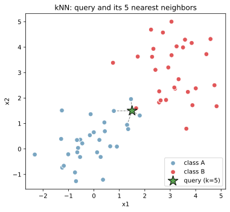
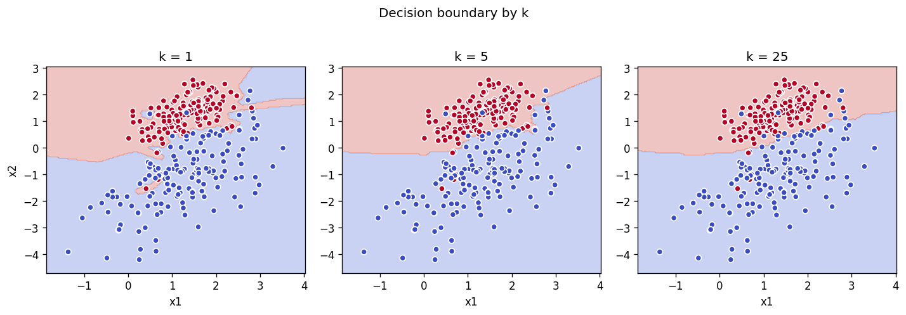

kNN（k近傍法、k-Nearest Neighbors）は、新しい点を予測するとき、訓練データの中で「その点に最も近い k 個のサンプル」を見て、多数決（分類）または平均（回帰）で答えを決める手法である。  
モデルを学習で作るのではなく、訓練データをそのまま記憶しておくのが特徴。「怠惰な学習（lazy learning）」とも呼ばれる。

距離は通常ユークリッド距離 `d(x, x_i) = sqrt(sum((x - x_i)^2))` を使う。スケール差が結果に直結するため、[標準化](../standardization/)（[標準偏差](../../math/stddev/)で割って平均 0・分散 1 に揃える）が基本。距離計算は内積を経由した [ベクトル・行列の演算](../../math/vector-matrix-ops/) で書け、`||x - x_i||^2 = ||x||^2 - 2 x · x_i + ||x_i||^2` の関係から行列積 1 回で全訓練点との距離を一括計算できる。


### 前提・注意

- 特徴量が数値であることが前提（カテゴリは数値化が必要）
- スケール差が距離を歪めるので[標準化](../standardization/)が必須
- k は奇数にしておくと二値分類で同数票が起きにくい
- 訓練時間はゼロに近いが、推論時に全訓練点との距離計算が必要

---

### 利点

- 実装と理解がシンプル
- 非線形な決定境界を自然に扱える
- 多クラス分類に拡張しやすい
- オンライン更新が容易（点を追加するだけ）

---

### 欠点

- 推論が遅い（訓練データが大きいほど線形に重くなる）
- メモリに訓練データを保持する必要がある
- 高次元データで距離の意味が薄れる（[次元の呪い](../curse-of-dimensionality/)）
- 不均衡データに弱い（多数派クラスに引っ張られる）

---

## Python での実例

まず kNN の予測がどう決まるかを概念図で見る。星印が予測したい点で、点線が最も近い5点（k=5）への距離。この5点のラベルの多数決で予測クラスが決まる。

```python
import numpy as np
import matplotlib.pyplot as plt

rng = np.random.default_rng(0)
X_a = rng.standard_normal((30, 2)) + [0, 0]
X_b = rng.standard_normal((30, 2)) + [3, 3]
X = np.vstack([X_a, X_b])
y = np.array([0] * 30 + [1] * 30)
query = np.array([1.5, 1.5])

dists = np.linalg.norm(X - query, axis=1)
nearest_idx = np.argsort(dists)[:5]

# (描画コードは省略 / 生成スクリプトは /tmp/knn_gen.py 参照)
```

出力:



k の値で決定境界がどう変わるかを以下のコードで確認する。k=1 は訓練点1つだけ見るので境界がギザギザで[過学習](../overfitting/)気味になる。k=25 は遠くまで見るので境界がなだらかになる一方、細かい構造が潰れる。一般には[交差検証](../cross-validation/)で適切な k を選ぶと考えられる。

```python
from sklearn.datasets import make_classification
from sklearn.neighbors import KNeighborsClassifier

X2, y2 = make_classification(
    n_samples=300, n_features=2, n_informative=2, n_redundant=0,
    n_clusters_per_class=1, class_sep=1.2, random_state=0,
)

for k in [1, 5, 25]:
    model = KNeighborsClassifier(n_neighbors=k).fit(X2, y2)
    # 決定境界を contourf で描画 (略)
```

出力:



---

### 数学での使いどころ

- ノンパラメトリック推定（分布の形を仮定しない）
- 最近傍探索（kd-tree / ball-tree / 近似最近傍）
- [カーネル密度推定](../../math/kde/)の素朴版（k固定で密度を見積もる）

数学的には、kNNは「[平均](../../math/mean/)を局所的に取る」発想に近い。点ごとに近傍だけで集計するため、グローバルな分布に依存しないのが特徴。

---

### 機械学習での使いどころ

機械学習では、kNN は以下で使われる。

- ベースライン（最初に試してモデルの目安にする）
- 推薦システム（似た嗜好のユーザーを近傍として探す）
- 異常検知（近傍までの距離が大きい点を異常とみなす）
- 画像検索（特徴ベクトルの近傍探索）

具体的な利用例:

- レコメンド：ユーザーAに似ているユーザー上位k人が好きな商品を推薦
- セキュリティ：通常パターンから遠い操作を不審と判断
- メディカル：症状ベクトルの近い患者の診断履歴を参考にする

---

### 適さないケース

- 訓練データが巨大（推論コストが線形に膨らむ）
- 特徴量が高次元（[次元の呪い](../curse-of-dimensionality/)で距離が意味を持たなくなる）
- リアルタイム推論が必要（毎回近傍探索を走らせるのは重い）
- クラスが極端に不均衡（少数派が近傍に入りにくい）
