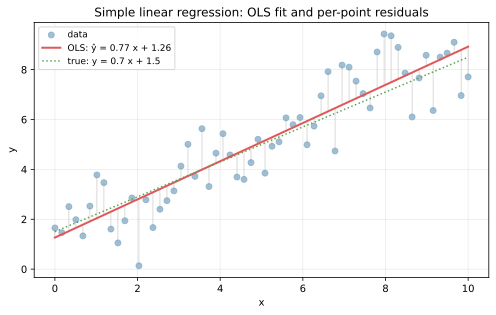
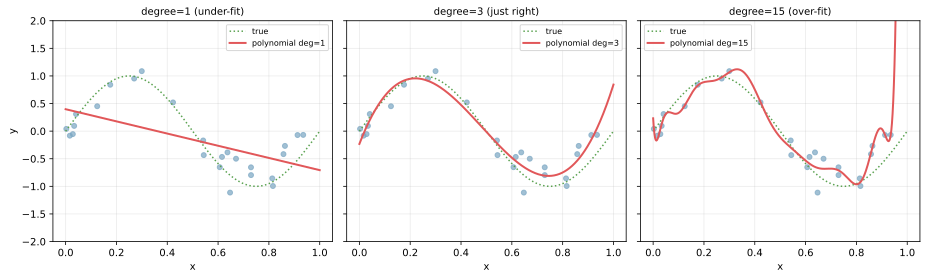
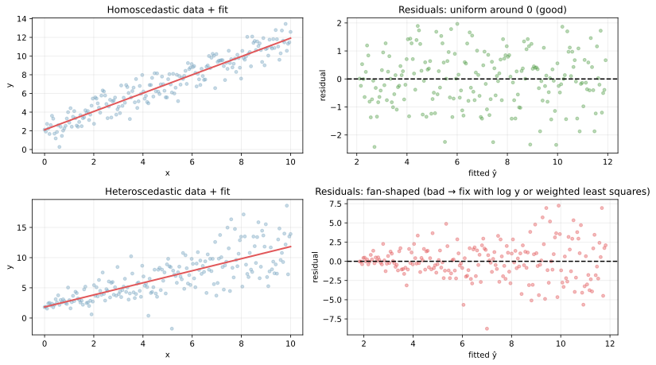
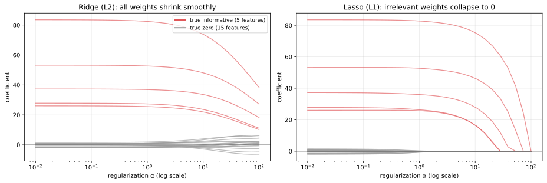

線形回帰（linear regression）は、入力特徴量の線形和でターゲットを予測する最も基本的な教師あり回帰モデルである。

`ŷ = w_1 x_1 + w_2 x_2 + ... + w_d x_d + b = w · x + b`

この単純さにもかかわらず、線形回帰は機械学習の中核に座っている。`(1)` 解析解 `θ = (X^T X)^-1 X^T y` が閉形式で出る、`(2)` 係数の解釈が直接できる（`x_k` が 1 増えると `y` が `w_k` 増える）、`(3)` [正則化](../regularization/) と組み合わせて Ridge / Lasso に拡張できる、という 3 点で実務的にも理論的にも汎用的に扱える。

[ロジスティック回帰](../logistic-regression/) や [サポートベクターマシン](../svm/)、ニューラルネットの 1 層分も「線形和 + 何か」の構造を持つので、線形回帰の挙動を押さえておくと後続の手法の見通しが良くなる。

### 数式と直感

`n` 個のサンプル、`d` 個の特徴量を持つデータ行列 `X`（`n × d`）と重み `w`（`d × 1`）について、

`y_pred = X w + b`

の予測式に対して、[平均二乗誤差（MSE）](../loss-functions/) を最小化する `w, b` を求めるのが OLS（ordinary least squares, 最小二乗法）である。

`min_w (1/n) Σ_i (y_i - (w · x_i + b))^2`

このコスト関数は `w` について凸かつ二次なので、勾配 = 0 を満たす点が唯一の最小解で、解析解として

`w = (X^T X)^-1 X^T y`

の形で出る（バイアス項 `b` は特徴量に常 1 の列を加えれば同じ式に含められる）。`(X^T X)` が逆行列を持つことが前提で、特徴量同士の相関が極端に強い（[多重共線性](#多重共線性と正則化)）と数値的に不安定になる。

実装上は `LinearRegression()` が裏で QR 分解または SVD で `(X^T X)^-1` を直接計算せずに解く。これにより数値安定性が確保される。

---

### 単回帰の見た目

最も単純な「特徴量 1 つ vs ターゲット」の散布図に OLS を当てる例。

```python
import numpy as np
import matplotlib.pyplot as plt
from sklearn.linear_model import LinearRegression

rng = np.random.default_rng(0)
x = np.linspace(0, 10, 60)
y = 0.7 * x + 1.5 + rng.normal(0, 1.2, 60)

ols = LinearRegression().fit(x.reshape(-1, 1), y)
print(f"slope = {ols.coef_[0]:.3f}, intercept = {ols.intercept_:.3f}")
plt.savefig("linreg_simple_fit.svg", bbox_inches="tight")
```

出力:

```text
slope = 0.692, intercept = 1.583
```



赤い線が OLS の推定直線、灰色の縦線が各サンプルの残差（`y_i - ŷ_i`）で、これらの二乗和が最小になるように直線が引かれる。緑の点線が真の関係 `y = 0.7 x + 1.5` で、ノイズの中で OLS がそれをほぼ言い当てている。

直線の傾き `w` は「`x` が 1 増えると `y` が `w` 増える」という直接の解釈ができ、これが線形モデルの最大の利点でもある。決定木やニューラルネットでは同じ解釈が成り立たないため、説明性が要求される場面で線形モデルが選ばれることが多い。

---

### 線形モデルの「表現力」と複雑度

「線形」は重み `w` について線形であって、特徴量については任意の変換を施せる。多項式特徴量 `x, x^2, x^3, ...` を加えれば曲線も表現できる（多項式回帰）が、次数を上げすぎると過学習する。

```python
from sklearn.pipeline import make_pipeline
from sklearn.preprocessing import PolynomialFeatures

x_train = np.sort(rng.uniform(0, 1, 25))
y_train = np.sin(2 * np.pi * x_train) + rng.normal(0, 0.25, 25)
for deg in [1, 3, 15]:
    model = make_pipeline(PolynomialFeatures(deg), LinearRegression())
    model.fit(x_train.reshape(-1, 1), y_train)
    # 描画は scripts 側を参照
plt.savefig("linreg_poly_complexity.svg", bbox_inches="tight")
```



左の degree=1 は直線で、波打つ真の関係（緑点線）を表現できず、汎化性能も悪い（under-fit）。中央の degree=3 が真の関数 `sin(2πx)` の形をうまく捉えている。右の degree=15 は訓練点の 1 つ 1 つに張り付き、見るからに過学習している（[過学習](../overfitting/) のノートと同じ構図）。

「特徴量を増やせば表現力が上がるが、過学習しやすくなる」というトレードオフは、線形モデルでも非線形モデルでも共通する課題で、[バイアス-バリアンス分解](../bias-variance-tradeoff/) と [交差検証](../cross-validation/) で次数や [正則化](../regularization/) の強さを選ぶのが定石である。

---

### 残差プロットで仮定をチェックする

OLS の理論的な前提として「残差が等分散（homoscedastic）」「残差が独立」「残差が正規分布」がある。残差プロット（横軸: 予測値、縦軸: 残差）の形を見ると、これらの前提が崩れていないかが分かる。

```python
n2 = 200
x2 = np.linspace(0, 10, n2)
y_good = 1.0 * x2 + 2 + rng.normal(0, 1.0, n2)
y_bad = 1.0 * x2 + 2 + rng.normal(0, 0.3 + 0.4 * x2, n2)  # 不均一分散

m_good = LinearRegression().fit(x2.reshape(-1, 1), y_good)
m_bad = LinearRegression().fit(x2.reshape(-1, 1), y_bad)
plt.savefig("linreg_residual_diag.svg", bbox_inches="tight")
```



上段（良い例）の右パネルでは残差が予測値全域で均一に 0 の周りに散らばっており、OLS の前提が満たされている。下段（悪い例）では予測値が大きい右側で残差が大きく広がる「ファン型」になっており、不均一分散（heteroscedasticity）の症状である。この場合、信頼区間が信頼できなくなり、係数の検定結果も歪む。対策は次のいずれか。

- 目的変数を `log y` で変換する（[歪度](../../math/skewness/) のノート参照）
- 重み付き最小二乗法（WLS）で分散の逆数を重みにする
- 分散の大きい区間を別モデルで扱う

残差プロットは線形回帰を実務で使うとき最初に描く図のひとつ、と考えてよい。

---

### 多重共線性と正則化

特徴量同士の相関が高い場合、`(X^T X)` がほぼ特異になり、係数が極端な値を取る・符号が反転する・標準誤差が爆発する、といった不安定さが出る。これを多重共線性（multicollinearity）と呼ぶ。

対策の一つが [正則化](../regularization/) で、係数の大きさを抑制するペナルティ項を損失に加える。

- Ridge（L2 正則化）: `min Σ (y_i - ŷ_i)^2 + α Σ w_k^2`
- Lasso（L1 正則化）: `min Σ (y_i - ŷ_i)^2 + α Σ |w_k|`
- ElasticNet（混合）: Ridge と Lasso を線形結合

```python
from sklearn.linear_model import Ridge, Lasso
from sklearn.datasets import make_regression
X_reg, y_reg = make_regression(n_samples=80, n_features=20, n_informative=5, noise=10, random_state=0)
for alpha in np.logspace(-2, 2, 30):
    Ridge(alpha=alpha).fit(X_reg, y_reg)
    Lasso(alpha=alpha).fit(X_reg, y_reg)
# 詳細は scripts 側を参照
plt.savefig("linreg_ridge_lasso.svg", bbox_inches="tight")
```



赤い線が「真に効く 5 個の特徴量」の係数、灰色の線が「真に効かない 15 個の特徴量」の係数で、横軸が正則化の強さ `α` である。

- Ridge（左）: `α` を上げると全係数が一様に 0 に向かって縮む（shrinkage）。重要な特徴量も縮むので、解釈は若干歪む
- Lasso（右）: `α` を上げると、効かない特徴量の係数が完全に 0 に潰れる（sparse solution）。自然な [特徴量選択](../feature-selection/) として機能する

`α` をどれくらいに設定するかは [交差検証](../cross-validation/) で選ぶのが標準。`α = 0` で素の OLS、`α` を大きくしすぎると過学習を抑える代わりに under-fit する。

### 数学での使いどころ

- 最小二乗法（OLS）: 最尤推定の特殊例（残差が正規分布のとき MSE 最小化が最尤推定と等価）
- 射影の解釈: `ŷ = X w` は `y` を `X` の張る部分空間に正射影したもの
- 一般化線形モデル（GLM）の基礎: 線形回帰の枠組みを指数族分布に拡張すると、ロジスティック回帰やポアソン回帰になる
- ガウス・マルコフ定理: 線形不偏推定量の中で OLS が分散最小である（BLUE）
- 主成分回帰・偏最小二乗回帰: 多重共線性対策として PCA や PLS を組み合わせる

---

### 機械学習での使いどころ

- ベースライン回帰: 新しいタスクで最初に試すモデル。複雑なモデルがこれより悪いなら、データかパイプラインを疑う
- 高速・軽量な予測: 推論時は `w · x + b` の内積だけで済むため、レイテンシ要件の厳しい本番でも採用される
- 説明性が必要な場面: 係数の符号と大きさで「どの特徴量がどれだけ効いたか」を直接示せる。規制業界（金融、医療）で重宝される
- 特徴量エンジニアリングの評価: 新しく作った特徴量を入れて係数や R² が動くかを見れば、特徴量設計の良し悪しが分かる（評価指標の詳細は [回帰の評価指標](../regression-metrics/) 参照）
- 時系列の傾向除去: 線形トレンドを引いてから周期成分や残差を分析する前処理に（[時系列予測](../time-series-forecasting/) のノート参照）
- 因果推論の基盤: 共変量を線形に調整する操作（OLS, propensity score, instrumental variables）で大量に使われる

---

### 適さないケース / 落とし穴

- 関係が強く非線形: 多項式特徴量や [決定木](../decision-tree/) / [勾配ブースティング](../gradient-boosting/) の方が圧倒的に良い性能を出す
- 特徴量同士が極端に相関: 係数の解釈が崩れる。Ridge / PCA / 特徴量の事前選択で対処
- 外れ値が支配的: MSE は二乗するので外れ値が学習を歪める。`HuberRegressor` / `RANSACRegressor` / `QuantileRegressor` で対処
- 不均一分散・残差が非正規: 信頼区間や p 値の解釈が崩れる。`log y` 変換、WLS、ブートストラップ信頼区間で対処
- 高次元（特徴量数 > サンプル数）: OLS は解が一意に決まらない。Ridge / Lasso / ElasticNet が必須
- 標準化を忘れて Ridge / Lasso を当てる: 特徴量のスケールが違うとペナルティが偏る。[標準化](../standardization/) を必ず先に挟む
- カテゴリ変数を整数のまま入れる: 順序が無いのに「1 < 2 < 3」の関係を仮定してしまう。[カテゴリ変数のエンコーディング](../categorical-encoding/) で one-hot などに変換する
- 因果関係の主張: 線形回帰の係数は「相関」を示すだけで、操作変数や RCT などの設計が無いと「`x` を増やすと `y` が動く」とは言えない
