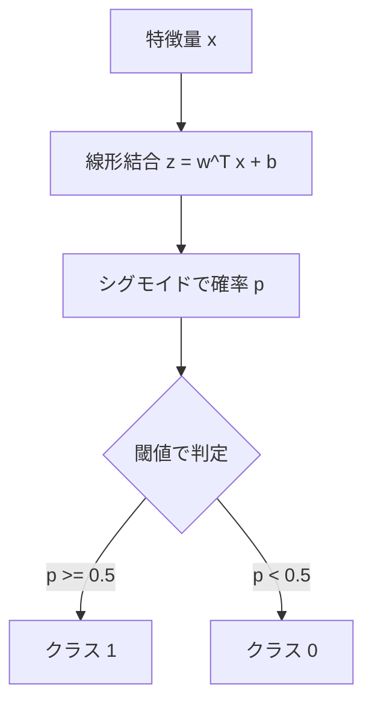
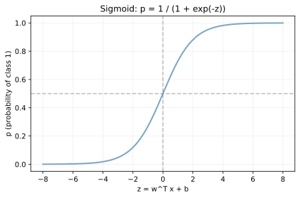
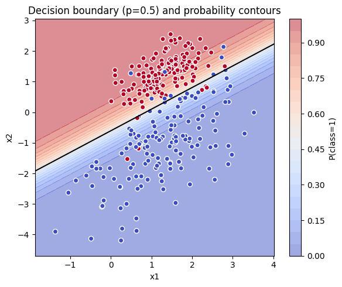
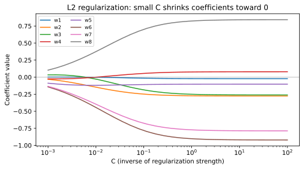
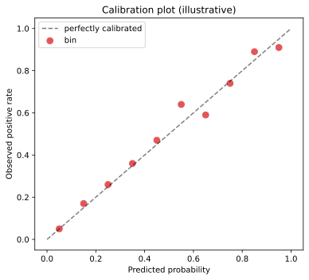

LogisticRegression（ロジスティック回帰）は、[線形回帰](../linear-regression/) の出力をシグモイド関数で 0〜1 の確率に押し込めることで二値分類を可能にしたモデルである。線形回帰の枠組みをほぼそのまま使いつつ、「実数の予測値」を「クラスに属する確率」に変換する点だけが異なる。名前に「回帰」と付いているが、実用上は二値分類の代表的なベースラインモデルとして使われる。

設計の核心は「特徴量の線形和を [log-odds](../../math/log-exp-logodds/) と見なし、シグモイドで確率に変換する」枠組みで、損失関数は二値交差エントロピー（[損失関数](../loss-functions/) のノート参照）を使う。確率に直接フィットさせると `(0, 1)` の制約があり線形和と相性が悪いが、log-odds は値域が実数全体なので素直に扱える、というのがこの形が生まれた理由となる。

「線形」と呼ばれるのは、決定境界（クラス 0 とクラス 1 の境目）が 2 次元なら直線、高次元なら超平面になるためである。逆に言うと、円形・XOR・スイス・ロールのような曲がった境界が必要なデータは素のままでは扱えない。境界の柔らかさが必要なら、後述の多項式特徴量・[RandomForest](../random-forest/)・[勾配ブースティング](../gradient-boosting/)・SVM RBF カーネル・ニューラルネットワークなどに切り替える。

他モデルとの位置づけを整理しておくと次のようになる。

- [kNN](../knn/) より高速で確率出力を持つが、非線形には弱い
- [RandomForest](../random-forest/) / [勾配ブースティング](../gradient-boosting/) より精度は劣ることが多いが、係数の解釈性が高く軽量
- ニューラルネットワークの最終層（二値なら sigmoid、多クラスなら softmax）は、本質的に LogisticRegression と同じ

二値分類で手を動かし始めるとき、まず LogisticRegression でベースラインを取り、そこから複雑なモデルに移っていくのが教科書的な進め方となる。確率出力が直接出ること、係数 `w` から「どの特徴量がどちらのクラスに引き寄せるか」を読めること、学習が高速で大規模データでもスケールすることが、ベースラインとして選ばれ続けている理由と言える。

主要な用語:

- 線形結合: 入力特徴の重み付き和（`w^T x + b`）。回帰の y そのもの
- シグモイド関数: 数値を 0〜1 の確率に変換する S 字曲線（後述）
- 閾値: 確率をクラスに変換する境界（例: 0.5 以上を陽性）。ビジネス制約に応じて 0.3 や 0.7 に動かせる

### 仕組み（概要）

- 線形スコア: `z = w^T x + b`
- 確率: `p = 1 / (1 + exp(-z))`
- 損失: 対数損失（交差エントロピー、`-y log p - (1-y) log (1-p)`）を最小化する



シグモイド関数は線形スコア `z` を 0〜1 の確率に押し込める単調増加関数で、`z=0` で `p=0.5` を通る。`z` が +∞ に近づくと `p` は 1 に、-∞ に近づくと 0 に漸近する。



2 次元の特徴量に対して LogisticRegression を学習させると、確率の等高線は直線の集まりになり、`p=0.5` の境界線が「決定境界」となる。下の図は学習データに対して、`predict_proba` の確率を色塗りで重ねたもの。



確率の等高線が直線になることが、LogisticRegression が「線形分類器」と呼ばれる理由である。非線形な境界が欲しい場合は、後述のように多項式特徴量を追加するか、別モデル（[RandomForest](../random-forest/), SVM RBF カーネル、ニューラルネットワーク）を選ぶ。

---

### 損失と正則化の捉え方

対数損失（交差エントロピー）は、正解クラスの確率が高いほど小さくなる損失。例えば真のクラスが 1 で `p=0.9` なら `-log(0.9) ≈ 0.105`、`p=0.5` なら `-log(0.5) ≈ 0.693` と、確信度が低いほどペナルティが大きい設計になっている。

[正則化](../regularization/)（L1/L2）は損失に `||w||` 系のペナルティを加えて、係数 `w` を小さく保つ仕組み。

- L2 正則化（Ridge 系）: ペナルティ `λ ||w||^2`。すべての係数を均等に縮める。最も一般的
- L1 正則化（Lasso 系）: ペナルティ `λ ||w||_1`。一部の係数を完全に 0 にする（特徴量選択になる）
- Elastic Net: L1 と L2 を混ぜたもの

scikit-learn の `LogisticRegression` では正則化強度を `C`（正則化強度の逆数）で指定する。`C` が小さいほど強い正則化となり、係数は 0 に近づく。下の図は `C` を変化させたときの 8 つの係数の挙動である。



`C` を 0.001 に近づけると、すべての係数が 0 へ収束していくのが見える。逆に `C` を 100 に大きくすると正則化がほぼ効かなくなり、係数の絶対値が大きくなって[過学習](../overfitting/)しやすくなる。実際の運用では `C` を [交差検証](../cross-validation/) で選ぶことが多い。

---

### スケーリングが必要な理由

LogisticRegression は[標準化](../standardization/)が事実上必須の前処理となる。理由は 2 つある。

1. 正則化項 `||w||^2` がスケールに依存する: スケールの大きい特徴量は「小さい係数で同じ影響を出せる」ため、正則化のペナルティが軽い。一方スケールの小さい特徴量に大きな係数を当てると正則化で罰せられる。結果、本来重要な特徴量の係数が不当に縮められる
2. 最適化（勾配降下系のソルバー）の収束が安定する: 特徴量のスケールが大きく違うと、損失曲面が引き伸ばされて勾配の方向が歪み、収束が遅くなる

特徴量の係数を「重要度」として解釈したい場合は、標準化なしの係数を直接比較しても無意味であることに特に注意したい。`C` を小さくして正則化を強める運用では、標準化の有無で結果が大きく変わると考えられる。

---

### 前提・注意

- 特徴量のスケールが違うと学習が不安定になるため[標準化](../standardization/)が基本（理由は前節）
- クラス不均衡では `class_weight="balanced"` や閾値調整、[PR-AUC](../roc-pr-auc/) の併用が重要
- 正則化（L1/L2）と `C` の選定で[過学習](../overfitting/)・未学習のトレードオフを取る
- 多重共線性（相関の強い特徴量同士）があると、係数が不安定になる。L1 正則化で片方を 0 に潰すか、事前に[相関係数](../../math/correlation/)で除外する
- ソルバーは `lbfgs`（デフォルト、L2 のみ）、`liblinear`（L1/L2、小規模データ向け）、`saga`（L1/L2/Elastic Net、大規模対応）を使い分ける

---

### 利点

- 学習が速く、データ量が増えてもスケールしやすい
- 出力が確率として解釈できる（`predict_proba` で確率値が直接出る）
- 係数 `w` が線形な重みとして読みやすく、説明可能性が高い
- 正則化と組み合わせやすく、過学習対策が単純（`C` を下げるだけ）
- ロジット `z = w^T x + b` の符号と大きさで「クラス 1 への引き寄せ強度」を読める
- 多クラス分類への自然な拡張がある（多項ロジスティック回帰、`multi_class="multinomial"`）

---

### 欠点

- 線形分離できないデータに弱い（XOR のような境界は素のままでは描けない）
- 非線形な特徴量効果は自分で作る必要がある（多項式特徴量、交互作用項を手動で追加）
- 多重共線性が強いと係数が不安定になり、解釈が崩れる
- 確率出力は校正されていない場合がある（`predict_proba` の値と実際の頻度がずれることがある）
- 外れ値の影響を受けやすい（線形回帰ほどではないが、シグモイドが飽和する点で起きる）

確率の校正度合いを確認したい場合は、Calibration Plot（予測確率と観測頻度の対応図）を使う。完全に校正されていれば対角線に乗る。



---

## Python での実例

```python
import pandas as pd
from sklearn.model_selection import train_test_split
from sklearn.preprocessing import StandardScaler
from sklearn.linear_model import LogisticRegression
from sklearn.pipeline import make_pipeline
from sklearn.metrics import roc_auc_score

X = df.drop(columns=["target"])
y = df["target"]

X_train, X_valid, y_train, y_valid = train_test_split(
    X, y, test_size=0.2, random_state=0, stratify=y
)

model = make_pipeline(
    StandardScaler(),
    LogisticRegression(max_iter=1000, class_weight="balanced")
)
model.fit(X_train, y_train)
proba = model.predict_proba(X_valid)[:, 1]
print("ROC-AUC:", roc_auc_score(y_valid, proba))
```

---

### 機械学習での使いどころ

LogisticRegression は二値分類の入門・ベースライン・本番運用すべてで使われる、最も基本的な分類器となる。線形でシンプル、確率出力が解釈しやすい、計算が軽い、という三拍子が揃っている。

- 二値分類のベースライン: [RandomForest](../random-forest/) や[勾配ブースティング](../gradient-boosting/) と比較する起点
- スパムフィルタ、CTR 予測のような線形仮説が当てはまるタスク
- 医療診断: 確率の校正と係数解釈の両方が重要な場面
- A/B テストの結果分析: 効果の方向と大きさを係数で読む
- 多クラス分類のソフトマックス出力（多項ロジスティック回帰）
- ニューラルネットワークの最終層: 二値分類は logistic、多クラスは softmax で、本質的に LogisticRegression と同じ

具体的な利用例:

- メール分類で語の出現有無を特徴量に取って線形に重ね合わせる
- マーケティングで顧客属性から購買確率を出し、係数で「効いている要因」を説明する
- 信用スコアリングで「年収・年齢・職業」の係数から審査の透明性を担保する

---

### 適さないケース

- 非線形な境界が必要な場合（XOR、円形クラスタなど）: 多項式特徴量を追加するか、[RandomForest](../random-forest/) / [勾配ブースティング](../gradient-boosting/) / SVM RBF / ニューラルネットワークを使う
- 特徴量間の強い相互作用が本質の場合: 交互作用項を手動で追加するか、木系モデルへ切り替える
- 系列性が本質的なデータ（時系列・テキスト・画像）: 専用モデル（RNN/Transformer/CNN）の方が適切
- 確率分布が極端に複雑な場合: ロジスティック関数の S 字に当てはまらず、性能が頭打ちになる
- 特徴量が極端に高次元（数万〜数百万）で sparsity も低い場合: L1 正則化で削るか、別の sparse-friendly な手法を検討する
