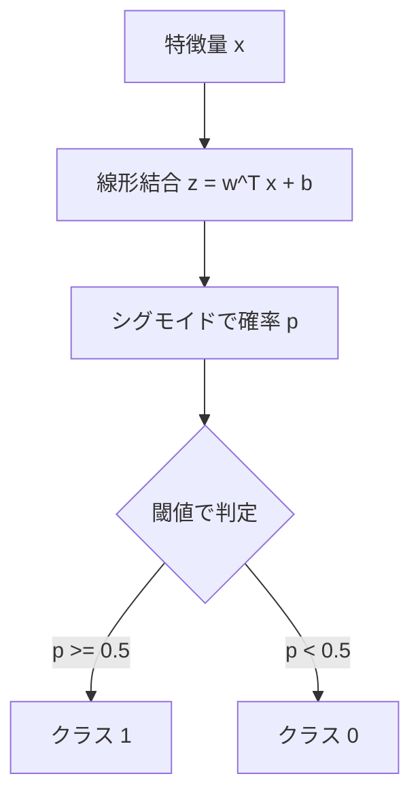

LogisticRegression は、線形結合をシグモイド関数で確率に変換する分類モデル。  
目的は「クラスに属する確率」を推定し、閾値で分類を行うこと。

* 線形結合：入力特徴の重み付き和（w^T x + b）。  
* シグモイド関数：数値を 0〜1 の確率に変換する関数。  
* 閾値：確率をクラスに変換する境界（例: 0.5 以上を陽性）。

### 仕組み（概要）

* 線形スコア: z = w^T x + b
* 確率: p = 1 / (1 + exp(-z))
* 損失: 対数損失（交差エントロピー）を最小化する



### 損失と正則化の捉え方

**対数損失（交差エントロピー）**は、正解に近い確率ほど小さくなる損失。  
**[正則化](../regularization/)（L1/L2）**は、係数を小さく保ち[過学習](../overfitting/)を抑える仕組み。

### 前提・注意

* 特徴量のスケールが違うと学習が不安定になるため標準化が基本
* クラス不均衡では class_weight や閾値調整が重要
* 正則化（L1/L2）で過学習を防ぐ

**利点：**
* 学習が速く、扱いやすい
* 出力が確率として解釈できる
* 係数が重要度として読みやすい

**欠点：**
* 線形分離できないデータに弱い
* 非線形な特徴は自分で作る必要がある
* 多重共線性が強いと係数が不安定

## Python での実例

```python
import pandas as pd
from sklearn.model_selection import train_test_split
from sklearn.preprocessing import StandardScaler
from sklearn.linear_model import LogisticRegression
from sklearn.pipeline import make_pipeline
from sklearn.metrics import roc_auc_score

X = df.drop(columns=["target"])
y = df["target"]

X_train, X_valid, y_train, y_valid = train_test_split(
    X, y, test_size=0.2, random_state=0, stratify=y
)

model = make_pipeline(
    StandardScaler(),
    LogisticRegression(max_iter=1000, class_weight="balanced")
)
model.fit(X_train, y_train)
proba = model.predict_proba(X_valid)[:, 1]
print("ROC-AUC:", roc_auc_score(y_valid, proba))
```

### 機械学習での使いどころ

* ベースラインの分類器
* 線形な関係が強いタスク
* 高い説明性が必要なケース

### 適さないケース

* 非線形な境界が必要な場合
* 特徴量間の強い相互作用が本質の場合
